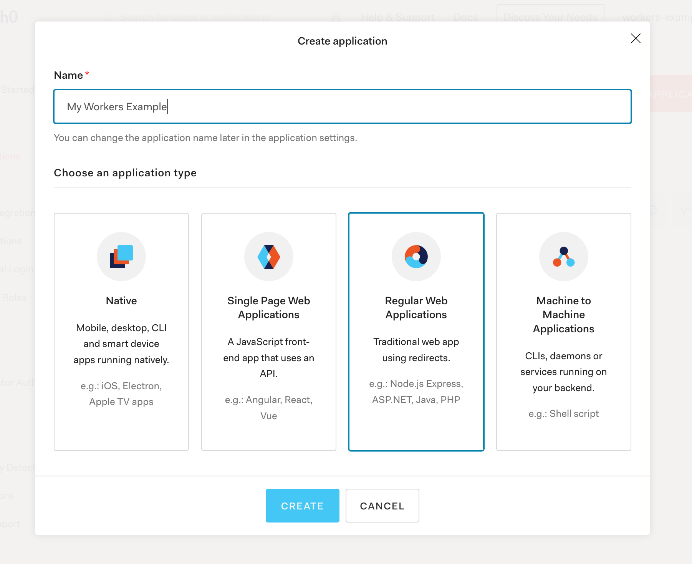
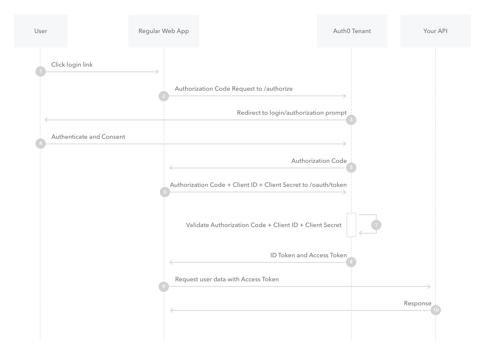
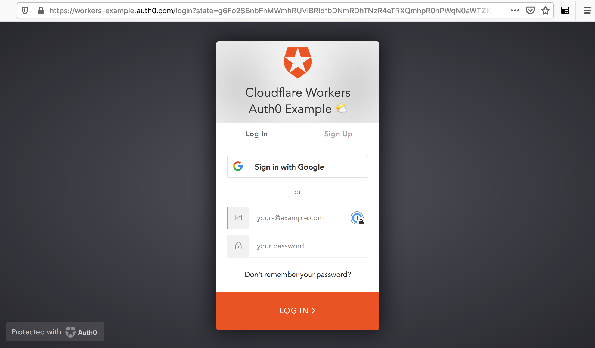
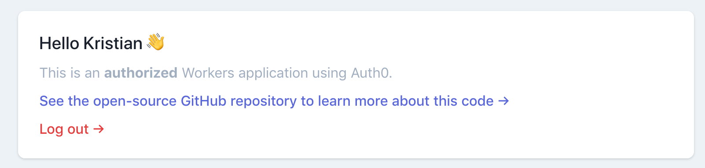
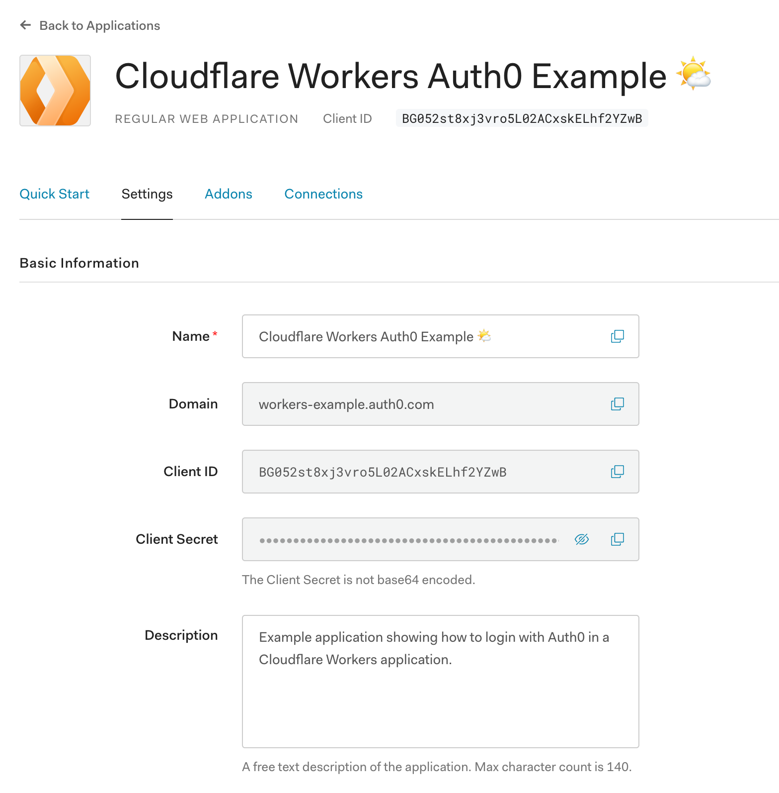
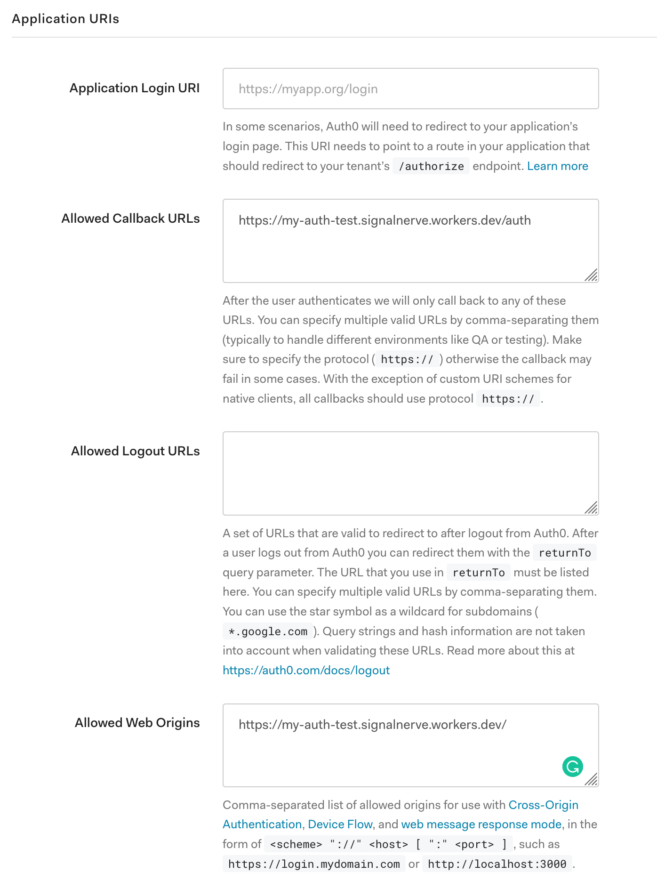

import TutorialsBeforeYouStart from "../../_partials/_tutorials-before-you-start.md"

# Authorize users with Auth0

<TutorialsBeforeYouStart/>

## Overview

In this tutorial you’ll integrate [Auth0](https://auth0.com), an identity management platform, into a Cloudflare Workers application. Adding authorization and authentication to an application is a common task for developers. By implementing it using Cloudflare Workers, you can take advantage of Workers’ unique platform advantages to simplify how and when your application needs user data.

### What you’ll learn

- How to authorize and authenticate users in Workers.
- How to persist authorization credentials inside of Workers KV.
- How to use Auth0 user info inside of your Workers application.

## Set up Auth0

If you don’t already have an Auth0 account, you can sign up for a free account at [auth0.com](https://www.auth0.com). This tutorial supports integration with Auth0’s free tier.

### Configure an Auth0 application

Every Auth0 account contains _applications_, which allow developers to create login/signup flows that are verified by Auth0. Integrating Auth0 with Workers requires creating an application in your Auth0 dashboard; if you’ve created an account for this tutorial, the “Default (Generic)” application provided by Auth0 will work; otherwise, create a new application with the type “Regular Web Application”.



Inside of our application’s settings, the client ID and client secret are keys that we’ll provide to our Workers application to authenticate with Auth0. There are several settings and configuration options here, but relevant to this tutorial are the “Allowed Callback URLs” and “Allowed Web Origins” options. In the “Publish” section of this tutorial, we’ll fill in these values with the final deployed URL of our application.

## Generate a new project

Using wrangler’s `generate` command, we can begin building a new application using a Workers template. For this tutorial, we’ll heavily modify the default template for [Workers Sites](/platform/sites), which deploys a static HTML application:

```sh
---
header: Generate a new project
---
$ wrangler generate --site my-auth-example
```

## Building an authorizer

Before we begin implementing an “authorizer” in our application, which will verify that a user is logged in, it’s useful to understand how Auth0’s login flow works. The condensed version of this flow is below (and, if you’re interested, you can [read a longer writeup in Auth0’s docs](https://auth0.com/docs/flows/concepts/auth-code)):

1. A user makes a request to the Workers application
2. If they aren’t logged in, they’re redirected to the login page
3. After logging in they’re redirected back to the Workers application, passing a login `code` as a query param
4. The Workers application takes the login `code` parameter and exchanges it with Auth0 for authorization tokens

In a traditional application that is attached to a database, the authorization tokens returned from Auth0 are often persisted in a database, allowing users to return to the application and continue to use it, without the need for re-authorization. With a Workers application, we have a quick and easy-to-use data storage solution that lives right next to our serverless application: Workers KV. Using Workers KV, we’ll store authorization tokens and tie them to a user using an authorization cookie.

[](https://auth0.com/docs/flows/concepts/auth-code)

<small>Auth0 Flow Diagram courtesy of <a href="https://auth0.com/docs/flows/concepts/auth-code">Auth0</a></small>

### Authenticating a user

Let’s begin implementing the login flow described in the previous section. When a user makes a request to the Workers application, we should verify that the user is authenticated. To define this logic create a new file — `workers-site/auth0.js`- which will contain the authorization logic for our application:

```js
---
filename: workers-site/auth0.js
---
const auth0 = {
  domain: AUTH0_DOMAIN,
  clientId: AUTH0_CLIENT_ID,
  clientSecret: AUTH0_CLIENT_SECRET,
  callbackUrl: AUTH0_CALLBACK_URL,
}

const redirectUrl = state => `${auth0.domain}/authorize?response_type=code&client_id=${auth0.clientId}&redirect_uri=${auth0.callbackUrl}&scope=openid%20profile%20email&state=${encodeURIComponent(state)}`

const generateStateParam = () => "stub"

const verify = async event => {
  // Verify a user based on an auth cookie and Workers KV data
  return { accessToken: "123" }
}

// Returns an array with the format
//   [authorized, context]
export const authorize = async event => {
  const authorization = await verify(event)
  if (authorization.accessToken) {
    return [true, { authorization }]
  } else {
    const state = await generateStateParam()
    return [false, { redirectUrl: redirectUrl(state) }]
  }
}
```

The `auth0` object wraps several secrets, which are encrypted values that can be defined and used by your script. In the “Publish” section of this tutorial, we’ll define these secrets using the [`wrangler secret`](/cli-wrangler/commands#secret) command.

The `generateStateParam` function will be used to prevent [Cross-Site Request Forgery attacks](https://auth0.com/docs/protocols/oauth2/mitigate-csrf-attacks). For now, we’ll return a string “stub”, but later in the tutorial, it will generate a random “state” parameter that we’ll store in Workers KV to verify incoming authorization requests.

The `verify` function, which we’ll stub out in our first pass through this file, will check for an authorization key and look up a corresponding value in Workers KV. For now, we’ll simply return an object with an `accessToken` string, to simulate an _authorized_ request.

The `authorize` function, which should be exported from `./auth0.js`, will wait for the response from the `verify` function, and return an array that can be used to determine how the application should proceed.

In `workers-site/index.js`, we can import the `authorize` function from `./auth0.js` and use it inside of our `handleEvent` function. Note that by default the Workers Sites template contains code for rendering our Workers Site from Workers KV. To keep that code functioning, make sure that you replace `handleEvent` as defined below:

```js
---
filename: workers-site/index.js
highlight: [1, 5, 6, 7, 8, 9, 10, 11, 12, 13, 14, 15, 16, 17, 18, 19, 20, 21, 22]
---
import { authorize } from "./auth0"

addEventListener("fetch", event => event.respondWith(handleEvent(event)))

async function handleEvent(event) {
  let request = event.request
  let response = new Response(null)
  const url = new URL(request.url)

  try {
    const [authorized, { authorization, redirectUrl }] = await authorize(event)

    // BEGINNING OF WORKERS SITES
    // Make sure to not touch this code for the majority of the tutorial!
    response = getAssetFromKV(event)
    // END OF WORKERS SITES

    return response
  } catch (e) {
    return new Response(e.message || e.toString(), { status: 500 })
  }
}
```

The `authorize` function returns an array with a boolean `authorized` and a context object which will contain either an `authorization` object or a `redirectUrl`.

Building on the past code sample, we can check that a user is `authorized` and that the `authorization` object contains an `accessToken`. Then update the incoming `request` to contain an `Authorization` header:

```js
---
filename: workers-site/index.js
highlight: [3, 4, 5, 6, 7, 8, 9, 10, 11]
---
async function handleEvent(event) {
  try {
    const [authorized, { authorization, redirectUrl }] = await authorize(event)
    if (authorized && authorization.accessToken) {
      request = new Request(request, {
        headers: {
          Authorization: `Bearer ${authorization.accessToken}`,
        },
      })
    }
    // END OF AUTHORIZATION CODE BLOCK

    // BEGINNING OF WORKERS SITES
  }
}
```

If a user isn’t authorized, we can redirect them to Auth0’s login page, by calling `Response.redirect`, passing in the `redirectUrl`:

```js
---
filename: workers-site/index.js
highlight: [6, 7, 8, 9, 10]
---
async function handleEvent(event) {
  try {
    const [authorized, { authorization, redirectUrl }] = await authorize(event)
    // END OF AUTHORIZATION CODE BLOCK

    // BEGINNING OF REDIRECT CODE BLOCK
    if (!authorized) {
      return Response.redirect(redirectUrl)
    }
    // END OF REDIRECT CODE BLOCK

    // BEGINNING OF WORKERS SITES
  }
}
```

When a user logs in via Auth0’s login form, they’ll be redirected back to the callback URL specified by our application. In the next section, we’ll handle that redirect, and get a user access token as part of the “login” code flow.



### Handling a login redirect

To handle the “login” code flow as defined by Auth0, we’ll handle an incoming request to the `/auth` path, which will contain a `code` parameter. By making another API request to Auth0, providing our app’s client ID and secret, we can exchange the login code for an access token.

To begin, we’ll add a new block of code to `handleEvent`, which will parse the request URL, and if the URL path matches `/auth`, we’ll call the newly imported `handleRedirect` function from `./auth0`.

```js
---
filename: workers-site/index.js
highlight: [1, 5, 6, 7, 8, 9]
---
import { authorize, handleRedirect } from "./auth0"

async function handleEvent(event) {
  try {
    // BEGINNING OF HANDLE AUTH REDIRECT CODE BLOCK
    if (url.pathname === "/auth") {
      const authorizedResponse = await handleRedirect(event)
    }
    // END OF HANDLE AUTH REDIRECT CODE BLOCK

    // BEGINNING OF REDIRECT CODE BLOCK
  }
}
```

The `handleRedirect` function, which we’ll export from `workers-site/auth0.js`, will parse the incoming URL, and pass the `code` login parameter to `exchangeCode`. We’ll also check for a `state` parameter, which we’ll use to prevent CSRF attacks. This `state` parameter should be matched to a known key in KV, indicating that the authorization request is valid:

```js
---
filename: workers-site/auth0.js
---
export const handleRedirect = async event => {
  const url = new URL(event.request.url)

  const state = url.searchParams.get("state")
  if (!state) {
    return null
  }

  const storedState = await AUTH_STORE.get(`state-${state}`)
  if (!storedState) {
    return null
  }

  const code = url.searchParams.get("code")
  if (code) {
    return exchangeCode(code)
  }
  return {}
}
```

Let’s define `exchangeCode`, which will take the `code` parameter, and make a request back to Auth0, exchanging it for an access token:

```js
---
filename: workers-site/auth0.js
---
const exchangeCode = async code => {
  const body = JSON.stringify({
    grant_type: "authorization_code",
    client_id: auth0.clientId,
    client_secret: auth0.clientSecret,
    code,
    redirect_uri: auth0.callbackUrl,
  })

  // We’ll define persistAuth in the next section
  return persistAuth(
    await fetch(AUTH0_DOMAIN + "/oauth/token", {
      method: "POST",
      headers: { "content-type": "application/json" },
      body,
    })
  )
}
```

### Persisting authorization data in Workers KV

Next we’ll define the `persistAuth` function to handle the request and parse the appropriate authorization info from it. Let’s begin by parsing the JSON body returned back from Auth0:

```js
---
filename: workers-site/auth0.js
---
const persistAuth = async exchange => {
  const body = await exchange.json()

  if (body.error) {
    throw new Error(body.error)
  }

  console.log(body) // { access_token: "...", id_token: "...", ... }
}
```

The `body` object — assuming no errors — will contain an `access_token`, `id_token`, and [other fields](https://auth0.com/docs/flows/guides/auth-code/add-login-auth-code#request-tokens) that we should persist inside of Workers KV, a key-value store that we can access inside of our Workers scripts. When we store data inside Workers KV we need to persist it using a key. The `id_token` field, which is returned by Auth0, is a [JSON Web Token](https://jwt.io) that contains a `sub` field, a unique identifier for each user. We’ll decode the JSON Web Token and parse it into an object:

```js
---
filename: workers-site/auth0.js
highlight: [37]
---
// https://github.com/pose/webcrypto-jwt/blob/master/workers-site/index.js
const decodeJWT = function(token) {
  var output = token
    .split(".")[1]
    .replace(/-/g, "+")
    .replace(/_/g, "/")
  switch (output.length % 4) {
    case 0:
      break
    case 2:
      output += "=="
      break
    case 3:
      output += "="
      break
    default:
      throw "Illegal base64url string!"
  }

  const result = atob(output)

  try {
    return decodeURIComponent(escape(result))
  } catch (err) {
    console.log(err)
    return result
  }
}

const persistAuth = async exchange => {
  const body = await exchange.json()

  if (body.error) {
    throw new Error(body.error)
  }

  const decoded = JSON.parse(decodeJWT(body.id_token))
}
```

To ensure that the ID token we’ve received is valid, we should do a number of checks on the decoded token object, as per the [OpenID Connect Core 1.0 spec](https://openid.net/specs/openid-connect-core-1_0.html#IDTokenValidation). We’ll update the `persistAuth` function to validate the token — if it isn’t valid, we can return an object indicating that the response is invalid:

```js
---
filename: workers-site/auth0.js
highlight: [1, 2, 3, 9, 10, 11, 12]
---
const validateToken = token => {
  // Stubbed function
}

const persistAuth = async exchange => {
  // Previous code

  const decoded = JSON.parse(decodeJWT(body.id_token))
  const validToken = validateToken(decoded)
  if (!validToken) {
    return { status: 401 }
  }
}
```

Inside of `validateToken`, we’ll examine fields inside of the decoded token, ensuring that:

- The `iss` field matches the `AUTH0_DOMAIN` secret
- The `aud` field matches the `AUTH0_CLIENT_ID` secret
- The `exp` field is after the current time
- The `iat` field was issued in the last day

The code for this will use a `try/catch` block, throwing an error and returning false if any of the above criteria aren’t true:

```js
---
filename: workers-site/auth0.js
---
const validateToken = token => {
  try {
    const dateInSecs = d => Math.ceil(Number(d) / 1000)
    const date = new Date()

    let iss = token.iss

    // ISS can include a trailing slash but should otherwise be identical to
    // the AUTH0_DOMAIN, so we should remove the trailing slash if it exists
    iss = iss.endsWith("/") ? iss.slice(0, -1) : iss

    if (iss !== AUTH0_DOMAIN) {
      throw new Error(
        `Token iss value (${iss}) doesn’t match AUTH0_DOMAIN (${AUTH0_DOMAIN})`,
      )
    }

    if (token.aud !== AUTH0_CLIENT_ID) {
      throw new Error(
        `Token aud value (${token.aud}) doesn’t match AUTH0_CLIENT_ID (${AUTH0_CLIENT_ID})`,
      )
    }

    if (token.exp < dateInSecs(date)) {
      throw new Error(`Token exp value is before current time`)
    }

    // Token should have been issued within the last day
    date.setDate(date.getDate() - 1)
    if (token.iat < dateInSecs(date)) {
      throw new Error(`Token was issued before one day ago and is now invalid`)
    }

    return true
  } catch (err) {
    console.log(err.message)
    return false
  }
}
```

With the decoded JWT available and validated, we can hash and salt the `sub` value and use it as a unique identifier for the current user. To do this, we’ll use the [Web Crypto API](https://developer.mozilla.org/en-US/docs/Web/API/Web_Crypto_API) available inside the Workers runtime. We’ll combine the `SALT` value, a secret that we’ll set later in the tutorial, with the `sub` value. By creating a SHA-256 digest of these combined strings, we can then use it as the key for storing the user’s JWT in Workers KV:

```js
---
filename: workers-site/auth0.js
highlight: [4, 5, 6, 7, 8, 9]
---
const persistAuth = async exchange => {
  // ...

  const text = new TextEncoder().encode(`${SALT}-${decoded.sub}`)
  const digest = await crypto.subtle.digest({ name: "SHA-256" }, text)
  const digestArray = new Uint8Array(digest)
  const id = btoa(String.fromCharCode.apply(null, digestArray))

  await AUTH_STORE.put(id, JSON.stringify(body))
}
```

Once the user’s authentication data has been stored in KV, we need to associate the user with that data. To do this, we’ll set a cookie, setting the value to the encrypted `id` string we just defined.

This cookie will be used as we fill out the `verify` function defined earlier in the tutorial, and we’ll set it to expire in a day (though this is easily customizable to your application’s needs). To persist this cookie, we’ll return an object containing some data for a [Response](https://developer.mozilla.org/en-US/docs/Web/API/Response) instance, redirecting the user via an [HTTP 302 response](https://developer.mozilla.org/en-US/docs/Web/HTTP/Status/302) to the `/` path, with a `Set-cookie` header:

```js
---
filename: workers-site/auth0.js
highlight: [1, 6, 7, 8, 9, 10, 11, 12, 13, 14]
---
const cookieKey = "AUTH0-AUTH"

const persistAuth = async exchange => {
  // previous code

  const date = new Date()
  date.setDate(date.getDate() + 1)

  const headers = {
    Location: "/",
    "Set-cookie": `${cookieKey}=${id}; Secure; HttpOnly; SameSite=Lax; Expires=${date.toUTCString()}`,
  }

  return { headers, status: 302 }
}
```

With our authorization logic defined, we can finally wrap up the corresponding code in `workers-site/index.js`. Knowing that the `handleRedirect` function will pass back an object with `Response` options, we can make a new `Response` object, passing in the information from the existing `response`, and adding the new headers and status code from `handleRedirect`. This will redirect the user to the app’s root path, setting a cookie to indicate that they’re authorized for future requests:

```js
---
filename: workers-site/index.js
highlight: [3, 4, 5, 6, 7, 8, 9, 10, 11, 12, 13, 14, 15]
---
async function handleEvent(event) {
  try {
    // BEGINNING OF HANDLE AUTH REDIRECT CODE BLOCK
    if (url.pathname === "/auth") {
      const authorizedResponse = await handleRedirect(event)
      if (!authorizedResponse) {
        return new Response("Unauthorized", { status: 401 })
      }
      response = new Response(response.body, {
        response,
        ...authorizedResponse,
      })
      return response
    }
    // END OF HANDLE AUTH REDIRECT CODE BLOCK

    // BEGINNING OF WORKERS SITES
  }
}
```

## Implementing CSRF protection

To correctly protect against CSRF attacks, our application needs to provide a `state` parameter to the Auth0 login URL. When the user logs in and is redirected back to our application, we can compare the `state` parameter in the redirect URL to our previous piece of `state`, confirming that the user is beginning and ending the login flow via our application.

We’ll generate this piece of state using `csprng.xyz`, a Cloudflare API service for generating random data. The API endpoint `csprng.xyz/v1/api` returns a JSON object with the key `Data` that we’ll use as the random value:

```json
{
  "Data": "PTBsWkQ7Zg5pAXAq5/YJS1mtFL97q1k/qUVJNdirEl0=",
  "Time": "2020-05-29T13:22:54.840Z",
  "Status": 200
}
```

To persist this random data, we’ll use KV, persisting it for one day (86,400 seconds) before discarding it (note that this matches the `expires_at` time of the Auth0-provided `code` parameter). Replace the stubbed `generateStateParam` function in `workers-site/auth0.js`

```js
---
filename: workers-site/auth0.js
---
const generateStateParam = async () => {
  const resp = await fetch("https://csprng.xyz/v1/api")
  const { Data: state } = await resp.json()
  await AUTH_STORE.put(`state-${state}`, true, { expirationTtl: 86400 })
  return state
}
```

## Verifying the token and retrieving user info

With our application persisting authentication data in Workers KV and associating it to the current user via a cookie, we’re now prepared to fill out the `verify` function defined earlier in the tutorial. This function will look at the `Cookie` header, and look up the authentication info that we persisted in Workers KV.

To begin, install the NPM package [`cookie`](https://www.npmjs.com/package/cookie), which we’ll use to simplify parsing the `Cookie` header in the `request`:

```sh
---
header: Install cookie package
---
$ cd workers-site && npm install cookie
```

In `workers-site/auth0.js`, we can begin to flesh out the contents of the `verify` function, beginning by parsing the `Cookie` header, looking for our `cookieKey` as defined earlier in the tutorial:

```js
---
filename: workers-site/auth0.js
highlight: [1, 4, 5, 6, 7, 8, 9, 10]
---
import cookie from "cookie"

const verify = async event => {
  const cookieHeader = event.request.headers.get("Cookie")
  if (cookieHeader && cookieHeader.includes(cookieKey)) {
    const cookies = cookie.parse(cookieHeader)
    if (!cookies[cookieKey]) return {}
    const sub = cookies[cookieKey]
  }
  return {}
}
```

With the unique ID `sub` parsed from the `Cookie` header, we can use it to retrieve the user information we previously stored in KV. First, we’ll do a lookup to Workers KV using the `sub` field as a key — if it isn’t found, we’ll throw an `Error`. Next, we’ll take that data from Workers KV and attempt to parse it as JSON — if that fails, another `Error` will be thrown:

```js
---
filename: workers-site/auth0.js
highlight: [8, 9, 10, 11, 12, 13, 14, 15, 16, 17, 18, 19, 20]
---
const verify = async event => {
  const cookieHeader = event.request.headers.get("Cookie")
  if (cookieHeader && cookieHeader.includes(cookieKey)) {
    const cookies = cookie.parse(cookieHeader)
    if (!cookies[cookieKey]) return {}
    const sub = cookies[cookieKey]

    const kvData = await AUTH_STORE.get(sub)
    if (!kvData) {
      throw new Error("Unable to find authorization data")
    }

    let kvStored
    try {
      kvStored = JSON.parse(kvData)
    } catch (err) {
      throw new Error("Unable to parse auth information from Workers KV")
    }

    const { access_token: accessToken, id_token: idToken } = kvStored
  }
}
```

Finally, we’ll decode the `idToken` stored in KV. This includes the `profile` and `email` scopes we requested from Auth0 when the user logged in, which we’ll return as `userInfo`, along with `accessToken` and `idToken`:

```js
---
filename: workers-site/auth0.js
highlight: [20, 21, 22, 24]
---
const verify = async event => {
  const cookieHeader = event.request.headers.get("Cookie")
  if (cookieHeader && cookieHeader.includes(cookieKey)) {
    const cookies = cookie.parse(cookieHeader)
    if (!cookies[cookieKey]) return {}
    const sub = cookies[cookieKey]

    const kvData = await AUTH_STORE.get(sub)
    if (!kvData) {
      throw new Error("Unable to find authorization data")
    }

    let kvStored
    try {
      kvStored = JSON.parse(kvData)
    } catch (err) {
      throw new Error("Unable to parse auth information from Workers KV")
    }

    const { access_token: accessToken, id_token: idToken } = kvStored
    const userInfo = JSON.parse(decodeJWT(idToken))
    return { accessToken, idToken, userInfo }
  }
  return {}
}
```

As a recap, this `verify` function will now correctly verify our application’s users based on the `Cookie` field and make any authorization information available as part of the `authorization` object:

```js
---
filename: workers-site/auth0.js
---
export const authorize = async event => {
  const authorization = await verify(event)
  if (authorization.accessToken) {
    return [true, { authorization }]
  } else {
    const state = await generateStateParam()
    return [false, { redirectUrl: redirectUrl(state) }]
  }
}
```

By implementing this function, we’ve now completed the authorization/authentication portion of the tutorial! Our application will authorize any incoming users, redirecting them to Auth0 and verifying their access tokens before they’re allowed to see our Workers Site content. To configure your deployment and publish the application, you can skip to the “Publish” section, but in the next few portions of the tutorial, we’ll focus on some of the more interesting aspects of this project: using user information in our application, via “edge state hydration”, logging out our users, and some improvements and customizations that can be done to this application to make it ready for production usage.

### Improvements and customizations

This tutorial introduces concepts for implementing authentication in Workers using Auth0. There are several potential customizations and improvements to this codebase that are out-of-scope for this tutorial. I will briefly mention a few in this section, along with links to learn more.

### Using user data in our application

In the previous section of the tutorial, we made a request to Auth0’s `/userinfo` endpoint, which provides information such as name and email address for use in our application. Using Workers’ [HTML Rewriter](/runtime-apis/html-rewriter), we can embed the `userInfo` object that we’ve received from Auth0 directly into our site, by creating an instance of the `HTMLRewriter` class, and attaching a handler `hydrateState` to any found `head` tags that pass through the rewriter. The `hydrateState` handler will add a new `script` tag with an ID of `edge_state`, which we can parse and utilize in any front-end JavaScript code we’ll deploy with our application. Instead of simply returning `response` in `handleEvent`, we can replace it with the HTML rewriter code, and return a transformed version of `response`:

```js
---
filename: workers-site/index.js
highlight: [1, 2, 3, 4, 5, 6, 7, 19, 20, 21, 22, 23]
---
const hydrateState = (state = {}) => ({
  element: head => {
    const jsonState = JSON.stringify(state)
    const scriptTag = `<script id="edge_state" type="application/json">${jsonState}</script>`
    head.append(scriptTag, { html: true })
  },
})

async function handleEvent(event) {
  try {
    // BEGINNING OF WORKERS SITES
    // Note the addition of the `await` keyword
    response = await getAssetFromKV(event)
    // END OF WORKERS SITES

    // Remove the line of code below
    // return response

    // BEGINNING OF STATE HYDRATION CODE BLOCK
    return new HTMLRewriter()
      .on("head", hydrateState(authorization.userInfo))
      .transform(response)
    // END OF STATE HYDRATION CODE BLOCK
  }
  // ...
}
```

For a more detailed example of this functionality, check out the [source code](https://github.com/signalnerve/workers-auth0-example/) for this tutorial, which shows how to integrate this information using the JavaScript framework Alpine.js. In this example, the `userInfo` object is embedded into the `script#edge_state` tag, and when the site is rendered in the client’s browser, the user’s name (or email address, if the user’s name isn’t provided) is displayed:



### Logging out users

While a user’s authentication cookie expires after a day, you may want to offer the ability for a user to log out manually. This is quite simple to implement — instead of letting the cookie expire automatically, your Workers application should pass a `Set-cookie` header that nulls out the `cookieKey` we previously defined. Let’s create a `logout` function in `workers-site/auth0.js`, and import it in `workers-site/index.js`, calling it when a user requests `/logout`:

```js
---
filename: workers-site/auth0.js
---
export const logout = event => {
  const cookieHeader = event.request.headers.get("Cookie")
  if (cookieHeader && cookieHeader.includes(cookieKey)) {
    return {
      headers: {
        "Set-cookie": `${cookieKey}=""; SameSite=Lax; Secure;`,
      },
    }
  }
  return {}
}
```

```js
---
filename: workers-site/index.js
highlight: [1, 7, 8, 9, 10, 11, 12, 13, 14, 15, 16, 17]
---
import { ..., logout } from "./auth0.js"

async function handleEvent(event) {
  try {
    // END OF WORKERS SITES CODE BLOCK

    // BEGINNING OF LOGOUT CODE BLOCK
    if (url.pathname === "/logout") {
      const { headers } = logout(event)
      return headers
        ? new Response(response.body, {
            ...response,
            headers: Object.assign({}, response.headers, headers)
          })
        : Response.redirect(url.origin)
    }
    // END OF LOGOUT CODE BLOCK

    // BEGINNING OF STATE HYDRATION CODE BLOCK
  }
}
```

In your Workers Site, you can add a “Log out” link, which will send users to the `/logout` route, and clear their auth cookie via the `Set-cookie` header:

```html
<a href="/logout">Log out</a>
```

<Aside>
By design, the placement of the `LOGOUT CODE BLOCK` in `workers-site/index.js` is placed _after_ the `WORKERS SITES CODE BLOCK`. This is intentional: it allows users to continue to your application’s deployed Workers Site code, meaning that you can provide a corresponding `logout/index.html` template with a “You’re logged out!” message, or something similar.
</Aside>

An example logout HTML page could look like this:

```html
---
filename: public/logout/index.html
---
<h1>You’re logged out</h1>
<div><a href="/">Log back in</a></div>
```

When the user refreshes the page, they’ll be identified as an unauthorized user, and be redirected to Auth0’s login page. For a more advanced implementation of logout functionality, you may choose to _always_ return a redirect to your app’s root path: this will force every user to sign in again immediately after logging out:

```js
---
filename: workers-site/auth0.js
---
export const logout = event => {
  const cookieHeader = event.request.headers.get("Cookie")
  if (cookieHeader && cookieHeader.includes(cookieKey)) {
    return {
      headers: {
        "Location": "/",
        "Set-cookie": `${cookieKey}="";`
      },
      status: 302
    }
  }
  return {}
}
```

#### Deploying to origin/originless

While this tutorial assumes that you’re deploying a Workers Sites application, you may want to put this authorization logic in front of an existing domain. This concept, known as deploying to an “origin”, is in contrast to the “originless” deploy, where your Workers deployment _is_ the final destination for any requests from users of your application.

The next section of this tutorial, “Publish”, assumes deployment to Workers’ built-in deployment target, `workers.dev`, but if you want to handle deploying to an existing domain, known commonly as a “zone”, you’ll need to do the following things:

1. Update the `handleEvent` function to make a request to your origin

While we’re currently using Workers Sites, you can update `workers-site/index.js` and replace the Workers Site code with a request to your origin:

```js
---
filename: workers-site/index.js
highlight: [10]
---
async function handleEvent(event) {
  try {
    // BEGINNING OF WORKERS SITES
    // ↳ this can now be thought of as "BEGINNING OF ORIGIN REQUEST"

    // Replace the below line of code
    // response = await getAssetFromKV(event)

    // With a fetch request to your origin
    response = await fetch(request)
    // END OF WORKERS SITES
    // ↳ this can now be thought of as "END OF ORIGIN REQUEST"
  }
}
```

Given an example configuration and deployment of `https://my-auth.signalnerve.com`, your Workers script will continue to authorize users, but when it comes time to return a response back to the user, the code will now make a request to `my-auth.signalnerve.com`, and, if you’ve set up the “edge state hydration” concept explored earlier in this tutorial, you’ll still receive the same user info in your HTML response as originally configured.

2. Configure your `wrangler.toml` to associate your Workers script with a zone

Associating a configured zone from your Cloudflare account is covered in the section [“Configure for deploying to a registered domain”](/learning/getting-started#optional-configure-for-deploying-to-a-registered-domain) section of [Getting started](/learning/getting-started). In the “Publish” section of this guide, we’ll cover how to configure the file `wrangler.toml` to deploy to workers.dev — make sure you read the [Getting started](/learning/getting-started#optional-configure-for-deploying-to-a-registered-domain) linked above so you can understand how these approaches differ.

In particular, you’ll need to ensure that you have `zone_id` and `route` keys in your `wrangler.toml`, and `workers_dev` disabled. You may also choose to entirely remove the `[site]` block from your `wrangler.toml`, which will stop `wrangler` from uploading the contents of your project’s `public` folder to Workers KV:

```toml
---
filename: wrangler.toml
highlight: [2, 3]
---
workers_dev = false
zone_id = "123abc"
route = "https://my-auth.signalnerve.com/*"

## The below information can be removed
[site]
bucket = "./public"
```

Pay close attention to the `route` field in your `wrangler.toml`, as this determines when your Workers script will run on your zone. For compatibility with the code we’ve written so far in this tutorial, the wildcard route `/*` should be used, which will match every request to your site and pass it through your Workers script.

Deploying an “origin” version of this code can be a great approach for users who want to utilize this functionality in an existing codebase or site!

#### Using the open-source version of this package

[The open-source example repository for this tutorial](https://github.com/signalnerve/workers-auth0-example) showcases all the functionality outlined in this tutorial — originless/origin deploys, edge state hydration, and more. If you want to get started with this project, we recommend you check it out!

## Publish

We’re finally ready to deploy our application to Workers. Before we can successfully deploy the application, we need to set some configuration values both in Workers and Auth0.

### Configuring `wrangler.toml`

The `wrangler.toml` generated as part of your application tells wrangler how and where to deploy your application. Using the [“Configuring your project” section of the Getting started](/learning/getting-started#6d-configuring-your-project) as a guide, populate `wrangler.toml` with your account ID, which will allow you to deploy your application to your Cloudflare account:

```toml
---
filename: wrangler.toml
---
account_id = "$accountId"
```

### Creating a Workers KV namespace

In the code for this tutorial, we’ve used the constant `AUTH_STORE` to refer to a Workers KV namespace where we store authorization info for our users. Before we can deploy this project, we need to create a Workers KV namespace and attach it to our Workers application. Using wrangler, we can create this Workers KV namespace directly from the command-line:

```sh
---
header: Create a new KV namespace with Wrangler
---
$ wrangler kv:namespace create AUTH_STORE
```

The output of running that command will be a block of code that you can paste directly into `wrangler.toml`, which will “bind” your new Workers KV namespace to your application. It should look something like this:

```toml
---
filename: wrangler.toml
highlight: [3, 4, 5]
---
## ...existing account and zone information

kv_namespaces = [
  { binding = "AUTH_STORE", id = "$YOURNAMESPACEID" }
]

## ...existing workers site configuration
```

### Secrets

In `workers-site/auth0.js`, we referred to several Auth0 constants, such as client ID, secret, and more. Before we can deploy our application, we should set up these secrets, using wrangler’s `secret` command, which will make them available to reference as constants in the codebase.

Below is the complete list of secrets that the Workers script will look for when it processes a client request:

| `wrangler secret` key | Value                                                                                                                        |
| --------------------- | ---------------------------------------------------------------------------------------------------------------------------- |
| AUTH0_DOMAIN          | Your Auth0 domain (e.g. `https://myapp.auth0.com`). Note this must include the _scheme_ `https://` and should be a valid URL |
| AUTH0_CLIENT_ID       | Your Auth0 client ID                                                                                                         |
| AUTH0_CLIENT_SECRET   | Your Auth0 client secret                                                                                                     |
| AUTH0_CALLBACK_URL    | The callback url for your application (see “Setting the callback url” below)                                                 |
| SALT                  | A secret string used to encrypt user `sub` values (see “Setting the salt” below)                                             |

For each key, you can find the corresponding value in your Auth0 application settings page.

**A note for developers using Wrangler 1.9.0 and below:** due to an issue with Wrangler’s publishing feature, you’ll need to publish your project before you’re able to set these secrets. To do this successfully, you’ll need to add a line stubbing out each of the above secrets in `auth0.js`:

```js
---
filename: workers-site/auth0.js
---
let AUTH0_DOMAIN, AUTH0_CLIENT_ID, AUTH0_CLIENT_SECRET, AUTH0_CALLBACK_URL, SALT
```

With these constants stubbed, you can publish your application:

```sh
---
header: Publish your project
---
$ wrangler publish
```

Once your application has successfully published, you can remove the constants line from `auth0.js`:

```js
---
filename: workers-site/auth0.js
---
// Delete the below line!
// let AUTH0_DOMAIN, AUTH0_CLIENT_ID, AUTH0_CLIENT_SECRET, AUTH0_CALLBACK_URL, SALT
```

Using `wrangler secret`, you can now set each secret directly in the command-line:

```sh
---
header: Set secret values
---
$ wrangler secret put AUTH0_DOMAIN
$ wrangler secret put AUTH0_CLIENT_ID
$ wrangler secret put AUTH0_CLIENT_SECRET
$ wrangler secret put AUTH0_CALLBACK_URL
$ wrangler secret put SALT
```



#### Setting the callback url

To correctly set the callback URL for your application, you will need to determine where your application will be deployed. Regardless of whether you’re setting up an _originless_ or _origin_-based deploy, the callback handler for this project is defined at `/auth`. This means that if you’re testing or deploying a staging version of this project, your callback URL will likely be something like `https://my-auth-example.signalnerve.workers.dev/auth`, or for production, you should set it to something like `https://my-production-app.com/auth`.

This tutorial assumes the usage of a `workers.dev` subdomain, which is provided for free to all developers using Workers. You can determine your callback URL by combining the name of your application (chosen during the `wrangler generate` phase -- in this tutorial, we picked `my-auth-example`) and your workers.dev subdomain, as seen below:

```txt
https://$applicationName.$subdomain.workers.dev/auth
```

Following this example, the callback URL for my application is `https://my-auth-test.signalnerve.workers.dev/auth`.

#### Setting the salt

In order to safely store user IDs (the sub value from Auth0) in the cookie we set in the browser, we should always refer to them by a value that cannot be easily guessed by someone else. To do this, we’ll generate a unique value based on the user’s ID and a _salt_: a secret value provided by the application.

To generate a salt, we’ll simply make a new, random string, and save it as a “secret” for our application. Previously in the tutorial, we used `csprng.xyz` API to generate a random piece of `state` to protect against CSRF attacks. Open `https://csprng.xyz/v1/api` in your browser, and copy the `Data` field to your clipboard. If you’d like to generate a string yourself, remember that it’s important that the salt can’t easily be guessed!

With a random string generated, you can set it using `wrangler secret`:

```sh
---
header: Set the SALT secret
---
$ wrangler secret put SALT
```

#### Allowed origin/callback URLs

Note that Auth0 has great security defaults and any callback URLs or origins that you’ll use as sources to log in from need to be explicitly provided in the Auth0 dashboard as part of your application config. Using the above `workers.dev` example, you should ensure the following values are set in the application settings page of your Auth0 dashboard, along with any additional urls used as part of testing (e.g. `localhost:8787` for [wrangler dev][wrangler dev] usage):

| URL                                                  | Description          |
| ---------------------------------------------------- | -------------------- |
| https://$applicationName.$subdomain.workers.dev/auth | Allowed Callback URL |
| https://$applicationName.$subdomain.workers.dev      | Allowed Origin       |



### Publishing your application

With your `wrangler.toml` successfully configured, you can now use wrangler’s `publish` command to deploy your application:

```sh
---
header: Publish your project
---
$ wrangler publish
```

Wrangler will compile your code, upload the associated Workers Sites folder (`public`, by default), and begin handling requests sent to your `workers.dev` application, or to your zone. To confirm everything works as expected, you should:

1. Visit your application (e.g. [my-auth-test.signalnerve.workers.dev](https://my-auth-test.signalnerve.workers.dev)), which should redirect you to Auth0’s login page
2. Login with an email/password, or if you’ve enabled Google, Twitter, or other “social” login providers, the login provider of your choice
3. Watch Auth0 redirect you to `/auth`, and then to `/`. Beneath the hood, your Workers application has exchanged a login `code` with Auth0 for an access token, persisted it to Workers KV, and registered you as an authorized user via a cookie.
4. If you see your site, congrats! You’ve successfully authorized users to your Workers application, using Auth0.


## Conclusion

Congrats! You’ve successfully built an application that authorizes and authenticates users on the edge using Cloudflare Workers. To see the final version of the project we built in this tutorial, check it out on GitHub: [signalnerve/workers-auth0-example](https://github.com/signalnerve/workers-auth0-example/).

There’s a lot more that you can build with Workers: serve static and JAMstack-style apps using Workers Sites, transform HTML responses using HTMLRewriter, and more. Here are some more tutorials for you to check out next. Happy coding!

- [Build a Slack bot](/tutorials/build-a-slackbot)
- [Deploy a React app using Workers Sites](/tutorials/deploy-a-react-app-with-create-react-app)
- [Localize a website using HTMLRewriter](/tutorials/localize-a-website)
