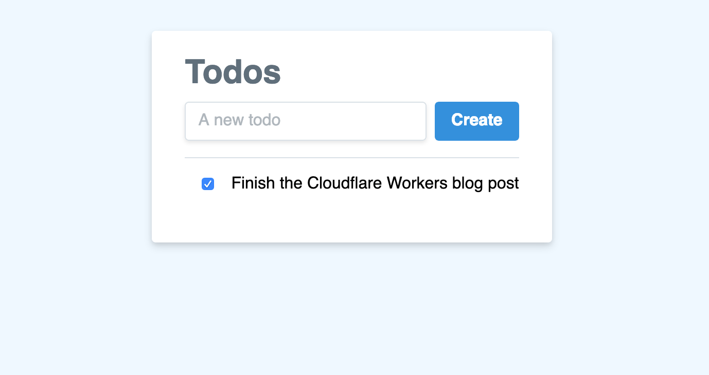

import TutorialsBeforeYouStart from "../../_partials/_tutorials-before-you-start.md"

# Build a To-Do list JAMstack app

<TutorialsBeforeYouStart/>

## Overview

In this tutorial, you’ll build a todo list application in HTML, CSS and JavaScript, with a twist: the data for the application will be stored in [Workers KV](/runtime-apis/kv).



Before starting this project, you should have some experience with HTML, CSS, and JavaScript. If you’re new to writing web apps, Workers is a great place to get started. Building with Workers is a super easy to focus on writing code, and actually shipping projects! In particular, the addition of Workers KV makes this tutorial a great introduction to building full, data-driven applications.

If you’d like to see the finished code for this project, find the project [on GitHub](https://github.com/signalnerve/cloudflare-workers-todos), and check out the [live demo](https://todos.signalnerve.workers.dev/) to see what you’ll be building!

## Generate

Cloudflare’s command-line tool for managing Worker projects, Wrangler, has great support for templates — pre-built collections of code that make it easy to get started writing Workers. In this tutorial, you’ll use the default JavaScript template to generate a Workers project.

In the command line, generate your Worker project, passing in a project name (e.g. “todos”):

```sh
---
header: Generate a project
---
$ wrangler generate todos
$ cd todos
```

Wrangler templates are just Git repositories, so if you want to create your own templates, or use one from our [Template Gallery](/examples), there’s a ton of options to help you get started.

Wrangler’s default template includes support for building and deploying JavaScript-based projects, including Webpack support. Inside of your new `todos` directory, `index.js` represents the entry-point to your Cloudflare Workers application.

All Cloudflare Workers applications start by listening for `fetch` events, which are fired when a client makes a request to a Workers route. When that request occurs, you can construct responses and return them to the user. This tutorial will walk you through understanding how the request/response pattern works, and how we can use it to build fully-featured applications.

```js
---
filename: index.js
---
addEventListener("fetch", event => {
  event.respondWith(handleRequest(event.request))
})

/**
 * Fetch and log a request
 * @param {Request} request
 */
async function handleRequest(request) {
  return new Response("Hello worker!", { status: 200 })
}
```

In your default `index.js` file, we can see that request/response pattern in action. The `handleRequest` constructs a new `Response` with the body text “Hello worker”, as well as an explicit status code of 200. When a `fetch` event comes into the worker, the script uses `event.respondWith` to return that new response back to the client. This means that your Cloudflare Worker script will serve new responses directly from Cloudflare’s cloud network: instead of continuing to the origin, where a standard server would accept requests, and return responses, Cloudflare Workers allows you to respond quickly and efficiently by constructing responses directly on the edge.

## Build

The code provided by the default Wrangler template generates a simple text response and returns it to the client. In this tutorial, you‘ll build off of that approach, by reading data from KV, and using it to populate an HTML response to send to the client.

The work needed to create this application can be roughly split into three tasks:

1. Write data to KV
2. Rendering data from KV
3. Adding todos from the UI

For the remainder of this tutorial, we‘ll walk through each step in this process, iterating on your application, and finally, publishing it at your own URL!

### Writing data to KV

To begin, we should understand how to populate our todo list with actual data. To do this, we‘ll make use of Cloudflare‘s Workers KV — it’s a simple key-value store that you can access inside of your Worker script to read and write data.

To get started with KV, we need to set up a “namespace”. All of our cached data will be stored inside that namespace, and given just a bit of configuration, we can access that namespace inside the script with a predefined variable. Use Wrangler to create a new namespace and get the associated namespace ID.

```sh
---
header: Create a new KV namespace
---
$ wrangler kv:namespace create "TODOS" --preview
```

Namespaces can be added to your application by defining them inside your Wrangler configuration. Copy your newly created namespace ID, and in your `wrangler.toml`, define a `kv_namespaces` key to set up your namespace:

```toml
---
filename: wrangler.toml
---
kv_namespaces = [
  {binding = "TODOS", id = "abcdef123"}
]
```

The defined namespace, `TODOS`, will now be available inside of your codebase. With that, it’s time to understand the KV API. A KV namespace has three primary methods you can use to interface with your cache: `get`, `put`, and `delete`. Pretty straightforward!

Let’s start storing data by defining an initial set of data, which we’ll put inside of the cache using the `put` method. I’ve opted to define an object, `defaultData`, instead of a simple array of todos: we may want to store metadata and other information inside of this cache object later on. Given that data object, I’ll use `JSON.stringify` to put a simple string into the cache:

```js
---
filename: index.js
---
async function handleRequest(request) {
  const defaultData = {
    todos: [
      {
        id: 1,
        name: "Finish the Cloudflare Workers blog post",
        completed: false,
      },
    ],
  }
  TODOS.put("data", JSON.stringify(defaultData))

  // ...previous code
}
```

The Worker KV data store is eventually consistent: writing to the cache means that it will become available eventually, but it’s possible to attempt to read a value back from the cache immediately after writing it, only to find that the cache hasn’t been updated yet.

Given the presence of data in the cache, and the assumption that our cache is eventually consistent, we should adjust this code slightly: first, we should actually read from the cache, parsing the value back out, and using it as the data source if exists. If it doesn’t, we’ll refer to `defaultData`, setting it as the data source for now (remember, it should be set in the future… eventually), while also setting it in the cache for future use. After breaking out the code into a few functions for simplicity, the result looks like this:

```js
---
filename: index.js
---
const defaultData = {
  todos: [
    {
      id: 1,
      name: "Finish the Cloudflare Workers blog post",
      completed: false,
    },
  ],
}

const setCache = data => TODOS.put("data", data)
const getCache = () => TODOS.get("data")

async function getTodos(request) {
  // ... previous code

  let data
  const cache = await getCache()
  if (!cache) {
    await setCache(JSON.stringify(defaultData))
    data = defaultData
  } else {
    data = JSON.parse(cache)
  }
}
```

### Rendering data from KV

Given the presence of data in our code, which is the cached data object for our application, we should actually take this data and make it available on screen.

In our Workers script, we’ll make a new variable, html, and use it to build up a static HTML template that we can serve to the client. In `handleRequest`, we can construct a new `Response` (with a `Content-Type` header of `text/html`), and serve it to the client:

```js
---
filename: index.js
---
const html = `<!DOCTYPE html>
<html>
  <head>
    <meta charset="UTF-8" />
    <meta name="viewport" content="width=device-width,initial-scale=1" />
    <title>Todos</title>
  </head>
  <body>
    <h1>Todos</h1>
  </body>
</html>
`

async function handleRequest(request) {
  const response = new Response(html, {
    headers: { "Content-Type": "text/html" },
  })
  return response
}
```

We have a static HTML site being rendered, and now we can begin populating it with data! In the body, we’ll add a `div` tag with an id of `todos`:

```js
---
filename: index.js
highlight: [10]
---
const html = `<!DOCTYPE html>
<html>
  <head>
    <meta charset="UTF-8" />
    <meta name="viewport" content="width=device-width,initial-scale=1" />
    <title>Todos</title>
  </head>
  <body>
    <h1>Todos</h1>
    <div id="todos"></div>
  </body>
</html>
`
```

Given that body, we can also add a script after the body that takes a `todos` array, loops through it, and for each todo in the array, creates a `div` element and appends it to the list of todos:

```js
---
filename: index.js
highlight: [11, 12, 13, 14, 15, 16, 17, 18, 19]
---
const html = `<!DOCTYPE html>
<html>
  <head>
    <meta charset="UTF-8" />
    <meta name="viewport" content="width=device-width,initial-scale=1" />
    <title>Todos</title>
  </head>
  <body>
    <h1>Todos</h1>
    <div id="todos"></div>
    <script>
      window.todos = []
      var todoContainer = document.querySelector("#todos")
      window.todos.forEach(todo => {
        var el = document.createElement("div")
        el.textContent = todo.name
        todoContainer.appendChild(el)
      })
    </script>
  </body>
</html>
`
```

Our static page can take in `window.todos`, and render HTML based on it, but we haven’t actually passed in any data from KV. To do this, we’ll need to make a couple changes.

First, our `html` variable will change to a function. The function will take in an argument, `todos`, which will populate the `window.todos` variable in the above code sample:

```js
---
filename: index.js
highlight: [1, 6]
---
const html = todos => `
<!doctype html>
<html>
  <!-- existing content -->
  <script>
    window.todos = ${todos}
    var todoContainer = document.querySelector("#todos")
    // ...
  <script>
</html>
`
```

In `handleRequest`, we can use the retrieved KV data to call the `html` function, and generate a `Response` based on it:

```js
---
filename: index.js
highlight: [2]
---
async function handleRequest(request) {
  const body = html(JSON.stringify(data.todos).replace(/</g, "\\u003c"))
  const response = new Response(body, {
    headers: { "Content-Type": "text/html" },
  })
  return response
}
```

### Adding todos from the UI

At this point, we’ve built a Cloudflare Worker that takes data from Cloudflare KV and renders a static page based on it. That static page reads the data, and generates a todo list based on that data. Of course, the piece we’re missing is creating todos, from inside the UI. We know that we can add todos using the KV API — we could simply update the cache by saying `TODOS.put(newData)`, but how do we update it from inside the UI?

To implement this, we’ll add a second handler in our Workers script, designed to watch for `PUT` requests to `/`. When a body is received at that URL, the worker will send the new todo data to our KV store.

Add this new functionality in `handleRequest`: if the request method is a PUT, it will take the request body and update the cache.

```js
---
filename: index.js
highlight: [5, 6, 7, 8, 9, 10, 11, 12, 13, 14, 15, 16, 17, 18, 19, 20]
---
addEventListener("fetch", event => {
  event.respondWith(handleRequest(event.request))
})

const setCache = data => TODOS.put("data", data)

async function updateTodos(request) {
  const body = await request.text()
  try {
    JSON.parse(body)
    await setCache(body)
    return new Response(body, { status: 200 })
  } catch (err) {
    return new Response(err, { status: 500 })
  }
}

async function handleRequest(request) {
  if (request.method === "PUT") {
    return updateTodos(request)
  } else {
    // Defined in previous code block
    return getTodos(request)
  }
}
```

The script is pretty straightforward – we check that the request is a `PUT`, and wrap the remainder of the code in a `try/catch` block. First, we parse the body of the request coming in, ensuring that it is JSON, before we update the cache with the new data, and return it to the user. If anything goes wrong, we simply return a 500. If the route is hit with an HTTP method other than `PUT` — that is, `POST`, `DELETE`, or anything else — we return a 404.

With this script, we can now add some “dynamic” functionality to our HTML page to actually hit this route. First, we’ll create an input for our todo “name”, and a button for “submitting” the todo.

```js
---
filename: index.js
highlight: [5, 6, 7, 8]
---
const html = todos => `
<!doctype html>
<html>
  <!-- existing content -->
  <div>
    <input type="text" name="name" placeholder="A new todo"></input>
    <button id="create">Create</button>
  </div>
  <!-- existing script -->
</html>
`
```

Given that input and button, we can add a corresponding JavaScript function to watch for clicks on the button — once the button is clicked, the browser will `PUT` to `/` and submit the todo.

```js
---
filename: index.js
highlight: [8, 9, 10, 11, 12, 13, 14, 15, 16, 17, 18, 19, 20, 21, 22, 23]
---
const html = todos => `
<!doctype html>
<html>
  <!-- existing content -->
  <script>
    // Existing JavaScript code

    var createTodo = function() {
      var input = document.querySelector("input[name=name]")
      if (input.value.length) {
        todos = [].concat(todos, {
          id: todos.length + 1,
          name: input.value,
          completed: false,
        })
        fetch("/", {
          method: "PUT",
          body: JSON.stringify({ todos: todos }),
        })
      }
    }

    document.querySelector("#create").addEventListener("click", createTodo)
  </script>
</html>
`
```

This code updates the cache, but what about our local UI? Remember that the KV cache is eventually consistent — even if we were to update our worker to read from the cache and return it, we have no guarantees it’ll actually be up-to-date. Instead, let’s just update the list of todos locally, by taking our original code for rendering the todo list, making it a re-usable function called `populateTodos`, and calling it when the page loads and when the cache request has finished:

```js
---
filename: index.js
highlight: [6, 7, 8, 9, 10, 11, 12, 13, 14, 15, 16]
---
const html = todos => `
<!doctype html>
<html>
  <!-- existing content -->
  <script>
    var populateTodos = function() {
      var todoContainer = document.querySelector("#todos")
      todoContainer.innerHTML = null
      window.todos.forEach(todo => {
        var el = document.createElement("div")
        el.textContent = todo.name
        todoContainer.appendChild(el)
      })
    }

    populateTodos()

    var createTodo = function() {
      var input = document.querySelector("input[name=name]")
      if (input.value.length) {
        todos = [].concat(todos, {
          id: todos.length + 1,
          name: input.value,
          completed: false,
        })
        fetch("/", {
          method: "PUT",
          body: JSON.stringify({ todos: todos }),
        })
        populateTodos()
        input.value = ""
      }
    }

    document.querySelector("#create").addEventListener("click", createTodo)
  </script>
`
```

With the client-side code in place, deploying the new version of the function should put all these pieces together. The result is an actual dynamic todo list!

### Updating todos from the UI

For the final piece of our (very) basic todo list, we need to be able to update todos — specifically, marking them as completed.

Luckily, a great deal of the infrastructure for this work is already in place. We can currently update the todo list data in our cache, as evidenced by our `createTodo` function. Performing updates on a todo, in fact, is much more of a client-side task than a Worker-side one!

To start, the `populateTodos` function can be updated to generate a `div` for each todo. In addition, we’ll move the name of the todo into a child element of that `div`:

```js
---
filename: index.js
highlight: [11, 12, 13]
---
const html = todos => `
<!doctype html>
<html>
  <!-- existing content -->
  <script>
    var populateTodos = function() {
      var todoContainer = document.querySelector("#todos")
      todoContainer.innerHTML = null
      window.todos.forEach(todo => {
        var el = document.createElement("div")
        var name = document.createElement("span")
        name.textContent = todo.name
        el.appendChild(name)
        todoContainer.appendChild(el)
      })
    }
  </script>
`
```

So far, we’ve designed the client-side part of this code to take an array of todos in, and given that array, render out a list of simple HTML elements. There’s a number of things that we’ve been doing that we haven’t quite had a use for, yet: specifically, the inclusion of IDs, and updating the completed value on a todo. Luckily, these things work well together, in order to support actually updating todos in the UI.

To start, it would be useful to signify the ID of each todo in the HTML. By doing this, we can then refer to the element later, in order to correspond it to the todo in the JavaScript part of our code. Data attributes, and the corresponding `dataset` method in JavaScript, are a perfect way to implement this. When we generate our `div` element for each todo, we can attach a data attribute called todo to each `div`:

```js
---
filename: index.js
highlight: [11]
---
const html = todos => `
<!doctype html>
<html>
  <!-- existing content -->
  <script>
    var populateTodos = function() {
      var todoContainer = document.querySelector("#todos")
      todoContainer.innerHTML = null
      window.todos.forEach(todo => {
        // Create div
        el.dataset.todo = todo.id
        // Create span, add todo.name, etc
      })
    }
  </script>
`
```

Inside our HTML, each `div` for a todo now has an attached data attribute, which looks like:

```html
<div data-todo="1"></div>
<div data-todo="2"></div>
```

Now we can generate a checkbox for each todo element. This checkbox will default to unchecked for new todos, of course, but we can mark it as checked as the element is rendered in the window:

```js
---
filename: index.js
highlight: [13, 14, 15, 17]
---
const html = todos => `
<!doctype html>
<html>
  <!-- existing content -->
  <script>
    window.todos.forEach(todo => {
      var el = document.createElement("div")
      el.dataset.todo = todo.id

      var name = document.createElement("span")
      name.textContent = todo.name

      var checkbox = document.createElement("input")
      checkbox.type = "checkbox"
      checkbox.checked = todo.completed ? 1 : 0

      el.appendChild(checkbox)
      el.appendChild(name)
      todoContainer.appendChild(el)
    })
  </script>
`
```

The checkbox is set up to correctly reflect the value of completed on each todo, but it doesn’t yet update when we actually check the box! To do this, we’ll add an event listener on the `click` event, calling `completeTodo`. Inside the function, we’ll inspect the checkbox element, finding its parent (the todo div), and using the `todo` data attribute on it to find the corresponding todo in our data. Given that todo, we can toggle the value of completed, update our data, and re-render the UI:

```js
---
filename: index.js
highlight: [9, 13, 14, 15, 16, 17, 18, 19, 20, 21, 22]
---
const html = todos => `
<!doctype html>
<html>
  <!-- existing content -->
  <script>
    var populateTodos = function() {
      window.todos.forEach(todo => {
        // Existing todo element set up code
        checkbox.addEventListener("click", completeTodo)
      })
    }

    var completeTodo = function(evt) {
      var checkbox = evt.target
      var todoElement = checkbox.parentNode

      var newTodoSet = [].concat(window.todos)
      var todo = newTodoSet.find(t => t.id == todoElement.dataset.todo)
      todo.completed = !todo.completed
      todos = newTodoSet
      updateTodos()
    }
  </script>
`
```

The final result of our code is a system that checks the todos variable, updates our Cloudflare KV cache with that value, and then does a straightforward re-render of the UI based on the data it has locally.

## Conclusions and next steps

With this, we’ve created a pretty remarkable project: an almost entirely static HTML/JS application, transparently powered by Cloudflare KV and Workers, served at the edge. There’s a number of additions to be made to this application, whether you want to implement a better design (I’ll leave this as an exercise for readers to implement — you can see a live version at [todos.signalnerve.workers.dev](https://todos.signalnerve.workers.dev/), or improvements to security, speed, etc.

One interesting and fairly trivial addition is implementing per-user caching. Of course, right now, the cache key is simply “data”: anyone visiting the site will share a todo list with any other user. Because we have the request information inside of our worker, it’s easy to make this data user-specific. For instance, implementing per-user caching by generating the cache key based on the requesting IP:

```js
---
filename: index.js
highlight: [2, 3, 5, 20, 21, 24]
---
async function getTodos(request) {
  const ip = request.headers.get("CF-Connecting-IP")
  const myKey = `data-${ip}`
  let data
  const cache = await getCache(myKey)
  if (!cache) {
    await setCache(myKey, JSON.stringify(defaultData))
    data = defaultData
  } else {
    data = JSON.parse(cache)
  }
  const body = html(JSON.stringify(data.todos || []).replace(/</g, "\\u003c"))
  return new Response(body, {
    headers: { "Content-Type": "text/html" },
  })
}

async function updateTodos(request) {
  const body = await request.text()
  const ip = request.headers.get("CF-Connecting-IP")
  const myKey = `data-${ip}`
  try {
    JSON.parse(body)
    await setCache(myKey, body)
    return new Response(body, { status: 200 })
  } catch (err) {
    return new Response(err, { status: 500 })
  }
}
```

One more deploy of our Workers project, and we have a full todo list application, with per-user functionality, served at the edge!

The final version of our Workers script looks like this:

```js
---
filename: index.js
---
const html = todos => `
<!DOCTYPE html>
<html>
  <head>
    <meta charset="UTF-8">
    <meta name="viewport" content="width=device-width,initial-scale=1">
    <title>Todos</title>
    <link href="https://cdn.jsdelivr.net/npm/tailwindcss/dist/tailwind.min.css" rel="stylesheet"></link>
  </head>

  <body class="bg-blue-100">
    <div class="w-full h-full flex content-center justify-center mt-8">
      <div class="bg-white shadow-md rounded px-8 pt-6 py-8 mb-4">
        <h1 class="block text-grey-800 text-md font-bold mb-2">Todos</h1>
        <div class="flex">
          <input class="shadow appearance-none border rounded w-full py-2 px-3 text-grey-800 leading-tight focus:outline-none focus:shadow-outline" type="text" name="name" placeholder="A new todo"></input>
          <button class="bg-blue-500 hover:bg-blue-800 text-white font-bold ml-2 py-2 px-4 rounded focus:outline-none focus:shadow-outline" id="create" type="submit">Create</button>
        </div>
        <div class="mt-4" id="todos"></div>
      </div>
    </div>
  </body>

  <script>
    window.todos = ${todos}

    var updateTodos = function() {
      fetch("/", { method: "PUT", body: JSON.stringify({ todos: window.todos }) })
      populateTodos()
    }

    var completeTodo = function(evt) {
      var checkbox = evt.target
      var todoElement = checkbox.parentNode
      var newTodoSet = [].concat(window.todos)
      var todo = newTodoSet.find(t => t.id == todoElement.dataset.todo)
      todo.completed = !todo.completed
      window.todos = newTodoSet
      updateTodos()
    }

    var populateTodos = function() {
      var todoContainer = document.querySelector("#todos")
      todoContainer.innerHTML = null

      window.todos.forEach(todo => {
        var el = document.createElement("div")
        el.className = "border-t py-4"
        el.dataset.todo = todo.id

        var name = document.createElement("span")
        name.className = todo.completed ? "line-through" : ""
        name.textContent = todo.name

        var checkbox = document.createElement("input")
        checkbox.className = "mx-4"
        checkbox.type = "checkbox"
        checkbox.checked = todo.completed ? 1 : 0
        checkbox.addEventListener("click", completeTodo)

        el.appendChild(checkbox)
        el.appendChild(name)
        todoContainer.appendChild(el)
      })
    }

    populateTodos()

    var createTodo = function() {
      var input = document.querySelector("input[name=name]")
      if (input.value.length) {
        window.todos = [].concat(todos, { id: window.todos.length + 1, name: input.value, completed: false })
        input.value = ""
        updateTodos()
      }
    }

    document.querySelector("#create").addEventListener("click", createTodo)
  </script>
</html>
`

const defaultData = { todos: [] }

const setCache = (key, data) => TODOS.put(key, data)
const getCache = key => TODOS.get(key)

async function getTodos(request) {
  const ip = request.headers.get("CF-Connecting-IP")
  const myKey = `data-${ip}`
  let data
  const cache = await getCache(myKey)
  if (!cache) {
    await setCache(myKey, JSON.stringify(defaultData))
    data = defaultData
  } else {
    data = JSON.parse(cache)
  }
  const body = html(JSON.stringify(data.todos || []).replace(/</g, "\\u003c"))
  return new Response(body, {
    headers: { "Content-Type": "text/html" },
  })
}

async function updateTodos(request) {
  const body = await request.text()
  const ip = request.headers.get("CF-Connecting-IP")
  const myKey = `data-${ip}`
  try {
    JSON.parse(body)
    await setCache(myKey, body)
    return new Response(body, { status: 200 })
  } catch (err) {
    return new Response(err, { status: 500 })
  }
}

async function handleRequest(request) {
  if (request.method === "PUT") {
    return updateTodos(request)
  } else {
    return getTodos(request)
  }
}

addEventListener("fetch", event => {
  event.respondWith(handleRequest(event.request))
})
```

You can find the source code for this project, as well as a README with deployment instructions, [on GitHub](https://github.com/signalnerve/cloudflare-workers-todos).
