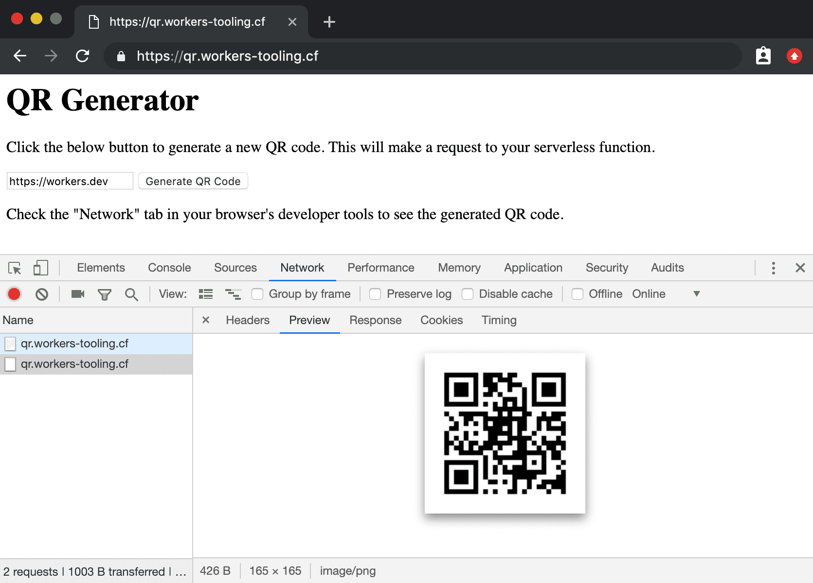

import TutorialsBeforeYouStart from "../../_partials/_tutorials-before-you-start.md"

# Build a QR code generator

<TutorialsBeforeYouStart/>

## Overview

In this tutorial, you’ll build and publish a serverless function that generates QR codes, using Cloudflare Workers.



If you’re interested in building and publishing serverless functions, this is the guide for you! No prior experience with serverless functions or Cloudflare Workers is assumed.

One more thing before you start the tutorial: if you just want to jump straight to the code, we’ve made the final version of the codebase [available on GitHub](https://github.com/signalnerve/workers-qr-code-generator). You can take that code, customize it, and deploy it for use in your own projects. Happy coding!

## Generate

Cloudflare’s command-line tool for managing Worker projects, Wrangler, has great support for templates — pre-built collections of code that make it easy to get started writing Workers. We’ll make use of the default JavaScript template to start building your project.

In the command line, generate your Worker project, using Wrangler’s [worker-template](https://github.com/cloudflare/worker-template), and pass the project name “qr-code-generator”:

```sh
---
header: Generating a new project with Wrangler
---
$ wrangler generate qr-code-generator
$ cd qr-code-generator
```

Wrangler templates are just Git repositories, so if you want to create your own templates, or use one from our [Template Gallery](/examples), there’s a ton of options to help you get started.

Cloudflare’s `worker-template` includes support for building and deploying JavaScript-based projects. Inside of your new `qr-code-generator` directory, `index.js` represents the entry-point to your Cloudflare Workers application.

All Cloudflare Workers applications start by listening for `fetch` events, which are fired when a client makes a request to a Workers route. When that request occurs, you can construct responses and return them to the user. This tutorial will walk you through understanding how the request/response pattern works, and how we can use it to build fully-featured applications.

```js
---
filename: "index.js"
---
addEventListener("fetch", event => {
  event.respondWith(handleRequest(event.request))
})

/**
 * Fetch and log a request
 * @param {Request} request
 */
async function handleRequest(request) {
  return new Response("Hello worker!", { status: 200 })
}
```

In your default `index.js` file, we can see that request/response pattern in action. The `handleRequest` constructs a new `Response` with the body text “Hello worker”, as well as an explicit status code of 200.

When a `fetch` event comes into the worker, the script uses `event.respondWith` to return that new response back to the client. This means that your Cloudflare Worker script will serve new responses directly from Cloudflare’s cloud network: instead of continuing to the origin, where a standard server would accept requests, and return responses, Cloudflare Workers allows you to respond quickly and efficiently by constructing responses directly on the edge.

## Build

Any project you publish to Cloudflare Workers can make use of modern JS tooling like ES modules, NPM packages, and [async/await](https://developer.mozilla.org/en-US/docs/Web/JavaScript/Reference/Statements/async_function) functions to put together your application. In addition, simple serverless functions aren’t the only thing you can publish on Cloudflare Workers: you can [build full applications](/tutorials/build-a-slackbot) using the same tooling and process as what we’ll be building today.

The QR code generator we’ll build in this tutorial will be a serverless function that runs at a single route and receives requests. Given text sent inside of that request (such as URLs, or strings), the function will encode the text into a QR code, and serve the QR code as a PNG response.

### Handling requests

Currently, our Workers function receives requests, and returns a simple response with the text “Hello worker!”. To handle data coming _in_ to our serverless function, check if the incoming request is a `POST`:

```js
---
filename: "index.js"
highlight: [2, 3, 4]
---
async function handleRequest(request) {
  if (request.method === "POST") {
    return new Response("Hello worker!", { status: 200 })
  }
}
```

Currently, if an incoming request isn’t a POST, `response` will be undefined. Since we only care about incoming `POST` requests, populate `response` with a new `Response` with a [405 status code](https://developer.mozilla.org/en-US/docs/Web/HTTP/Status/405), if the incoming request isn’t a `POST`:

```js
---
filename: "index.js"
highlight: [5, 6, 7, 8]
---
async function handleRequest(request) {
  let response
  if (request.method === "POST") {
    response = new Response("Hello worker!", { status: 200 })
  } else {
    response = new Response("Expected POST", { status: 405 })
  }
  return response
}
```

With the basic flow of `handleRequest` established, it’s time to think about how to handle incoming _valid_ requests: if a `POST` request comes in, the function should generate a QR code. To start, move the “Hello worker!” response into a new function, `generate`, which will ultimately contain the bulk of our function’s logic:

```js
---
filename: "index.js"
highlight: [1, 2, 3, 8]
---
const generate = async request => {
  return new Response("Hello worker!", { status: 200 })
}

async function handleRequest(request) {
  // ...
  if (request.method === "POST") {
    response = await generate(request)
  // ...
}
```

### Building a QR Code

All projects deployed to Cloudflare Workers support NPM packages, which makes it incredibly easy to rapidly build out _a lot_ of functionality in your serverless functions. The [`qr-image`](https://github.com/alexeyten/qr-image) package is a great way to take text, and encode it into a QR code, with support for generating the codes in a number of file formats (such as PNG, the default, and SVG), and configuring other aspects of the generated QR code. In the command-line, install and save `qr-image` to your project’s `package.json`:

```sh
---
header: Installing the qr-image package
---
$ npm install --save qr-image
```

In `index.js`, require the `qr-image` package as the variable `qr`. In the `generate` function, parse the incoming request as JSON, using `request.json`, and use the `text` to generate a QR code using `qr.imageSync`:

```js
---
filename: "index.js"
highlight: [1, 2, 3, 4, 5, 6, 7]
---
const qr = require("qr-image")

const generate = async request => {
  const body = await request.json()
  const text = body.text
  const qr_png = qr.imageSync(text || "https://workers.dev")
}
```

By default, the QR code is generated as a PNG. Construct a new instance of `Response`, passing in the PNG data as the body, and a `Content-Type` header of `image/png`: this will allow browsers to properly parse the data coming back from your serverless function, as an image:

```js
---
filename: "index.js"
highlight: [5]
---
const generate = async request => {
  const body = await request.json()
  const text = body.text
  const qr_png = qr.imageSync(text || "https://workers.dev")
  return new Response(qr_png, { headers })
}
```

With the `generate` function filled out, we can simply wait for the generation to finish in `handleRequest`, and return it to the client as `response`:

```js
---
filename: "index.js"
highlight: [4]
---
async function handleRequest(request) {
  // ...
  if (request.method === "POST") {
    response = await generate(request)
  // ...
}
```

### Testing In a UI

The serverless function will work if a user sends a `POST` request to a route, but it would be great to _also_ be able to test it with a proper interface. At the moment, if any request is received by your function that _isn’t_ a `POST`, a `500` response is returned. The new version of `handleRequest` should return a new `Response` with a static HTML body, instead of the `500` error:

```js
---
filename: "index.js"
highlight: [1, 2, 3, 4, 5, 6, 7, 8, 9, 10, 11, 12, 13, 14, 15, 16, 23]
---
const landing = `
<h1>QR Generator</h1>
<p>Click the below button to generate a new QR code. This will make a request to your serverless function.</p>
<input type="text" id="text" value="https://workers.dev"></input>
<button onclick="generate()">Generate QR Code</button>
<p>Check the "Network" tab in your browser’s developer tools to see the generated QR code.</p>
<script>
  function generate() {
    fetch(window.location.pathname, {
      method: "POST",
      headers: { "Content-Type": "application/json" },
      body: JSON.stringify({ text: document.querySelector("#text").value })
    })
  }
</script>
`

async function handleRequest(request) {
  let response
  if (request.method === "POST") {
    response = await generate(request)
  } else {
    response = new Response(landing, { headers: { "Content-Type": "text/html" } })
  }
  return response
}
```

The `landing` variable, which is a static HTML string, sets up an `input` tag and a corresponding `button`, which calls the `generate` function. This function will make an HTTP `POST` request back to your serverless function, allowing you to see the corresponding QR code image data inside of your browser’s network inspector:


With that, your serverless function is complete! The full version of the code looks like this:

```js
---
filename: "index.js"
---
const qr = require("qr-image")

const generate = async request => {
  const { text } = await request.json()
  const headers = { "Content-Type": "image/png" }
  const qr_png = qr.imageSync(text || "https://workers.dev")
  return new Response(qr_png, { headers })
}

const landing = `
<h1>QR Generator</h1>
<p>Click the below button to generate a new QR code. This will make a request to your serverless function.</p>
<input type="text" id="text" value="https://workers.dev"></input>
<button onclick="generate()">Generate QR Code</button>
<p>Check the "Network" tab in your browser’s developer tools to see the generated QR code.</p>
<script>
  function generate() {
    fetch(window.location.pathname, {
      method: "POST",
      headers: { "Content-Type": "application/json" },
      body: JSON.stringify({ text: document.querySelector("#text").value })
    })
  }
</script>
`

async function handleRequest(request) {
  let response
  if (request.method === "POST") {
    response = await generate(request)
  } else {
    response = new Response(landing, { headers: { "Content-Type": "text/html" } })
  }
  return response
}

addEventListener("fetch", event => {
  event.respondWith(handleRequest(event.request))
})
```

## Publish

And with that, you’re finished writing the code for the QR code serverless function, on Cloudflare Workers!

Wrangler has built-in support for bundling, uploading, and releasing your Cloudflare Workers application. To do this, we’ll run `wrangler publish`, which will _build_ and _publish_ your code.

```sh
---
header: Publishing your project
---
$ wrangler publish
```

## Resources

In this tutorial, you built and published a serverless function to Cloudflare Workers for generating QR codes. If you’d like to see the full source code for this application, you can find it [on GitHub](https://github.com/signalnerve/workers-qr-code-generator).

If you want to get started building your own projects, check out the quick-start templates we’ve provided in our [Template Gallery](/examples).
