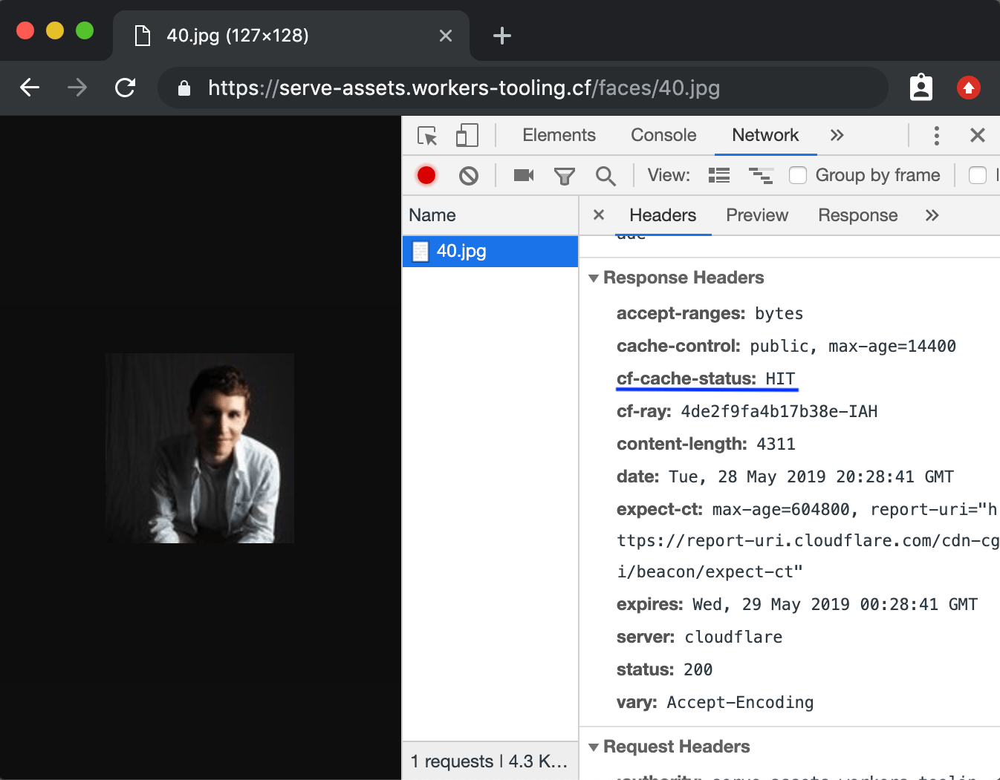

import TutorialsBeforeYouStart from "../../_partials/_tutorials-before-you-start.md"

# Configure your CDN

<TutorialsBeforeYouStart/>

## Overview

In this tutorial, you’ll build and publish a Cloudflare Workers function that serves assets from a storage platform (in this example, [Google Cloud Storage](https://cloud.google.com/storage/)) to your users. This approach, called “white-labelling”, often takes the form of complex DNS configuration – thanks to Cloudflare Workers, and Cloudflare’s CDN, we can build a powerful (and fast) solution to this problem in just a few lines of code.

If you’re interested in building and publishing a Cloudflare Workers function to configure your CDN, this is the guide for you! No prior experience with serverless functions or Cloudflare Workers is assumed.

One more thing before you start the tutorial: if you just want to jump straight to the code, we’ve made the final version of the codebase [available on GitHub](https://github.com/signalnerve/assets-on-workers). You can take that code, customize it, and deploy it for use in your own projects. Happy coding!

## Prerequisites

This tutorial assumes that you have a _public_ bucket on Google Cloud Storage, which you’ll use to serve assets through your Cloudflare Workers function. If you don’t have a Google Cloud Storage bucket to use with this project, we recommend going through Google Cloud’s “Cloud Storage Quickstart” guide, which can be found [here](https://cloud.google.com/storage/docs/quickstart-console).

This tutorial makes use of sample images to illustrate serving data through your Cloudflare Workers function. If you have an existing set of images you’d like to use, you can upload those to your Google Cloud Storage bucket and use them — if you don’t have an existing set of images, we’ve provided a sample set of profile pictures via [UIFaces.com](http://uifaces.com/), formatted in numeric order (`1.jpg`, `2.jpg`, … `199.jpg`).

To follow along with this tutorial using the data set we’ve provided, download the [sample image collection](https://storage.cloud.google.com/workers-docs-configure-your-cdn-tutorial/faces.zip), and upload the zipped folder “faces” to root of your bucket. The directory structure should look like this:

```txt
your-bucket
└── faces
    ├── 1.jpg
    ├── 2.jpg
    ├── ...
    └── 99.jpg
```

Finally, to ensure that you can access the objects from your Workers function, your Google Cloud Storage bucket should be publicly accessible. To ensure this, follow the “Making groups of objects publicly readable” guide in the Google Cloud Storage docs, which can be found at [Google Cloud’s docs](https://cloud.google.com/storage/docs/access-control/making-data-public#buckets).

## Generate

Cloudflare’s command-line tool for managing Worker projects, Wrangler, has great support for templates — pre-built collections of code that make it easy to get started writing Workers. We’ll make use of the default JavaScript template to start building your project.

In the command line, generate your Workers project, and pass the project name `serve-cdn-assets`:

```sh
---
header: Generate a new project
---
$ wrangler generate serve-cdn-assets
$ cd serve-cdn-assets
```

By default, Wrangler will use our [`worker-template`](https://github.com/cloudflare/worker-template). Wrangler templates are just Git repositories, so if you want to create your own templates, or use one from our [Template Gallery](/examples), there’s a ton of options to help you get started.

Cloudflare’s `worker-template` includes support for building and deploying JavaScript-based projects. Inside of your new `serve-cdn-assets` directory, `index.js` represents the entry-point to your Cloudflare Workers application.

All Cloudflare Workers applications start by listening for `fetch` events, which are fired when a client makes a request to a Workers route. When that request occurs, you can construct responses and return them to the user. This tutorial will walk you through understanding how the request/response pattern works, and how we can use it to build fully-featured applications.

```js
---
filename: index.js
---
addEventListener("fetch", event => {
  event.respondWith(handleRequest(event))
})

/**
 * Fetch and log a request
 * @param {Request} request
 */
async function handleRequest(event) {
  return new Response("Hello worker!", { status: 200 })
}
```

In your default `index.js` file, we can see that request/response pattern in action. The `handleRequest` constructs a new `Response` with the body text “Hello worker”, as well as an explicit status code of 200.

When a `fetch` event comes into the worker, the script uses `event.respondWith` to return that new response back to the client. This means that your Cloudflare Workers script will serve new responses directly from Cloudflare’s edge network: instead of continuing to the origin, where a standard server would accept requests, and return responses, Cloudflare Workers allows you to respond quickly and efficiently by constructing responses directly on the edge.

## Build

Any project you publish to Cloudflare Workers can make use of modern JS tooling like ES modules, NPM packages, and [async/await](https://developer.mozilla.org/en-US/docs/Web/JavaScript/Reference/Statements/async_function) functions to put together your application. In addition, simple serverless functions aren’t the only thing you can publish on Cloudflare Workers: you can [build full applications](/tutorials/build-a-slackbot), or [serverless functions](/tutorials/build-a-qr-code-generator) using the same tooling and process as what we’ll be building today.

The Cloudflare Workers project built in this tutorial will be a serverless function that runs on a _wildcard_ route and receives requests. When the serverless function receives an incoming request, it should parse the URL, find what asset is being requested, and serve it from the configured Cloud Storage bucket. Because the asset will go through your Workers function, and through Cloudflare’s network, you can also make use of both Cloudflare’s _default_ caching behavior, as well as your own custom logic, to ensure that as much data can be cached at Cloudflare’s globally distributed data centers — the result is an easy-to-understand and highly performant CDN configuration, with the ability to customize it to your application’s specific needs.

### Handling requests

Currently, the Workers function receives requests, and returns a simple response with the text “Hello worker!”. Begin configuring the function by adding an additional check — requests coming in to the function should **only** be `GET` requests. If it receives other requests, like `POST`s or `DELETE`s, it should return an error response, with a status code of [405](https://httpstatuses.com/405). Using `event.request.method`, the resulting code is below:

```js
---
filename: index.js
highlight: [2, 3, 4, 5, 6]
---
async function handleRequest(event) {
  if (event.request.method === "GET") {
    return new Response("Hello worker!", { status: 200 })
  } else {
    return new Response("Method not allowed", { status: 405 })
  }
}
```

Given that the incoming request to the function _is_ a `GET`, it should be clear that the bulk of our implementation will happen inside of that conditional, replacing the “Hello worker!” response. Create a separate function, `serveAsset`, which will house the majority of the implementation for the remainder of the tutorial:

```js
---
filename: index.js
highlight: [1, 2, 3, 7]
---
async function serveAsset(event) {
  return new Response("Hello worker!", { status: 200 })
}

async function handleRequest(event) {
  if (event.request.method === "GET") {
    return serveAsset(event)
  } // ...
}
```

### Routing to your assets

Looking back at the original definition of this project, at the beginning of the “Build” section, the `serveAsset` function should parse the URL, find what asset is being requested, and serve it from the configured Cloud Storage bucket. To do this, the `event.request.url` field should be parsed using the `URL` library, and set to `url`. Given an instance of the `URL` class, `url`, there are a number of useful properties that can be used to query the incoming request. `serveAsset` should check the `pathname`, which contains the part of the URL _after_ the `host`: for instance, given the URL `https://assets.mysite.com/faces/1.jpg`, the pathname will be `/faces/1.jpg`:

```js
---
filename: index.js
highlight: [2, 3]
---
function serveAsset(event) {
  const url = new URL(event.request.url)
  console.log(url.pathname) // "/faces/1.jpg"
}
```

With that `path` available, the function can simply request the corresponding path from our Cloud Storage bucket. Given a constant `BUCKET_NAME` (we’ll set it in this tutorial to “my-bucket”), set a `BUCKET_URL` constant, append `url.pathname` to the end of it, and `fetch` it to get your function’s `response`:

```js
---
filename: index.js
highlight: [1, 2, 6]
---
const BUCKET_NAME = "my-bucket"
const BUCKET_URL = `http://storage.googleapis.com/${bucketName}`

function serveAsset(event) {
  const url = new URL(event.request.url)
  return fetch(`${bucketUrl}${url.pathname}`)
}
```

### Custom caching

At this point in the tutorial, deploying this script would give you a fully-functional project you could use to retrieve assets from your Cloud Storage bucket. Instead of wrapping up the tutorial here, let’s continue to explore how configuring your CDN is really powerful with Workers, by making use of the [Cache API](/learning/how-the-cache-works).

To cache responses in a Workers function, the Cache API provides `cache.match`, to check for the presence of a cached asset, and `cache.put`, to cache a `response` for a given `request`. Given those two functions, the general flow will look like this:

1. Check for the presence of a cached asset, and set it to `response`.
2. If `response` doesn’t exist, get the asset from cloud storage, set it to `response`, and cache it.
3. Return `response` from the function, back to the `fetch` event handler.

The `Cache-Control` header is a common way that HTML responses indicate _how_ they should be cached. The Workers implementation respects the `Cache-Control` header (as well as many others), in indicating how assets should be cached on Cloudflare’s CDN. In building a custom asset serving solution, and enabling caching, you should set a custom `Cache-Control` header (in this example, we’ll set it to `public`, and a `max-age` value of `14400` seconds, or four hours). When the asset is retrieved from cloud storage, the `serveAsset` function should construct a new instance of `Response`, copying much of the HTML response data from the cloud storage response, but overwriting the response headers. By doing this, you’ll define your own custom caching information, and passing it to the Workers Cache API.

When you add something to the cache, it’s important to note that an HTML response is designed to only be processed once in your code, according to the Service Worker spec that Cloudflare Workers implements. To get around this, we’ll clone the asset response, using `response.clone()`, and pass that cloned response to the Cache API, and return the original `response` back from the function. The final code looks like this:

```js
---
filename: index.js
highlight: [ 3, 4, 5, 6, 7, 8, 9, 10, 11, 12]
---
async function serveAsset(event) {
  const url = new URL(event.request.url)
  const cache = caches.default
  let response = await cache.match(event.request)

  if (!response) {
    response = await fetch(`${BUCKET_URL}${url.pathname}`)
    const headers = { "cache-control": "public, max-age=14400" }
    response = new Response(response.body, { ...response, headers })
    event.waitUntil(cache.put(event.request, response.clone()))
  }
  return response
}
```

Before building and publishing your Workers script, there’s one more thing to be added. Currently, if an asset is requested that doesn’t exist, or if your bucket policy doesn’t include public access to an asset, `serveAsset` will pass back the corresponding error page directly to the client. Instead of doing this, the returned response should be checked in `handleRequest`: if the status code is higher than `399` (where 200-level status codes indicate “success”, and 399-level status codes indicate “redirection”), we can return a truncated `response` with just the `status` and `statusText` from response:

```js
---
filename: index.js
highlight: [3, 4, 5, 6, 7]
---
async function handleRequest(event) {
  if (event.request.method === "GET") {
    let response = await serveAsset(event)
    if (response.status > 399) {
      response = new Response(response.statusText, { status: response.status })
    }
    return response
  } else {
    return new Response("Method not allowed", { status: 405 })
  }
}
```

And with that, you’re finished writing the code for this tutorial! The final version of your script should like this:

```js
addEventListener("fetch", event => {
  event.respondWith(handleRequest(event))
})

const BUCKET_NAME = "hugo-workers"
const BUCKET_URL = `http://storage.googleapis.com/${BUCKET_NAME}`

async function serveAsset(event) {
  const url = new URL(event.request.url)
  const cache = caches.default
  let response = await cache.match(event.request)

  if (!response) {
    response = await fetch(`${BUCKET_URL}${url.pathname}`)
    const headers = { "cache-control": "public, max-age=14400" }
    response = new Response(response.body, { ...response, headers })
    event.waitUntil(cache.put(event.request, response.clone()))
  }
  return response
}

async function handleRequest(event) {
  if (event.request.method === "GET") {
    let response = await serveAsset(event)
    if (response.status > 399) {
      response = new Response(response.statusText, { status: response.status })
    }
    return response
  } else {
    return new Response("Method not allowed", { status: 405 })
  }
}
```

## Publish

To make this script available for use, you’ll need to build and publish it to Cloudflare using Wrangler. To do this, we’ll first _build_ the code, and then _publish_ it:

```sh
---
header: Build and publish your project
---
$ wrangler build
$ wrangler publish
```

After deploying your project, open up your browser to test retrieving your assets! For instance, if your Workers project is deployed to the route `myassets.com`, going to the URL `myassets.com/faces/1.jpg` should show an uploaded asset. In addition, you can inspect the request in your browser to confirm that it’s being cached. Cloudflare’s CDN will send a `cf-cache-status` header, with `HIT` or `MISS`, to indicate whether the content was a “cache hit” or not:



## Resources

In this tutorial, you built and published a serverless function to Cloudflare Workers for serving assets from cloud storage. If you’d like to see the full source code for this application, visit the [repo on GitHub](https://github.com/signalnerve/assets-on-workers).

If you want to get started building your own projects, check out the quick-start templates we’ve provided in our [Template Gallery](/examples).
