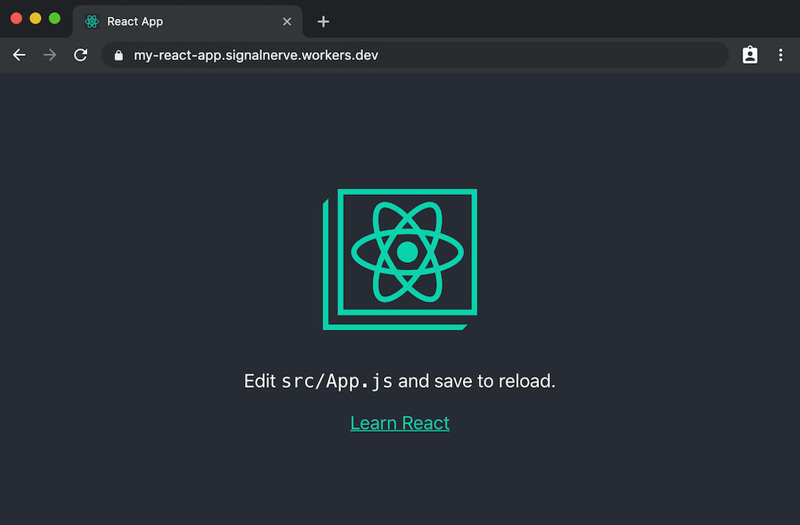

import TutorialsBeforeYouStart from "../../_partials/_tutorials-before-you-start.md"

<!-- Use non-breaking hyphens &#8209; instead of - to improve layout -->
# Deploy a React app with create&#8209;react&#8209;app

<TutorialsBeforeYouStart/>

## Overview

In this tutorial, you will use [Wrangler](https://github.com/cloudflare/wrangler) and [Cloudflare Workers](https://workers.cloudflare.com) to deploy and serve a static site. With the rise of architectures like [JAMStack](https://jamstack.org/), static sites have become a simple, streamlined way to combine highly-available static assets with performant backend code, especially when deployed in a serverless model. With Workers, your application will be distributed to over 200+ locations around the world, and served directly from Cloudflare’s CDN at the server closest to your users.

<YouTube id="6YC3MgVwCGA"/>

If you just want to review the code used in this tutorial, the final version of the codebase is [available on GitHub](https://github.com/signalnerve/react-workers-template). You can take that code, customize it, and deploy it for use in your own projects.

## Prerequisites

You will be using [create-react-app](https://github.com/facebook/create-react-app) to create the example project for this tutorial. No experience with React is needed, and you can take what you learn in this tutorial and apply it to other frameworks, such as [Vue](https://vuejs.org) or [Angular](https://angular.io), and even static site frameworks like [Gatsby](https://gatsbyjs.org) and [Hugo](https://gohugo.io).

## Create a static site

In this tutorial, you will use [`create-react-app`](https://github.com/facebook/react) to build a simple static application. Create a new project directly by using `npx`:

```sh
---
header: Create a new React application
---
$ npx create-react-app my-static-site
```

`create-react-app` will create a new project, and include all the relevant dependencies needed to build the project.

## Generate a project

In the command line, navigate to your newly-created React project, and use `wrangler init --site` to generate a Workers Sites configuration for your project:

```sh
---
header: Initialize a new Wrangler project
---
$ cd my-static-site
$ wrangler init --site
```

The `init --site` command will provide the scaffolding necessary to deploy your React application. For the majority of static sites, you should not need to change the Workers script. By default, the script will look at an incoming request, and will serve a corresponding asset from [Workers KV](https://www.cloudflare.com/products/workers-kv/) based on that route. 

For example, if you deploy a static site at `mystaticsite.com`, requesting `mystaticsite.com/about.html` will look for a file in KV called `about.html`, and serve it back to the client. In addition, if the asset being returned from KV is cacheable, it will automatically be cached with Cloudflare’s CDN, making subsequent requests even faster.

To serve a single page application, update `workers-site/index.js` with the following code to so that all html requests are pointed at your root `index.html` file.

```js
import { getAssetFromKV, serveSinglePageApp } from '@cloudflare/kv-asset-handler';

async function handleEvent(event) {
   ...
   const asset = await getAssetFromKV(event, { mapRequestToAsset: serveSinglePageApp });
}
```

## Configure and publish

To prepare your application for deployment, open the newly-created `wrangler.toml` file, which represents the configuration for your Workers application. Using the [Configuring your project section of Get started](/get-started/guide#6d-configuring-your-project) as a guide, populate `wrangler.toml` with your account ID, which will allow you to deploy your React application to your Cloudflare account.

The `bucket` key in your `wrangler.toml` file indicates the build folder that Sites will deploy to Workers. While many front-end application and static site generators use the folder `public`, `create-react-app` uses the folder `build`. Change the `bucket` key in `wrangler.toml` to `build`:

```toml
---
filename: wrangler.toml
highlight: [3, 4, 5]
---
# ... previous wrangler config

[site]
bucket = "./build"
entry-point = "workers-site"
```

With a configured `wrangler.toml` file, it is time to build your project and publish it to Workers. Run `npm run build` to tell `create-react-app` to build your site, and `wrangler publish` to deploy it to Workers:

```sh
---
header: Build and publish your application
---
$ npm run build
$ wrangler publish
```

After deploying your project, open your browser to review your static site.



## How it works

The Workers Site feature is designed to work with as little configuration as possible. Since the process for deploying static sites is fairly consistent, regardless of framework or language, you should not need to spend a lot of time configuring your project or writing any additional code to serve your site on Workers.

If you are interested in how a Workers Site operates, this section will briefly document how the underlying script works and what it does each time a user makes a request to your site.

Like all Workers scripts, the static site feature begins by listening for incoming `fetch` events to your application — these are incoming requests from a client, such as a browser or a phone:

```js
---
filename: index.js
---
addEventListener("fetch", event => {
  event.respondWith(handleRequest(event.request))
})
```

When the script receives an incoming [`Request`](https://developer.mozilla.org/en-US/docs/Web/API/Request), it looks at the `pathname`, such as `/workers`, and looks up an associated file uploaded to Workers KV. If that file is found, a new [`Response`](https://developer.mozilla.org/en-US/docs/Web/API/Response) is generated, with a matching [MIME type](https://developer.mozilla.org/en-US/docs/Web/HTTP/Basics_of_HTTP/MIME_types) in the `Content-Type` header of the response — for example, if the path `/workers.jpg` is requested, a new response is returned with the header `Content-type: image/jpeg`.

After fetching assets from [Workers KV](/runtime-apis/kv), the static site template will cache them in Cloudflare’s powerful CDN. When subsequent users request `/index.html`, Cloudflare’s CDN will transparently serve a cached version.

## Resources

In this tutorial, you built and published a static site to Workers. If you would like to see the full source code for this application, the final version of the codebase is available [in a GitHub repository](https://github.com/signalnerve/react-workers-template).

If you want to get started building your own projects, review the existing list of [Quickstart templates](/get-started/quickstarts).
