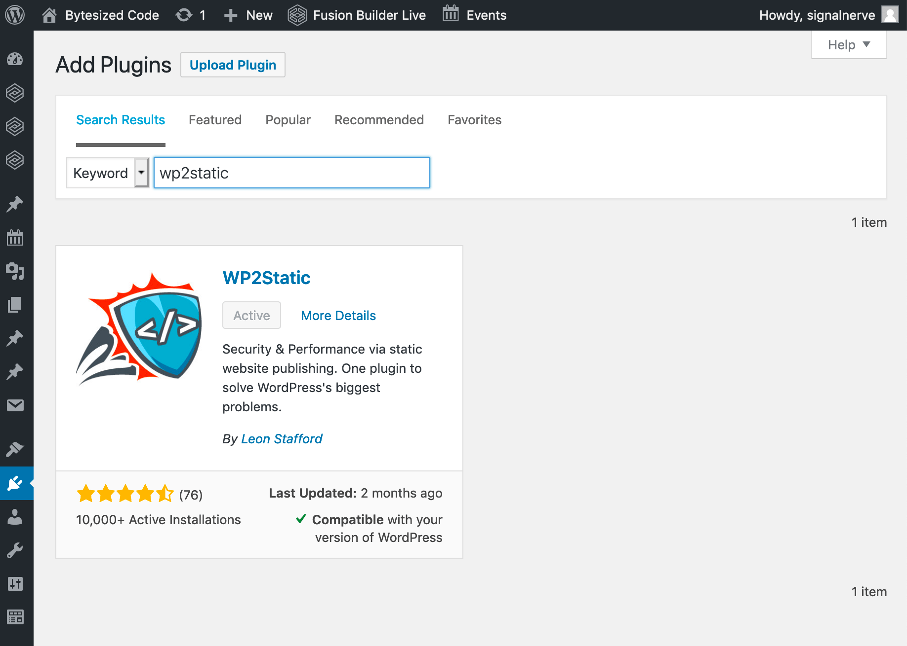
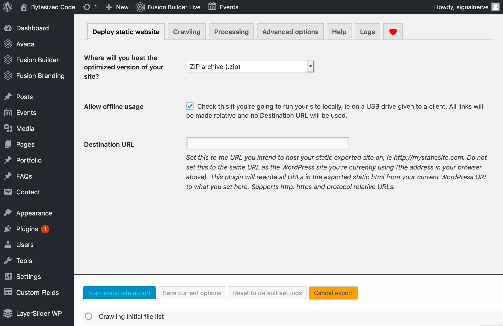
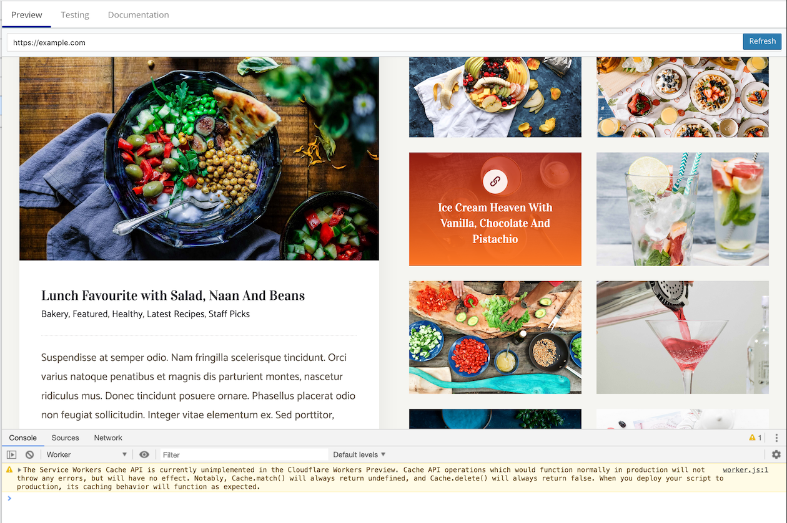

import TutorialsBeforeYouStart from "../../_partials/_tutorials-before-you-start.md"

# Deploy a static WordPress site

<TutorialsBeforeYouStart/>

## Overview

In this tutorial, we’ll migrate a WordPress site to Cloudflare Workers, making use of [Workers Sites](/platform/sites). Serving a static version of your WordPress site has many advantages over directly exposing your WordPress site. While WordPress is extremely powerful and easy to use, the consistent discovery of new vulnerabilities make it an obvious target for hackers to attack. Because WordPress is built on PHP, each incoming request to your site regenerates a new response on the server – for most websites this isn’t necessary, and leads to scaling issues when your site receives a lot of traffic.

We’ll use the free WordPress plugin [WP2Static](https://wordpress.org/plugins/static-html-output-plugin/), which generates a completely static (HTML, CSS, and JS) version of your WordPress site. Using [Wrangler](https://github.com/cloudflare/wrangler), we’ll publish the site to Cloudflare Workers. The Workers Sites functionality built into Wrangler includes support for serving and caching your site directly in Cloudflare’s CDN, enabling users to view your site quickly and securely.

## Prerequisites

This tutorial assumes that you are:

- the Administrator account on your WordPress site, and
- able to install WordPress Plugins on the site.

## Setup

To start, we’ll install the [WP2Static](https://wordpress.org/plugins/static-html-output-plugin/) plugin to export your WordPress site to a zip file. In your WordPress admin, navigate to the “Add Plugins” page, by default at `/wp-admin/plugin-install.php`. In the search bar, search WP2Static and confirm that the resulting plugin that you will be installing matches the plugin below.



Select “Install” on the plugin and once it’s finished installing, “Activate”.

### Export your WordPress site

When your application refreshes, you should see a new section of your sidebar called WP2Static. Navigate to that section and we’ll begin your first static WordPress export.

From the “Where will you host..” dropdown on the page, select “ZIP archive (.zip)”. WP2Static supports a number of different export types, including manual and automated exports. To make deployment easier, we recommend you select “Allow offline usage” – this will make all the URLs in your WordPress export _relative_: `/logo.png` versus `https://mysite.com/logo.png`, and will reduce the number of asset errors that could occur depending on your theme and WordPress setup.

It’s time to do our first export! Select “Start static site export” (it might take a while), and when it completes, save the ZIP file somewhere you can easily find it later.



## Creating the Workers project

With an export ready of our site, it’s time to get to work deploying it. To do this, we’ll use [Wrangler](https://github.com/cloudflare/wrangler), the command-line tool for Cloudflare Workers. If you haven’t yet installed and configured Wrangler, check out our [Getting started](/learning/getting-started) guide.

Once Wrangler is installed and configured, we can create a new project for deploying our static WordPress site to Workers. To generate a new project run:

```sh
---
header: Generate a new project
---
$ wrangler generate --site wp-static
```

The [`--site`](/platform/sites/configuration) flag indicates that we want to deploy a static site, namely, our static WordPress site.

### Port the WordPress Site

The newly generated `wp-static` directory will contain three things:

1. A `public` directory, representing the site you want to deploy to Workers. This will be the location of your WordPress site.
2. A `workers-site` directory, which contains the Workers script that will serve your website content. In this tutorial, we won’t change anything in this folder.
3. A `wrangler.toml` file, which contains the configuration details for our `wp-static` file. We’ll populate this file with some information before the project is deployed.

When deploying a website using Workers Sites, your static code – your HTML, CSS, and JavaScript – will be uploaded to Workers KV. The location of these files is by default the `public` folder mentioned above.

Open the ZIP file downloaded from your WordPress static export, and extract the contents of the ZIP into the `public` folder:

```sh
---
header: Copy files into the public directory
---
$ cp -R ~/Downloads/wp-static-html-output-<some-tag>/ ./public
```

Your directory structure should look something like this:

```sh
---
header: Listing the files in wp-static
---
$ tree wp-static
├── public
│   ├── 2018
│   ├── 2019
│   ├── 404.html
│   └── # More exported WordPress files
├── workers-site
│   ├── index.js
│   ├── node_modules
│   └── # More Workers script files
└── wrangler.toml
```

## Deploying

To preview and deploy our application, we need to fill out `wrangler.toml` — the configuration file for this project. Most of the file has been pre-filled, but you need to specify your `account_id` and where you want to deploy your application. Fill out the [`account_id`](/learning/getting-started#6a-obtaining-your-account-id-and-zone-id) field in `wrangler.toml` with your Cloudflare account ID.

Using Wrangler’s preview feature, we can quickly upload a version of our site to the Cloudflare Workers preview service, and make sure that the static export looks like we’d expect. Running `wrangler preview` will upload your static site and preview it in a browser window.

When your site looks correct in Wrangler’s preview, you can move onto publishing your project to a domain. For a guide on how to do this, check out [Getting started](/learning/getting-started#6-configure-your-project-for-deployment).

[](https://wp-static.signalnerve.workers.dev)

## Limitations

There are some features available in WordPress sites that will not be supported in a static site environment:

- WordPress Forms
- WordPress Comments
- Any links to `/wp-admin` or similar “internal” WordPress routes

## Conclusions

Deploying your WordPress site to Workers has benefits for your site’s performance, security, and cost. With a static version of your site being served, you can do a number of things with your live WordPress installation:

- Move your WordPress install to a private URL or subdomain, and serve the static version of your site by deploying the Workers application to your domain. See [Deploying to a Domain](/learning/getting-started#optional-configure-for-deploying-to-a-registered-domain) to learn more!
- Run your WordPress instance locally, or put your now-hidden WP instance behind something like [Cloudflare Access](https://www.cloudflare.com/products/cloudflare-access/) to only give access to your contributors. This has a dramatic effect on the number of attack vectors for your WordPress site and its content.
- Downgrade your WordPress hosting plan to a cheaper plan. Because the memory and bandwidth requirements for your WordPress instance are now much smaller, you can often get away with hosting it on a cheaper plan, or moving to shared hosting. Your Cloudflare Workers plan is priced per-request, and because you can host up to thirty sites on your account, serving a high number of static WordPress sites can be an order of magnitude cheaper on Workers.

We’re super excited about the future of Workers and WordPress, and we’d love to hear about what you’re building with them!
