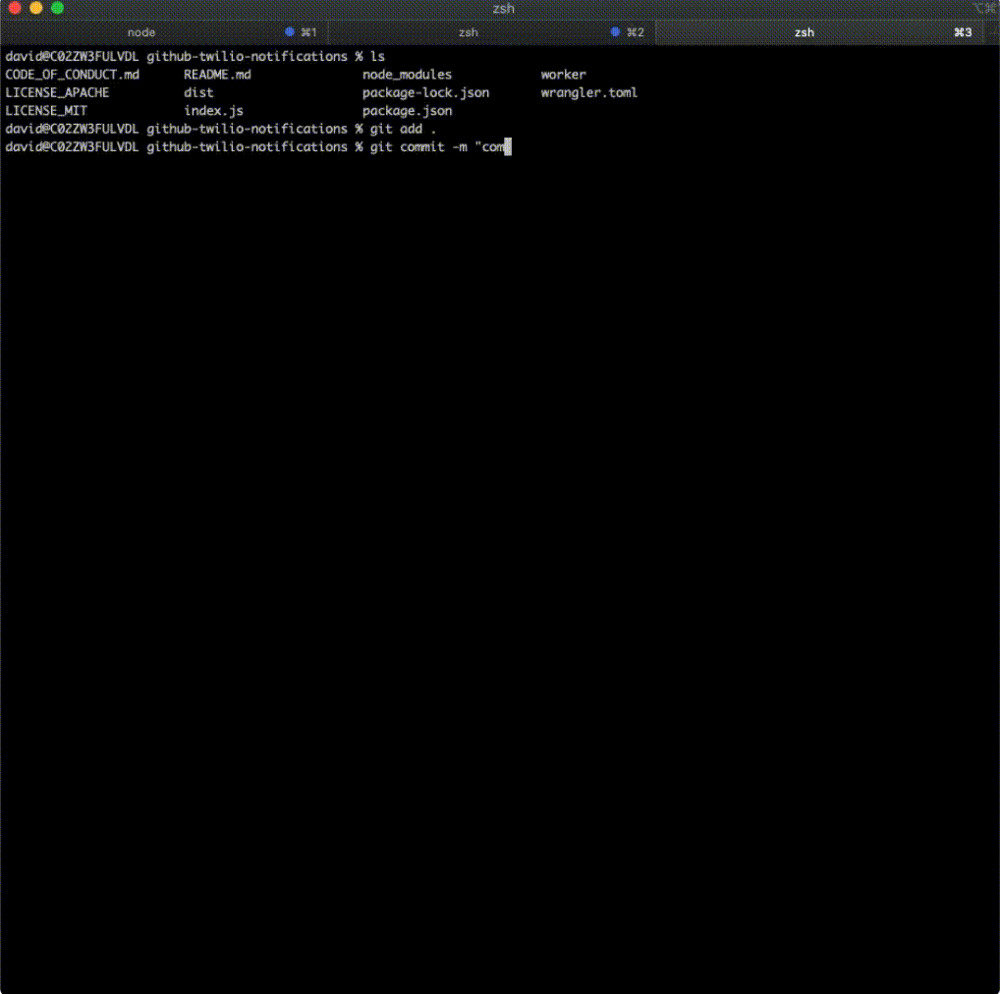

import TutorialsBeforeYouStart from "../../_partials/_tutorials-before-you-start.md"

# GitHub SMS notifications using Twilio

<TutorialsBeforeYouStart/>

## Overview

In this tutorial, you will learn to build an SMS notification system on Workers to receive updates about one of your GitHub repositories. When there is new activity on your repo, your worker will send you a text update using Twilio.

You’ll learn how to:
- Build webhooks using Workers
- Integrate Workers with GitHub and Twilio
- Use Worker secrets with Wrangler



--------------------------------

## Generate a project

We will start by using `wrangler generate` to generate a Worker project in the cli.

```sh
---
header: Generate a project
---
$ wrangler generate github-twilio-notifications
$ cd github-twilio-notifications
```

Inside of your new `github-sms-notifications` directory, `index.js` represents the entry-point to your Cloudflare Workers application. We will work here for most of the tutorial.

You will also need a GitHub account and a repository for this tutorial. If you don't have either setup, you should [create a new GitHub account](https://github.com/join) and [create a new repo](https://docs.github.com/en/github/getting-started-with-github/create-a-repo) to follow along to this tutorial.

First, we’ll create a webhook for your repo to post updates to your worker. Inside of your worker, we’ll then parse the updates. Finally, we’ll send a POST request to Twilio to send a text message to you.

You can reference the finished code on this [GitHub repository](https://github.com/davidtsong/github-twilio-notifications/).

--------------------------------

## Configure GitHub

The first step is to configure a GitHub webhook to post to our Worker when there is an update to the repo.

Click on the "Settings" tab for your repo and then click on the "Webhooks" page from the list on the left.

Click "Add webhook" and configure the "Payload URL" with your worker URL. You can find your worker URL by setting your account id in the `wrangler.toml` file and then running "wrangler publish" in your command line to generate a live URL for your Worker.

For the "Content type", choose "application/json".

Generate a secret key of your choice and set it as the "Secret".

Click "Let me select individual events" for which events to trigger the webhook. Select the events you want to get notifications for. (I selected "Pull requests", "Pushes", and "Branch or tag creation")

Finally, click "Add webhook" to finish our configuration.


--------------------------------

## Parsing the Response

With your local environment setup, we will now parse the repo update with your worker. If you get stuck, you can refer to the finished [index.js](https://github.com/davidtsong/GitHub-twilio-notifications/blob/master/index.js).

Your generated `index.js` should look like this below:

```js
---
filename: index.js
---
addEventListener("fetch", event => {
  event.respondWith(handleRequest(event.request))
})

/**
 * Respond with hello worker text
 * @param {Request} request
 */
async function handleRequest(request) {
  return new Response("Hello worker!", {
    headers: { "content-type": "text/plain" },
  })
}
```

Let’s start by modifying the starter code to handle a `POST` response and renaming the request handler. We can use the `request.method` property of [request](/runtime-apis/request) to check if the request is a `POST` request, and send an error response if incorrect. The `simpleResponse` function is an easy wrapper for you to respond with requests using your Worker.

```js
---
filename: index.js
---
function simpleResponse(statusCode, message) {
  let resp = {
    message: message,
    status: statusCode
  }

  return new Response(JSON.stringify(resp), {
    headers: { "Content-Type": "application/json" },
    status: statusCode
  })
}

addEventListener("fetch", event => {
  event.respondWith(githubWebhookHandler(event.request))
})

async function githubWebhookHandler(request) {
  if (request.method !== "POST") {
    return simpleResponse(
      200,
      "Please send a POST request :)"
    )
  }
}
```

Next, we’ll validate that the request is sent with the right secret key. GitHub attaches a hash signature for each payload using the secret key ([see the docs for more details](https://developer.github.com/webhooks/securing/)). We can use a helper function called `checkSignature` on the request to ensure the hash is correct. Then, we can access data from the webhook by parsing the request as JSON.

```js
---
filename: index.js - githubWebhookHandler()
---
async function githubWebhookHandler(request) {
  if (request.method !== "POST") {
    return simpleResponse(
      200,
      "Please send a POST request :)"
    )
  }
  try {
    const formData = await request.json()
    const headers = await request.headers
    const action = headers.get("X-GitHub-Event")
    const repo_name = formData.repository.full_name
    const sender_name = formData.sender.login

    if (!checkSignature(formData, headers)) {
      return simpleResponse(403, "Wrong password, try again :P")
    }

  } catch (e) {
    return simpleResponse(
      200,
      `Error:  ${e}`
    )
  }
}

```

The `checkSignature` function will use the crypto library to hash the received payload with our known secret key to ensure it matches the request hash. GitHub uses an HMAC hexdigest to compute the hash in the sha1 format.

```js
---
filename: index.js
---
const crypto = require("crypto")

async function createHexSignature(requestBody) {
  let hmac = crypto.createHmac("sha1", SECRET_TOKEN)
  hmac.update(requestBody,"utf-8")

  return hmac.digest("hex")
}

async function checkSignature(formData, headers) {
  let expectedSignature = await createHexSignature(formData)
  let actualSignature = headers.get("X-Hub-Signature")

  return expectedSignature === actualSignature
}
```

Since our project relies on importing a library, we need to use [webpack](/cli-wrangler/webpack/) and update our `wrangler.toml` to set `type = "webpack"`.

Your `wrangler.toml` should look something like this:

```toml
---
filename: "wrangler.toml"
---
name = "nameless-bonus-1fdf"
type = "webpack"
account_id = "xxxxxxxxx"
workers_dev = true
route = ""
zone_id = ""
```

--------------------------------

## Sending a Text with Twilio

Finally, we will send a text message to you about your repo activity using Twilio. You’ll need a Twilio account and number to send texts so follow [this guide to get setup](https://www.twilio.com/sms/api). FYI, Twilio has this [pretty awesome game](https://www.twilio.com/quest) where you can learn how to use their platform and get some free credits while you are at it.

Then, we can create a helper function to send text messages for us by sending a post request to the Twilio API endpoint. [Refer to the Twilio reference here](https://www.twilio.com/docs/sms/api/message-resource#create-a-message-resource) to learn more about this endpoint.

We construct our headers and body in the format shown in the Twilio reference page. Change the `from` value to your Twilio Phone number.

```js
---
filename: index.js - sendText()
---
async function sendText(message){
  const endpoint = "https://api.twilio.com/2010-04-01/Accounts/" + ACCOUNT_SID + "/Messages.json"

  let encoded = new URLSearchParams()
  encoded.append("To", RECIPIENT)
  encoded.append("From", "+19388887573")
  encoded.append("Body", message)

  let token = btoa(ACCOUNT_SID + ":" + AUTH_TOKEN)

  const request = {
    body: encoded,
    method: "POST",
    headers: {
      "Authorization": `Basic ${token}`,
      "Content-Type": "application/x-www-form-urlencoded"
    }
  }

  let result = await fetch(endpoint, request)
  result = await result.json()

  return new Response(JSON.stringify(result), request)
}
```
To make this work, we need to set some secrets to hide your `ACCOUNT_SID` and `AUTH_TOKEN` from the source code. You can set secrets with `wrangler secret put` in the cli.

```sh
$ wrangler secret put ACCOUNT_SID
```

Use wrangler to set your Twilio `ACCOUNT_SID`, `RECIPIENT`(your number), Twilio `AUTH_TOKEN`, and `SECRET_TOKEN` (for GitHub) secrets to the respective values.

Finally, we modify our `githubWebhookHandler` to send a text at the end using the `sendText` function we just made.

```js
async function githubWebhookHandler(request) {
  if (request.method !== "POST") {
    return simpleResponse(
      200,
      "Please send a POST request :)"
    )
  }
  try {
    const formData = await request.json()
    const headers = await request.headers
    const action = headers.get("X-GitHub-Event")
    const repo_name = formData.repository.full_name
    const sender_name = formData.sender.login

    if (!checkSignature(formData, headers)) {
      return simpleResponse(403, "Wrong password, try again :P")
    }

    return await sendText(`${sender_name} casted spell: ${action} onto your repo ${repo_name}`)

  } catch (e) {
    return simpleResponse(
      200,
      `Error:  ${e}`
    )
  }
}
```

You made it :) Now, just use wrangler to deploy your script to Workers and test it out.

```sh
$ wrangler publish
```


Make an update (that you configured in the GitHub webhook settings)) to your repo and you'll get a text soon after. If you’ve never used Git before, here’s a [quick guide](https://www.datacamp.com/community/tutorials/git-push-pull) to pushing to your repo.

You can reference the finished code on this [GitHub repository](https://github.com/davidtsong/github-twilio-notifications/).

You’ve learned how to:
- Build webhooks using Workers
- Integrate Workers with GitHub and Twilio
- Use Worker secrets with wrangler

Other tutorials:
- [Authorize users with Auth0](/tutorials/authorize-users-with-auth0)
- [Build a JAMStack app](/tutorials/build-a-jamstack-app)
- [Build a QR code generator](/tutorials/build-a-qr-code-generator)
