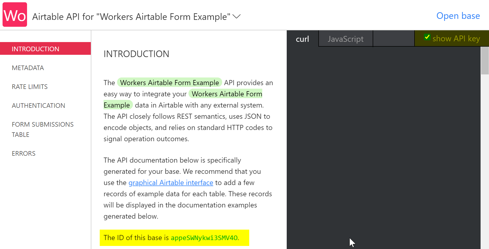

import TutorialsBeforeYouStart from "../../_partials/_tutorials-before-you-start.md"

# Handle form submissions with Airtable

<TutorialsBeforeYouStart/>

## Overview

Cloudflare Workers excels as a performant serverless functions platform. This makes it a great fit for handling form submissions from your front-end applications, particularly when you need to send those submissions to an external API or database.

In this tutorial, we'll use Workers and [Airtable](https://airtable.com) to persist form submissions from a front-end user interface. Airtable is a great, free-to-use spreadsheet solution that has an approachable API for developers. Workers will handle incoming form submissions, and use Airtable's [REST API](https://airtable.com/api) to asynchronously persist the data in an Airtable "base" (Airtable's term for a spreadsheet) for later reference.


[The source for this project can be found on GitHub](https://github.com/cloudflare/workers-airtable-form)—note that this codebase includes both a front-end component (built with [React](https://reactjs.org) and [Tailwind CSS](https://tailwindcss.com)), as well as a serverless function for handling the interaction with Airtable. 

**[The front-end portion of this site](https://airtable-form-example.pages.dev) does not require any specific React experience.** It uses a basic HTML5 form, showing that you can use Workers to handle any kind of form, whether entirely in HTML, or client-side, JS-heavy forms, such as with React or other front-end frameworks.

## Create a form

To recap the basics of HTML5 forms, a `form` element generally contains an `action` attribute, which indicates the URL that the form will submit to. For instance, the below `form` will submit data to the path `/new_submission`:

```html
<form action="/new_submission">
  <input type="text" name="first_name" id="first_name"></input>
  <button type="submit">Submit</button>
</form>
```

<Aside>

If you're unfamiliar with HTML5 forms, the Mozilla Developer Network's ["Web Forms - Working with user data"](https://developer.mozilla.org/en-US/docs/Learn/Forms) is a great beginner's guide.

</Aside>

To pass data _inside_ of the form, you can use `input` tags. `input` tags have a `type`, which specifies how the `input` should render, and what kind of data it contains. When an `input` has a `name` attribute, the `form` will submit that data to the provided `action` URL, matching that `name` attribute. 

<Aside>

The `id` attribute, while not required for the `input` to be submitted as part of the `form`, [may be required to ensure accessibility](https://developer.mozilla.org/en-US/docs/Learn/Accessibility/HTML#meaningful_text_labels). If the `input` element is nested inside the `label`, the `id` is not required. If the `input` element is not nested inside the `label`, the `id` on the `input` is required along with the `for` (or `htmlFor` in React) property to ensure differently abled readers will get built-in accessibility features.

Additionally, the `id` attribute is often set alongside the `name` attribute to enable styling via CSS.

</Aside>

For example, if I fill in the `first_name` `input` with the text "Kristian", submitting the `form` via the "Submit" `button` will submit data to the URL `/new_submission` with the data `first_name=Hello`.

The `form` used in the example front-end UI builds on these basics, adding some CSS classes via Tailwind CSS, and adding the fields needed for a "Contact"-style form: "First name", "Last name", "Email", "Phone", "Subject", and "Message".


The code for this form can be [found on GitHub](https://github.com/cloudflare/workers-airtable-form/blob/main/frontend/src/Form.js). Of particular note is the `form` action, which has a placeholder for our serverless function URL, and the `method` attribute, which tells the form to submit using an [HTTP POST](https://developer.mozilla.org/en-US/docs/Web/HTTP/Methods/POST). 

Some sample code is provided as an example below, including the first `input`, to show that the `name` is set to the value `first_name`, as well as the standard `button` with `type="submit"`:

```html
<form action="SERVERLESS_FN_URL" method="POST" class="...">
  <div>
    <label for="first_name" class="...">
      First name
    </label>
    <div class="...">
      <input
        type="text"
        name="first_name"
        id="first_name"
        autocomplete="given-name"
        placeholder="Ellen"
        required
        class="..."
      />
    </div>
  </div>

  <!-- Rest of form -->

  <button type="submit" class="...">
    Submit
  </button>
</form>
```

If you'd like to follow along with this example, you can directly copy the `form` code from the [`Form` component](https://github.com/cloudflare/workers-airtable-form/blob/main/frontend/src/Form.js) into your own project, or use the codebase and plug in your own serverless function, following the next section in the tutorial. 

## Create a serverless function

In order to handle the form submission, we'll create and deploy a Workers serverless function that parses the incoming form data, and prepares it for submission to Airtable.

To begin, use `wrangler` to generate a new function, called `airtable-form-handler`, and navigate to it in our terminal:

```sh
---
header: Generating a new Workers function
---
$ wrangler generate airtable-form-handler
$ cd airtable-form-handler
```

<Aside>

If you've chosen to work with the [sample codebase on GitHub](https://github.com/cloudflare/workers-airtable-form), you can find a sample function in the `worker` directory.

</Aside>

In `wrangler.toml`, add your Cloudflare account ID:

<Aside>

[Check out our Quick Start guide](https://developers.cloudflare.com/workers/get-started/guide#7-configure-your-project-for-deployment) if you're unsure where to find your Cloudflare Account ID.

</Aside>

```toml
---
filename: wrangler.toml
highlight: [4]
---
name = "airtable-form-handler"
type = "javascript"

account_id = "yourAccountId"
```

## Configure an Airtable base

When our serverless function is completed, it will send data up to an Airtable base via Airtable's REST API.

If you don't have an Airtable account, create one (the free plan is fine). In Airtable's dashboard, create a new base, choosing to "Start from scratch":


Once you've created a new base, you can set it up for use with the front-end form. Delete the existing columns, and create six columns, with the following "field types":

| Field name   | Airtable field type |
| ------------ | ------------------- |
| First Name   | "Single line text"  |
| Last Name    | "Single line text"  |
| Email        | "Email"             |
| Phone Number | "Phone number"      |
| Subject      | "Single line text"  |
| Message      | "Long text"         |

The completed fields should look like the below screenshot in the Airtable UI. Note that the field names are case-sensitive: if you change them to anything else, you'll need to exactly match your new field names in the API request we make to Airtable later in the tutorial.


Finally, give your base's _table_ a name. Right-click the table name at the top left of the screen (it will likely have a name like "Table 1"), and give it a more descriptive name, like "Form Submissions".


With our new Airtable base set up, we can grab the values from Airtable's UI that we need to make API requests.

Visit [Airtable's API page](https://airtable.com/api), and select your new base. In the API documentation page, find your **Airtable base ID** (the highlighted text in the below screenshot). You can also check the "show API key" checkbox in the top right of the window, to easily access your Airtable API key from the same page.



Further down the page, you'll begin to see example requests, showing you how to authenticate with the Airtable API externally, by providing an `Authorization` header in the format `Bearer $API_KEY`. The key after `Bearer` is your Airtable API key—make sure to keep it a secret!


To make this API key available in your codebase, you can use the `wrangler secret` command. The `secret` command encrypts and stores environment variables for use in your function, without revealing them to users. 

Run `wrangler secret put`, passing `AIRTABLE_API_KEY` as the name of your secret:

```sh
---
header: Setting the AIRTABLE_API_KEY secret with Wrangler
---
$ wrangler secret put AIRTABLE_API_KEY
Enter the secret text you would like assigned to the variable AIRTABLE_API_KEY on the script named airtable-form-handler:
******
🌀  Creating the secret for script name airtable-form-handler
✨  Success! Uploaded secret AIRTABLE_API_KEY.
```


Before we continue, let's review the keys that we should have from Airtable:

1. _Airtable Table Name:_ the name for your table, e.g. "Form Submissions".
2. _Airtable Base ID:_ the alphanumeric base ID found at the top of your base's API page.
3. _Airtable API Key:_ the private API key found in example API requests on the Airtable API documentation page.

## Submit data to Airtable

With our Airtable base set up, and the keys and IDs we need to communicate with the API at the ready, it's time to set up our Workers function, and persist data from our form into Airtable.

In `index.js`, begin by setting up a simple Workers handler that can respond to requests. When the URL requested has a pathname of `/submit`, we'll handle a new form submission, otherwise, we'll redirect to `FORM_URL`, a constant representing your front-end form URL (for example, [airtable-form-example.pages.dev](https://airtable-form-example.pages.dev)):

```js
---
filename: index.js
---
addEventListener('fetch', event => {
  event.respondWith(handleRequest(event.request))
})

const FORM_URL = "https://airtable-form-example.pages.dev"

async function handleRequest(request) {
  const url = new URL(request.url)

  if (url.pathname === "/submit") {
    return submitHandler(request)
  }

  return Response.redirect(FORM_URL)
}
```

The `submitHandler` has two functions—first, it will parse the form data coming from our HTML5 form. Once the data is parsed, we'll use the Airtable API to persist a new _row_ (a new form submission) to our table:

```js
---
filename: index.js
---
const submitHandler = async request => {
  if (request.method !== "POST") {
    return new Response("Method Not Allowed", {
      status: 405
    })
  }

  const body = await request.formData();

  const {
    first_name,
    last_name,
    email,
    phone,
    subject,
    message
  } = Object.fromEntries(body)

  // The keys in "fields" are case-sensitive, and
  // should exactly match the field names you set up 
  // in your Airtable table, such as "First Name". 
  const reqBody = {
    fields: {
      "First Name": first_name,
      "Last Name": last_name,
      "Email": email,
      "Phone Number": phone,
      "Subject": subject,
      "Message": message
    }
  }

  await createAirtableRecord(reqBody)
  return Response.redirect(FORM_URL)
}
```

While the majority of this function is concerned with parsing the request _body_ (the data being sent as part of the request), there are two important things to note. First, if the HTTP method sent to this function _isn't_ `POST`, we'll return a new response with the status code of [`405 Method Not Allowed`](https://httpstatuses.com/405). 

The variable `reqBody` represents a collection of _fields_, which are key-value pairs for each column in our Airtable table. By formatting `reqBody` as an object with a collection of fields, we're creating a new record in our table with a value for each field.

After we call `createAirtableRecord` (the function we'll define next), we'll redirect the client back to our `FORM_URL`. This function can be changed: for instance, to redirect to a "Thank You" page, or something similar.

The `createAirtableRecord` function accepts a `body` parameter, which conforms to the Airtable API's required format—namely, a JavaScript object containing key-value pairs under `fields`, representing a single record to be created on our table:

```js
---
filename: index.js
---
const createAirtableRecord = body => {
  return fetch(`https://api.airtable.com/v0/${AIRTABLE_BASE_ID}/${encodeURIComponent(AIRTABLE_TABLE_NAME)}`, {
    method: 'POST',
    body: JSON.stringify(body),
    headers: {
      Authorization: `Bearer ${AIRTABLE_API_KEY}`,
      'Content-type': `application/json`
    }
  })
}
```

To make an authenticated request to Airtable, we need to provide three constants that represent data about our Airtable account, base, and table name. We've already set `AIRTABLE_API_KEY` using `wrangler secret`, since it's a value that should be encrypted. The _Airtable base ID_ and _table name_ are values that can be publicly shared in places like GitHub. We can use Wrangler's `vars` feature to pass public environment variables from `wrangler.toml`. Add a `vars` table at the end of your `wrangler.toml` file, as seen below:

```toml
---
filename: wrangler.toml
highlight: [7]
---
name = "workers-airtable-form"
type = "javascript"

account_id = "yourAccountId"
workers_dev = true

[vars]
AIRTABLE_BASE_ID = "exampleBaseId"
AIRTABLE_TABLE_NAME = "Form Submissions"
```

With all these fields submitted, it's time to deploy your Workers serverless function, and get your form communicating with it. First, publish your function:

```sh
---
header: Publishing the serverless function
---
$ wrangler publish
✨  Built successfully, built project size is 10 KiB.
✨  Successfully published your script to
 https://workers-airtable-form.cloudflare.workers.dev
```

You'll notice that your function is deployed to a unique URL—for instance, `https://workers-airtable-form.cloudflare.workers.dev`. This represents the first part of your front-end form's `action` attribute—the second part is the _path_ for our form handler, which is `/submit`. In your front-end UI, configure your `form` tag as seen below:

```html
<form action="https://workers-airtable-form.cloudflare.workers.dev/submit" method="POST" class="...">
<!-- The rest of your HTML form -->
```

Once you've deployed your new form (we recommend [Cloudflare Pages](https://pages.dev) for that), you should be able to submit a new form submission, and see the value show up immediately in Airtable:


## Conclusion

With that, you've created a Workers serverless function that can accept form submissions, and persist them to Airtable. Along the way, we've learned how to parse form data, set up environment variables, and use the `fetch` API to make requests to external services outside of our Workers function.

You can find the source for this project—both the front-end UI, as well as the serverless function that communicates with Airtable—[on GitHub](https://github.com/cloudflare/workers-airtable-form).

See what else you can build with Workers with some of our other resources below!

- [Build a Slackbot](https://developers.cloudflare.com/workers/tutorials/build-a-slackbot)
- [Build a To-Do List Jamstack App](https://developers.cloudflare.com/workers/tutorials/build-a-jamstack-app)
- [Build a blog using Nuxt.js and Sanity.io on Cloudflare Pages](https://developers.cloudflare.com/pages/tutorials/build-a-blog-using-nuxt-and-sanity)
- [James Quick's video on building a Cloudflare Workers + Airtable integration](https://www.youtube.com/watch?v=tFQ2kbiu1K4)
