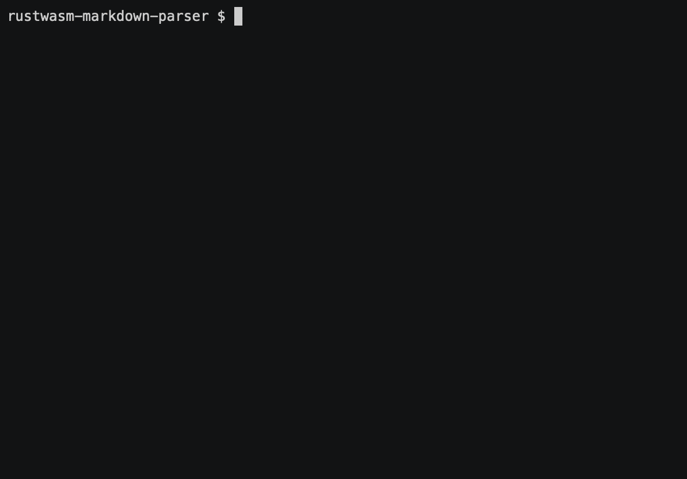

import TutorialsBeforeYouStart from "../../_partials/_tutorials-before-you-start.md"

# Hello World in Rust

This tutorial will walk you through the steps of generating, building, previewing, configuring, and publishing
a Rust-generated WebAssembly serverless function that parses Markdown for Cloudflare Workers.

<TutorialsBeforeYouStart/>

## Generate

Cloudflare's command-line tool for managing Workers projects, Wrangler, has great support for templates – pre-built collections of code that make it easy to get started writing Workers. We'll make use of the [rustwasm-worker template](https://github.com/cloudflare/rustwasm-worker-template/) to start building your project.

In the command line, generate your Workers project by passing in a project name (we'll use rustwasm-markdown-parser), and the template URL to base your project on.

```sh
~ $ wrangler generate rustwasm-markdown-parser https://github.com/cloudflare/rustwasm-worker-template/
```

This creates a directory called `rustwasm-markdown-parser` which you can now `cd` into.

Wrangler templates are just Git repositories, so if you want to create your own templates, or use one from our [Template Gallery](/templates), there's a ton of options to help you get started.

## Workers Playground

You can test how your Workers function will look when it's deployed by using the preview service, which you can access with the `preview` command:

```sh
rustwasm-markdown-parser $ wrangler preview --watch
```

Using the `preview` command will open a browser tab with your Cloudflare Workers function loaded in the Cloudflare preview UI.

The `--watch` flag for `preview` tells Wrangler to watch your Worker project for changes and update the preview tab live with the latest URL. Let's leave Wrangler running in `--watch` mode for now as we continue the tutorial.

## Building

Let's make our Workers function more interesting. We'll pull in a dependency from the `crates.io` ecosystem called `pulldown-cmark`.
We'll add this to our `Cargo.toml`:

```toml
## Cargo.toml

[dependencies]
pulldown-cmark = "0.4.0"
```

Now we'll leverage the code in the `string-to-string` example from the `pulldown-cmark` GitHub repository. Let's change
our `src/lib.rs` to look like this:

```rust
---
filename: src/lib.rs
---
mod utils;

use cfg_if::cfg_if;
use wasm_bindgen::prelude::*;
use pulldown_cmark::{Parser, Options, html};

cfg_if! {
    // When the `wee_alloc` feature is enabled, use `wee_alloc` as the global
    // allocator.
    if #[cfg(feature = "wee_alloc")] {
        extern crate wee_alloc;
        #[global_allocator]
        static ALLOC: wee_alloc::WeeAlloc = wee_alloc::WeeAlloc::INIT;
    }
}

#[wasm_bindgen]
pub fn parse() -> String {
    let markdown_input: &str = "Hello world, this is a ~~complicated~~ *very simple* example.";
    println!("Parsing the following Markdown string:\n{}", markdown_input);

    // Set up options and parser. Strikethroughs are not part of the CommonMark standard
    // and we therefore must enable it explicitly.
    let mut options = Options::empty();
    options.insert(Options::ENABLE_STRIKETHROUGH);
    let parser = Parser::new_ext(markdown_input, options);

    // Write to String buffer.
    let mut html_output: String = String::with_capacity(markdown_input.len() * 3 / 2);
    html::push_html(&mut html_output, parser);

    // Check that the output is what we expected.
    let expected_html: &str = "<p>Hello world, this is a <del>complicated</del> <em>very simple</em> example.</p>\n";
    assert_eq!(expected_html, &html_output);

    format!("\nHTML output:\n{}", &html_output)
}
```

Now we'll update our `worker/worker.js` to use the new code we've written:

```javascript
addEventListener('fetch', (event) => {
  event.respondWith(handleRequest(event.request))
})

/**
 * Fetch and log a request
 * @param {Request} request
 */
async function handleRequest(request) {
  const { parse } = wasm_bindgen
  await wasm_bindgen(wasm)
  const output = parse()
  let res = new Response(output, { status: 200 })
  res.headers.set('Content-type', 'text/html')
  return res
}
```

If `wrangler preview --watch` is running, you'll see the output of your Rust program in your browser a few seconds after you save in your editor. Wrangler watches your project for changes then compiles your Rust to WebAssembly and outputs compiler errors.

## Publish

And with that, you're finished writing a Cloudflare Workers function with Rust-generated Wasm!

Wrangler has built-in support for bundling, uploading, and releasing your Cloudflare Workers application. To do this, we'll run `wrangler publish`, which will _build_ and _publish_ your code:



## Resources

In this tutorial, you built and published a Rust-generated WebAssembly serverless function that parses Markdown. If you'd like to see the full source code for this application, you can find it [on GitHub](https://github.com/granjef3/rustwasm-markdown-parser).

If you enjoyed this tutorial, we encourage you to explore our other tutorials for building on Cloudflare Workers:

- [Authorize users with Auth0](/tutorials/authorize-users-with-auth0)
- [Build a JAMStack app](/tutorials/build-a-jamstack-app)
- [Build a QR code generator](/tutorials/build-a-qr-code-generator)

If you want to get started building your own projects, check out the quick-start templates we've provided in our [Starters](/starters).