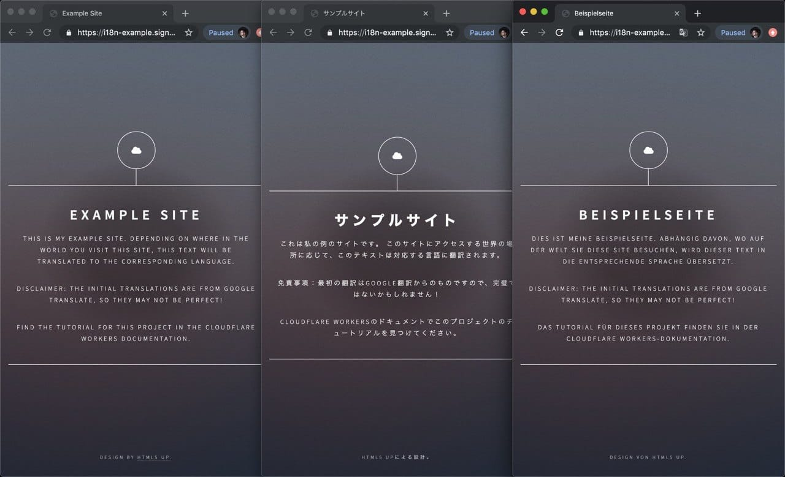

import TutorialsBeforeYouStart from "../../_partials/_tutorials-before-you-start.md"

# Localize a website with HTMLRewriter

<TutorialsBeforeYouStart/>

## Overview

The [`HTMLRewriter`](/runtime-apis/html-rewriter) class (currently in beta) built into the Cloudflare Workers runtime allows for parsing and rewriting of HTML at the edge, giving developers the ability to efficiently and transparently customize their Workers applications.

In this tutorial, we’ll build an example internationalization and localization engine (commonly referred to as “i18n” and “l10n”) for your application, serve the content of your site, and automatically translate the content based your visitors’ location in the world.



## Setup

This tutorial is designed to use an existing website. To simplify this process, we’ll use a free HTML5 template from [HTML5 UP](https://html5up.net). With this website as the base, we’ll use the `HTMLRewriter` functionality in the Workers platform to overlay an i18n layer, automatically translating the site based on the user’s language.

If you’d like to deploy your own version of the site, you can find the source [on GitHub](https://github.com/signalnerve/i18n-example-workers). Instructions on how to deploy this application can be found in the project’s README.

## Generate a project

To generate a new project, we’ll use `wrangler generate --site` to create a new application, calling it `i18n-example`:

```sh
---
theme: dark
---
~/ $ wrangler generate i18n-example --site
~/ $ cd i18n-example
~/i18n-example $
```

The `--site` flag indicates to Wrangler that we want to build a [Workers Sites](/platform/sites) project—this means that there will be both a “site” component, the static HTML that we want to serve to the user, and a Workers script. Inside the Workers script we can customize the HTML response using `HTMLRewriter`.

The newly generated `i18n-example` project will contain two folders: `public`, which is our static HTML, and `workers-site`:

<pre class="CodeBlock CodeBlock-scrolls-horizontally" language="sh"><code><u><b class="CodeBlock--token-directory">~/i18n-example</b> <b class="CodeBlock--token-prompt">$</b> </u>ls<br/><u><b class="CodeBlock--token-value">public    workers-site  wrangler.toml</b></u></code></pre>

Inside of `public`, we should replace the default generated HTML code with the HTML5 UP template seen in the demo screenshot: you can download a [release](https://github.com/signalnerve/i18n-example-workers/archive/v1.0.zip) (ZIP link) of the code for this project and copy the `public` folder to your own project to get started.

With the static HTML for this project updated, we can focus on the Workers script inside of the `workers-site` folder, at `index.js`.

## Understanding `data-i18n-key`

The `HTMLRewriter` class provided in the Workers runtime allows developers to parse HTML and write simple JavaScript to query and transform every element of the page.

Our example website is a basic single-page HTML project that lives in `./public`, with some text elements: an `h1` element with the text “Example Site”, and a number of `p` elements with different text:


What is unique about this page is the addition of [data attributes](https://developer.mozilla.org/en-US/docs/Learn/HTML/Howto/Use_data_attributes) in the HTML – custom attributes defined on a number of elements on this page. The `data-i18n-key` on the `h1` tag on this page, as well as many of the `p` tags, indicates that there is a corresponding internationalization key, which should be used to look up a translation for this text:

```html
---
filename: public/index.html
---
<!-- source clipped from i18n-example site -->

<div class="inner">
  <h1 data-i18n-key="headline">Example Site</h1>
  <p data-i18n-key="subtitle">
    This is my example site. Depending o...
  </p>
  <p data-i18n-key="disclaimer">
    Disclaimer: the initial translations...
  </p>
</div>
```

Using `HTMLRewriter`, we’ll take this page (e.g. `./public/index.html`) and parse the HTML. When we find a `data-i18n-key`, we’ll look up an internal `strings` object, using `data-i18n-key` to find a matching key, and retrieve the string translation. With `HTMLRewriter`, it’s super easy to _query_ elements, for instance, to find a data attribute, but as the name suggests, we can also _rewrite_ elements: taking a translated string and directly inserting it into the HTML.

Finally, it’s shockingly easy to introduce one more cool feature into this project: based on the `Accept-Language` header, which exists on incoming requests, we can set the translation language per-request, allowing users from around the world to see a locally-relevant and translated page. Neat!

## Using the HTML Rewriter API

To start, let’s look at `workers-site/index.js`: our Workers application in this tutorial will live entirely in this file, so it’s important to be familiar with it.

Inside of this file, the default code for running a [Workers Site](/platform/sites) has been provided. The crucial part of the generated code lives in the `handleEvent` function. The`getAssetFromKV` function retrieves a website asset uploaded from your local `./public` folder, runs some magic to make it live on Workers KV, and returns it to the user. For now, we can ignore much of `getAssetFromKV` (though if you’d like to learn more, check out [the docs](/platform/sites/start-from-worker) .

To implement translations on the site, we’ll take the HTML response retrieved from KV and pass it into a new instance of `HTMLRewriter`. When instantiating `HTMLRewriter`, we can also attach handlers using the `on` function: in our case, we’ll use the `[data-i18n-key]` selector (see the [documentation](/runtime-apis/html-rewriter) for more advanced usage) to parse all elements that require translation with a single class, `ElementHandler`. With the created instance of `HTMLRewriter`, the `transform` function takes a `response` and can be returned to the client:

```js
---
filename: workers-site/index.js
---
async function handleEvent(event) {
  const response = await getAssetFromKV(event)
  return new HTMLRewriter().on("[data-i18n-key]", new ElementHandler()).transform(response)
}
```

## Transforming HTML

Our `ElementHandler` will receive every element parsed by the `HTMLRewriter` instance, and thanks to the expressive API, it’s really easy to query each incoming element for information.

In [How it works](#understanding-data-i18n-key), we talked about `data-i18n-key`, a custom data attribute that could be used to find a corresponding translated string for the website’s user interface. In `ElementHandler`, we can define an `element` function, which will be called as each element is parsed. Inside of it, we can query for the custom data attribute using `getAttribute`:

```js
---
filename: workers-site/index.js
---
class ElementHandler {
  element(element) {
    const i18nKey = element.getAttribute("data-i18n-key")
  }
}
```

With `i18nKey` defined, we can use it to lookup a corresponding translated string. Let’s set up `strings`, an object with key-value pairs corresponding to the `data-i18n-key` value – for now, we’ll define a single example string, `headline`, with a (possibly badly translated) German `string`, “Beispielseite” (“Example Site”), and retrieve it in the `element` function:

```js
---
filename: workers-site/index.js
highlight: [1,2,3,8]
---
const strings = {
  headline: "Beispielseite",
}

class ElementHandler {
  element(element) {
    const i18nKey = element.getAttribute("data-i18n-key")
    const string = strings[i18nKey]
  }
}
```

With our translated `string`, we can take it and insert it into the original element, using the `setInnerContent` function:

```js
---
filename: workers-site/index.js
highlight: [9,10,11]
---
const strings = {
  headline: "Beispielseite",
}

class ElementHandler {
  element(element) {
    const i18nKey = element.getAttribute("data-i18n-key")
    const string = strings[i18nKey]
    if (string) {
      element.setInnerContent(string)
    }
  }
}
```

To check that everything looks like you’d expect, it could be a good time to use the preview functionality built into Wrangler. Call `wrangler preview --watch` to open up a live preview of your project, refreshed after every code change that you make.

We can expand on this simple translation functionality to provide country-specific translations, based on the incoming request’s `Accept-Language` header. By taking this header, parsing it, and passing the parsed language into our `ElementHandler`, we can retrieve a translated string in our user’s home language, provided that it’s defined in `strings`.

To implement this, we’ll update the `strings` object, adding a second layer of key-value pairs, and allowing strings to be looked up in the format `strings[country][key]`. In addition, we’ll pass a `countryStrings` object into our `ElementHandler`, so that it can be used during the parsing process. Finally, we’ll grab the `Accept-Language` header from an incoming request, parse it, and pass the parsed language to `ElementHandler`.

To parse the `Accept-Language` header, we’ll install the [`accept-language-parser`](https://www.npmjs.com/package/accept-language-parser) NPM package:

```sh
---
theme: dark
---
~/i18n-example $ npm i accept-language-parser
```

Once imported into our code, we can use it to parse the most relevant language for a client based on `Accept-Language` header, and pass it to `ElementHandler`. Our final code for the project, with an included sample translation for Germany (using Google Translate) looks like this:

```js
---
filename: workers-site/index.js
highlight: [24,25,26,31,50,51,52,53,54,55,56]
---
import { getAssetFromKV, defaultKeyModifier } from "@cloudflare/kv-asset-handler"
import parser from "accept-language-parser"

const DEBUG = false

addEventListener("fetch", event => {
  event.respondWith(handleEvent(event))
})

const strings = {
  de: {
    title: "Beispielseite",
    headline: "Beispielseite",
    subtitle:
      "Dies ist meine Beispielseite. Abhängig davon, wo auf der Welt Sie diese Site besuchen, wird dieser Text in die entsprechende Sprache übersetzt.",
    disclaimer:
      "Haftungsausschluss: Die anfänglichen Übersetzungen stammen von Google Translate, daher sind sie möglicherweise nicht perfekt!",
    tutorial: "Das Tutorial für dieses Projekt finden Sie in der Cloudflare Workers-Dokumentation.",
    copyright: "Design von HTML5 UP.",
  },
}

class ElementHandler {
  constructor(countryStrings) {
    this.countryStrings = countryStrings
  }

  element(element) {
    const i18nKey = element.getAttribute("data-i18n-key")
    if (i18nKey) {
      const translation = this.countryStrings[i18nKey]
      if (translation) {
        element.setInnerContent(translation)
      }
    }
  }
}

async function handleEvent(event) {
  const url = new URL(event.request.url)
  try {
    let options = {}
    if (DEBUG) {
      options = {
        cacheControl: {
          bypassCache: true,
        },
      }
    }
    const languageHeader = event.request.headers.get("Accept-Language")
    const language = parser.pick(["de"], languageHeader)
    const countryStrings = strings[language] || {}

    const response = await getAssetFromKV(event, options)

    return new HTMLRewriter().on("[data-i18n-key]", new ElementHandler(countryStrings)).transform(response)
  } catch (e) {
    if (DEBUG) {
      return new Response(e.message || e.toString(), {
        status: 404,
      })
    } else {
      return new Response(`"${defaultKeyModifier(url.pathname)}" not found`, {
        status: 404,
      })
    }
  }
}
```

## Publish

Our simple i18n tool built on Cloudflare Workers is complete, and it’s time to deploy it to your domain!

It’s super easy (and quick) to deploy sites to your Workers.dev subdomain, but the `wrangler.toml` configuration file in your project needs a little bit of setup before you can deploy your project. First, you’ll need to add your Cloudflare [account ID](/learning/getting-started#6a-obtaining-your-account-id-and-zone-id). Set this ID at the top part of your project’s `wrangler.toml`:

```toml
---
filename: wrangler.toml
highlight: [2]
---
name = "i18n-example"
account_id = "6de123.."
workers_dot_dev = true
```

The `[site]` section at the bottom of `wrangler.toml` tells Wrangler how to deploy your Workers Site. The `bucket` key tells Wrangler where to find your static assets: by default set to the `public` folder, where we placed our HTML code at the beginning of this tutorial. The `entry-point` key indicates where your Workers script is located, and like `bucket`, the default of `workers-site` should already be correctly configured for your application.

The final version of your project’s `wrangler.toml` should look like:

```toml
---
filename: wrangler.toml
highlight: [6, 7, 8]
---
name = "i18n-example"
type = "webpack"
account_id = "6de123.."
workers_dot_dev = true

[site]
bucket = "./public"
entry-point = "workers-site"
```

With that, it’s time to publish your application! Using `wrangler`, we can publish to Cloudflare’s entire network almost instantly, using the `publish` command:

```sh
---
theme: dark
---
~/i18n-example $ wrangler publish
```


## Resources

In this tutorial, you built and published an i18n tool using `HTMLRewriter`. If you’d like to see the full source code for this application, visit the [repo on GitHub](https://github.com/signalnerve/i18n-example-workers).

If you want to get started building your own projects, check out the [templates](/examples).
