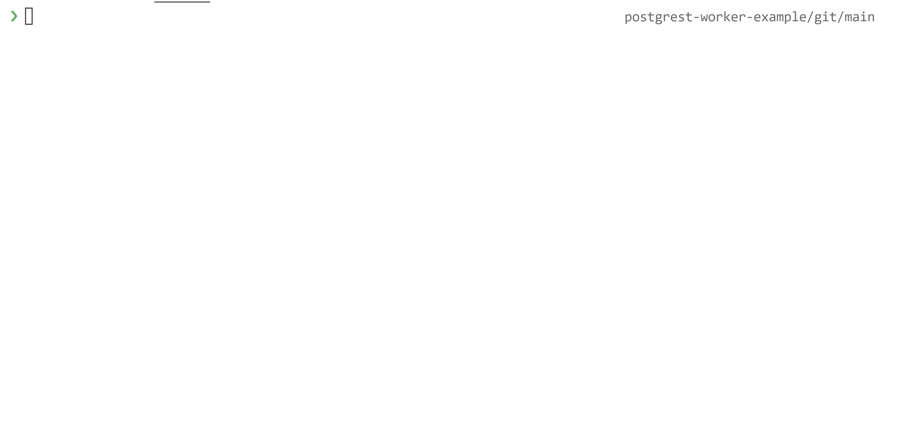

# Build data-driven applications with Workers and PostgreSQL

## Overview

Many applications for the web are built using industry standards like [PostgreSQL](https://postgresql.org), an open-source SQL database. Instead of directly connecting their user interface to that database, it is common for developers to use a backend server to format and proxy API requests to that database. Rather than building a back-end server for this task, you will make use of Cloudflare Workers and a recent improvement to the PostgreSQL developer experience — [PostgREST](https://postgrest.org): a REST API built specifically for PostgreSQL. By doing this, you will handle API requests to your database without needing to maintain another piece of infrastructure.

In this tutorial, you will explore how to integrate with PostgREST and PostgreSQL using Workers.



## Prerequisites

To effectively learn from this tutorial, you should have an instance of PostgreSQL configured. In addition, you will need to install PostgREST, a separate service that provides REST API access to your Postgres database.

If you want a quick way to get up and running with these tools, refer to [postgres-postgrest-cloudflared-example](https://github.com/signalnerve/postgres-postgrest-cloudflared-example/), an example project that uses `docker-compose` to set up a PostgreSQL database, PostgREST, and `cloudflared`, which exposes the PostgREST endpoint to the Internet for use in your Workers function.

In order to continue with the tutorial, ensure that you have a publicly accessible URL for your PostgREST endpoint.

## Create a Workers function

Begin by creating a new Workers function, running `wrangler generate`:

```sh
---
header: Create a Workers function
---
$ wrangler generate postgrest-example
$ cd postgrest-example
```

Inside your Worker, configure your `wrangler.toml` file with your account ID. Change the `type` value to webpack to use `webpack` for bundling the Worker:

```toml
---
filename: wrangler.toml
highlight: [2, 3, 4]
---
name = "postgrest-worker-example"
type = "webpack"

account_id = "yourAccountId"
```

## Build an API using postgrest-js

PostgREST provides a consistent REST API structure for use in your applications. Each table in your PostgreSQL database has a separate path as `/:table_name`. Query parameters are used to do lookups in your database. For example, to find all users with an ID of `1`, one sends a `GET` request to `/users?id=eq.1`.

The URL structure makes it great for exploration, but in an application, it would be better to have something easier to use. [postgrest-js](https://github.com/supabase/postgrest-js/) is an open-source package that wraps PostgREST in an expressive JavaScript API. You will use it in your project to build a few endpoints to work with your PostgreSQL database in a Workers function.

Begin by installing `postgrest-js`:

```sh
---
header: Installing postgrest-js
---
$ npm install @supabase/postgrest-js
```

Before beginning to work with `postgrest-js` in your application, you must patch `cross-fetch`, the internal library that `postgrest-js` uses for making HTTP requests, with Workers' built-in `fetch` API. Do this by creating a custom Webpack configuration and updating the `wrangler.toml` file to use it. Create a `webpack.config.js` with the below configuration:

```js
---
filename: webpack.config.js
---
module.exports = {
  target: "webworker",
  entry: "./index.js",
  externals: [
    { 'cross-fetch': 'fetch' }
  ]
}
```

In `wrangler.toml`, define the `webpack_config` key, and use your new file as the value:

```toml
---
filename: wrangler.toml
highlight: [3]
---
name = "postgrest-worker-example"
type = "webpack"
webpack_config = "webpack.config.js"

account_id = "yourAccountId"
```

With the Webpack build configured, `postgrest-js` is ready to be used inside of your new Workers function. In `index.js`, import the package, and set up a new instance of `PostgrestClient`. Note that the `POSTGREST_ENDPOINT` is a placeholder for the publicly accessible PostgREST endpoint mentioned earlier in this tutorial:

```js
---
filename: index.js
highlight: [1, 2]
---
import { PostgrestClient } from '@supabase/postgrest-js'
const client = new PostgrestClient(POSTGREST_ENDPOINT)

addEventListener('fetch', event => {
// ... Rest of code
```

With a new client set up, you will make your first request from inside the Workers function to your PostgREST endpoint. To do this, you will select data from a table inside of your database, using the `from` and `select` functions in `postgrest-js`. The below example uses the `users` table, and selects everything inside of it, though if you are bringing your own PostgreSQL setup to this tutorial, adjust the code accordingly. Replace the default code in `handleRequest` with the below code:

```js
---
filename: index.js
---
// ... Rest of code

async function handleRequest(request) {
  const { data, error } = await client
    .from('users')
    .select()
  
  if (error) throw error

  return new Response(JSON.stringify(data), {
    headers: {
      'Content-type': 'application/json'
    }
  })
}
```

This code is identical to making a `GET` request to `/users` on your PostgREST endpoint. In this example, the function returns the `data` object back from `postgrest-js` to the client, as JSON.

To publish this function, run `wrangler publish`:

```sh
---
header: Publish the Workers function
---
$ wrangler publish
✨  Built successfully, built project size is 3 KiB.
✨  Successfully published your script to
 https://postgrest-worker-example.signalnerve.workers.dev
```

To correctly configure the function, set a `POSTGREST_ENDPOINT` secret, which tells Workers where to actually route requests to. [`wrangler secret`](/cli-wrangler/commands#secret) is a command that sets an encrypted value, or a secret, that is [only available inside of the Workers function](/platform/environment-variables#adding-secrets-via-wrangler):

```sh
$ wrangler secret put POSTGREST_ENDPOINT
Enter the secret text you'd like assigned to the variable POSTGREST_ENDPOINT on the script named postgrest-worker-example:
**************
🌀  Creating the secret for script name postgrest-worker-example
✨  Success! Uploaded secret POSTGREST_ENDPOINT.
```

Visit the Workers function in browser (such as `https://postgrest-worker-example.signalnerve.workers.dev`). It returns a simple JSON array of your PostgreSQL data:

```json
---
header: JSON array returning from PostgREST in a Workers function
---
[{"id":1,"name":"Kristian"}]
```

### Adding a router

To increase the functionality of this project, you can add a router to handle multiple potential paths in the application. The application will have one path which returns all users, a path that returns a single user based on ID, and a path that accepts data and creates a user. The URL structure will look like this:

| Route            | Action                    |
| ---------------- | ------------------------- |
| `GET /users`     | Get all users             |
| `GET /users/:id` | Get one user, based on ID |
| `POST /users`    | Create a new user         |

To build this, you will integrate [`itty-router`](https://github.com/kwhitley/itty-router), a small router built in JavaScript, into the project. Begin by installing the package:

```sh
---
header: Install itty-router
---
$ npm install itty-router
```

With `itty-router` installed, import the package into `index.js`, and instantiate a new router at the top of your serverless function:

```js
---
filename: index.js
highlight: [2, 5]
---
import { PostgrestClient } from '@supabase/postgrest-js'
import { Router } from 'itty-router'

const client = new PostgrestClient(POSTGREST_ENDPOINT)
const router = Router()
```

As with most routers, `itty-router` works by adding routes to your `router`, based on the HTTP method clients will access them by. In this case, the router will have three routes: `GET /users`, `GET /users/:id`, and `POST /users`. To begin using the `router`, take the current code, which retrieves all the users in your database, and port it into a `GET /users` route. The updated code is below, but with a modified JSON response, which returns an object with a `users` array:

```js
---
filename: index.js
---
router.get('/users', async () => {
  const { data, error } = await client.from('users').select()
  if (error) throw error

  return new Response(JSON.stringify({ users: data }), {
    headers: { 'content-type': 'application/json' },
  })
})
```

With the first route configured, the Workers function needs to pass requests off to the `router`. To do this, remove the `handleRequest` function, and call `router.handle` in the `fetch` event listener directly:

```js
---
filename: index.js
highlight: [4, 11, 12, 13, 14]
---
const router = Router()

addEventListener('fetch', event => {
  event.respondWith(router.handle(event.request))
})

router.get("/users", () => {
  // PostgREST code
})

// Delete the below function in your code entirely
async function handleRequest(request) {
  // Old PostgREST code
}
```

Deploy the new version of the function with `wrangler publish`. The previous code now runs at `/users`, and returns a JSON array of users:

```json
---
header: Updated JSON object returning users in a Workers function
---
{"users":[{"id":1,"name":"Kristian"}]}
```

Notice that the original path at `/` – or the root – now has nothing configured. A client visiting this URL causes the function to throw an exception. To fix this, use `itty-router`'s `all` method, which acts as a catch-all for any routes not explicitly handled by other route handlers. Return a new `404 Not Found` response for any route not recognized:

```js
---
filename: index.js
highlight: [5]
---
router.get('/users', async () => {
  // Existing code
})

router.all('*', () => new Response("Not Found", { status: 404 }))
```

The second planned route is `GET /users/:id`, which returns a single user based on their ID. Configure another route, which will use parameters to capture part of the URL and make it available as part of the route handler as an object `params`:


```js
---
filename: index.js
---
router.get('/users/:id', async ({ params } => {
  const { id } = params
  console.log(id) // e.g. 5, if requested URL is /users/5
})
```

With the ID captured as the `id` variable, `postgrest-js` can select from the `users` table again, now with an added filter that requires any returned users have a matching ID. This limits the response to a single user, such as a user with an ID of 1. There are a number of filters available for use in `postgrest-js`: `gt` (greater than), `lt` (less than), and `eq` (equal to). These filters can be added to the query chain:

```js
---
filename: index.js
highlight: [3, 4, 5, 6]
---
router.get('/users/:id', async ({ params }) => {
  const { id } = params
  const { data, error } = await client
    .from('users')
    .select()
    .eq('id', id)
})
```

By implementing this, you will get a JSON array of users back, but since it will be filtering based on ID, it can either be an empty array (when no user is found), or an array with a single item (a user was found). Complete the route handler by returning a JSON object with a key `user`, which is either `null`, or the object returned from PostgREST for the found user:

```js
---
filename: index.js
highlight: [8, 9, 10, 11, 12, 13, 14, 15]
---
router.get('/users/:id', async ({ params }) => {
  const { id } = params
  const { data, error } = await client
    .from('users')
    .select()
    .eq('id', id)

  if (error) throw error

  const user = data.length ? data[0] : null

  return new Response(JSON.stringify({ user }), {
    headers: { 'content-type': 'application/json' },
    status: user ? 200 : 404
  })
})
```

Deploy the function again with `wrangler publish` to allow looking up users based on their ID, such as `/users/1`. If there is a user in the database with that given ID, you will get a JSON response (with a status of `200 OK`) containing the user data, otherwise the JSON response will be a `null` value (with a status of `404 Not Found`):

```json
---
header: JSON object for a found user based on ID
---
{"user":{"id":1,"name":"Kristian"}}
```

```json
---
header: Empty JSON object when no user is found
---
{"user":null}
```

### Creating new users

To complete the function, create a third endpoint, which creates users from your Workers + PostgREST API. The route will accept `POST` requests to `/users`, with a JSON payload containing the data to save in your database. For example, if the `users` table contains a `name` value, sending a JSON payload to the PostgREST API with the format `{"name":"Kristian"}` will create a new user with a name of **Kristian**.

In the Workers function, implement this by setting up a new `post` handler, and parsing the request body (the data being sent as part of the request) as JSON inside of that handler:

```js
---
filename: index.js
---
router.post('/users', async request => {
  const userData = await request.json()
})
```

With that data available as `userData`, use the `insert` function to create a new user in your database. `postgrest-js` returns the new user back from PostgREST, which can be returned as the JSON response back to the client:

```js
---
filename: index.js
highlight: [3, 4, 5, 6, 7, 8, 9, 10, 11]
---
router.post('/users', async request => {
  const userData = await request.json()
  const { data: user, error } = await client
    .from('users')
    .insert([userData])

  if (error) throw error

  return new Response(JSON.stringify({ user }), {
    headers: { 'content-type': 'application/json' },
  })
})
```

Deploy the updated function using the command `wrangler publish`. To test this new endpoint, use `cURL`, a command-line tool for making requests. Copy the below command, replacing the base part of the URL with your unique `*.workers.dev` deployment. This command sends JSON data to your new endpoint as a `POST` request, which is parsed by the Workers function and used to create a new user in your database. The response back should be the new user you have created:

```sh
---
header: Creating a new user using cURL
---
$ curl https://postgrest-worker-example.signalnerve.workers.dev/users -X POST -H "Content-type: application/json" -d '{"name": "Dog"}'
{"user":{"id":2,"name":"Dog"}}
```

## Conclusion

In this tutorial, you have used PostgREST, `postgrest-js`, and Cloudflare Workers to build a serverless API for your PostgreSQL database. This architecture provides an infinitely-scaling and secure approach to interfacing between your databases and your front-end applications, while still retaining the control and flexibility of avoiding lock-in to Database-as-a-Service tools and other complicated SDKs for data management.

If you found this tutorial useful, continue building with other Cloudflare Workers tutorials below. 

- [Authorize users with Auth0](/tutorials/authorize-users-with-auth0)
- [Build a Slackbot](/tutorials/build-a-slackbot)
- [GitHub SMS notifications using Twilio](/tutorials/github-sms-notifications-using-twilio)
