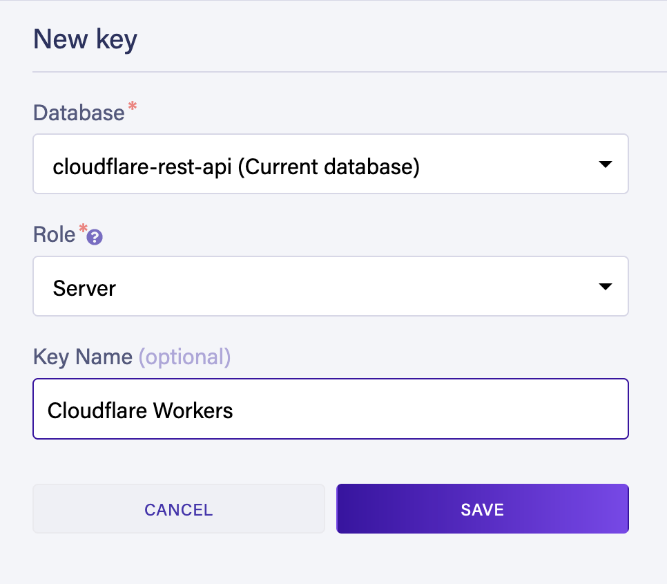

import TutorialsBeforeYouStart from "../../_partials/_tutorials-before-you-start.md"

# Create a serverless, globally distributed REST API with Fauna

<TutorialsBeforeYouStart/>

## Overview

In this tutorial you learn how to store and retrieve data in your Cloudflare Workers applications by building a REST API that manages an inventory catalog using [Fauna][fauna] as its data layer.

### Learning goals

* How to store and retrieve data from Fauna in your Workers.
* How to use Wrangler to store secrets securely.
* How to use [Worktop][worktop] to add routing to your Workers.

Building with Fauna, Workers, and Worktop enables you to create a globally distributed, strongly consistent, fully serverless REST API in a single repository. You can develop and reason about your application as if it were a monolith but gain the resilience and reduced latency of a distributed application running at the edge.


Fauna is a document-based database with a flexible schema. This allows you to define the structure of your data – whatever it may be – and store documents that adhere to that structure. In this tutorial, you build a product inventory, where each `product` document must contain the following properties:

*   **title** - A human-friendly string that represents the title or name of a product.
*   **serialNumber** - A machine-friendly string that uniquely identifies the product.
*   **weightLbs** - A floating point number that represents the weight in pounds of the product.
*   **quantity** A non-negative integer that represents how many items of a particular product there are in the inventory.

Documents are stored in the **Products** [collection][fauna-collections]. Collections in document databases are groups of related documents.

For this tutorial all API endpoints are public. However, Fauna also offers multiple avenues for securing endpoints and collections. Refer to [Choosing an authentication strategy with Fauna][fauna-choosing-authentication-strategy] for more information on authenticating users to your applications with Fauna.

## Setting up Fauna

### Creating your database

Open the [Fauna dashboard][fauna-dashboard] in your browser and log into your Fauna account. 

<Aside type="note" header="Fauna Account">

If you do not have a Fauna account, you can [sign up][fauna-signup] and deploy this template using the free tier.

</Aside>

In the Fauna dashboard:
1. Select **Create database**.
2. Provide a valid name.
3. Select the **Classic** [Region Group][fauna-region-groups].
4. Select **Create**.


### Creating the products catalog

Next, select **New Collection** to create the **Products** collection that stores your inventory documents.


### Creating a server key

You must create a key to connect to the database from your Worker.

Navigate to the **Security** tab in the Fauna dashboard and create a new key with the **Server** role:



The Fauna dashboard displays the key's secret. Copy and save this server key to use in a later step.

<Aside type="warning" header="Protect your keys">

Server keys can read and write all documents in all collections and can call all [user-defined functions][fauna-udfs] (UDFs). Protect server keys and do not commit them to source control repositories.

</Aside>

## Managing your inventory with Workers

Generate a new project using the Wrangler [generate][wrangler-generate] command:

```sh
---
header: Create a Workers function
---
$ wrangler generate fauna-workers
$ cd fauna-workers
$ wrangler publish
```
<Aside type="note" header="Publish before storing secrets">

You must publish a version of your project before storing your server secret in the next step.

</Aside>

### Adding your Fauna secret as an environment variable

After creating and deploying your Worker, you can store your Fauna client secret safely in Cloudflare with the following command:

```sh
---
header: Storing your Fauna secret
---
$ wrangler secret put FAUNA_SECRET
```

When prompted, paste the Fauna server secret you obtained earlier.

The **FAUNA_SECRET** environment variable is now injected automatically into your Worker code at runtime.

### Installing dependencies

First, install the Fauna JavaScript driver.

```sh
---
header: Installing the Fauna driver
---
$ npm install faunadb
```

Next, install the [Worktop][worktop] framework for Cloudflare Workers.

```sh
---
header: Installing Worktop
---
$ npm install worktop@0.7
```

Worktop solves common needs such as routing, path parameters, and  HTTP methods.

Edit your `wrangler.toml` file found in your Worker's project directory. Set the type to `"javascript"` (not `"webpack"`) and add the `[build]` and `[build.upload]` sections as shown in the following snippet:

```toml
---
header: wrangler.toml
---
type = "javascript"

...

[build]
command = "npm run build"

[build.upload]
format = "service-worker"
```

### JavaScript utility functions

Create a `utils.js` file in the project folder and paste the following code:

```js
---
header: utils.js
---
export function getFaunaError(error) {
  const { code, description } = error.requestResult.responseContent.errors[0];
  let status;

  switch (code) {
    case 'unauthorized':
    case 'authentication failed':
      status = 401;
      break;
    case 'permission denied':
      status = 403;
      break;
    case 'instance not found':
      status = 404;
      break;
    case 'instance not unique':
    case 'contended transaction':
      status = 409;
      break;
    default:
      status = 500;
  }

  return { code, description, status };
}
```

The `getFaunaError()` function extracts the [HTTP response status codes][http-status-codes] and description for the most common errors returned by Fauna.

### Base inventory logic

Replace the contents of your `index.js` file with the skeleton of your API:

```js
---
header: index.js (skeleton)
---
import {Router, listen} from 'worktop';
import faunadb from 'faunadb';
import {getFaunaError} from './utils.js';

const router = new Router();

const faunaClient = new faunadb.Client({
  secret: FAUNA_SECRET,
});

const {Create, Collection, Match, Index, Get, Ref, Paginate, Sum, Delete, Add, Select, Let, Var, Update} = faunadb.query;

router.add('GET', '/', async (request, response) => {
  response.send(200, 'hello world');
});

listen(router.run);
```

Examine the initialization of the Fauna client:

```js
---
header: Instantiating the Fauna client
---
const faunaClient = new faunadb.Client({
  secret: FAUNA_SECRET,
});
```

The **FAUNA_SECRET** environment variable is injected into your application automatically at runtime. Workers run on a custom JavaScript runtime instead of Node.js, so you do not need to use `process.env` to access your environment variables.

### Creating product documents

Add your first Worktop route to the `index.js` file. This route accepts `POST` requests to the `/products` endpoint:

```js
---
header: Creating product documents
---
router.add('POST', '/products', async (request, response) => {
  try {
    const {serialNumber, title, weightLbs} = await request.body();

    const result = await faunaClient.query(
      Create(
        Collection('Products'),
        {
          data: {
            serialNumber,
            title,
            weightLbs,
            quantity: 0
          }
        }
      )
    );

    response.send(200, {
      productId: result.ref.id
    });
  } catch (error) {
    const faunaError = getFaunaError(error);
    response.send(faunaError.status, faunaError);
  }
});
```

This route applies an FQL query written in JavaScript that creates a new document in the **Products** collection:

```js
---
header: Create query in FQL inside JavaScript
---
Create(
  Collection('Products'),
  {
    data: {
      serialNumber,
      title,
      weightLbs,
      quantity: 0
    }
  }
)
```

To see what a document looks like, navigate to the **Shell** tab in the Fauna dashboard and run the following query:

```js
---
header: Create query in pure FQL
---
Create(
  Collection('Products'),
  {
    data: {
      serialNumber: "A48432348",
      title: "Gaming Console",
      weightLbs: 5,
      quantity: 0
    }
  }
)
```

Fauna returns the created document:

```js
---
header: Newly created document
---
{
  ref: Ref(Collection("Products"), "<document_id>"),
  ts: <timestamp>,
  data: {
    serialNumber: "A48432348",
    title: "Gaming Console",
    weightLbs: 5,
    quantity: 0
  }
}

```

*   **ref** - A [reference][fql-reference] to the newly created document.
*   **ts** - The timestamp of the new document creation in microseconds.
*   **data** - The  actual content of the document.

Examining the route you create, when the query is successful, the ID of the newly created document is returned in the response body:

```js
---
header: Returning the new document ID
---
response.send(200, {
  productId: result.ref.id
});
```

Finally, if Fauna returns any error, an exception is raised by the client. You catch that exception and respond with the result from the `getFaunaError()` utility function:

```js
---
header: Handling any errors
---
const faunaError = getFaunaError(error);
response.send(faunaError.status, faunaError);
```

### Retrieving product documents

Next, create a route that reads a single document from the **Products** collection.

Add the following route to your `index.js` file. This route accepts `GET` requests at the `/products/:productId` endpoint:

```js
---
header: Retrieving product documents
---
router.add('GET', '/products/:productId', async (request, response) => {
  try {
    const productId = request.params.productId;

    const result = await faunaClient.query(
      Get(Ref(Collection('Products'), productId))
    );

    response.send(200, result);

  } catch (error) {
    const faunaError = getFaunaError(error);
    response.send(faunaError.status, faunaError);
  }
});
```

The FQL query uses the [Get][fql-get] function to retrieve a full document from a document reference:

```js
---
header: Retrieving a document by ID in FQL inside JavaScript
---
Get(Ref(Collection('Products'), productId))
```

If the document exists, return it in the response body:

```js
---
header: Returning the document in the response body
---
response.send(200, result);
```

If not, an error is returned.

### Deleting product documents

The logic to delete product documents is similar to the logic for retrieving products. Add the following route to your `index.js` file:

```js
---
header: Deleting product documents
---
router.add('DELETE', '/products/:productId', async (request, response) => {
  try {
    const productId = request.params.productId;

    const result = await faunaClient.query(
      Delete(Ref(Collection('Products'), productId))
    );

    response.send(200, result);
  } catch (error) {
    const faunaError = getFaunaError(error);
    response.send(faunaError.status, faunaError);
  }
});
```

The only difference with the previous route is that you use the [Delete][fql-delete] function to delete a document by providing its reference.

When the delete operation is successful, Fauna returns the deleted document and the route forwards the deleted document in the response's body. If not, an error is returned.

## Testing and deploying your Worker

Before deploying your Worker, test it locally by using Wrangler's [dev][wrangler-dev] command:

```js
---
header: Testing your Worker locally
---
wrangler dev
```

Once the development server is up and running, we can start making HTTP requests to our Worker.

First, create a new product:

```sh
---
header: Create a new product
---
$ curl \
    --data '{"serialNumber": "H56N33834", "title": "Bluetooth Headphones", "weightLbs": 0.5}' \
    --header 'Content-Type: application/json' \
    --request POST \
    http://127.0.0.1:8787/products
```

You should receive a `200` response similar to the following:

```json
---
header: Create product response
---
{
  "productId": "<document_id>"
}
```

<Aside type="note">

Copy the `productId` value for use in the remaining test queries.

</Aside>

Next, read the document you just created:

```sh
---
header: Read a document
---
$ curl \
    --header 'Content-Type: application/json' \
    --request GET \
    http://127.0.0.1:8787/products/<document_id>
```

The response should be the new document serialized to JSON:

```json
---
header: Read product response
---
{
  "ref": {"@ref":{"id":"<document_id>","collection":{"@ref":{"id":"Products","collection":{"@ref":{"id":"collections"}}}}}},"ts":1617887459975000,
  "data": {
    "serialNumber": "H56N33834",
    "title": "Bluetooth Headphones",
    "weightLbs":0.5,
    "quantity":0
  }
}
```

Finally, deploy your Worker using the [`wrangler publish`][wrangler-publish] command:

```sh
---
header: Deploying your Worker
---
$ wrangler publish
```

This publishes the Worker to your `*.workers.dev` subdomain.

## Updating inventory quantity

As the last step, implement a route to update the quantity of a product in your inventory, which is `0` by default.

This will present a problem. To calculate the total quantity of a product, you first need to determine how many items there currently are in your inventory. If you solve this in two queries, first reading the quantity and then updating it, the original data might change.

Fauna solves this by reading and updating the quantity of a product in a single FQL transaction. It's important to mention that all FQL queries are, in fact, transactions. If anything fails, all changes are reverted back thanks to Fauna's ACID properties.

Add the following route to your `index.js` file. This route responds to HTTP `PATCH` requests on the `/products/:productId/add-quantity` URL endpoint:

```js
---
header: Updating inventory quantity
---
router.add('PATCH', '/products/:productId/add-quantity', async (request, response) => {
  try {
    const productId = request.params.productId;
    const {quantity} = await request.body();

    const result = await faunaClient.query(
      Let(
        {
          productRef: Ref(Collection('Products'), productId),
          productDocument: Get(Var('productRef')),
          currentQuantity: Select(['data', 'quantity'], Var('productDocument'))
        },
        Update(
          Var('productRef'),
          {
            data: {
              quantity: Add(
                Var('currentQuantity'),
                quantity
              )
            }
          }
        )
      )
    );

    response.send(200, result);
  } catch (error) {
    const faunaError = getFaunaError(error);
    response.send(faunaError.status, faunaError);
  }
});
```

Examine the FQL query in more detail:

```js
---
header: Update query in FQL inside JavaScript
---
Let(
  {
    productRef: Ref(Collection('Products'), productId),
    productDocument: Get(Var('productRef')),
    currentQuantity: Select(['data', 'quantity'], Var('productDocument'))
  },
  Update(
    Var('productRef'),
    {
      data: {
        quantity: Add(
          Var('currentQuantity'),
          quantity
        )
      }
    }
  )
)
```

This query uses the FQL [Let][fql-let] function to set some variables for use later in the query:

*   **productRef** - The **Ref** of the document to update.
*   **productDocument** - The full product document that will be updated.
*   **currentQuantity** - The currently available quantity of the product. You extract the property by using the FQL [Select][fql-select] function.

You can access the values of variables created by `Let` in any subsequent FQL expressions by using the FQL [Var][fql-var] function.

After declaring the variables, `Let` accepts an FQL expression as a second parameter. This expression is where you update your document:

```js
---
header: Updating a product document
---
Update(
  Var('productRef'),
  {
    data: {
      quantity: Add(
        Var('currentQuantity'),
        quantity
      )
    }
  }
)
```

The FQL [Update][fql-update] function only updates the provided properties of a document. In this example, only the `quantity` property is updated.

Finally, this query calculates the new total quantity by adding the value of `quantity` to `currentQuantity` using the FQL [Add][fql-add] function.

<Aside type="note" header="Consistency guarantees in Fauna">

Even if multiple Workers update this quantity from different parts of the world, Fauna guarantees the consistency of the data across all Fauna regions. [This article][fauna-blog-consistency-without-clocks] explains how Fauna's distributed protocol works without the need for atomic clocks.

</Aside>

Test your update route:

```sh
---
header: Update product inventory
---
$ curl \
    --data '{"quantity": 5}' \
    --header 'Content-Type: application/json' \
    --request PATCH \
    http://127.0.0.1:8787/products/<document_id>/add-quantity
```

The response should be the entire full updated document with five additional items in the quantity:

```json
---
header: Update product response
---
{
  "ref": {"@ref":{"id":"<document_id>","collection":{"@ref":{"id":"Products","collection":{"@ref":{"id":"collections"}}}}}},
  "ts": 1617890383200000,
  "data": {
    "serialNumber": "H56N33834",
    "title": "Bluetooth Headphones",
    "weightLbs": 0.5,
    "quantity": 5
  }
}
```

Update your Worker by publishing it to Cloudflare.

```sh
---
header: Updating your Worker in Cloudflare
---
$ wrangler publish
```

## Complete code

At this point, your code should look as follows:

### `wrangler.toml`

<details>
<summary>Click to expand</summary>

```toml
name = "fauna-workers"
type = "javascript"

account_id = ""
workers_dev = true
route = ""
zone_id = ""
compatibility_date = "2021-11-10"

[build]
command = "npm run build"

[build.upload]
format = "service-worker"
```

</details>

### `index.js`

<details>
<summary>Click to expand</summary>

```js
// Copyright Fauna, Inc.
// SPDX-License-Identifier: MIT-0

import {Router, listen} from 'worktop';
import faunadb from 'faunadb';
import {getFaunaError} from './utils.js';

const router = new Router();

const faunaClient = new faunadb.Client({
  secret: FAUNA_SECRET,
});

const {Create, Collection, Match, Index, Get, Ref, Paginate, Sum, Delete, Add, Select, Let, Var, Update} = faunadb.query;

router.add('GET', '/', async (request, response) => {
  response.send(200, 'hello world');
});

router.add('POST', '/products', async (request, response) => {
  try {
    const {serialNumber, title, weightLbs} = await request.body();

    const result = await faunaClient.query(
      Create(
        Collection('Products'),
        {
          data: {
            serialNumber,
            title,
            weightLbs,
            quantity: 0
          }
        }
      )
    );

    response.send(200, {
      productId: result.ref.id
    });
  } catch (error) {
    const faunaError = getFaunaError(error);
    response.send(faunaError.status, faunaError);
  }
});

router.add('GET', '/products/:productId', async (request, response) => {
  try {
    const productId = request.params.productId;

    const result = await faunaClient.query(
      Get(Ref(Collection('Products'), productId))
    );

    response.send(200, result);

  } catch (error) {
    const faunaError = getFaunaError(error);
    response.send(faunaError.status, faunaError);
  }
});

router.add('DELETE', '/products/:productId', async (request, response) => {
  try {
    const productId = request.params.productId;

    const result = await faunaClient.query(
      Delete(Ref(Collection('Products'), productId))
    );

    response.send(200, result);
  } catch (error) {
    const faunaError = getFaunaError(error);
    response.send(faunaError.status, faunaError);
  }
});

router.add('PATCH', '/products/:productId/add-quantity', async (request, response) => {
  try {
    const productId = request.params.productId;
    const {quantity} = await request.body();

    const result = await faunaClient.query(
      Let(
        {
          productRef: Ref(Collection('Products'), productId),
          productDocument: Get(Var('productRef')),
          currentQuantity: Select(['data', 'quantity'], Var('productDocument'))
        },
        Update(
          Var('productRef'),
          {
            data: {
              quantity: Add(
                Var('currentQuantity'),
                quantity
              )
            }
          }
        )
      )
    );

    response.send(200, result);
  } catch (error) {
    const faunaError = getFaunaError(error);
    response.send(faunaError.status, faunaError);
  }
});

listen(router.run);
```

</details>

### `util.js`

<details>
<summary>Click to expand</summary>

```js
// Copyright Fauna, Inc.
// SPDX-License-Identifier: MIT-0

export function getFaunaError(error) {
  const { code, description } = error.requestResult.responseContent.errors[0];
  let status;

  switch (code) {
    case 'unauthorized':
    case 'authentication failed':
      status = 401;
      break;
    case 'permission denied':
      status = 403;
      break;
    case 'instance not found':
      status = 404;
      break;
    case 'instance not unique':
    case 'contended transaction':
      status = 409;
      break;
    default:
      status = 500;
  }

  return { code, description, status };
}
```

</details>

## Cleaning up

To remove the resources you create in this tutorial, delete your Worker in the Cloudflare dashboard > **Workers** > **Manage Workers** > **your Worker** > **Settings** > **Delete**:


Finally, delete your Fauna database from its settings in the Fauna dashboard:


## Next steps

In this tutorial, you learned how to use Fauna with Cloudflare Workers to create a globally distributed, strongly consistent, next-generation serverless REST API that serves data quickly to a worldwide audience.

To build your own production-ready applications, refer to the [Fauna Workers quickstart](https://github.com/fauna-labs/fauna-workers). The quickstart implements suggested practices like a least-privilege security model and business logic encapsulation in user-defined functions.

If you'd like to speak directly with a Fauna expert about building your applications on Cloudflare Workers with Fauna, please [contact][fauna-contact] us.

[fauna]: https://fauna.com/?utm_source=Cloudflare&utm_medium=referral&utm_campaign=Q4_CF_2021
[fauna-blog-consistency-without-clocks]: https://fauna.com/blog/consistency-without-clocks-faunadb-transaction-protocol?utm_source=Cloudflare&utm_medium=referral&utm_campaign=Q4_CF_2021
[fauna-choosing-authentication-strategy]: https://fauna.com/blog/choosing-an-authentication-strategy-with-fauna?utm_source=Cloudflare&utm_medium=referral&utm_campaign=Q4_CF_2021
[fauna-collections]: https://docs.fauna.com/fauna/current/learn/introduction/key_concepts#collections?utm_source=Cloudflare&utm_medium=referral&utm_campaign=Q4_CF_2021
[fauna-contact]: https://www2.fauna.com/cloudflare-contact?utm_source=Cloudflare&utm_medium=referral&utm_campaign=Q4_CF_2021
[fauna-dashboard]: https://dashboard.fauna.com/?utm_source=Cloudflare&utm_medium=referral&utm_campaign=Q4_CF_2021
[fauna-default-roles]: https://docs.fauna.com/fauna/current/security/keys.html?utm_source=Cloudflare&utm_medium=referral&utm_campaign=Q4_CF_2021
[fauna-region-groups]: https://docs.fauna.com/fauna/current/api/fql/region_groups#how-to-use-region-groups?utm_source=Cloudflare&utm_medium=referral&utm_campaign=Q4_CF_2021
[fauna-signup]: https://dashboard.fauna.com/signup?utm_source=Cloudflare&utm_medium=referral&utm_campaign=Q4_CF_2021
[fauna-udfs]: https://docs.fauna.com/fauna/current/learn/understanding/user_defined_functions?utm_source=Cloudflare&utm_medium=referral&utm_campaign=Q4_CF_2021

[fql]: https://docs.fauna.com/fauna/current/api/fql/?utm_source=Cloudflare&utm_medium=referral&utm_campaign=Q4_CF_2021
[fql-add]: https://docs.fauna.com/fauna/current/api/fql/functions/add?lang=shell&utm_source=Cloudflare&utm_medium=referral&utm_campaign=Q4_CF_2021
[fql-delete]: https://docs.fauna.com/fauna/current/api/fql/functions/delete?lang=shell&utm_source=Cloudflare&utm_medium=referral&utm_campaign=Q4_CF_2021
[fql-get]: https://docs.fauna.com/fauna/current/api/fql/functions/get?lang=shell&utm_source=Cloudflare&utm_medium=referral&utm_campaign=Q4_CF_2021
[fql-let]: https://docs.fauna.com/fauna/current/api/fql/functions/let?lang=shell&utm_source=Cloudflare&utm_medium=referral&utm_campaign=Q4_CF_2021
[fql-reference]: https://docs.fauna.com/fauna/current/api/fql/functions/ref?lang=shell&utm_source=Cloudflare&utm_medium=referral&utm_campaign=Q4_CF_2021
[fql-select]: https://docs.fauna.com/fauna/current/api/fql/functions/select?lang=shell&utm_source=Cloudflare&utm_medium=referral&utm_campaign=Q4_CF_2021
[fql-update]: https://docs.fauna.com/fauna/current/api/fql/functions/update?lang=shell&utm_source=Cloudflare&utm_medium=referral&utm_campaign=Q4_CF_2021
[fql-var]: https://docs.fauna.com/fauna/current/api/fql/functions/var?lang=shell&utm_source=Cloudflare&utm_medium=referral&utm_campaign=Q4_CF_2021

[fauna-js-docs]: https://github.com/fauna/faunadb-js#using-with-cloudflare-workers
[http-status-codes]: https://developer.mozilla.org/en-US/docs/Web/HTTP/Status
[worktop]: https://github.com/lukeed/worktop
[wrangler-dev]: https://developers.cloudflare.com/workers/cli-wrangler/commands#dev
[wrangler-generate]: https://developers.cloudflare.com/workers/cli-wrangler/commands#generate
[wrangler-publish]: https://developers.cloudflare.com/workers/cli-wrangler/commands#publish
