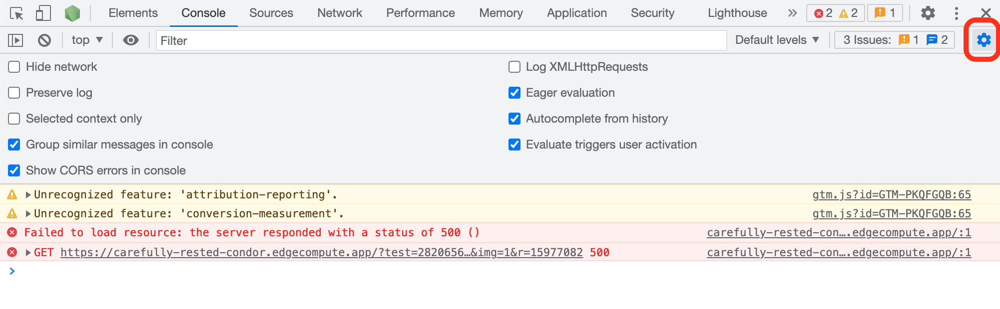

---
order:
pcx-content-type: how-to
---

# Debug mode

Zaraz offers a debug mode to troubleshoot the events and triggers systems. To activate the debug mode you need to create a special debug cookie containing your debug key. 

1. Log in to the [Cloudflare dashboard](https://dash.cloudflare.com/login), and select your account and website.
1. Go to **Zaraz**. 
1. In the main Zaraz screen, click **Settings**.
1. Copy your **Debug Key**.
1. Open a web browser and access its Developer Tools. For example, to access Developer Tools in Google Chrome, click **View** > **Developer** > **Developer Tools**.  
1. Click the **Console** pane and enter the following command to create a debug cookie: 

  ```txt
  document.cookie="debug=YOUR_DEBUG_KEY"
  ```

1. Refresh your browser to see the debug logs. They will appear in the Console pane.

Zaraz’s debug mode is now enabled. However, due to the temporary nature of the Console pane in web browsers, you need to activate the **Preserve Log** option for the Console pane. If you do not activate this option, you will lose the previous debug information whenever the Console refreshes.

To activate the **Preserve Log** option in Google Chrome:

1. Open **Developer Tools**.
1. Go to **Console**.
1. Select the **Console settings** cog > **Preserve logs**.

