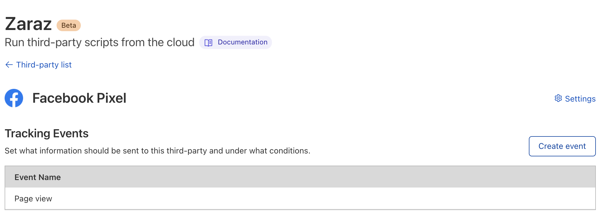

# Add a third-party tool

You can add new third-party tools and load them into your website through the Cloudflare dashboard. If your tool needs more than a simple `Pageview` event to trigger it, [create the trigger](/get-started/create-trigger) you need first.

1. Log in to the [Cloudflare dashboard](https://dash.cloudflare.com/login), and select your account and website.

1. Click **Zaraz**.

1. From **Third-party tools**, click **Add new tool**.

1. Choose a tool from the tools library page and click **Continue** to confirm your selection.

1. In **Set up**, configure the settings for your new tool. The information you need to enter will depend on the tool you choose.

1. Click **Save**.

Your tool is now configured. Cloudflare Zaraz created the event that will load the tool into your website when the conditions you set are met. From this page you can configure the tool's **Settings** and add additional events, by clicking **Create event**. You can also edit the events by clicking their names.

Click **Third-party list** to go back to the main Cloudflare Zaraz page. Here you will see your tool listed under **Third-party tools**, and the name of the event associated with it. In this page you can also click the **Active** toggle to enable or disable your tool, **Edit** your tool, or **Delete** your tool.