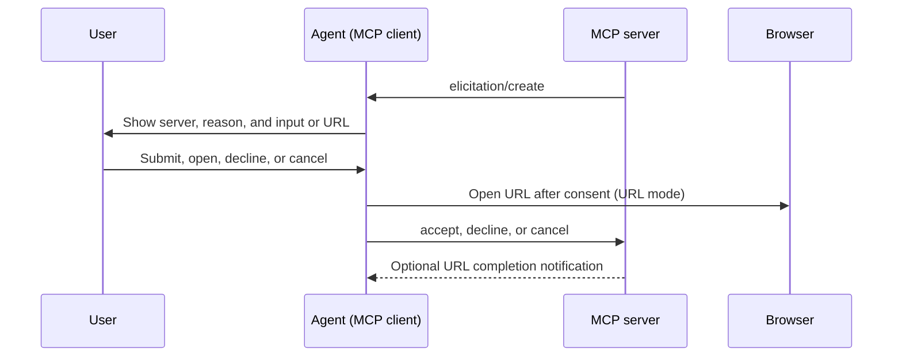

import { PackageManagers, TypeScriptExample } from "~/components";

Agents connected to Model Context Protocol (MCP) servers with [`addMcpServer`](/agents/model-context-protocol/apis/client-api/) can now handle [elicitation](https://modelcontextprotocol.io/specification/2025-11-25/client/elicitation) requests.

Elicitation lets an MCP server request user input while it handles a tool call. Form mode collects structured, non-sensitive data. URL mode asks for consent before opening an out-of-band flow, such as third-party authorization or payment.



Register a handler for each mode your Agent supports in `onStart()`:

<TypeScriptExample>

```ts
import { Agent } from "agents";
import type { ElicitRequest, ElicitResult } from "agents/mcp";

export class MyAgent extends Agent<Env> {
	onStart() {
		this.mcp.configureElicitationHandlers({
			form: (request, serverId) => this.forwardToUser(request, serverId),
			url: (request, serverId) => this.forwardToUser(request, serverId),
		});
	}

	private forwardToUser(
		request: ElicitRequest,
		serverId: string,
	): Promise<ElicitResult> {
		// Show the request in your UI and resolve after the user responds.
		throw new Error(
			`Implement elicitation for ${serverId}: ${request.params.message}`,
		);
	}
}
```

</TypeScriptExample>

Connections advertise only the modes with configured handlers. An Agent without handlers advertises no elicitation capability, which lets the server use its fallback. The SDK stores the advertised modes with each MCP server registration so they survive Durable Object hibernation. Callback functions remain in memory and reattach when `onStart()` runs.

For implementation details and a browser forwarding pattern, refer to [MCP client elicitation](/agents/model-context-protocol/apis/client-api/#elicitation). The [`mcp-client`](https://github.com/cloudflare/agents/tree/main/examples/mcp-client) and [`mcp-elicitation`](https://github.com/cloudflare/agents/tree/main/examples/mcp-elicitation) examples implement both sides.

## Upgrade

To update to this release:

<PackageManagers pkg="agents@latest" />
