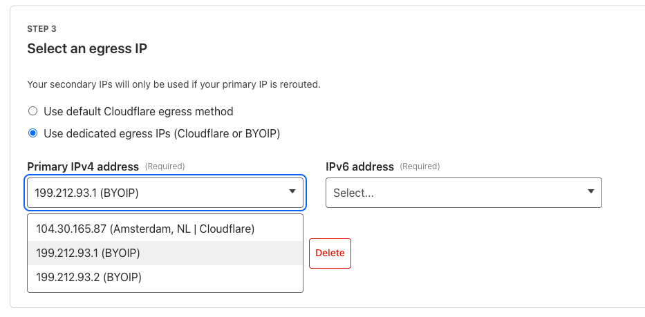

Gateway now supports Bring Your Own IP (BYOIP) for dedicated egress IPs, available to all enterprise customers.

Admins can now onboard and use their own IPv4 or IPv6 prefixes to egress traffic from Cloudflare, delivering greater control, flexibility, and compliance for network traffic.

Get started by following the [BYOIP onboarding process](/cloudflare-one/policies/gateway/egress-policies/dedicated-egress-ips/#bring-your-own-ip-address-byoip). Once your IPs are onboarded, go to **Gateway** > **Egress Policies**, select an egress IP, and choose **Use dedicated egress IPs (Cloudflare or BYOIP)**. Then, select your BYOIP from the dropdown menu.

For more details, see [BYOIP Dedicated Egress](/cloudflare-one/policies/gateway/egress-policies/dedicated-egress-ips/#bring-your-own-ip-address-byoip).
