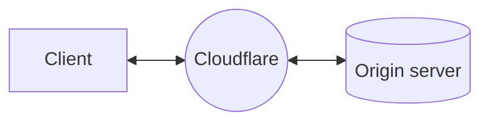
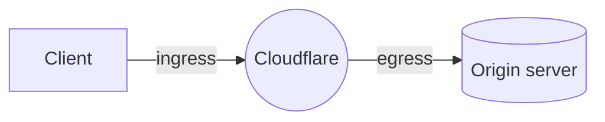

:::caution[Warning]

Cloudflare Aegis is available in early access to Enterprise customers. Contact your account team to request access.
:::

When you use Cloudflare [as a reverse proxy](/fundamentals/concepts/how-cloudflare-works/#how-cloudflare-works-as-a-reverse-proxy), [Cloudflare's global network](https://www.cloudflare.com/network/) sits between client requests and your origin servers.

Zooming in to what happens as a request routes through Cloudflare, you can consider two parts of the process: ingress and egress.

Ingress refers to the data center where the client request lands on, based on Internet routing. From there on, the request will be processed according to your Cloudflare configurations and, if needed, a connection to the origin will be initiated via an egress data center.

Traditionally, Cloudflare maintains a very large pool of egress IPs that are used by all Cloudflare customers and are [publicly documented](https://www.cloudflare.com/ips/). With Aegis, Cloudflare provides dedicated egress IP addresses that are reserved for you.

:::caution[Warning]

[BYOIP](/byoip/) cannot be used as an Aegis egress IP.
:::

## Benefits

With dedicated egress IPs, you can:

* Lock down your [network firewall](/aegis/configuration-options/network-firewall/) to only allow traffic from the Aegis IPs.
* Use [Cloudflare Access](/aegis/configuration-options/access-cni/) to secure your applications without installing software or customizing code on your server.
* Ensure only authorized [Workers](/aegis/configuration-options/workers/) can access your origin services.

Refer to the [introductory blog post](https://blog.cloudflare.com/cloudflare-aegis/) for details and example use cases.

## Scope

You can assign Aegis IPs to single or multiple Cloudflare zones, and across different Cloudflare accounts.

Aegis IPs are included within [BGP advertisement over CNI](/network-interconnect/classic-cni/set-up/configure-bgp-bfd/).
