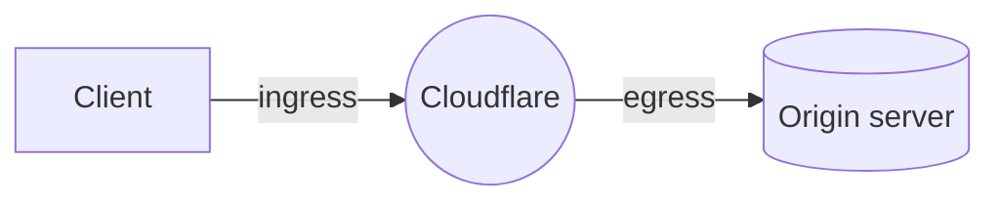

[Spectrum](/spectrum/) allows you to route email, file transfer, games, and more over TCP or UDP through Cloudflare, masking your origin and protecting it from DDoS attacks.

While you can use [BYOIP](/byoip/) or static IPs to control which IPs are used for ingress with Spectrum, Aegis allows you to have a more strict list of egress IPs as well.

Aegis with Spectrum supports both TCP and UDP application types.

When a Spectrum app is configured as HTTP/HTTPS type, Aegis must be manually configured through a CDN Cache Rule.