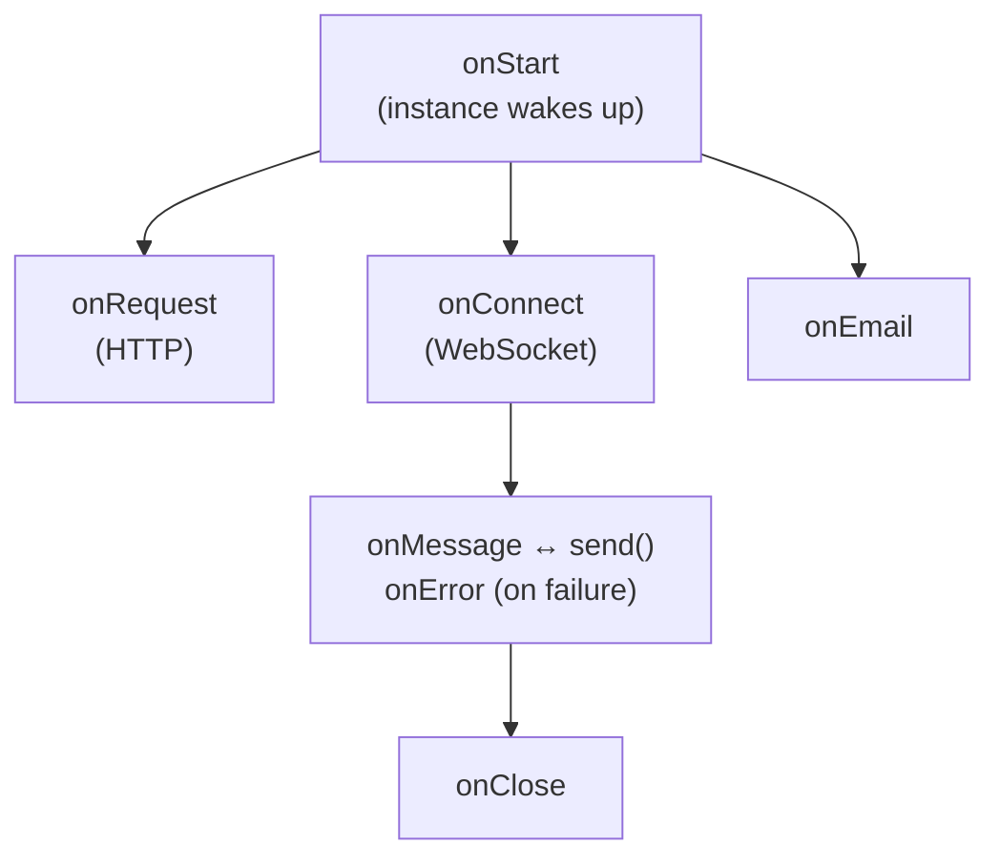

import { Render, LinkCard } from "~/components";

<Render file="agent-class-legacy" product="agents" />

The `Agent` class is a [Durable Object](/durable-objects/) with the [Lifecycle](/agents/lifecycle/) and a fixed set of [capabilities](/agents/capabilities/) already installed. Extend it when you need a feature that only the `Agent` class has today:

- `@callable()` methods and the `useAgent` client
- [Chat agents](/agents/agent-class/communication-channels/chat/) with `AIChatAgent` and `useAgentChat`
- [Voice](/agents/agent-class/communication-channels/voice/), [email](/agents/agent-class/communication-channels/email/), and the other [communication channels](/agents/agent-class/communication-channels/)
- [Project Think](/agents/harnesses/think/), which extends `Agent`

The pages in this section document the `Agent` class and the classes that extend it.

## Move from the Agent class to a harness

Each `Agent` API calls a capability underneath. To move an agent off the `Agent` class, extend `DurableObject`, install the Lifecycle, and use the capability from this table directly. For how request, alarm, and WebSocket handling work on the Lifecycle, refer to [Move an existing Durable Object onto the Lifecycle](/agents/getting-started/add-to-existing-project/#move-an-existing-durable-object-onto-the-lifecycle).

| Agent API                                                              | Capability                                       |
| ---------------------------------------------------------------------- | ------------------------------------------------ |
| `this.schedule()`, `this.scheduleEvery()`, `this.cancelSchedule()`     | [`Scheduler`](/agents/capabilities/scheduler/)   |
| `this.queue()`, `this.dequeue()`, `this.getQueue()`                    | [`Queue`](/agents/capabilities/queue/)           |
| `this.addMcpServer()`, `this.removeMcpServer()`, `this.mcp`            | [`MCPClientManager`](/agents/capabilities/mcp-client/) |
| `this.state`, `this.setState()`, `onStateChanged()`                    | [`State`](/agents/capabilities/state/)           |
| `onConnect()`, `onMessage()`, `this.broadcast()`, `getConnections()`   | [`WebSockets`](/agents/capabilities/websockets/) |
| `this.tasks`                                                           | [`Tasks`](/agents/capabilities/tasks/)           |

To stay on the `Agent` class and add another capability, such as the [Pi harness](/agents/harnesses/pi/), install it on `this.lifecycle` in the constructor:

```ts
import { Agent } from "agents";
import { PiHarness } from "agents/harness/pi";

export class Assistant extends Agent<Env> {
	harness = new PiHarness({
		/* model and tools */
	});

	constructor(ctx: DurableObjectState, env: Env) {
		super(ctx, env);
		this.lifecycle.use(this.harness);
	}
}
```

The Agents SDK provides two main APIs for the Agent class:

| API                           | Description                                                                      |
| ----------------------------- | -------------------------------------------------------------------------------- |
| **Server-side** `Agent` class | Encapsulates agent logic: connections, state, methods, AI models, error handling |
| **Client-side** SDK           | `AgentClient`, `useAgent`, and `useAgentChat` for connecting from browsers       |

:::note

Agents require [Cloudflare Durable Objects](/durable-objects/). Refer to [Configuration](/agents/platform/configuration/) to learn how to add the required bindings.

:::

## Agent class

An Agent is a class that extends the base `Agent` class:

```ts
import { Agent, routeAgentRequest } from "agents";

export class MyAgent extends Agent<Env, State> {
	// Your agent logic
}

export default {
	async fetch(request: Request, env: Env) {
		return (
			(await routeAgentRequest(request, env)) ||
			new Response("Not found", { status: 404 })
		);
	},
} satisfies ExportedHandler<Env>;
```

Each Agent can have millions of instances. Each instance is a separate micro-server that runs independently, allowing horizontal scaling. Instances are addressed by a unique identifier (user ID, email, ticket number, etc.).

<Render file="unique-agents" product="agents" />

## Hooks



| Method                                        | When it runs                                                                                                                                                                                    |
| --------------------------------------------- | ----------------------------------------------------------------------------------------------------------------------------------------------------------------------------------------------- |
| `onStart(props?)`                             | When the instance starts, or wakes from hibernation. Receives optional [initialization props](/agents/agent-class/routing/#props) passed via `getAgentByName` or `routeAgentRequest`. |
| `onRequest(request)`                          | For each HTTP request to the instance                                                                                                                                                           |
| `onConnect(connection, ctx)`                  | When a WebSocket connection is established                                                                                                                                                      |
| `onMessage(connection, message)`              | For each WebSocket message received                                                                                                                                                             |
| `onError(connection, error)`                  | When a WebSocket error occurs                                                                                                                                                                   |
| `onClose(connection, code, reason, wasClean)` | When a WebSocket connection closes                                                                                                                                                              |
| `onEmail(email)`                              | When an email is routed to the instance                                                                                                                                                         |
| `onStateChanged(state, source)`               | When state changes (from server or client)                                                                                                                                                      |

## Core properties

| Property     | Type               | Description                            |
| ------------ | ------------------ | -------------------------------------- |
| `this.env`   | `Env`              | Environment variables and bindings     |
| `this.ctx`   | `ExecutionContext` | Execution context for the request      |
| `this.state` | `State`            | Current persisted state                |
| `this.sql`   | Function           | Execute SQL queries on embedded SQLite |

## Server-side API reference

| Feature                  | Methods                                                                                          | Documentation                                                                          |
| ------------------------ | ------------------------------------------------------------------------------------------------ | -------------------------------------------------------------------------------------- |
| **State**                | `setState()`, `onStateChanged()`, `initialState`                                                 | [Store and sync state](/agents/agent-class/state/)                               |
| **Callable methods**     | `@callable()` decorator                                                                          | [Callable methods](/agents/agent-class/callable-methods/)                        |
| **Scheduling**           | `schedule()`, `scheduleEvery()`, `getScheduleById()`, `listSchedules()`                          | [Schedule tasks](/agents/agent-class/schedule-tasks/)                            |
| **Durable execution**    | `runFiber()`, `startFiber()`, `stash()`, `onFiberRecovered()`, `keepAlive()`, `keepAliveWhile()` | [Durable execution](/agents/agent-class/durable-execution/)                      |
| **Queue**                | `queue()`, `dequeue()`, `dequeueAll()`, `getQueue()`                                             | [Queue tasks](/agents/agent-class/queue-tasks/)                                  |
| **WebSockets**           | `onConnect()`, `onMessage()`, `onClose()`, `broadcast()`                                         | [WebSockets](/agents/agent-class/websockets/)                                |
| **HTTP/SSE**             | `onRequest()`                                                                                    | [HTTP and SSE](/agents/agent-class/http-sse/)                                |
| **Email**                | `onEmail()`, `replyToEmail()`                                                                    | [Email routing](/agents/agent-class/communication-channels/email/)                                 |
| **Workflows**            | `runWorkflow()`, `waitForApproval()`                                                             | [Run Workflows](/agents/agent-class/run-workflows/)                              |
| **MCP Client**           | `addMcpServer()`, `removeMcpServer()`, `getMcpServers()`                                         | [MCP Client API](/agents/model-context-protocol/apis/client-api/)                      |
| **AI Models**            | Workers AI, OpenAI, Anthropic bindings                                                           | [Using AI models](/agents/agent-class/using-ai-models/)                         |
| **Protocol messages**    | `shouldSendProtocolMessages()`, `isConnectionProtocolEnabled()`                                  | [Protocol messages](/agents/agent-class/protocol-messages/)                  |
| **Context**              | `getCurrentAgent()`                                                                              | [getCurrentAgent()](/agents/lifecycle/get-current-agent/)                      |
| **Tracing**              | `wrapAISDK()`                                                                                    | [Tracing](/agents/platform/observability/tracing/)                           |
| **Diagnostics channels** | `subscribe()`, diagnostics channels                                                              | [Diagnostics channels](/agents/platform/observability/diagnostics-channels/) |
| **Sub-agents**           | `subAgent()`, `abortSubAgent()`, `deleteSubAgent()`                                              | [Sub-agents](/agents/agent-class/sub-agents/)                                    |
| **Agents as tools**      | `runAgentTool()`, `clearAgentToolRuns()`, `hasAgentToolRun()`                                    | [Agents as tools](/agents/agent-class/agent-tools/)                              |
| **Agent Skills**         | `skills` registry, bundled skill sources, script runners                                         | [Agent Skills](/agents/tools/agent-skills/)                                |
| **Sessions**             | `Sessions` capability: message trees, compaction, search                                         | [Sessions](/agents/capabilities/sessions/)                                        |
| **Think**                | `Think` base class, workspace tools, lifecycle hooks, extensions                                 | [Think](/agents/harnesses/think/)                                                      |
| **Chat SDK**             | `createChatSdkState()`, `ChatSdkStateAgent`                                                      | [Chat SDK](/agents/agent-class/communication-channels/chat-sdk/)                                    |

## SQL API

Each Agent instance has an embedded SQLite database accessed via `this.sql`:

```ts
// Create tables
this.sql`CREATE TABLE IF NOT EXISTS users (id TEXT PRIMARY KEY, name TEXT)`;

// Insert data
this.sql`INSERT INTO users (id, name) VALUES (${id}, ${name})`;

// Query data
const users = this.sql<User>`SELECT * FROM users WHERE id = ${id}`;
```

For state that needs to sync with clients, use the [State API](/agents/agent-class/state/) instead.

## Client-side API reference

| Feature               | Methods                | Documentation                                                                               |
| --------------------- | ---------------------- | ------------------------------------------------------------------------------------------- |
| **WebSocket client**  | `AgentClient`          | [Client SDK](/agents/agent-class/communication-channels/chat/client-sdk/)                               |
| **HTTP client**       | `agentFetch()`         | [Client SDK](/agents/agent-class/communication-channels/chat/client-sdk/#http-requests-with-agentfetch) |
| **React hook**        | `useAgent()`           | [Client SDK](/agents/agent-class/communication-channels/chat/client-sdk/#react)                         |
| **Chat hook**         | `useAgentChat()`       | [Client SDK](/agents/agent-class/communication-channels/chat/client-sdk/)                               |
| **Agent tool events** | `useAgentToolEvents()` | [Agents as tools](/agents/agent-class/agent-tools/#render-child-timelines-in-react)   |

Module-level helper exports include `agentTool()` from `agents/agent-tools`, which converts a Think or `AIChatAgent` subclass into an AI SDK tool definition.

### Quick example

```ts
import { useAgent } from "agents/react";
import type { MyAgent } from "./server";

function App() {
	const agent = useAgent<MyAgent, State>({
		agent: "my-agent",
		name: "user-123",
	});

	// Call methods on the agent
	agent.stub.someMethod();

	// Update state (syncs to server and all clients)
	agent.setState({ count: 1 });
}
```

## Chat agents

For AI chat applications, extend `AIChatAgent` instead of `Agent`:

```ts
import { AIChatAgent } from "@cloudflare/ai-chat";

class ChatAgent extends AIChatAgent {
	async onChatMessage(onFinish) {
		// this.messages contains the conversation history
		// Return a streaming response
	}
}
```

Features include:

- Built-in message persistence
- Automatic resumable streaming (reconnect mid-stream)
- Works with `useAgentChat` React hook

Refer to [Build a chat agent](/agents/examples/chat-agent/) for a complete tutorial.

## Routing

Agents are accessed via URL patterns:

```txt
https://your-worker.workers.dev/agents/:agent-name/:instance-name
```

Use `routeAgentRequest()` in your Worker to route requests:

```ts
import { routeAgentRequest } from "agents";

export default {
	async fetch(request: Request, env: Env) {
		return (
			routeAgentRequest(request, env) ||
			new Response("Not found", { status: 404 })
		);
	},
} satisfies ExportedHandler<Env>;
```

Refer to [Routing](/agents/agent-class/routing/) for custom paths, CORS, and instance naming patterns.

## Next steps

<LinkCard
	title="Get started with the Agent class"
	href="/agents/agent-class/get-started/"
	description="Build a counter agent with synced state in about 10 minutes."
/>

<LinkCard
	title="Configuration"
	href="/agents/platform/configuration/"
	description="Learn about wrangler.jsonc setup and deployment."
/>

<LinkCard
	title="WebSockets"
	href="/agents/agent-class/websockets/"
	description="Real-time bidirectional communication with clients."
/>

<LinkCard
	title="Build a chat agent"
	href="/agents/examples/chat-agent/"
	description="Build AI applications with AIChatAgent."
/>
