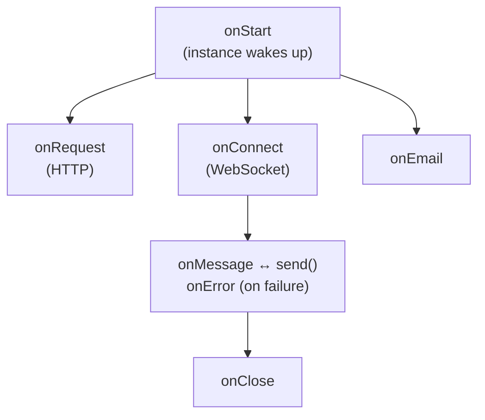

import { Render, LinkCard, TypeScriptExample } from "~/components";

This page provides an overview of the Agents SDK. For detailed documentation on each feature, refer to the linked reference pages.

## Overview

The Agents SDK provides two main APIs:

| API                           | Description                                                                      |
| ----------------------------- | -------------------------------------------------------------------------------- |
| **Server-side** `Agent` class | Encapsulates agent logic: connections, state, methods, AI models, error handling |
| **Client-side** SDK           | `AgentClient`, `useAgent`, and `useAgentChat` for connecting from browsers       |

:::note

Agents require [Cloudflare Durable Objects](/durable-objects/). Refer to [Configuration](/agents/api-reference/configuration/) to learn how to add the required bindings.

:::

## Agent class

An Agent is a class that extends the base `Agent` class:

<TypeScriptExample filename="src/server.ts">

```ts
import { Agent } from "agents";

class MyAgent extends Agent<Env, State> {
	// Your agent logic
}

export default MyAgent;
```

</TypeScriptExample>

Each Agent can have millions of instances. Each instance is a separate micro-server that runs independently, allowing horizontal scaling. Instances are addressed by a unique identifier (user ID, email, ticket number, etc.).

<Render file="unique-agents" product="agents" />

## Lifecycle



| Method                                        | When it runs                                                                                                                                                                            |
| --------------------------------------------- | --------------------------------------------------------------------------------------------------------------------------------------------------------------------------------------- |
| `onStart(props?)`                             | When the instance starts, or wakes from hibernation. Receives optional [initialization props](/agents/api-reference/routing/#props) passed via `getAgentByName` or `routeAgentRequest`. |
| `onRequest(request)`                          | For each HTTP request to the instance                                                                                                                                                   |
| `onConnect(connection, ctx)`                  | When a WebSocket connection is established                                                                                                                                              |
| `onMessage(connection, message)`              | For each WebSocket message received                                                                                                                                                     |
| `onError(connection, error)`                  | When a WebSocket error occurs                                                                                                                                                           |
| `onClose(connection, code, reason, wasClean)` | When a WebSocket connection closes                                                                                                                                                      |
| `onEmail(email)`                              | When an email is routed to the instance                                                                                                                                                 |
| `onStateChanged(state, source)`               | When state changes (from server or client)                                                                                                                                              |

## Core properties

| Property     | Type               | Description                            |
| ------------ | ------------------ | -------------------------------------- |
| `this.env`   | `Env`                | Environment variables and bindings     |
| `this.ctx`   | `DurableObjectState` | Durable Object state and storage APIs  |
| `this.state` | `State`              | Current persisted state                |
| `this.sql`   | Function             | Execute SQL queries on embedded SQLite |

## Server-side API reference

| Feature               | Methods                                                                              | Documentation                                                       |
| --------------------- | ------------------------------------------------------------------------------------ | ------------------------------------------------------------------- |
| **State**             | `setState()`, `onStateChanged()`, `initialState`                                     | [Store and sync state](/agents/api-reference/store-and-sync-state/) |
| **Callable methods**  | `@callable()` decorator                                                              | [Callable methods](/agents/api-reference/callable-methods/)         |
| **Scheduling**        | `schedule()`, `scheduleEvery()`, `getSchedules()`, `cancelSchedule()`, `keepAlive()` | [Schedule tasks](/agents/api-reference/schedule-tasks/)             |
| **Queue**             | `queue()`, `dequeue()`, `dequeueAll()`, `getQueue()`                                 | [Queue tasks](/agents/api-reference/queue-tasks/)                   |
| **WebSockets**        | `onConnect()`, `onMessage()`, `onClose()`, `broadcast()`                             | [WebSockets](/agents/api-reference/websockets/)                     |
| **HTTP/SSE**          | `onRequest()`                                                                        | [HTTP and SSE](/agents/api-reference/http-sse/)                     |
| **Voice**             | `withVoice()`, `withVoiceInput()`, `onTurn()`                                        | [Voice agents](/agents/api-reference/voice-agents/)                 |
| **Workspace**         | `readFile()`, `writeFile()`, `glob()`, `diff()` via `Workspace`                      | [Workspace](/agents/api-reference/workspace/)                       |
| **Email**             | `onEmail()`, `replyToEmail()`                                                        | [Email routing](/agents/api-reference/email/)                       |
| **Workflows**         | `runWorkflow()`, `waitForApproval()`                                                 | [Run Workflows](/agents/api-reference/run-workflows/)               |
| **MCP Client**        | `addMcpServer()`, `removeMcpServer()`, `getMcpServers()`                             | [MCP Client API](/agents/api-reference/mcp-client-api/)             |
| **AI Models**         | Workers AI, OpenAI, Anthropic bindings                                               | [Using AI models](/agents/api-reference/using-ai-models/)           |
| **Protocol messages** | `shouldSendProtocolMessages()`, `isConnectionProtocolEnabled()`                      | [Protocol messages](/agents/api-reference/protocol-messages/)       |
| **Context**           | `getCurrentAgent()`                                                                  | [getCurrentAgent()](/agents/api-reference/get-current-agent/)       |
| **Observability**     | `subscribe()`, diagnostics channels, Tail Workers                                    | [Observability](/agents/api-reference/observability/)               |

## SQL API

Each Agent instance has an embedded SQLite database accessed via `this.sql`:

<TypeScriptExample>

```ts
// Create tables
this.sql`CREATE TABLE IF NOT EXISTS users (id TEXT PRIMARY KEY, name TEXT)`;

// Insert data
this.sql`INSERT INTO users (id, name) VALUES (${id}, ${name})`;

// Query data
const users = this.sql<User>`SELECT * FROM users WHERE id = ${id}`;
```

</TypeScriptExample>

For state that needs to sync with clients, use the [State API](/agents/api-reference/store-and-sync-state/) instead.

## Client-side API reference

| Feature              | Methods          | Documentation                                                                 |
| -------------------- | ---------------- | ----------------------------------------------------------------------------- |
| **WebSocket client** | `AgentClient`    | [Client SDK](/agents/api-reference/client-sdk/)                               |
| **HTTP client**      | `agentFetch()`   | [Client SDK](/agents/api-reference/client-sdk/#http-requests-with-agentfetch) |
| **React hook**       | `useAgent()`     | [Client SDK](/agents/api-reference/client-sdk/#react)                         |
| **Chat hook**        | `useAgentChat()` | [Client SDK](/agents/api-reference/client-sdk/)                               |
| **Voice hooks**      | `useVoiceAgent()`, `useVoiceInput()` | [Voice agents](/agents/api-reference/voice-agents/)                 |

### Quick example

<TypeScriptExample filename="src/client.tsx">

```ts
import { useAgent } from "agents/react";
import type { MyAgent } from "./server";

type CounterState = {
	count: number;
};

function App() {
	const agent = useAgent<MyAgent, CounterState>({
		agent: "my-agent",
		name: "user-123",
	});

	// Call methods on the agent
	agent.stub.someMethod();

	// Update state (syncs to server and all clients)
	agent.setState({ count: 1 });
}
```

</TypeScriptExample>

## Chat agents

For AI chat applications, extend `AIChatAgent` instead of `Agent`:

<TypeScriptExample filename="src/server.ts">

```ts
import { AIChatAgent } from "@cloudflare/ai-chat";

class ChatAgent extends AIChatAgent {
	async onChatMessage(onFinish) {
		// this.messages contains the conversation history
		// Return a streaming response
	}
}
```

</TypeScriptExample>

Features include:

- Built-in message persistence
- Automatic resumable streaming (reconnect mid-stream)
- Works with `useAgentChat` React hook

Refer to [Build a chat agent](/agents/getting-started/build-a-chat-agent/) for a complete tutorial.

## Routing

Agents are accessed via URL patterns:

```txt
https://your-worker.workers.dev/agents/:agent-name/:instance-name
```

Use `routeAgentRequest()` in your Worker to route requests:

<TypeScriptExample filename="src/server.ts">

```ts
import { routeAgentRequest } from "agents";

export default {
	async fetch(request: Request, env: Env) {
		return (
			(await routeAgentRequest(request, env)) ||
			new Response("Not found", { status: 404 })
		);
	},
} satisfies ExportedHandler<Env>;
```

</TypeScriptExample>

Refer to [Routing](/agents/api-reference/routing/) for custom paths, CORS, and instance naming patterns.

## Next steps

<LinkCard
	title="Quick start"
	href="/agents/getting-started/quick-start/"
	description="Build your first agent in about 10 minutes."
/>

<LinkCard
	title="Configuration"
	href="/agents/api-reference/configuration/"
	description="Learn about wrangler.jsonc setup and deployment."
/>

<LinkCard
	title="WebSockets"
	href="/agents/api-reference/websockets/"
	description="Real-time bidirectional communication with clients."
/>

<LinkCard
	title="Voice agents"
	href="/agents/api-reference/voice-agents/"
	description="Speech-to-text, text-to-speech, and real-time voice interactions."
/>

<LinkCard
	title="Workspace"
	href="/agents/api-reference/workspace/"
	description="Durable filesystem storage for code, files, and generated artifacts."
/>

<LinkCard
	title="Build a chat agent"
	href="/agents/getting-started/build-a-chat-agent/"
	description="Build AI applications with AIChatAgent."
/>
