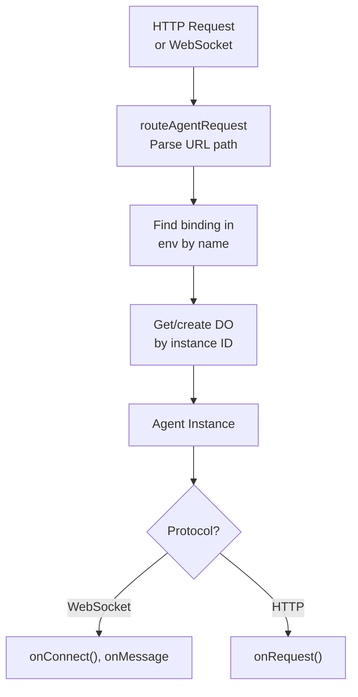

import { TypeScriptExample, WranglerConfig } from "~/components";

This guide explains how requests are routed to agents, how naming works, and patterns for organizing your agents.

## How routing works

When a request comes in, `routeAgentRequest()` examines the URL and routes it to the appropriate agent instance:

```txt
https://your-worker.dev/agents/{agent-name}/{instance-name}
                         └─────┬─────┘   └─────┬──────┘
                        Class name     Unique instance ID
                       (kebab-case)
```

**Example URLs:**

| URL                        | Agent Class | Instance   |
| -------------------------- | ----------- | ---------- |
| `/agents/counter/user-123` | `Counter`   | `user-123` |
| `/agents/chat-room/lobby`  | `ChatRoom`  | `lobby`    |
| `/agents/my-agent/default` | `MyAgent`   | `default`  |

## Name resolution

Agent class names are automatically converted to kebab-case for URLs:

| Class Name    | URL Path                   |
| ------------- | -------------------------- |
| `Counter`     | `/agents/counter/...`      |
| `MyAgent`     | `/agents/my-agent/...`     |
| `ChatRoom`    | `/agents/chat-room/...`    |
| `AIAssistant` | `/agents/ai-assistant/...` |

The router matches both the original name and kebab-case version, so these all work:

- `useAgent({ agent: "Counter" })` → `/agents/counter/...`
- `useAgent({ agent: "counter" })` → `/agents/counter/...`

## Using routeAgentRequest()

The `routeAgentRequest()` function is the main entry point for agent routing:

<TypeScriptExample>

```ts
import { routeAgentRequest } from "agents";

export default {
	async fetch(request: Request, env: Env, ctx: ExecutionContext) {
		// Route to agents - returns Response or undefined
		const agentResponse = await routeAgentRequest(request, env);

		if (agentResponse) {
			return agentResponse;
		}

		// No agent matched - handle other routes
		return new Response("Not found", { status: 404 });
	},
};
```

</TypeScriptExample>

### Enabling CORS

For cross-origin requests (common when your frontend is on a different domain):

<TypeScriptExample>

```ts
const response = await routeAgentRequest(request, env, {
	cors: true, // Enable default CORS headers
});
```

</TypeScriptExample>

Or with custom CORS headers:

<TypeScriptExample>

```ts
const response = await routeAgentRequest(request, env, {
	cors: {
		"Access-Control-Allow-Origin": "https://myapp.com",
		"Access-Control-Allow-Methods": "GET, POST, OPTIONS",
		"Access-Control-Allow-Headers": "Content-Type, Authorization",
	},
});
```

</TypeScriptExample>

## Instance naming patterns

The instance name (the last part of the URL) determines which agent instance handles the request. Each unique name gets its own isolated agent with its own state.

### Per-user agents

Each user gets their own agent instance:

<TypeScriptExample>

```ts
// Client
const agent = useAgent({
	agent: "UserProfile",
	name: `user-${userId}`, // e.g., "user-abc123"
});
```

</TypeScriptExample>

```txt
/agents/user-profile/user-abc123 → User abc123's agent
/agents/user-profile/user-xyz789 → User xyz789's agent (separate instance)
```

### Shared rooms

Multiple users share the same agent instance:

<TypeScriptExample>

```ts
// Client
const agent = useAgent({
	agent: "ChatRoom",
	name: roomId, // e.g., "general" or "room-42"
});
```

</TypeScriptExample>

```txt
/agents/chat-room/general → All users in "general" share this agent
```

### Global singleton

A single instance for the entire application:

<TypeScriptExample>

```ts
// Client
const agent = useAgent({
	agent: "AppConfig",
	name: "default", // Or any consistent name
});
```

</TypeScriptExample>

### Dynamic naming

Generate instance names based on context:

<TypeScriptExample>

```ts
// Per-session
const agent = useAgent({
	agent: "Session",
	name: sessionId,
});

// Per-document
const agent = useAgent({
	agent: "Document",
	name: `doc-${documentId}`,
});

// Per-game
const agent = useAgent({
	agent: "Game",
	name: `game-${gameId}-${Date.now()}`,
});
```

</TypeScriptExample>

## Custom URL routing

For advanced use cases where you need control over the URL structure, you can bypass the default `/agents/{agent}/{name}` pattern.

### Using basePath (client-side)

The `basePath` option lets clients connect to any URL path:

<TypeScriptExample>

```ts
// Client connects to /user instead of /agents/user-agent/...
const agent = useAgent({
	agent: "UserAgent", // Required but ignored when basePath is set
	basePath: "user", // → connects to /user
});
```

</TypeScriptExample>

This is useful when:

- You want clean URLs without the `/agents/` prefix
- The instance name is determined server-side (for example, from auth/session)
- You are integrating with an existing URL structure

### Server-side instance selection

When using `basePath`, the server must handle routing. Use `getAgentByName()` to get the agent instance, then forward the request with `fetch()`:

<TypeScriptExample>

```ts
export default {
	async fetch(request: Request, env: Env) {
		const url = new URL(request.url);

		// Custom routing - server determines instance from session
		if (url.pathname === "/user") {
			const session = await getSession(request);
			const agent = await getAgentByName(env.UserAgent, session.userId);
			return agent.fetch(request); // Forward request directly to agent
		}

		// Default routing for standard /agents/... paths
		return (
			(await routeAgentRequest(request, env)) ??
			new Response("Not found", { status: 404 })
		);
	},
};
```

</TypeScriptExample>

### Custom path with dynamic instance

Route different paths to different instances:

<TypeScriptExample>

```ts
// Route /chat/{room} to ChatRoom agent
if (url.pathname.startsWith("/chat/")) {
	const roomId = url.pathname.replace("/chat/", "");
	const agent = await getAgentByName(env.ChatRoom, roomId);
	return agent.fetch(request);
}

// Route /doc/{id} to Document agent
if (url.pathname.startsWith("/doc/")) {
	const docId = url.pathname.replace("/doc/", "");
	const agent = await getAgentByName(env.Document, docId);
	return agent.fetch(request);
}
```

</TypeScriptExample>

### Receiving the instance identity (client-side)

When using `basePath`, the client does not know which instance it connected to until the server tells it. The agent automatically sends its identity on connection:

<TypeScriptExample>

```tsx
const agent = useAgent({
	agent: "UserAgent",
	basePath: "user",
	onIdentity: (name, agentType) => {
		console.log(`Connected to ${agentType} instance: ${name}`);
		// e.g., "Connected to user-agent instance: user-123"
	},
});

// Reactive state - re-renders when identity is received
return (
	<div>
		{agent.identified ? `Connected to: ${agent.name}` : "Connecting..."}
	</div>
);
```

</TypeScriptExample>

For `AgentClient`:

<TypeScriptExample>

```ts
const agent = new AgentClient({
	agent: "UserAgent",
	basePath: "user",
	host: "example.com",
	onIdentity: (name, agentType) => {
		// Update UI with actual instance name
		setInstanceName(name);
	},
});

// Wait for identity before proceeding
await agent.ready;
console.log(agent.name); // Now has the server-determined name
```

</TypeScriptExample>

### Handling identity changes on reconnect

If the identity changes on reconnect (for example, session expired and user logs in as someone else), you can handle it with `onIdentityChange`:

<TypeScriptExample>

```ts
const agent = useAgent({
	agent: "UserAgent",
	basePath: "user",
	onIdentityChange: (oldName, newName, oldAgent, newAgent) => {
		console.log(`Session changed: ${oldName} → ${newName}`);
		// Refresh state, show notification, etc.
	},
});
```

</TypeScriptExample>

If `onIdentityChange` is not provided and identity changes, a warning is logged to help catch unexpected session changes.

### Disabling identity for security

If your instance names contain sensitive data (session IDs, internal user IDs), you can disable identity sending:

<TypeScriptExample>

```ts
class SecureAgent extends Agent {
	// Do not expose instance names to clients
	static options = { sendIdentityOnConnect: false };
}
```

</TypeScriptExample>

When identity is disabled:

- `agent.identified` stays `false`
- `agent.ready` never resolves (use state updates instead)
- `onIdentity` and `onIdentityChange` are never called

### When to use custom routing

| Scenario                          | Approach                                |
| --------------------------------- | --------------------------------------- |
| Standard agent access             | Default `/agents/{agent}/{name}`        |
| Instance from auth/session        | `basePath` + `getAgentByName` + `fetch` |
| Clean URLs (no `/agents/` prefix) | `basePath` + custom routing             |
| Legacy URL structure              | `basePath` + custom routing             |
| Complex routing logic             | Custom routing in Worker                |

## Server-side agent access

You can access agents from your Worker code using `getAgentByName()` for RPC calls:

<TypeScriptExample>

```ts
import { getAgentByName, routeAgentRequest } from "agents";

export default {
	async fetch(request: Request, env: Env) {
		const url = new URL(request.url);

		// API endpoint that interacts with an agent
		if (url.pathname === "/api/increment") {
			const counter = await getAgentByName(env.Counter, "global-counter");
			const newCount = await counter.increment();
			return Response.json({ count: newCount });
		}

		// Regular agent routing
		return (
			(await routeAgentRequest(request, env)) ??
			new Response("Not found", { status: 404 })
		);
	},
};
```

</TypeScriptExample>

### With location hints

For latency-sensitive applications, you can hint where the agent should run:

<TypeScriptExample>

```ts
const agent = await getAgentByName(env.MyAgent, "instance-name", {
	locationHint: "enam", // Eastern North America
});
```

</TypeScriptExample>

Available location hints: `wnam`, `enam`, `sam`, `weur`, `eeur`, `apac`, `oc`, `afr`, `me`

### With jurisdiction

For data residency requirements:

<TypeScriptExample>

```ts
const agent = await getAgentByName(env.MyAgent, "instance-name", {
	jurisdiction: "eu", // EU jurisdiction
});
```

</TypeScriptExample>

## Sub-paths and HTTP methods

Requests can include sub-paths after the instance name. These are passed to your agent's `onRequest()` handler:

```txt
/agents/api/v1/users     → agent: "api", instance: "v1", path: "/users"
/agents/api/v1/users/123 → agent: "api", instance: "v1", path: "/users/123"
```

Handle sub-paths in your agent:

<TypeScriptExample>

```ts
export class API extends Agent {
	async onRequest(request: Request): Promise<Response> {
		const url = new URL(request.url);

		// url.pathname contains the full path including /agents/api/v1/...
		// Extract the sub-path after your agent's base path
		const path = url.pathname.replace(/^\/agents\/api\/[^/]+/, "");

		if (request.method === "GET" && path === "/users") {
			return Response.json(await this.getUsers());
		}

		if (request.method === "POST" && path === "/users") {
			const data = await request.json();
			return Response.json(await this.createUser(data));
		}

		return new Response("Not found", { status: 404 });
	}
}
```

</TypeScriptExample>

## Multiple agents

You can have multiple agent classes in one project. Each gets its own namespace:

<TypeScriptExample>

```ts
// server.ts
export { Counter } from "./agents/counter";
export { ChatRoom } from "./agents/chat-room";
export { UserProfile } from "./agents/user-profile";

export default {
	async fetch(request: Request, env: Env) {
		return (
			(await routeAgentRequest(request, env)) ??
			new Response("Not found", { status: 404 })
		);
	},
};
```

</TypeScriptExample>

<WranglerConfig>

```jsonc
{
	"durable_objects": {
		"bindings": [
			{ "name": "Counter", "class_name": "Counter" },
			{ "name": "ChatRoom", "class_name": "ChatRoom" },
			{ "name": "UserProfile", "class_name": "UserProfile" },
		],
	},
	"migrations": [
		{
			"tag": "v1",
			"new_sqlite_classes": ["Counter", "ChatRoom", "UserProfile"],
		},
	],
}
```

</WranglerConfig>

Each agent is accessed via its own path:

```txt
/agents/counter/...
/agents/chat-room/...
/agents/user-profile/...
```

## Request flow

Here is how a request flows through the system:



## Routing with authentication

There are several ways to authenticate requests before they reach your agent.

### Using authentication hooks

The `routeAgentRequest()` function provides `onBeforeConnect` and `onBeforeRequest` hooks for authentication:

<TypeScriptExample>

```ts
import { Agent, routeAgentRequest } from "agents";

export default {
	async fetch(request: Request, env: Env) {
		return (
			(await routeAgentRequest(request, env, {
				// Run before WebSocket connections
				onBeforeConnect: async (request) => {
					const token = new URL(request.url).searchParams.get("token");
					if (!(await verifyToken(token, env))) {
						// Return a response to reject the connection
						return new Response("Unauthorized", { status: 401 });
					}
					// Return nothing to allow the connection
				},
				// Run before HTTP requests
				onBeforeRequest: async (request) => {
					const auth = request.headers.get("Authorization");
					if (!auth || !(await verifyAuth(auth, env))) {
						return new Response("Unauthorized", { status: 401 });
					}
				},
				// Optional: prepend a prefix to agent instance names
				prefix: "user-",
			})) ?? new Response("Not found", { status: 404 })
		);
	},
};
```

</TypeScriptExample>

### Manual authentication

Check authentication before calling `routeAgentRequest()`:

<TypeScriptExample>

```ts
export default {
	async fetch(request: Request, env: Env) {
		const url = new URL(request.url);

		// Protect agent routes
		if (url.pathname.startsWith("/agents/")) {
			const user = await authenticate(request, env);
			if (!user) {
				return new Response("Unauthorized", { status: 401 });
			}

			// Optionally, enforce that users can only access their own agents
			const instanceName = url.pathname.split("/")[3];
			if (instanceName !== `user-${user.id}`) {
				return new Response("Forbidden", { status: 403 });
			}
		}

		return (
			(await routeAgentRequest(request, env)) ??
			new Response("Not found", { status: 404 })
		);
	},
};
```

</TypeScriptExample>

### Using a framework (Hono)

If you are using a framework like [Hono](https://hono.dev/), authenticate in middleware before calling the agent:

<TypeScriptExample>

```ts
import { Agent, getAgentByName } from "agents";
import { Hono } from "hono";

const app = new Hono<{ Bindings: Env }>();

// Authentication middleware
app.use("/agents/*", async (c, next) => {
	const token = c.req.header("Authorization")?.replace("Bearer ", "");
	if (!token || !(await verifyToken(token, c.env))) {
		return c.json({ error: "Unauthorized" }, 401);
	}
	await next();
});

// Route to a specific agent
app.all("/agents/code-review/:id/*", async (c) => {
	const id = c.req.param("id");
	const agent = await getAgentByName(c.env.CodeReviewAgent, id);
	return agent.fetch(c.req.raw);
});

export default app;
```

</TypeScriptExample>

For WebSocket authentication patterns (tokens in URLs, JWT refresh), see [Cross-domain authentication](/agents/guides/cross-domain-authentication/).

## Troubleshooting

### Agent namespace not found

The error message lists available agents. Check:

1. Agent class is exported from your entry point.
2. Class name in code matches `class_name` in `wrangler.jsonc`.
3. URL uses correct kebab-case name.

### Request returns 404

1. Verify the URL pattern: `/agents/{agent-name}/{instance-name}`.
2. Check that `routeAgentRequest()` is called before your 404 handler.
3. Ensure the response from `routeAgentRequest()` is returned (not just called).

### WebSocket connection fails

1. Do not modify the response from `routeAgentRequest()` for WebSocket upgrades.
2. Ensure CORS is enabled if connecting from a different origin.
3. Check browser dev tools for the actual error.

### basePath not working

1. Ensure your Worker handles the custom path and forwards to the agent.
2. Use `getAgentByName()` + `agent.fetch(request)` to forward requests.
3. The `agent` parameter is still required but ignored when `basePath` is set.
4. Check that the server-side route matches the client's `basePath`.

## API reference

### routeAgentRequest(request, env, options?)

Routes a request to the appropriate agent.

| Parameter      | Type                     | Description                     |
| -------------- | ------------------------ | ------------------------------- |
| `request`      | `Request`                | The incoming request            |
| `env`          | `Env`                    | Environment with agent bindings |
| `options.cors` | `boolean \| HeadersInit` | Enable CORS headers             |

**Returns:** `Promise<Response | undefined>` - Response if matched, undefined if no agent route.

### getAgentByName(namespace, name, options?)

Get an agent instance by name for server-side RPC or request forwarding.

| Parameter              | Type                        | Description            |
| ---------------------- | --------------------------- | ---------------------- |
| `namespace`            | `DurableObjectNamespace<T>` | Agent binding from env |
| `name`                 | `string`                    | Instance name          |
| `options.locationHint` | `string`                    | Preferred location     |
| `options.jurisdiction` | `string`                    | Data jurisdiction      |

**Returns:** `Promise<DurableObjectStub<T>>` - Typed stub for calling agent methods or forwarding requests.

### useAgent(options) / AgentClient options

Client connection options for custom routing:

| Option             | Type                                             | Description                                          |
| ------------------ | ------------------------------------------------ | ---------------------------------------------------- |
| `agent`            | `string`                                         | Agent class name (required)                          |
| `name`             | `string`                                         | Instance name (default: `"default"`)                 |
| `basePath`         | `string`                                         | Full URL path - bypasses agent/name URL construction |
| `path`             | `string`                                         | Additional path to append to the URL                 |
| `onIdentity`       | `(name, agent) => void`                          | Called when server sends identity                    |
| `onIdentityChange` | `(oldName, newName, oldAgent, newAgent) => void` | Called when identity changes on reconnect            |

**Return value properties (React hook):**

| Property     | Type            | Description                                   |
| ------------ | --------------- | --------------------------------------------- |
| `name`       | `string`        | Current instance name (reactive)              |
| `agent`      | `string`        | Current agent class name (reactive)           |
| `identified` | `boolean`       | Whether identity has been received (reactive) |
| `ready`      | `Promise<void>` | Resolves when identity is received            |

### Agent.options (server)

Static options for agent configuration:

| Option                       | Type      | Default | Description                                          |
| ---------------------------- | --------- | ------- | ---------------------------------------------------- |
| `hibernate`                  | `boolean` | `true`  | Whether the agent should hibernate when inactive     |
| `sendIdentityOnConnect`      | `boolean` | `true`  | Whether to send identity to clients on connect       |
| `hungScheduleTimeoutSeconds` | `number`  | `30`    | Timeout before a running schedule is considered hung |

<TypeScriptExample>

```ts
class SecureAgent extends Agent {
	static options = { sendIdentityOnConnect: false };
}
```

</TypeScriptExample>

## Next steps

- Learn about the [Client SDK](/agents/api-reference/client-sdk/) for connecting from browsers.
- Review [cross-domain authentication](/agents/guides/cross-domain-authentication/) for WebSocket auth patterns.
- Explore [callable methods](/agents/api-reference/callable-methods/) for RPC from clients.
- Set up [configuration](/agents/api-reference/configuration/) for your agent bindings.
