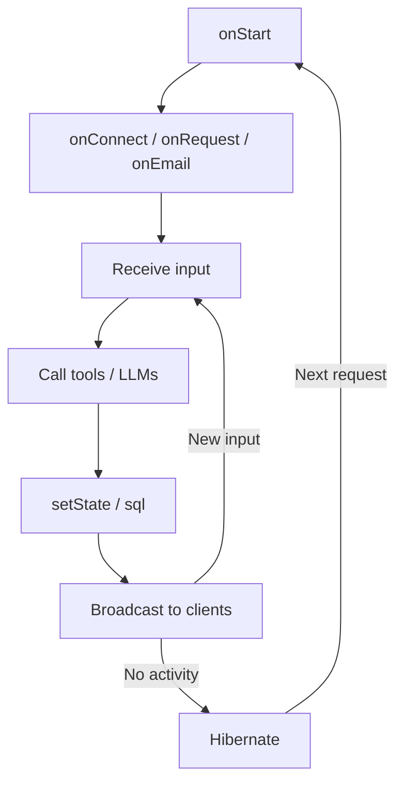

import { TypeScriptExample, LinkCard } from "~/components";

An agent is an AI system that autonomously executes multi-step tasks. It decides which tools to call, in what order, and adapts its plan based on intermediate results. Unlike a traditional API workflow (fixed steps, deterministic output) or a co-pilot (waits for your input at every turn), an agent can take a goal, figure out the steps, and execute them end-to-end.

## What makes Cloudflare agents different

Most agent frameworks run your agent as a stateless function: each request reconstructs context from scratch, calls a model, returns a response, and forgets everything. You bolt on a database for memory, a message queue for scheduling, and a pub/sub layer for real-time updates — all as separate infrastructure.

On Cloudflare, an agent is a [Durable Object](/durable-objects/) — a stateful micro-server with its own embedded SQLite database, running on Cloudflare's global network. Every agent instance:

- **Persists state automatically** — `this.state` and `this.sql` survive restarts, deploys, and hibernation. No external database required.
- **Stays connected** — clients connect via WebSocket. State changes broadcast to all connected clients in real-time.
- **Runs autonomously** — agents can schedule their own work (cron, delays, one-shot timers) and call models without a user present.
- **Hibernates when idle** — no traffic means no cost. The agent wakes on the next request.
- **Scales horizontally** — each unique name creates a separate instance. One agent class can have millions of instances running independently.

## An agent in code

An agent is a class. You extend `Agent`, define state, and expose methods:

<TypeScriptExample>

```ts
import { Agent, callable } from "agents";

type State = {
	messages: Array<{ role: string; content: string }>;
};

export class MyAgent extends Agent<Env, State> {
	initialState: State = { messages: [] };

	@callable()
	async chat(userMessage: string) {
		const messages = [
			...this.state.messages,
			{ role: "user", content: userMessage },
		];

		const response = await this.env.AI.run(
			"@cf/meta/llama-4-scout-17b-16e-instruct",
			{ messages },
		);

		this.setState({
			messages: [
				...messages,
				{ role: "assistant", content: response.response },
			],
		});

		return response.response;
	}
}
```

</TypeScriptExample>

This agent stores conversation history in its state, calls an LLM, and persists the result — all without an external database, a separate API server, or any glue infrastructure. Every connected client sees the state update in real-time.

## The agent lifecycle

Agents operate in a loop driven by external events and internal schedules:



| Lifecycle method | When it runs                                                               |
| ---------------- | -------------------------------------------------------------------------- |
| `onStart`        | Instance wakes up — on first request, after hibernation, or after a deploy |
| `onConnect`      | A WebSocket client connects                                                |
| `onMessage`      | A WebSocket message is received                                            |
| `onRequest`      | An HTTP request arrives                                                    |
| `onEmail`        | An email is routed to this instance                                        |
| `setState`       | Persists state to SQLite and broadcasts to all connected clients           |

## How the pieces map together

If you have read about agent architectures elsewhere, here is how the standard components map to Cloudflare primitives:

| Concept              | On Cloudflare                                                                  | Learn more                                                          |
| -------------------- | ------------------------------------------------------------------------------ | ------------------------------------------------------------------- |
| **Decision engine**  | Any LLM — Workers AI, OpenAI, Anthropic, or any provider via the Vercel AI SDK | [Calling LLMs](/agents/concepts/calling-llms/)                      |
| **Tool integration** | `@callable()` methods, MCP servers and clients                                 | [Tools](/agents/concepts/tools/)                                    |
| **Memory**           | `this.state` (synced key-value), `this.sql` (embedded SQLite)                  | [Store and sync state](/agents/api-reference/store-and-sync-state/) |
| **Scheduling**       | `this.schedule()` for cron, delays, and one-shot timers                        | [Schedule tasks](/agents/api-reference/schedule-tasks/)             |
| **Orchestration**    | Cloudflare Workflows for durable, multi-step pipelines                         | [Workflows](/agents/concepts/workflows/)                            |
| **Human oversight**  | Workflow approvals, MCP elicitation                                            | [Human in the loop](/agents/concepts/human-in-the-loop/)            |

## When to use an agent

Not every problem needs an agent. Use the simplest model that fits:

| Use case                                                 | Build with                |
| -------------------------------------------------------- | ------------------------- |
| Stateless API proxy or simple request-response           | A [Worker](/workers/)     |
| Multi-step pipeline with retries and guaranteed delivery | A [Workflow](/workflows/) |
| Stateful, interactive, or autonomous AI system           | An **Agent**              |
| Long-running pipeline initiated by an interactive agent  | An **Agent + Workflow**   |

If your system needs to remember context across requests, stay connected to users in real-time, or act on its own schedule — build an agent.

## Next steps

<LinkCard
	title="Quick start"
	href="/agents/getting-started/quick-start/"
	description="Build a working agent in 10 minutes."
/>

<LinkCard
	title="Agent class internals"
	href="/agents/concepts/agent-class/"
	description="How Agent is built on top of Durable Objects, layer by layer."
/>

<LinkCard
	title="Calling LLMs"
	href="/agents/concepts/calling-llms/"
	description="Patterns for using LLMs inside a stateful agent."
/>
