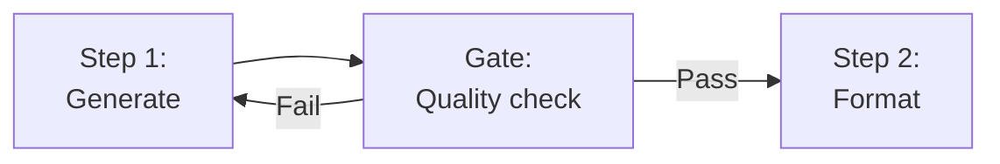
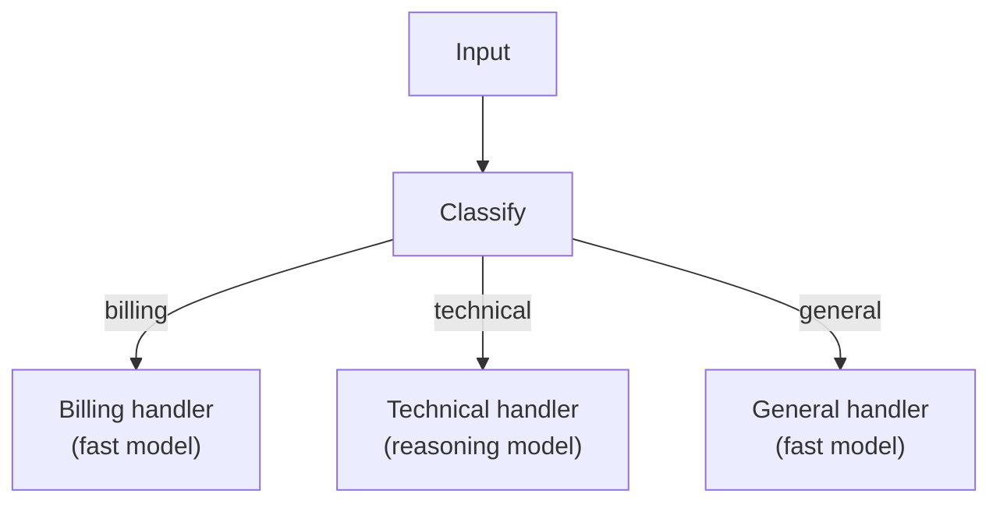
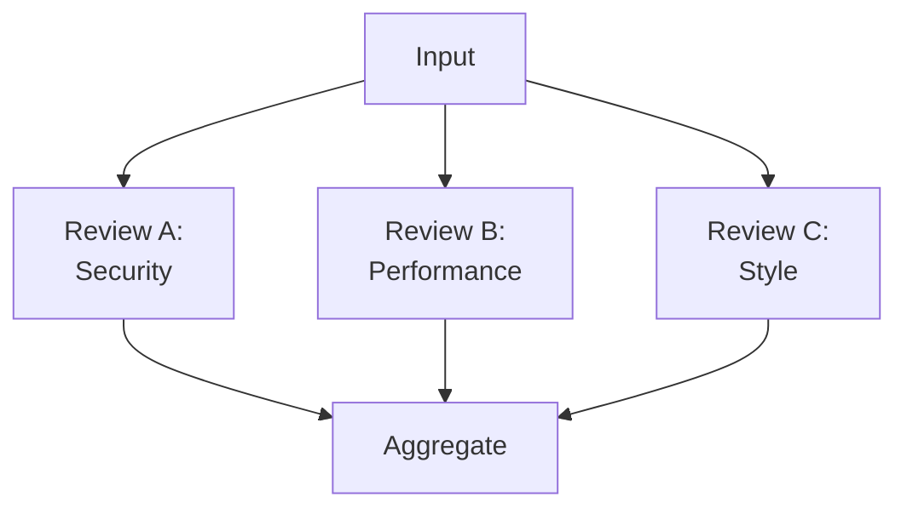
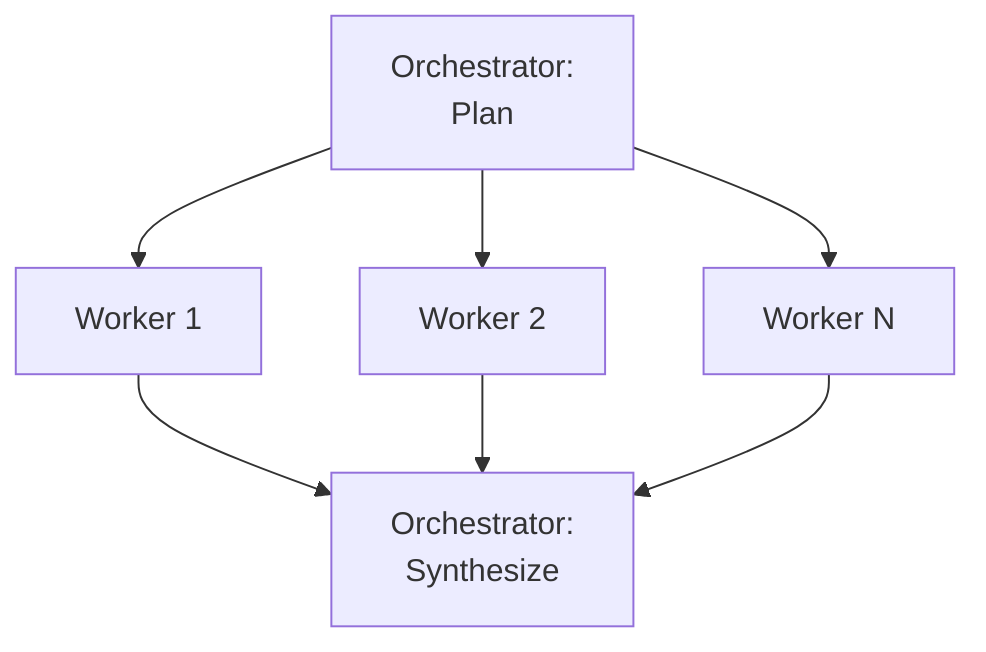
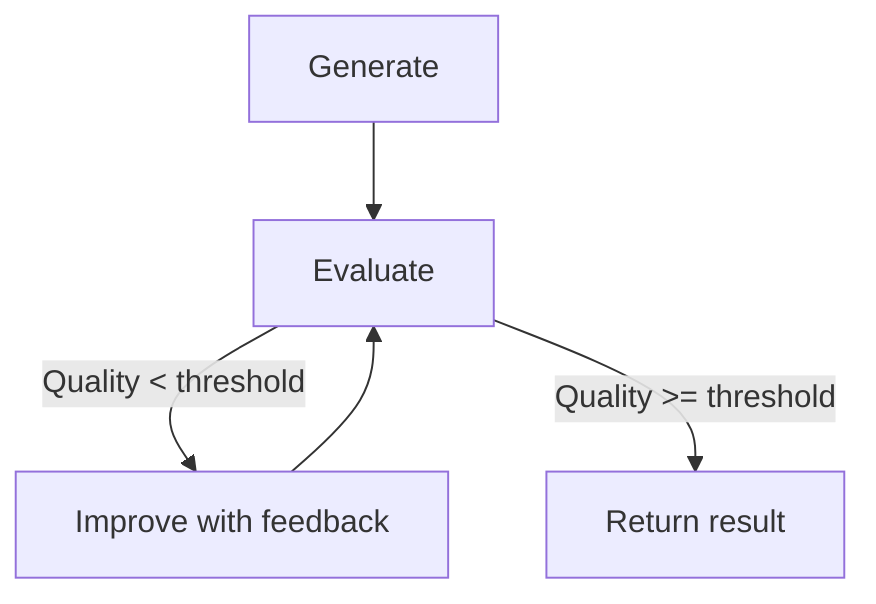

import { TypeScriptExample, LinkCard } from "~/components";

Not every agent needs an autonomous loop. Many real-world tasks are better served by structured patterns that compose LLM calls in predictable ways. This page covers five patterns from [Anthropic's research on building effective agents](https://www.anthropic.com/research/building-effective-agents), adapted for the Cloudflare Agents SDK.

Each pattern uses the [AI SDK](https://ai-sdk.dev) with Workers AI, but any provider (OpenAI, Anthropic, Google) works — swap the model and the rest stays the same.

## Prompt chaining

Decompose a task into sequential steps where each LLM call processes the output of the previous one. Add a quality gate between steps to decide whether to continue or loop back.

**When to use:** Tasks with clear stages — content pipelines, multi-step analysis, generate-then-verify workflows.



<TypeScriptExample>

```ts
import { Agent, callable } from "agents";
import { generateText, generateObject } from "ai";
import { createWorkersAI } from "workers-ai-provider";
import { z } from "zod";

export class ContentAgent extends Agent<Env> {
	@callable()
	async generateCopy(product: string) {
		const workersai = createWorkersAI({ binding: this.env.AI });
		const model = workersai("@cf/meta/llama-4-scout-17b-16e-instruct");

		const { text: draft } = await generateText({
			model,
			prompt: `Write marketing copy for: ${product}`,
		});

		const { object: review } = await generateObject({
			model,
			schema: z.object({
				hasCallToAction: z.boolean(),
				clarity: z.number().min(1).max(10),
				issues: z.array(z.string()),
			}),
			prompt: `Evaluate this copy:\n${draft}`,
		});

		if (!review.hasCallToAction || review.clarity < 7) {
			const { text: improved } = await generateText({
				model,
				prompt: `Rewrite this copy. Fix: ${review.issues.join(", ")}\n\nOriginal: ${draft}`,
			});
			return { copy: improved, revised: true };
		}

		return { copy: draft, revised: false };
	}
}
```

</TypeScriptExample>

Inside an Agent, intermediate results persist in state. If the client disconnects mid-chain, the agent finishes the work and delivers the result on reconnect.

## Routing

Classify input and direct it to a specialized handler. Each route can use a different model, system prompt, or processing strategy.

**When to use:** Multi-purpose agents — support bots, content processors, or any system that handles different types of requests.



<TypeScriptExample>

```ts
import { Agent, callable } from "agents";
import { generateText, generateObject } from "ai";
import { createWorkersAI } from "workers-ai-provider";
import { z } from "zod";

export class SupportAgent extends Agent<Env> {
	@callable()
	async handleQuery(query: string) {
		const workersai = createWorkersAI({ binding: this.env.AI });

		const { object: route } = await generateObject({
			model: workersai("@cf/meta/llama-4-scout-17b-16e-instruct"),
			schema: z.object({
				type: z.enum(["billing", "technical", "general"]),
				complexity: z.enum(["simple", "complex"]),
			}),
			prompt: `Classify this support query: ${query}`,
		});

		const systemPrompts: Record<string, string> = {
			billing: "You handle billing and refund requests. Follow company policy.",
			technical:
				"You are a technical support specialist. Give step-by-step solutions.",
			general: "You handle general inquiries. Be helpful and concise.",
		};

		const { text: response } = await generateText({
			model: workersai("@cf/meta/llama-4-scout-17b-16e-instruct"),
			system: systemPrompts[route.type],
			prompt: query,
		});

		this.sql`INSERT INTO queries (query, type, complexity, response, created_at)
      VALUES (${query}, ${route.type}, ${route.complexity}, ${response}, ${Date.now()})`;

		return { response, route };
	}
}
```

</TypeScriptExample>

Because the Agent has persistent storage, every classification is recorded. Over time, you can analyze routing patterns to improve your classifier or identify gaps in coverage.

## Parallelization

Run multiple LLM calls simultaneously and aggregate results. Use this for tasks that benefit from multiple perspectives or independent subtasks.

**When to use:** Multi-faceted analysis, voting/consensus systems, or any task where subtasks are independent.



<TypeScriptExample>

```ts
import { Agent, callable } from "agents";
import { generateObject, generateText } from "ai";
import { createWorkersAI } from "workers-ai-provider";
import { z } from "zod";

export class ReviewAgent extends Agent<Env> {
	@callable()
	async review(code: string) {
		const workersai = createWorkersAI({ binding: this.env.AI });
		const model = workersai("@cf/meta/llama-4-scout-17b-16e-instruct");

		const reviewSchema = z.object({
			issues: z.array(z.string()),
			severity: z.enum(["low", "medium", "high"]),
			suggestions: z.array(z.string()),
		});

		const [security, performance, quality] = await Promise.all([
			generateObject({
				model,
				system: "You are a security reviewer. Find vulnerabilities.",
				schema: reviewSchema,
				prompt: `Review:\n${code}`,
			}),
			generateObject({
				model,
				system: "You are a performance reviewer. Find bottlenecks.",
				schema: reviewSchema,
				prompt: `Review:\n${code}`,
			}),
			generateObject({
				model,
				system: "You are a code quality reviewer. Check best practices.",
				schema: reviewSchema,
				prompt: `Review:\n${code}`,
			}),
		]);

		const reviews = {
			security: security.object,
			performance: performance.object,
			quality: quality.object,
		};

		const { text: summary } = await generateText({
			model,
			prompt: `Summarize these code reviews into key actions:\n${JSON.stringify(reviews, null, 2)}`,
		});

		return { reviews, summary };
	}
}
```

</TypeScriptExample>

All three reviews run concurrently via `Promise.all`. The agent then uses a final LLM call to synthesize the results into a unified summary.

## Orchestrator-workers

A central LLM plans the work, delegates subtasks to specialized worker calls, and synthesizes the results. Unlike parallelization, the orchestrator dynamically decides what subtasks are needed.

**When to use:** Open-ended tasks where the number and type of subtasks are not known in advance — research, planning, multi-file code generation.



<TypeScriptExample>

```ts
import { Agent, callable } from "agents";
import { generateObject, generateText } from "ai";
import { createWorkersAI } from "workers-ai-provider";
import { z } from "zod";

export class ResearchAgent extends Agent<Env> {
	@callable()
	async research(topic: string) {
		const workersai = createWorkersAI({ binding: this.env.AI });
		const model = workersai("@cf/meta/llama-4-scout-17b-16e-instruct");

		const { object: plan } = await generateObject({
			model,
			schema: z.object({
				subtopics: z.array(
					z.object({
						topic: z.string(),
						angle: z.string(),
					}),
				),
			}),
			prompt: `Break this research topic into 3-5 subtopics:\n${topic}`,
		});

		const findings = await Promise.all(
			plan.subtopics.map(async (sub) => {
				const { text } = await generateText({
					model,
					prompt: `Research "${sub.topic}" from the angle: ${sub.angle}`,
				});
				return { subtopic: sub.topic, finding: text };
			}),
		);

		const { text: synthesis } = await generateText({
			model,
			prompt: `Synthesize these research findings into a report:\n${JSON.stringify(findings, null, 2)}`,
		});

		this.sql`INSERT INTO research (topic, plan, findings, synthesis, created_at)
      VALUES (${topic}, ${JSON.stringify(plan)}, ${JSON.stringify(findings)}, ${synthesis}, ${Date.now()})`;

		return { plan, findings, synthesis };
	}
}
```

</TypeScriptExample>

The orchestrator decides how many workers to spawn and what each one should focus on. The plan itself is generated by the LLM, making this pattern adaptable to any task shape.

## Evaluator-optimizer

One LLM generates a response while another evaluates it. If the evaluation fails, the generator tries again with the feedback. This loops until quality thresholds are met or a maximum iteration count is reached.

**When to use:** Tasks where quality matters more than speed — translations, legal drafts, code generation, any output that needs refinement.



<TypeScriptExample>

```ts
import { Agent, callable } from "agents";
import { generateText, generateObject } from "ai";
import { createWorkersAI } from "workers-ai-provider";
import { z } from "zod";

export class TranslationAgent extends Agent<Env> {
	@callable()
	async translate(text: string, targetLanguage: string) {
		const workersai = createWorkersAI({ binding: this.env.AI });
		const model = workersai("@cf/meta/llama-4-scout-17b-16e-instruct");
		const maxIterations = 3;

		let { text: translation } = await generateText({
			model,
			prompt: `Translate to ${targetLanguage}, preserving tone:\n${text}`,
		});

		for (let i = 0; i < maxIterations; i++) {
			const { object: evaluation } = await generateObject({
				model,
				schema: z.object({
					score: z.number().min(1).max(10),
					preservesTone: z.boolean(),
					issues: z.array(z.string()),
				}),
				prompt: `Evaluate this translation.\nOriginal: ${text}\nTranslation: ${translation}`,
			});

			if (evaluation.score >= 8 && evaluation.preservesTone) {
				return { translation, iterations: i + 1, finalScore: evaluation.score };
			}

			const { text: improved } = await generateText({
				model,
				prompt: `Improve this translation. Issues: ${evaluation.issues.join(", ")}\n\nOriginal: ${text}\nCurrent: ${translation}`,
			});
			translation = improved;
		}

		return { translation, iterations: maxIterations, finalScore: null };
	}
}
```

</TypeScriptExample>

The evaluation loop runs entirely on the server. The client makes a single call and gets back the refined result. Because the Agent persists state, the iteration history is available for analysis — you can track how many iterations different types of content typically need.

## Choosing a pattern

| Pattern              | Subtasks known in advance? | Subtasks independent? | Needs quality loop? | Best for                       |
| -------------------- | -------------------------- | --------------------- | ------------------- | ------------------------------ |
| Prompt chaining      | Yes                        | No (sequential)       | Optional gate       | Pipelines with clear stages    |
| Routing              | Yes                        | N/A (single path)     | No                  | Multi-purpose agents           |
| Parallelization      | Yes                        | Yes                   | No                  | Multi-perspective analysis     |
| Orchestrator-workers | No (LLM decides)           | Yes                   | No                  | Open-ended research, planning  |
| Evaluator-optimizer  | Yes                        | No (iterative)        | Yes                 | High-quality output generation |

These patterns compose. A routing step can dispatch to a parallelized review. An orchestrator can use evaluator-optimizer loops for each worker's output. Start with the simplest pattern that fits your task and add complexity only when needed.

## Next steps

<LinkCard
	title="Anthropic patterns guide"
	href="https://github.com/cloudflare/agents/tree/main/guides/anthropic-patterns"
	description="Full runnable implementations of all five patterns."
/>

<LinkCard
	title="Calling LLMs"
	href="/agents/concepts/calling-llms/"
	description="State as context, surviving disconnections, autonomous model calls."
/>

<LinkCard
	title="Tools"
	href="/agents/concepts/tools/"
	description="Give your agent the ability to take action — AI SDK tools, MCP, and callable methods."
/>

<LinkCard
	title="Workflows"
	href="/agents/concepts/workflows/"
	description="Add durable multi-step execution with retries and approvals."
/>
