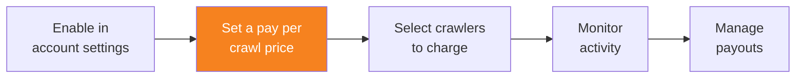

import { Steps, DashButton } from "~/components";

Once your domain's visibility is set to **Visible** in Account Settings, you can set a pay per crawl price, configure a Terms URL, and enable pay per crawl for that domain.

{/* prettier-ignore */}
<Steps>
1. Go to **AI Crawl Control**.

    <DashButton url="/?to=/:account/:zone/ai" />

2. Go to the **Settings** tab.
3. In the **Pay Per Crawl** card, select **Enable**.
4. Set your per crawl price - this is the amount charged for each successful content retrieval (HTTP 200 response) by an AI crawler.
5. (Optional) Set a **Terms URL** - a valid URL to custom terms and conditions that will be included in the `Link` header of HTTP 200 and 402 responses to crawlers.
6. Select **Save**.
</Steps>

## Crawl price

The crawl price is the amount charged for each successful content retrieval (HTTP 200 response) by an AI crawler that is set to **Charge**.

:::note[Pricing considerations]
The minimum price is $0.01 USD per crawl. Consider your content value and expected crawler volume when setting your price.
:::

After setting a crawl price the first time, the domain's status in Account Settings will update to **Enabled**.

## Terms URL (optional)

You can optionally provide a **Terms URL** that points to custom terms and conditions for crawlers paying to access to your content. When configured:

- The URL is included in the `Link` header of HTTP 200 and 402 responses served to crawlers by Pay Per Crawl.
- Crawler operators are responsible for reviewing your custom terms before using your content.
