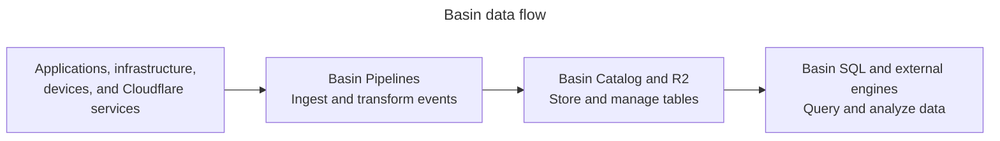

import {
	Description,
	Feature,
	PackageManagers,
} from "~/components";
import ChangelogSection from "~/components/landing/ChangelogSection.astro";

<Description>
	Collect, transform, manage, and query analytics data with a serverless platform
	built on [Apache Iceberg](https://iceberg.apache.org/) and [R2](/r2/).
</Description>

:::note
Basin was formerly known as Cloudflare Data Platform. Cloudflare Pipelines, R2 Data Catalog, and R2 SQL are now named Basin Pipelines, Basin Catalog, and Basin SQL. Existing resources and configurations continue to work.
:::

Basin is an end-to-end analytics data platform that brings ingestion, table management, and distributed SQL together to Cloudflare's Developer Platform. It receives data from applications, infrastructure, devices, and Cloudflare services, transforms events during ingestion, stores them in open Iceberg tables, and makes it queryable with Basin SQL or [compatible external engines](/basin-catalog/config-examples/).

With Basin, you can expect to:

- Ingest and transform events without managing streaming infrastructure
- Keep data portable through the open Apache Iceberg standard
- Maintain tables automatically with compaction and snapshot expiration
- Run globally distributed OLAP queries without managing query clusters
- Access tables stored in R2 without [egress fees](/r2/pricing/#egress)

To build your first request analytics workflow, follow the [Basin CLI guide](/basin/get-started/guide/).

---

## Ingest with Basin Pipelines

[Basin Pipelines](/basin-pipelines/) receives events through HTTP endpoints or [Workers bindings](/workers/runtime-apis/bindings/). It transforms events with SQL and writes Iceberg tables or files to R2.

Run the setup command to configure a stream, sink, and pipeline:

<PackageManagers type="exec" pkg="wrangler" args="basin pipelines setup" />

<Feature
	header="Basin Pipelines documentation"
	href="/basin-pipelines/"
	cta="Explore Basin Pipelines"
>
	Configure streaming ingestion, SQL transformations, and R2 destinations.
</Feature>

---

## Manage your data with Basin Catalog

[Basin Catalog](/basin-catalog/) manages Iceberg metadata in your R2 bucket. It provides an Iceberg REST catalog and automatic table maintenance.

Enable Basin Catalog on an existing R2 bucket:

<PackageManagers
	type="exec"
	pkg="wrangler"
	args="basin catalog enable YOUR_BUCKET_NAME"
/>

<Feature
	header="Basin Catalog documentation"
	href="/basin-catalog/"
	cta="Explore Basin Catalog"
>
	Manage catalogs, maintain tables, and connect compatible Iceberg engines.
</Feature>

---

## Query your data with Basin SQL

[Basin SQL](/basin-sql/) runs distributed online analytical processing (OLAP) queries across catalog tables. It uses Cloudflare's global network without requiring query clusters.

Query a table in your warehouse with SQL:

<PackageManagers
	type="exec"
	pkg="wrangler"
	args={
		'basin sql query YOUR_WAREHOUSE_NAME "SELECT * FROM default.events LIMIT 10"'
	}
/>

<Feature
	header="Basin SQL documentation"
	href="/basin-sql/"
	cta="Explore Basin SQL"
>
	Run SQL queries, review supported syntax, and monitor query usage.
</Feature>

---

<ChangelogSection
	productIds={["basin-pipelines", "basin-catalog", "basin-sql"]}
	description="The latest features and improvements across Basin."
	viewAllHref="/changelog/product/basin/"
/>
