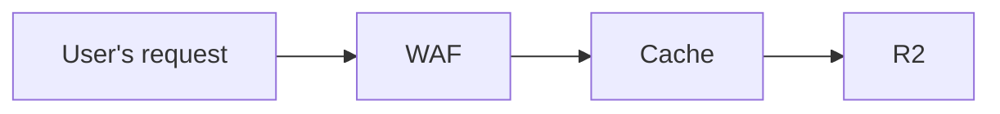

To limit access to the public bucket created for caching content, you can use Cloudflare's [WAF](/waf/custom-rules/use-cases/configure-token-authentication/). The WAF provides an additional security layer to filter requests and ensure that only authorized traffic reaches your bucket. 

The following diagram illustrates the flow of a user's request through WAF, Cache, and R2.

 

The WAF product uses token authentication to either sign or authenticate a request. You can then use this in either Workers or Snippets to control access.

## Presigned URLs

You can presign URLs similar to [S3](https://docs.aws.amazon.com/AmazonS3/latest/userguide/using-presigned-url.html), enabling you to share direct access to your content with a with an associated timeout. This approach can be implemented using a combination of Snippets, Rules, or Cloudflare Workers.

For optimal performance, we recommend separating the creation and validation processes as follows:

- [Snippets](/rules/snippets/examples/signing-requests/) for HMAC creation
- [Rules](/ruleset-engine/rules-language/functions/#hmac-validation) for HMAC validation

In the Workers documentation, in the section [Signing requests](/workers/examples/signing-requests/), you can also find an example of how to verify a signed request using the HMAC.
