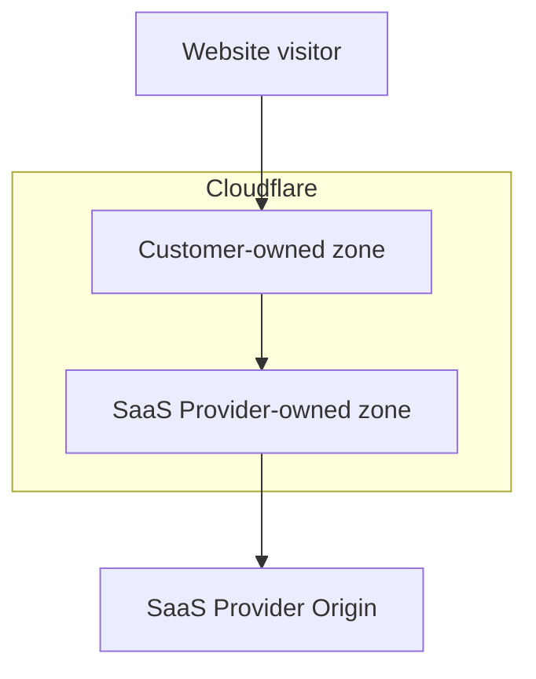
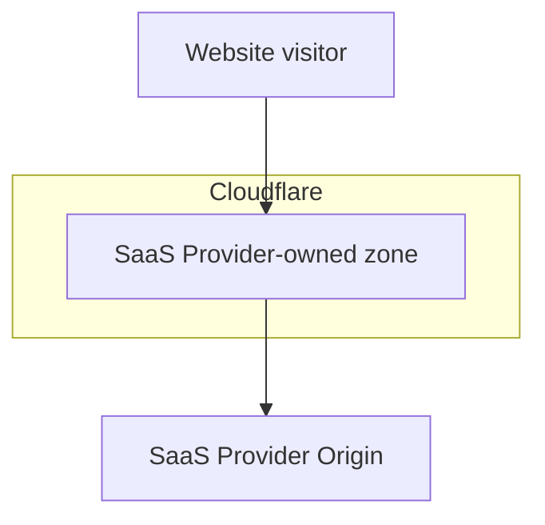

import { Example } from "~/components";

O2O is a specific traffic routing configuration where traffic routes through two Cloudflare zones: the first Cloudflare zone is owned by customer 1 and the second Cloudflare zone is owned by customer 2, who is considered a SaaS provider.

If one or more hostnames are onboarded to a SaaS Provider that uses Cloudflare products as part of their platform - specifically the [Cloudflare for SaaS product](/cloudflare-for-platforms/cloudflare-for-saas/) - those hostnames will be created as [custom hostnames](/cloudflare-for-platforms/cloudflare-for-saas/domain-support/) in the SaaS Provider's zone.

To give the SaaS provider permission to route traffic through their zone, any custom hostname must be activated by you (the SaaS customer) by placing a [`CNAME` record](/cloudflare-for-platforms/cloudflare-for-saas/start/getting-started/#3-have-customer-create-cname-record) on your authoritative DNS. Once traffic for that hostname reaches Cloudflare, your own Cloudflare zone can also participate in the path: if that zone contains a [proxied](/fundamentals/concepts/how-cloudflare-works/#application-services) `CNAME` for the same hostname targeting the SaaS provider, you have an O2O setup.

Your Cloudflare zone may use a [full setup](/dns/zone-setups/full-setup/) (Cloudflare is authoritative DNS) or a [partial setup](/dns/zone-setups/partial-setup/) (another DNS provider remains authoritative). O2O does not require Cloudflare to be your authoritative DNS provider.

For provider-specific `CNAME` targets and extra steps, refer to the [provider guides](/cloudflare-for-platforms/cloudflare-for-saas/saas-customers/provider-guides/).

## Prerequisites

- You have your own Cloudflare zone for the domain (full or partial setup).
- Your zone and the SaaS provider's zone are in different Cloudflare accounts.
- In your Cloudflare zone, the hostname has a [proxied](/dns/proxy-status/) `CNAME` record whose target is the hostname provided by your SaaS provider.
- Your SaaS provider has activated the hostname on their Cloudflare for SaaS configuration (usually as a [custom hostname](/cloudflare-for-platforms/cloudflare-for-saas/domain-support/)).
- Visitors resolve the hostname to Cloudflare so the request reaches the Cloudflare network with that hostname.

Since O2O is based on `CNAME`, it does not apply when an `A` or `AAAA` record is used to point to the SaaS provider ([apex proxying](/cloudflare-for-platforms/cloudflare-for-saas/start/advanced-settings/apex-proxying/) is a separate setup).

## With O2O

If you have your own Cloudflare zone (`example.com`) and your zone contains a [proxied DNS record](/dns/proxy-status/) matching the custom hostname (`mystore.example.com`) with a `CNAME` target defined by the SaaS Provider, then O2O will be enabled.

<Example>

DNS management for **example.com**

| **Type** | **Name**     | **Target**                  | **Proxy status** |
| -------- | ------------ | --------------------------------- | ---------------- |
| `CNAME`  | `mystore`    | `customers.saasprovider.com` | Proxied          |

</Example>

Use the exact target hostname from your SaaS provider's documentation. Each provider publishes its own `CNAME` target.

With O2O enabled, the settings configured in your Cloudflare zone will be applied to the traffic first, and then the settings configured in the SaaS provider's zone will be applied to the traffic second. In the SaaS provider-owned zone, a HTTP header will be set to `cf-connecting-o2o: 1`.

### Full setup and partial setup

O2O works the same way whether your zone uses a full or partial DNS setup. What matters is the proxied `CNAME` in **your** Cloudflare zone and that visitor traffic reaches Cloudflare for that hostname.

| Your zone setup | Authoritative DNS | What you configure |
| --------------- | ----------------- | ------------------ |
| [Full setup](/dns/zone-setups/full-setup/) | Cloudflare nameservers | Proxied `CNAME` to the SaaS provider target in your Cloudflare DNS |
| [Partial setup](/dns/zone-setups/partial-setup/) (`CNAME` setup) | Your existing DNS provider | Proxied `CNAME` to the SaaS provider target **in your Cloudflare zone**, and DNS at your authoritative provider that still sends visitors to Cloudflare for that hostname |

#### Authoritative DNS for partial setup

On a partial setup, your authoritative DNS provider must still direct visitors to Cloudflare for the hostname. Common patterns include a `CNAME` to `{hostname}.cdn.cloudflare.net` (as described in [Partial setup](/dns/zone-setups/partial-setup/setup/)), or a `CNAME` to the SaaS provider's hostname when that hostname already resolves to Cloudflare (many [provider guides](/cloudflare-for-platforms/cloudflare-for-saas/saas-customers/provider-guides/) use this pattern).

In both cases, O2O depends on the **proxied `CNAME` inside your Cloudflare zone**, not only on the record at your authoritative DNS provider.

### `CNAME` target requirements

O2O only applies when the proxied record in your zone is a `CNAME` to your SaaS provider's hostname.

| Record in your Cloudflare zone | Result |
| ------------------------------ | ------ |
| Proxied `CNAME` to the SaaS provider target | O2O: your zone, then the SaaS provider zone, then their origin |
| Proxied `A`, `AAAA`, or `CNAME` to a different target | Not O2O to that SaaS provider. Your zone settings apply and traffic is sent to that target as the origin |
| No matching proxied hostname in your zone | O2O is not enabled. Only the SaaS provider's zone applies if the hostname is configured there |

Point the `CNAME` **directly** at the SaaS provider target. Do not target another proxied record in your zone that then points at the SaaS provider. Indirect targets can prevent O2O from applying for that hostname.

:::note
If a hostname already works only through your SaaS provider on Cloudflare, and you later add your own Cloudflare zone with a proxied `CNAME` to that provider, routing becomes O2O for that hostname. Settings in your zone (for example WAF, cache, and Workers) then apply to that traffic. Review those settings before you rely on the new path in production, and keep the DNS records your SaaS provider requires. Refer to [Product compatibility](/cloudflare-for-platforms/cloudflare-for-saas/saas-customers/product-compatibility/).
:::

## Detect O2O traffic

When traffic flows through an O2O configuration, Cloudflare sets the HTTP header `cf-connecting-o2o: 1` on requests entering the SaaS provider's zone. There is no API field or zone setting that indicates whether O2O is active — it is a per-request routing behavior determined by the customer's DNS configuration.

You can check for this header in your origin server or in a [Cloudflare Worker](/workers/) to identify O2O traffic and apply specific logic.

## Without O2O

If you do not have your own Cloudflare zone and have only onboarded one or more of your hostnames to a SaaS Provider, then O2O will not be enabled.

O2O is also not enabled if you have your own zone but that zone does not contain a matching proxied `CNAME` to the SaaS provider for the hostname.

Without O2O enabled, the settings configured in the SaaS Provider's zone will be applied to the traffic.

