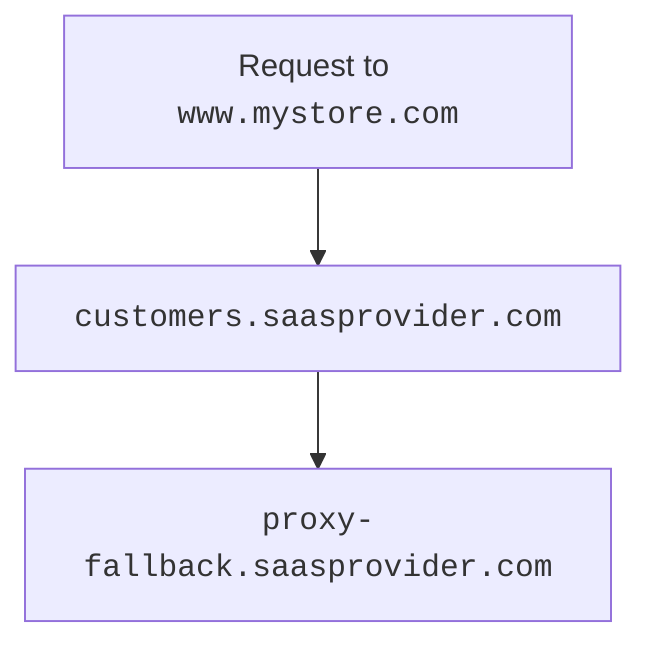

import { Example, Render } from "~/components"

***

<Render file="get-started-prereqs" params={{ one: "on a Free plan." }} />

***

## Initial setup

<Render file="get-started-initial-setup-preamble" /> <br/>

### 1. Create fallback origin

<Render file="get-started-fallback-origin" />

### 2. (Optional) Create CNAME target

The `CNAME` target — optional, but highly encouraged — provides a friendly and more flexible place for customers to [route their traffic](#3-have-customer-create-cname-record). You may want to use a subdomain such as `customers.<SAAS_PROVIDER>.com`.

[Create](/dns/manage-dns-records/how-to/create-dns-records/#create-dns-records) a proxied `CNAME` that points your `CNAME` target to your fallback origin (can be a wildcard such as `*.customers.saasprovider.com`).

<Example>

| **Type** | **Name**     | **IPv4 address**                  | **Proxy status** |
| -------- | ------------ | --------------------------------- | ---------------- |
| `CNAME`  | `.customers` | `proxy-fallback.saasprovider.com` | Proxied          |

</Example>

***

## Per-hostname setup

<Render file="get-started-per-hostname" />

### 3. Have customer create CNAME record

To finish the custom hostname setup, your customer needs to set up a `CNAME` record at their authoritative DNS that points to your [`CNAME` target](#2-optional-create-cname-target) [^1].

<Render file="get-started-check-statuses" />

Your customer's `CNAME` record might look like the following:

```txt
www.mystore.com CNAME customers.saasprovider.com
```

This record would route traffic in the following way:



<br/>

Requests to `www.mystore.com` would go to your `CNAME` target (`customers.saasprovider.com`), which would then route to your fallback origin (`proxy-fallback.saasprovider.com`).

[^1]: <Render file="regional-services" />

#### Service continuation

<Render file="get-started-service-continuation" />
