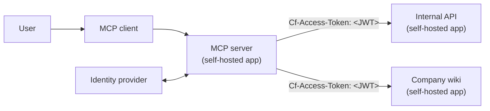
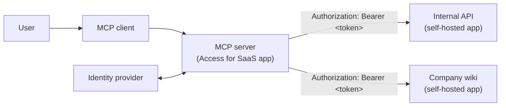

import { Render, GlossaryTooltip, APIRequest, Tabs, TabItem } from "~/components";

MCP servers often need to call internal applications on behalf of authenticated users. For example, an MCP server that helps employees interact with internal tools needs to forward the user's identity to those downstream services (the internal applications the MCP server connects to) so that each request is authorized with the correct permissions.

The [Linked App Token](/cloudflare-one/access-controls/applications/linked-app-token/) policy selector enables this by allowing an Access policy on one application to accept tokens issued for another. There are two ways to set this up depending on how your MCP server is deployed.

## Self-hosted MCP server (recommended)

If your MCP server is a [self-hosted Access application](/cloudflare-one/access-controls/applications/http-apps/self-hosted-public-app/), Cloudflare Access handles authentication automatically. The MCP server receives the user's JWT from Access in the `Cf-Access-Jwt-Assertion` header and forwards it to downstream applications in the `Cf-Access-Token` header. No OAuth implementation is needed in your MCP server code.



### Setup

1. Add your MCP server as a [self-hosted Access application](/cloudflare-one/access-controls/applications/http-apps/self-hosted-public-app/).

2. On each downstream application that the MCP server needs to access, create a Linked App Token policy:

		<Tabs syncKey="dashPlusAPI">
		<TabItem label="Dashboard">

		1. In the [Cloudflare dashboard](https://one.dash.cloudflare.com), go to **Zero Trust** > **Access controls** > **Applications**.
		3. Select the downstream application (not the MCP server application) and select **Edit**.
		2. Go to the **Policies** tab and select **Create new policy**.
		3. Set the policy **Action** to _Service Auth_.
		4. For **Selector**, select _Linked App Token_.
		5. For **Value**, select the MCP server application. For example,

			| Action       | Rule type | Selector          | Value |
			| ------------ | --------- | ----------------- | ---- |
			| Service Auth | Include   | Linked App Token | `internal-mcp-server`|
		6. Save the policy.
		7. In your downstream application, add the policy to the **Access policies** list.
		8. Save the application.

		</TabItem>
		<TabItem label="API">

		1. Get the `uid` of your MCP server application:

			<APIRequest path="/accounts/{account_id}/access/apps" method="GET" />

			```json title="Response"
			{
				"id": "a1b2c3d4-e5f6-7890-abcd-ef1234567890",
				"uid": "a1b2c3d4-e5f6-7890-abcd-ef1234567890",
				"type": "self_hosted",
				"name": "internal-mcp-server",
				...
			}
			```

		2. Create a policy on the downstream application:

			<APIRequest
				path="/accounts/{account_id}/access/policies"
				method="POST"
				json={{
					name: "Allow requests from MCP server",
					decision: "non_identity",
					include: [
						{
							linked_app_token: {
								app_uid: "a1b2c3d4-e5f6-7890-abcd-ef1234567890",
							},
						},
					],
				}}
			/>


		</TabItem>
		</Tabs>

3. In your MCP server code, forward the `Cf-Access-Jwt-Assertion` header from incoming requests as the `Cf-Access-Token` header on outgoing requests to the downstream application:

	```txt
	Cf-Access-Token: <JWT from Cf-Access-Jwt-Assertion>
	```

Access will now validate the JWT token against the Linked App Token rule and propagate the user's identity to the downstream application.

## SaaS MCP server (Access for SaaS with OAuth)

If your MCP server is registered as an [Access for SaaS OIDC application](/cloudflare-one/access-controls/ai-controls/saas-mcp/) and implements [MCP OAuth](https://modelcontextprotocol.io/specification/2025-03-26/basic/authorization), it receives an OAuth `access_token` from Cloudflare Access. The MCP server forwards this token to downstream self-hosted applications in the `Authorization: Bearer` header.

This approach requires your MCP server to implement the OAuth authorization code flow. Use the [self-hosted MCP server approach](#self-hosted-mcp-server-recommended) if you want Cloudflare to handle authentication for you.



### Setup

1. [Add the MCP server as an Access for SaaS OIDC application](/cloudflare-one/access-controls/ai-controls/saas-mcp/).

2. On each downstream application, create a Linked App Token policy selecting the SaaS MCP server application as the value.

3. Configure the MCP server to forward the `access_token` in outgoing requests:

	```txt
	Authorization: Bearer ACCESS_TOKEN
	```

For detailed step-by-step instructions for both the Dashboard and API, refer to [Linked App Token - SaaS to self-hosted](/cloudflare-one/access-controls/applications/linked-app-token/#saas-to-self-hosted).

## Known limitations

- The Linked App Token policy can only be added to [self-hosted applications](/cloudflare-one/access-controls/applications/http-apps/self-hosted-public-app/). It cannot be added to SaaS or other application types.
- This feature works best with applications that rely on the [Cloudflare Access JWT](/cloudflare-one/access-controls/applications/http-apps/authorization-cookie/validating-json/) for authentication and identity. If the downstream application has its own authentication layer after Access, requests that pass Access validation may still be rejected by the application itself.
