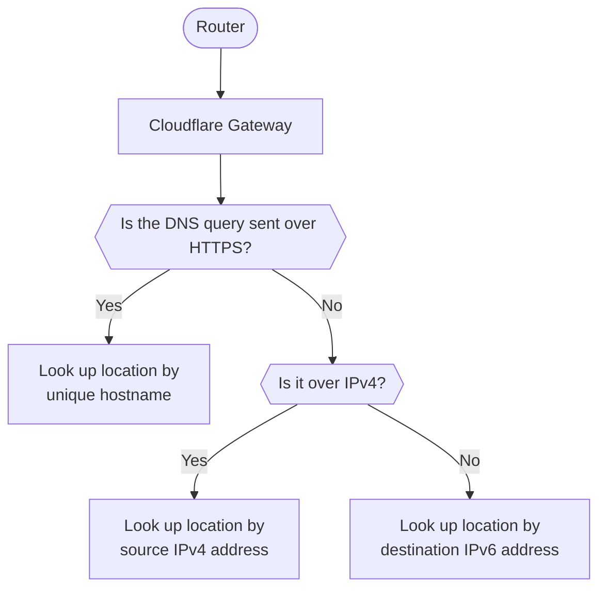

When you create a DNS location, Gateway assigns IPv4/IPv6 addresses and DoT/DoH hostnames to that location. These are the IP addresses and hostnames you send your DNS queries to for Gateway to resolve.

To view the resolver endpoint IP addresses and hostnames for a DNS location:

1. In [Zero Trust](https://one.dash.cloudflare.com/), go to **Gateway** > **DNS locations**.
2. Locate the DNS location, then select **Configure**.
3. Go to **Setup instructions**. The addresses and hostnames will appear in **Your configuration**.

## DNS query location matching

Gateway uses different methods to match a DNS query to DNS locations depending on the type of request and network:

1. First, Gateway checks whether the query was sent using DNS over HTTPS. If yes, Gateway looks up the DNS location by its unique hostname.
2. Next, if the query was not sent with DNS over HTTPS, Gateway checks whether it was sent over IPv4. If yes, it looks up the DNS location by the source IPv4 address.
3. Last, if the query was not sent over IPv4, it means it was sent over IPv6. Gateway will look up the DNS location associated with the query based on the unique DNS resolver IPv6 address.

## IPv6 address

When you create a DNS location, your location will receive a unique DNS resolver IPv6 address. This IPv6 address is how Gateway will match DNS queries to locations and apply the appropriate filtering rules.

## IPv4 address

### Source IP

Gateway uses the public source IPv4 address of your network to identify your DNS location, apply policies and log DNS requests. Unless you have purchased a [dedicated IPv4 resolver IP](#dns-resolver-ip), you must provide source IP addresses for the IPv4 traffic you want to filter with DNS policies. Otherwise, Gateway will not be able to attribute the traffic to your account.

When creating a DNS location, Zero Trust automatically identifies the source IP address of the network you are on.

If you are on the Enterprise plan, you have the option of manually entering one or more source IP addresses of your choice. This enables you to create Gateway DNS locations even if you are not connecting from any of those networks' IP addresses.

### DNS resolver IP

For queries over IPv4, the default DNS resolver IP addresses are anycast IP addresses, and they are shared across every Cloudflare Zero Trust account.

If you are on the Enterprise plan, you can request a dedicated DNS resolver IPv4 address to be provisioned for a DNS location in lieu of the default anycast addresses. Like IPv6, queries forwarded to that address will be identified using the dedicated DNS resolver IPv4 address.

Resolver IP addresses you will only be assigned to the Zero Trust account you request. For more information on requesting dedicated DNS resolver IPv4 addresses, contact your account team.

## DNS over TLS

Each DNS location is assigned a unique hostname for DNS over TLS (DoT). Gateway will identify your location based on its DoT hostname.

## DNS over HTTPS

Each DNS location is assigned a unique hostname for DNS over HTTPS (DoH). Gateway will identify your location based on its DoH hostname.

### DoH subdomain

Each DNS location in Cloudflare Zero Trust has a unique DoH subdomain (previously known as unique ID). If your organization uses DNS policies, you can enter your location's DoH subdomain as part of the WARP client settings.

For example, for the DoH hostname `https://65y9p2vm1u.cloudflare-gateway.com/dns-query`, the DoH subdomain is `65y9p2vm1u`.

## Send specific queries to Gateway

By default, all queries from a configured DNS location will be sent to its DNS resolver IP address to be inspected by Gateway. You can configure Gateway to only filter queries originating from specific networks within a location:

1. [Create an IP list](/cloudflare-one/policies/gateway/lists/) with the IPv4 and/or IPv6 addresses that your organization will source queries from.
2. Add a [Source IP](/cloudflare-one/policies/gateway/dns-policies/#source-ip) condition to your DNS policies.

For example, to block security threats for specific networks, you could create the following policy:

| Selector            | Operator | Value                                                           | Logic | Action |
| ------------------- | -------- | --------------------------------------------------------------- | ----- | ------ |
| Security Categories | in       | Select all categories that apply                                | And   | Block  |
| Source IP           | in list  | The name of the IP list containing your organization's networks |       |        |

DNS queries made from IP addresses that are not in your IP list will not be filtered or populate your organization's [Gateway activity logs](/cloudflare-one/insights/logs/gateway-logs/).
