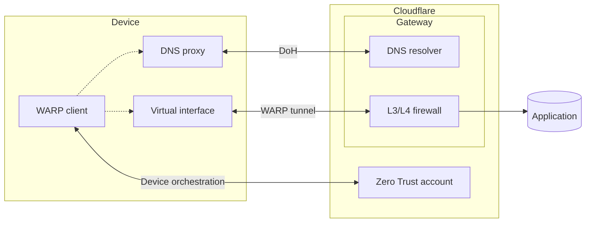
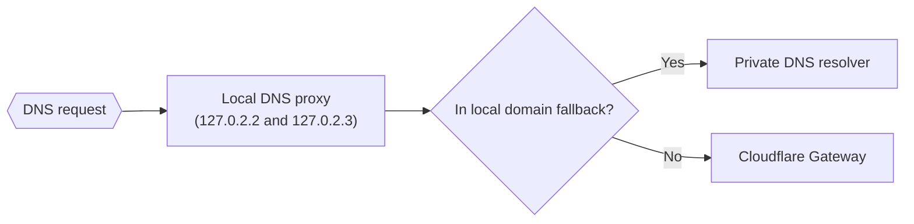
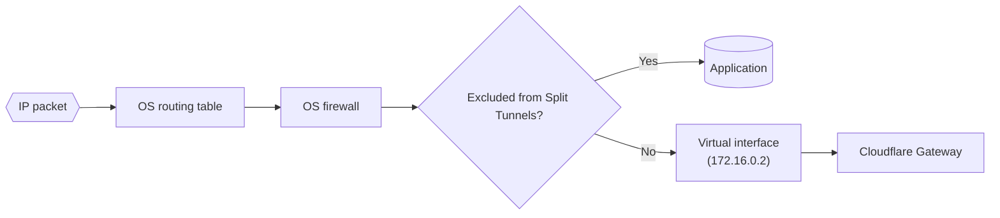

import { TabItem, Tabs } from "~/components";

This guide explains how the Cloudflare WARP client interacts with a device's operating system to route traffic in [Gateway with WARP](/cloudflare-one/connections/connect-devices/warp/configure-warp/warp-modes/#gateway-with-warp-default) mode.

In [Gateway with DoH](/cloudflare-one/connections/connect-devices/warp/configure-warp/warp-modes/#gateway-with-doh) mode, the IP traffic information does not apply. In [Secure Web Gateway without DNS filtering](/cloudflare-one/connections/connect-devices/warp/configure-warp/warp-modes/#secure-web-gateway-without-dns-filtering) mode, the DNS traffic information does not apply.

## Overview

The WARP client allows organizations to have granular control over the applications an end user device can access. The client forwards DNS and network traffic from the device to Cloudflare's global network, where Zero Trust policies are applied in the cloud. On all operating systems, the WARP daemon maintains three connections between the device and Cloudflare:

| Connection                                                                                                                                     | Protocol | Purpose                                                                                                         |
| ---------------------------------------------------------------------------------------------------------------------------------------------- | -------- | --------------------------------------------------------------------------------------------------------------- |
| Device orchestration                                                                                                                           | HTTPS    | Perform user registration, check device posture, apply WARP profile settings.                                   |
| [DoH](https://www.cloudflare.com/learning/dns/dns-over-tls/)                                                                                   | HTTPS    | Send DNS requests to Gateway for DNS policy enforcement.                                                        |
| WARP tunnel ([via WireGuard or MASQUE](/cloudflare-one/connections/connect-devices/warp/configure-warp/warp-settings/#device-tunnel-protocol)) | UDP      | Send IP packets to Gateway for network policy enforcement, HTTP policy enforcement, and private network access. |



Your [Split Tunnel](/cloudflare-one/connections/connect-devices/warp/configure-warp/route-traffic/split-tunnels/) configuration determines what traffic is sent down the WARP tunnel. Your [Local Domain Fallback](/cloudflare-one/connections/connect-devices/warp/configure-warp/route-traffic/local-domains/) configuration determines which DNS requests are sent to Gateway via DoH. Traffic to the [DoH endpoint](/cloudflare-one/connections/connect-devices/warp/deployment/firewall/#doh-ip) and [device orchestration API](/cloudflare-one/connections/connect-devices/warp/deployment/firewall/#client-orchestration-api) endpoint do not obey Split Tunnel rules, since those connections always operate outside of the WARP tunnel.

Next, you will learn how WARP configures your operating system to apply your Local Domain Fallback and Split Tunnel routing rules. Implementation details differ between desktop and mobile clients.

## Windows, macOS, and Linux

The desktop client consists of two components: a service/daemon that handles all WARP functionality on your device, and a GUI wrapper that makes it easier for a user to interact with the daemon.

### DNS traffic

When you turn on WARP, WARP creates a local DNS proxy on the device and binds it to these IP addresses on port 53 (the port designated for DNS traffic):

- **IPv4**: `127.0.2.2` and `127.0.2.3`
- **IPv6**:
  - macOS and Linux: `fd01:db8:1111::2` and `fd01:db8:1111::3`
  - Windows: `::ffff:127.0.2.2`

WARP then configures the operating system to send all DNS requests to these IP addresses. All network interfaces on the device will now use this local DNS proxy for DNS resolution. In other words, all DNS traffic will now be handled by the WARP client.

:::note

Browsers with DoH configured will bypass the local DNS proxy. You may need to disable DoH settings in the browser.
:::

Based on your Local Domain Fallback configuration, WARP will either forward the request to Gateway for DNS policy enforcement or forward the request to your private DNS resolver.

- Requests to Gateway are sent over our [DoH connection](#overview) (outside of the WARP tunnel).
- Requests to your private DNS resolver are sent either inside or outside of the tunnel depending on your Split Tunnel configuration. For more information, refer to [How the WARP client handles DNS requests](/cloudflare-one/connections/connect-devices/warp/configure-warp/route-traffic/#how-the-warp-client-handles-dns-requests).



You can verify that the operating system is using WARP's local DNS proxy:

<Tabs> <TabItem label="macOS">

On macOS, open a terminal window and run `scutil --dns`. The DNS servers should be set to WARP's local DNS proxy IPs.

```sh
scutil --dns
```

```sh {4-5} output
DNS configuration (for scoped queries)
resolver #1
  search domain[0] : <DNS-SEARCH-DOMAIN>
  nameserver[0] : 127.0.2.2
  nameserver[1] : 127.0.2.3
  if_index : 15 (en0)
  flags    : Scoped, Request A records
  reach    : 0x00030002 (Reachable,Local Address,Directly Reachable Address)
resolver #2
  nameserver[0] : 127.0.2.2
  nameserver[1] : 127.0.2.3
  nameserver[2] : fd01:db8:1111::2
  nameserver[3] : fd01:db8:1111::3
  if_index : 23 (utun3)
  flags    : Scoped, Request A records, Request AAAA records
  reach    : 0x00030002 (Reachable,Local Address,Directly Reachable Address)
```

</TabItem> <TabItem label="Windows">

On Windows, open a PowerShell window and run `ipconfig`. The DNS servers should be set to WARP's local DNS proxy IPs.

```powershell
ipconfig
```

```txt {15-16} output
Windows IP Configuration

Unknown adapter CloudflareWARP:

   Connection-specific DNS Suffix  . :
   Description . . . . . . . . . . . : Cloudflare WARP Interface Tunnel
   Physical Address. . . . . . . . . :
   DHCP Enabled. . . . . . . . . . . : No
   Autoconfiguration Enabled . . . . : Yes
   IPv6 Address. . . . . . . . . . . : 2606:4700:110:8f79:145:f180:fc4:8106(Preferred)
   Link-local IPv6 Address . . . . . : fe80::83b:d647:4bed:d388%49(Preferred)
   IPv4 Address. . . . . . . . . . . : 172.16.0.2(Preferred)
   Subnet Mask . . . . . . . . . . . : 255.255.255.255
   Default Gateway . . . . . . . . . :
   DNS Servers . . . . . . . . . . . : 127.0.2.2
                                       127.0.2.3
   NetBIOS over Tcpip. . . . . . . . : Enabled
```

</TabItem>

<TabItem label="Linux">

On Linux, check the `/etc/resolv.conf` file. The DNS servers should be set to WARP's local DNS proxy IPs.

```sh
cat /etc/resolv.conf
```

```sh {2-3} output
# This file was generated by cloudflare-warp.
nameserver 127.0.2.2
nameserver 127.0.2.3
nameserver fd01:db8:1111::2
nameserver fd01:db8:1111::3
search <DNS-SEARCH-DOMAIN>
options edns0
options trust-ad
```

</TabItem> </Tabs>

### IP traffic

When you turn on WARP, WARP makes three changes on the device to control if traffic is sent inside or outside of the WARP tunnel:

- Creates a [virtual network interface](#virtual-interface).
- Modifies the operating system [routing table](#routing-table) according to your Split Tunnel rules.
- Modifies the operating system [firewall](#system-firewall) according to your Split Tunnel rules.



#### Virtual interface

Virtual interfaces allow the operating system to logically subdivide a physical interface, such as a network interface controller (NIC), into separate interfaces for the purposes of routing IP traffic. WARP's virtual interface is what maintains the WireGuard/MASQUE connection between the device and Cloudflare. By default, its IP address is hardcoded as `172.16.0.2`. You can use [**Override local interface IP**](/cloudflare-one/connections/connect-devices/warp/configure-warp/warp-settings/#override-local-interface-ip) to assign unique IPs per device.

To view a list of all network interfaces on the operating system:

<Tabs> <TabItem label="macOS">

On macOS, run `ifconfig`. When WARP is turned on, you will see a `utun` interface with IP address `172.16.0.2`.

```sh
ifconfig
```

```sh {3} output
<redacted>
utun3: flags=8051<UP,POINTOPOINT,RUNNING,MULTICAST> mtu 1280
	inet 172.16.0.2 --> 172.16.0.2 netmask 0xffffffff
	inet6 fe80::f6d4:88ff:fe82:6d9e%utun3 prefixlen 64 scopeid 0x17
	inet6 2606:4700:110:8c7d:7369:7526:a59b:5636 prefixlen 128
	nd6 options=201<PERFORMNUD,DAD>
```

</TabItem> <TabItem label="Windows">

On Windows, run `ipconfig`. When WARP is turned on, you will see an adapter called `CloudflareWARP` with IP address `172.16.0.2`.

```powershell
ipconfig
```

```txt {12} output
Windows IP Configuration

Unknown adapter CloudflareWARP:

   Connection-specific DNS Suffix  . :
   Description . . . . . . . . . . . : Cloudflare WARP Interface Tunnel
   Physical Address. . . . . . . . . :
   DHCP Enabled. . . . . . . . . . . : No
   Autoconfiguration Enabled . . . . : Yes
   IPv6 Address. . . . . . . . . . . : 2606:4700:110:8f79:145:f180:fc4:8106(Preferred)
   Link-local IPv6 Address . . . . . : fe80::83b:d647:4bed:d388%49(Preferred)
   IPv4 Address. . . . . . . . . . . : 172.16.0.2(Preferred)
   Subnet Mask . . . . . . . . . . . : 255.255.255.255
   Default Gateway . . . . . . . . . :
   DNS Servers . . . . . . . . . . . : 127.0.2.2
                                       127.0.2.3
   NetBIOS over Tcpip. . . . . . . . : Enabled
```

</TabItem>

<TabItem label="Linux">

On Linux, run `ifconfig` or `ip addr`. When WARP is turned on, you will see a `utun` interface with IP address `172.16.0.2`.

```sh null
ip addr
```

```sh {4} output
<redacted>
3: CloudflareWARP: <POINTOPOINT,MULTICAST,NOARP,UP,LOWER_UP> mtu 1280 qdisc mq state UNKNOWN group default qlen 500
    link/none
    inet 172.16.0.2/32 scope global CloudflareWARP
       valid_lft forever preferred_lft forever
    inet6 2606:4700:110:8a2e:a5f7:a8de:a1f9:919/128 scope global
       valid_lft forever preferred_lft forever
    inet6 fe80::117e:276b:8a79:c498/64 scope link stable-privacy
       valid_lft forever preferred_lft forever
```

</TabItem>

</Tabs>

#### Routing table

WARP edits the system routing table to control what IP traffic goes to Gateway. The routing table indicates which network interface should handle packets to a particular IP address. By default, all traffic routes through WARP's virtual interface except for the IPs and domains on your Split Tunnel exclude list (which use the default interface on your device).

You can verify that the routing table matches your Split Tunnel rules:

<Tabs> <TabItem label="macOS">

To view the entire routing table on macOS, run `netstat -r`.

You can also search the routing table for a domain or IP address. In this example, we see that traffic to `google.com` is sent through `utun3`, which is the WARP virtual interface on this device:

```sh
route get google.com
```

```sh {4} output
   route to: lga25s81-in-f14.1e100.net
destination: 136.0.0.0
       mask: 248.0.0.0
  interface: utun3
      flags: <UP,DONE,PRCLONING>
 recvpipe  sendpipe  ssthresh  rtt,msec    rttvar  hopcount      mtu     expire
       0         0         0         0         0         0      1280         0
```

In contrast, this DHCP address is excluded from WARP and uses the default interface:

```sh
route get 169.254.0.0
```

```sh {4} output
   route to: 169.254.0.0
destination: 169.254.0.0
       mask: 255.255.0.0
  interface: en0
      flags: <UP,DONE,CLONING,STATIC>
 recvpipe  sendpipe  ssthresh  rtt,msec    rttvar  hopcount      mtu     expire
       0         0         0         0         0         0      1500   -210842
```

</TabItem> <TabItem label="Windows">

To view the entire routing table on Windows, run `netstat -r`.

You can also search the routing table for an IP address. In this example, we see that traffic to `1.1.1.1` is sent through the WARP virtual interface:

```powershell
Find-NetRoute -RemoteIPAddress "1.1.1.1" | Select-Object InterfaceAlias -Last 1
```

```txt output
InterfaceAlias
--------------
CloudflareWARP
```

In contrast, this DHCP address is excluded from WARP and uses the default interface:

```powershell
Find-NetRoute -RemoteIPAddress "169.254.0.0" | Select-Object InterfaceAlias -Last 1
```

```txt output
InterfaceAlias
--------------
Wi-Fi
```

</TabItem>

<TabItem label="Linux">

To view the entire routing table on Linux, run `ip -6 route show table all` or `ip -4 route show table all`.

You can also search the routing table for an IP address. In this example, we see that traffic to `1.1.1.1` is sent through the WARP virtual interface:

```sh
ip route get 1.1.1.1
```

```sh output
1.1.1.1 dev CloudflareWARP table 65743 src 172.16.0.2 uid 1000
    cache
```

In contrast, this DHCP address is excluded from WARP and uses the default interface:

```sh
ip route get 169.254.0.0
```

```sh output
169.254.0.0 dev ens18 src 172.24.8.6 uid 1000
    cache
```

</TabItem>

</Tabs>

#### System firewall

WARP modifies the operating system firewall to enforce your Split Tunnel rules. This adds a layer of protection in case a service bypasses the routing table and tries to send traffic directly through another interface. For example, if traffic to `203.0.113.0` is supposed to be inspected by Gateway, we create a firewall rule that blocks `203.0.113.0` on all interfaces except for `utun`.

## iOS, Android, and ChromeOS

On iOS and Android/ChromeOS, the Cloudflare One Agent installs itself as a VPN client to capture and route all traffic. The app is built on the official VPN framework for iOS and Android. For more information, refer to Apple's [NetworkExtension documentation](https://developer.apple.com/documentation/networkextension) and Google's [Android developer documentation](https://developer.android.com/guide/topics/connectivity/vpn).

Note that ChromeOS runs the Android app in a virtual machine, rather than running a native Chrome app.
