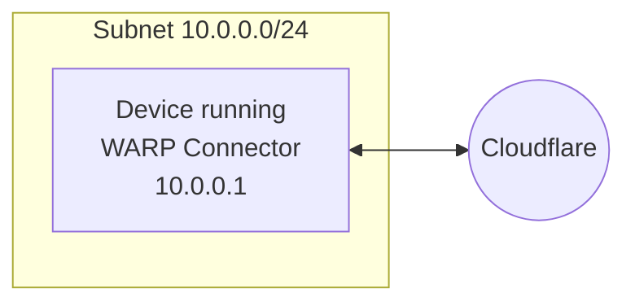
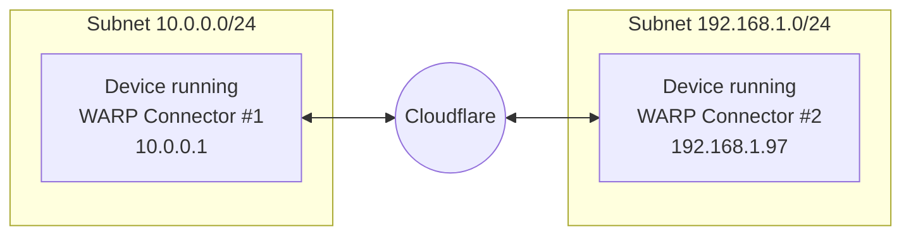
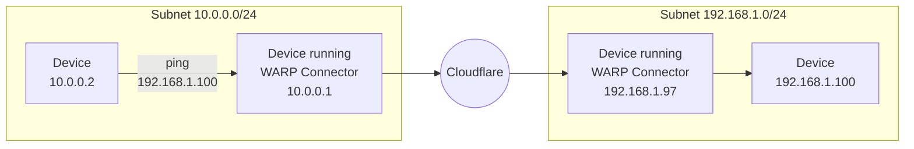

import { Details, GlossaryTooltip, TabItem, Tabs } from "~/components"


<Details header="Feature availability">

| [WARP modes](/cloudflare-one/connections/connect-devices/warp/configure-warp/warp-modes/) | [Zero Trust plans](https://www.cloudflare.com/teams-pricing/) |
| ----------------------------------------------------------------------------------------- | ------------------------------------------------------------- |
| Gateway with WARP                                                                         | All plans                                                     |

| System   | Availability |
| -------- | ------------ |
| Windows  | ❌            |
| macOS    | ❌            |
| Linux    | ✅            |
| iOS      | ❌            |
| Android  | ❌            |
| ChromeOS | ❌            |


</Details>

Cloudflare WARP Connector is a piece of software [^1] that enables site-to-site, bidirectional, and mesh networking connectivity without requiring changes to underlying network routing infrastructure. WARP Connector establishes a secure Layer 3 connection between a private network and Cloudflare, allowing you to:

* Connect two or more private networks to each other.
* Connect IoT devices that cannot run external software, such as printers and IP phones.
* Filter and log server-initiated traffic, such as VoIP and SIP traffic.
* Apply Zero Trust security policies based on the source IP of the request.


As shown in the diagram, WARP Connector acts as a router for a subnet within the private network to on-ramp and off-ramp traffic through Cloudflare. All devices on the subnet can access any services connected to Cloudflare, and all devices connected to Cloudflare can access any services on the subnet. Each subnet runs a WARP Connector on a designated Linux machine (typically the default gateway router), but other devices on the network do not need to install software.

This guide will cover how to connect two independent subnets, for example `10.0.0.0/24` and `192.168.1.0/24`. Each subnet must run its own WARP Connector on a Linux host. Installing on your router is the simplest setup, but if you do not have access to the router, you may choose any other machine on the subnet. In this example, we will create a WARP Connector for subnet `10.0.0.0/24` and install it on `10.0.0.1`. We will then create a second WARP Connector for subnet `192.168.1.0/24` and install it on `192.168.1.97`.

## Prerequisites

* A Linux host [^2] on each subnet
* Verify that your firewall allows inbound/outbound traffic over the [WARP IP addresses, ports, and domains](/cloudflare-one/connections/connect-devices/warp/deployment/firewall/).

## 1. Install a WARP Connector

To install WARP Connector on a host machine:

1. In [Zero Trust](https://one.dash.cloudflare.com), go to **Network** > **Tunnels**.
2. Select **Create a tunnel**.
3. For the tunnel type, select **WARP Connector**.
4. You will be prompted to turn on **Warp to Warp** and [**Override local interface IP**](/cloudflare-one/connections/connect-devices/warp/configure-warp/warp-settings/#override-local-interface-ip) if they are currently turned off. These settings allow Cloudflare to assign a unique <GlossaryTooltip term="CGNAT IP">CGNAT IP</GlossaryTooltip> to each WARP device and route traffic between them.
5. Give the tunnel any name (for example, `Subnet-10.0.0.0/24`) and select **Create tunnel**.
7. Select the operating system of your host machine.
8. On your host machine, open a terminal window and run the commands shown in the Zero Trust dashboard. Those commands will install the WARP Connector, enable IP forwarding on the host, and connect WARP Connector to your Zero Trust organization.

    :::note[Remote SSH connections]

    If you are managing the deployment remotely over SSH, your connection may drop when you install the WARP Connector. Because the WARP connector immediately starts forwarding traffic to Cloudflare, the remote SSH server's traffic will now route to Cloudflare instead of via the server's public IP. To work around the issue:
    - **Option 1**: In your WARP Connector [device profile](#3-recommended-create-a-device-profile), temporarily add the public IP of your local machine to the [Split Tunnel Exclude list](/cloudflare-one/connections/connect-devices/warp/configure-warp/route-traffic/split-tunnels/).

    - **Option 2**: If your local machine is connected to Zero Trust (for example, via the WARP client), you can SSH to the <GlossaryTooltip term="CGNAT IP">CGNAT IP</GlossaryTooltip> of the WARP Connector. Traffic to the CGNAT IP must [route through the WARP tunnel](#4-configure-split-tunnels).
    :::

9. (Optional) Configure IP forwarding:

    <Details header="Enable IP forwarding to persist after reboot">
      ```sh
      echo 'net.ipv4.ip_forward = 1' | sudo tee -a /etc/sysctl.d/99-warp-svc.conf
      sudo sysctl -p /etc/sysctl.d/99-warp-svc.conf
      ```
    </Details>

    <Details header="Configure IP forwarding with iptables">
    If you are setting up WARP Connector on a host with iptables enabled, make sure that your iptables FORWARD chain includes rules to accept the desired traffic. For testing and troubleshooting purposes, you can set the default policy for the WARP interface to ACCEPT:
      ```sh
      iptables -A FORWARD -i CloudflareWARP -J ACCEPT
      ```
    </Details>


10. To verify that the WARP Connector is connected to Cloudflare:
    ```sh
    $ warp-cli status
    Status update: Connected
    Success
    ```

    <details>
    <summary>Troubleshoot connection</summary>
    <div>

    If WARP is disconnected, try the following troubleshooting strategies:

    - Run `warp-cli connect`.

    - If your private network uses a firewall to restrict Internet traffic, ensure that it allows the [WARP ports and IPs](/cloudflare-one/connections/connect-devices/warp/deployment/firewall/).

    - Review your [WARP daemon logs](/cloudflare-one/connections/connect-devices/warp/troubleshooting/warp-logs/) for information about why the connection is failing.

    </div>
    </details>

WARP Connector software is now installed but not yet routing traffic.

## 2. Add private network routes

1. In [Zero Trust](https://one.dash.cloudflare.com), go to **Networks** > **Routes**.
2. Select **Create route**.
3. In **CIDR**, enter the private IPv4 address range that you wish to route through this WARP Connector (for example, `10.0.0.0/24`). WARP Connector does not currently support IPv6 routes.
    :::note
    If you do not already have a private network range, you can choose a subnet from one of these [pre-defined CIDRs](https://datatracker.ietf.org/doc/html/rfc1918#section-3).
    :::
4. For **Tunnel**, select the name of your WARP Connector (_Subnet-10.0.0.0/24_).
5. Select **Create**.

## 3. (Recommended) Create a device profile

A dedicated [device profile](/cloudflare-one/connections/connect-devices/warp/configure-warp/device-profiles/) allows you to manage the WARP Connector host machine separately from WARP client user devices.

WARP Connector hosts are registered to your Zero Trust organization with the email address `warp_connector@<your-team-name>.cloudflareaccess.com`. To set up a device profile for WARP Connector, [create a new profile](/cloudflare-one/connections/connect-devices/warp/configure-warp/device-profiles/#create-a-new-profile) that matches on the following expression:

| Selector | Operator | Value |
| -------- | -------- | ----- |
| User email | is | `warp_connector@<your-team-name>.cloudflareaccess.com` |

## 4. Configure Split Tunnels

In your WARP Connector device profile, configure the following [Split Tunnel settings](/cloudflare-one/connections/connect-devices/warp/configure-warp/route-traffic/split-tunnels/):

1. Route your private network CIDR (`10.0.0.0/24`) through the WARP tunnel. For example, if you are using **Exclude** mode, delete `10.0.0.0/8` from the list and re-add the following IPs: `10.0.1.0/24`, `10.0.2.0/23`, `10.0.4.0/22`, `10.0.8.0/21`, `10.0.16.0/20`, `10.0.32.0/19`, `10.0.64.0/18`, `10.0.128.0/17`, `10.1.0.0/16`, `10.2.0.0/15`, `10.4.0.0/14`, `10.8.0.0/13`, `10.16.0.0/12`, `10.32.0.0/11`, `10.64.0.0/10`, `10.128.0.0/9`
2. Route the CGNAT IP space (`100.96.0.0/12`) through the WARP tunnel. For example, if you are using **Exclude** mode, delete `100.64.0.0/10` from the list and re-add `100.64.0.0/11` and `100.112.0.0/12`.

The `10.0.0.0/24` WARP Connector is now connected to Cloudflare.


## 5. Install another WARP Connector

Repeat Steps 1, 2, and 4 above to install an additional WARP Connector on subnet `192.168.1.0/24`. The device profile in Step 3 will apply to all WARP Connectors.



## 6. Route traffic through WARP Connector

Depending on where you installed the WARP Connector, you may need to configure other devices on the subnet to route traffic through WARP Connector.

### Option 1: Default gateway

If you installed WARP Connector on your router, no additional configuration is necessary. All traffic will use the router as the default gateway.


### Option 2: Alternate gateway

If you have access to the router but installed WARP Connector on another machine, you can configure the router to forward traffic to the WARP Connector. This typically involves adding a static route for the destination IPs that you want to connect to through Cloudflare. Refer to your router's documentation for specific instructions on how to add an IP route.


#### Route from subnet to subnet

For example, if you are on subnet `10.0.0.0/24` and want to reach applications behind subnet `192.168.1.0/24`, add a rule that routes `192.168.1.0/24` to the WARP Connector host machine (`10.0.0.100` in the diagram above). When a device sends a request to `192.168.1.0/24`, the router will first redirect the traffic to the WARP Connector host. WARP Connector encrypts the traffic, changes its destination IP to the [WARP ingress IP](/cloudflare-one/connections/connect-devices/warp/deployment/firewall/#warp-ingress-ip), and sends it back to the router. The router will now forward this encrypted traffic to Cloudflare.

:::note

Ensure that your routing rules do not forward the [WARP ingress IP](/cloudflare-one/connections/connect-devices/warp/deployment/firewall/#warp-ingress-ip) back to the WARP Connector.
:::

#### Route from subnet to WARP clients

`100.96.0.0/12` is the default CIDR for all user devices running the [WARP client](/cloudflare-one/connections/connect-devices/warp/). To connect from the subnet to user devices:
- On your router, add a rule that routes the destination IP `100.96.0.0/12` to the WARP Connector host machine (`10.0.0.100` in the diagram above).
- Ensure that CGNAT IP traffic routes through WARP on both the WARP Connector host and WARP client devices. In other words, delete `100.96.0.0/12` from the [Split Tunnel Exclude list](/cloudflare-one/connections/connect-devices/warp/configure-warp/route-traffic/split-tunnels/) in both device profiles.

### Option 3: Intermediate gateway

If you do not have access to the router, you will need to configure each device on the subnet to egress through the WARP Connector machine instead of the default gateway.


#### Route all traffic

You can configure all traffic on a device to egress through WARP Connector with its local source IP. All traffic will be filtered by your Gateway network policies.

<Tabs> <TabItem label="Linux">

```sh
$ sudo ip route add default via <WARP-CONNECTOR-IP> dev eth0 metric 101
```

Ensure that the `metric` value is lower than other default gateways. To verify that WARP Connector is now the preferred default gateway, run `ip route get <DESTINATION-IP>`.

</TabItem> <TabItem label="macOS">

```sh
$ sudo route -n change default <WARP-CONNECTOR-IP> -interface en0
```

</TabItem>

<TabItem label="Windows">

```bash
route /p add 0.0.0.0 mask 0.0.0.0 <WARP-CONNECTOR-IP> metric 101
```

</TabItem> </Tabs>

#### Route specific IPs

You can configure only certain routes to egress through WARP Connector. For example, you may only want to filter traffic destined to internal applications and devices, but allow public Internet traffic to bypass Cloudflare.

<Tabs> <TabItem label="Linux">

```sh
$ sudo ip route add <DESTINATION-IP> via <WARP-CONNECTOR-IP> dev eth0
```

</TabItem> <TabItem label="macOS">

```sh
$ sudo route -n add -net <DESTINATION-IP> <WARP-CONNECTOR-IP>
```

</TabItem>

<TabItem label="Windows">

```bash
route /p add <DESTINATION-IP> mask 255.255.255.255 <WARP-CONNECTOR-IP>
```

</TabItem> </Tabs>


#### Verify routes

To validate subnet routing, [check your routing table](/cloudflare-one/connections/connect-devices/warp/configure-warp/route-traffic/warp-architecture/#routing-table) and ensure that traffic is routing through the `CloudflareWARP` [virtual interface](/cloudflare-one/connections/connect-devices/warp/configure-warp/route-traffic/warp-architecture/#virtual-interface).

## 7. Test the WARP Connector

You can now test the connection between the two subnets. For example, on the `10.0.0.2` device run `ping 192.168.1.100`.



:::note

If you are testing with curl using private hostnames, add the `--ipv4` flag to your curl commands.
:::

## VPC deployments

When setting up WARP Connector on a virtual private cloud (VPC), you may need to configure additional settings in the cloud service provider.

### GCP

For Google Cloud Project (GCP) deployments, [enable IP forwarding](https://cloud.google.com/vpc/docs/using-routes#canipforward) on the VM instance where you installed WARP Connector.

### AWS

For Amazon Web Services (AWS) deployments:
- Stop [source/destination checking](https://docs.aws.amazon.com/AWSEC2/latest/UserGuide/using-eni.html) on the EC2 instance where you installed WARP Connector.
- In your [subnet route table](https://docs.aws.amazon.com/vpc/latest/userguide/subnet-route-tables.html), route all IPv4 traffic to the EC2 instance where you installed WARP Connector. For example,

  | Destination | Target |
  | ----------- | ------ |
  | `0.0.0.0/0` | `eni-11223344556677889` |

[^1]: WARP Connector is an extension of the [WARP client](/cloudflare-one/connections/connect-devices/warp/).

[^2]: Check the [system requirements](/cloudflare-one/connections/connect-devices/warp/download-warp/#linux). Package dependencies are the following: `curl`, `gpg`, `iptables`, `iptables-persistent`, `lsb-core`, and `sudo`.
