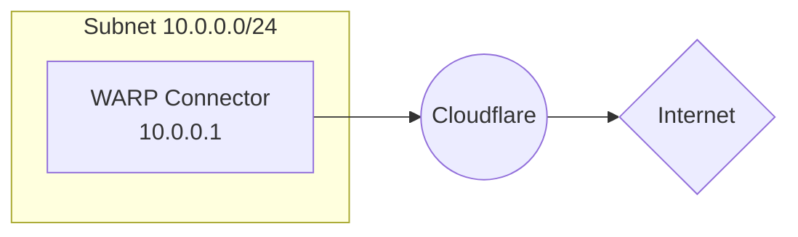
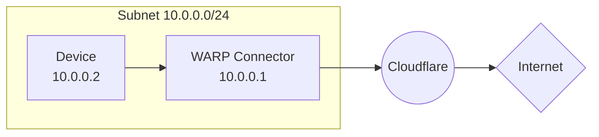

import { Render, Details, GlossaryTooltip, TabItem, Tabs } from "~/components";

This guide covers how to connect a private network to the Internet using WARP Connector. In this example, we will create a WARP Connector for subnet `10.0.0.0/24` and install it on `10.0.0.1`.

:::note
To connect a private network using `cloudflared`, refer to [Connect private networks](/cloudflare-one/connections/connect-networks/private-net/cloudflared/).
:::

## Prerequisites

- A Linux host [^1] on the subnet
- Verify that your firewall allows inbound/outbound traffic over the [WARP IP addresses, ports, and domains](/cloudflare-one/connections/connect-devices/warp/deployment/firewall/).

## 1. Install a WARP Connector

<Render file="tunnel/warp-connector-install" />

## 2. (Recommended) Create a device profile

<Render file="tunnel/warp-connector-device-profile" />

## 3. Route traffic from subnet to WARP Connector

### Option 1: Default gateway

<Render file="tunnel/warp-connector-default-gateway" />

### Option 2: Alternate gateway

<Render file="tunnel/warp-connector-alternate-gateway" />

#### Route from subnet to Internet

For example, for all traffic from laptop `10.0.0.2` to egress through WARP Connector, add a rule on the router that routes `0.0.0.0` to the WARP Connector host machine (`10.0.0.100`). When the laptop sends a request, the router will first redirect the traffic to the WARP Connector host. WARP Connector encrypts the traffic, changes its destination IP to the [WARP ingress IP](/cloudflare-one/connections/connect-devices/warp/deployment/firewall/#warp-ingress-ip), and sends it back to the router. The router will now forward this encrypted traffic to Cloudflare.

:::note

Ensure that your routing rules do not forward the [WARP ingress IP](/cloudflare-one/connections/connect-devices/warp/deployment/firewall/#warp-ingress-ip) back to the WARP Connector.
:::
### Option 3: Intermediate gateway

<Render file="tunnel/warp-connector-intermediate-gateway" />

#### Route all traffic

<Render file="tunnel/warp-connector-route-all-traffic" />

#### Verify routes

<Render file="tunnel/warp-connector-verify-routes" />

## 4. Test the WARP Connector

You can now test if traffic from your subnet routes through Cloudflare.

1. On the `10.0.0.2` device, run `curl --ipv4 www.google.com`.
2. Check your [Gateway DNS logs](/cloudflare-one/insights/logs/gateway-logs/) for queries from `warp_connector@<your-team-name>.cloudflareaccess.com`. Logs may take a few minutes to populate.

[^1]: Check the [system requirements](/cloudflare-one/connections/connect-devices/warp/download-warp/#linux). Package dependencies are the following: `curl`, `gpg`, `iptables`, `iptables-persistent`, `lsb-core`, and `sudo`.
