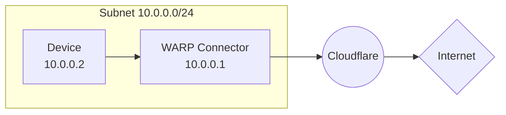
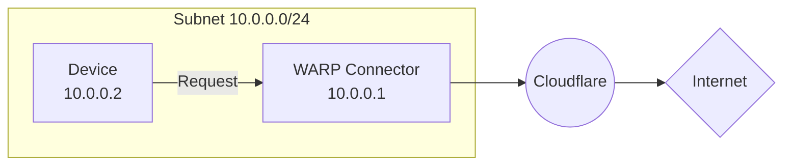

import { Render, Details, GlossaryTooltip, TabItem, Tabs } from "~/components";

This guide covers how to connect a private network to the Internet using WARP Connector. In this example, we will create a WARP Connector for subnet `10.0.0.0/24` and install it on `10.0.0.1`.

## Prerequisites

- A Linux host [^1] on the subnet
- Verify that your firewall allows inbound/outbound traffic over the [WARP IP addresses, ports, and domains](/cloudflare-one/connections/connect-devices/warp/deployment/firewall/).

## 1. Install a WARP Connector

<Render file="tunnel/warp-connector-install" />

## 2. (Recommended) Create a device profile

<Render file="tunnel/warp-connector-device-profile" />

## 3. Route traffic from subnet to WARP Connector

Depending on where you installed the WARP Connector, you may need to configure other devices on the subnet to route outbound requests through WARP Connector.

### Option 1: Default gateway

<Render file="tunnel/warp-connector-default-gateway" />

### Option 2: Alternate gateway

<Render file="tunnel/warp-connector-alternate-gateway" />

#### Add route to router

For example, for all traffic from the subnet to egress through WARP Connector, add a rule on the router that routes `0.0.0.0` to the WARP Connector host machine (`10.0.0.100`).

<Render file="tunnel/warp-connector-alternate-gateway-flow" />

### Option 3: Intermediate gateway

<Render file="tunnel/warp-connector-intermediate-gateway" />

#### Add route to devices

<Render file="tunnel/warp-connector-route-all-traffic" />

#### Verify routes

<Render file="tunnel/warp-connector-verify-routes" />

## 4. Test the WARP Connector

You can now test if traffic from your subnet routes through Cloudflare. For example,

1. On the `10.0.0.2` device, run `curl --ipv4 www.google.com`.
2. Check your [Gateway DNS logs](/cloudflare-one/insights/logs/gateway-logs/) for queries from `warp_connector@<your-team-name>.cloudflareaccess.com`. Logs may take a few minutes to populate.

[^1]: <Render file="tunnel/warp-connector-linux-packages" />