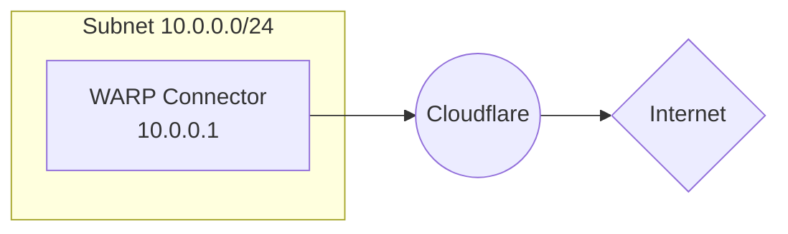

import { Render, Details, GlossaryTooltip, TabItem, Tabs } from "~/components";

Forward requests from the private network to the Internet.

The `10.0.0.0/24` WARP Connector is now routing traffic from the host machine to Cloudflare.