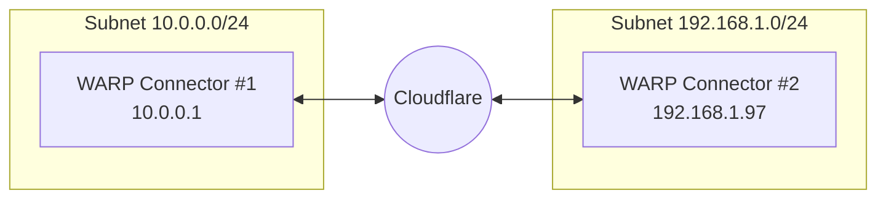
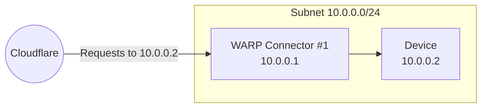
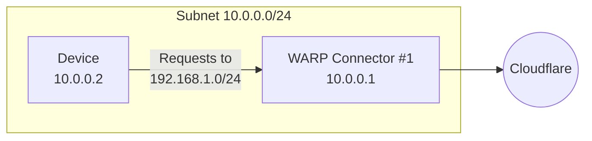
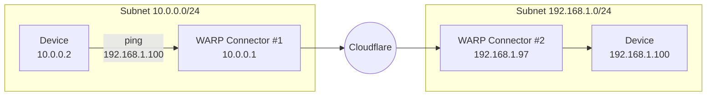

import { Render, Details, GlossaryTooltip, TabItem, Tabs } from "~/components";

This guide will cover how to connect two independent subnets with WARP Connector. Each subnet must run its own WARP Connector on a Linux host. Installing on your router is the simplest setup, but if you do not have access to the router, you may choose any other machine on the subnet.



In this example, we will create a WARP Connector for subnet `10.0.0.0/24` and install it on `10.0.0.1`. We will then create a second WARP Connector for subnet `192.168.1.0/24` and install it on `192.168.1.97`.

## Prerequisites

- A Linux host [^1] on each subnet
- Verify that your firewall allows inbound/outbound traffic over the [WARP IP addresses, ports, and domains](/cloudflare-one/connections/connect-devices/warp/deployment/firewall/).

## 1. Install a WARP Connector

<Render file="tunnel/install-warp-connector" />

## 2. Add private network routes

1. In [Zero Trust](https://one.dash.cloudflare.com), go to **Networks** > **Routes**.
2. Select **Create route**.
3. In **CIDR**, enter the private IPv4 address range that you wish to route through this WARP Connector (for example, `10.0.0.0/24`). WARP Connector does not currently support IPv6 routes.
    :::note
    If you do not already have a private network range, you can choose a subnet from one of these [pre-defined CIDRs](https://datatracker.ietf.org/doc/html/rfc1918#section-3).
    :::
4. For **Tunnel**, select the name of your WARP Connector (_Subnet-10.0.0.0/24_).
5. Select **Create**.

## 3. (Recommended) Create a device profile

A dedicated [device profile](/cloudflare-one/connections/connect-devices/warp/configure-warp/device-profiles/) allows you to manage the WARP Connector host machine separately from WARP client user devices.

WARP Connector hosts are registered to your Zero Trust organization with the email address `warp_connector@<your-team-name>.cloudflareaccess.com`. To set up a device profile for WARP Connector, [create a new profile](/cloudflare-one/connections/connect-devices/warp/configure-warp/device-profiles/#create-a-new-profile) that matches on the following expression:

| Selector | Operator | Value |
| -------- | -------- | ----- |
| User email | is | `warp_connector@<your-team-name>.cloudflareaccess.com` |

## 4. Route traffic from WARP Connector to subnet

In your WARP Connector device profile, [configure Split Tunnels](/cloudflare-one/connections/connect-devices/warp/configure-warp/route-traffic/split-tunnels/) so that traffic to your private network CIDR (`10.0.0.0/24`) routes through the WARP tunnel.

For example, if you are using **Exclude** mode, delete `10.0.0.0/8` from Split Tunnels and re-add the following IPs: `10.0.1.0/24`, `10.0.2.0/23`, `10.0.4.0/22`, `10.0.8.0/21`, `10.0.16.0/20`, `10.0.32.0/19`, `10.0.64.0/18`, `10.0.128.0/17`, `10.1.0.0/16`, `10.2.0.0/15`, `10.4.0.0/14`, `10.8.0.0/13`, `10.16.0.0/12`, `10.32.0.0/11`, `10.64.0.0/10`, `10.128.0.0/9`

The WARP Connector will now forward inbound requests to devices on the subnet.



## 5. Route traffic from subnet to WARP Connector

Depending on where you installed the WARP Connector, you may need to configure other devices on the subnet to route outbound requests through WARP Connector.



### Option 1: Default gateway

If you installed WARP Connector on your router, no additional configuration is necessary. All traffic will use the router as the default gateway.


### Option 2: Alternate gateway

If you have access to the router but installed WARP Connector on another machine, you can configure the router to forward traffic to the WARP Connector. This typically involves adding a static route for the destination IPs that you want to connect to through Cloudflare. Refer to your router's documentation for specific instructions on how to add an IP route.


#### Route from subnet to subnet

For example, if you are on subnet `10.0.0.0/24` and want to reach applications behind subnet `192.168.1.0/24`, add a rule that routes `192.168.1.0/24` to the WARP Connector host machine (`10.0.0.100` in the diagram above). When a device sends a request to `192.168.1.0/24`, the router will first redirect the traffic to the WARP Connector host. WARP Connector encrypts the traffic, changes its destination IP to the [WARP ingress IP](/cloudflare-one/connections/connect-devices/warp/deployment/firewall/#warp-ingress-ip), and sends it back to the router. The router will now forward this encrypted traffic to Cloudflare.

:::note

Ensure that your routing rules do not forward the [WARP ingress IP](/cloudflare-one/connections/connect-devices/warp/deployment/firewall/#warp-ingress-ip) back to the WARP Connector.
:::

### Option 3: Intermediate gateway

If you do not have access to the router, you will need to configure each device on the subnet to egress through the WARP Connector machine instead of the default gateway.


#### Route all traffic

You can configure all traffic on a device to egress through WARP Connector with its local source IP. All traffic will be filtered by your Gateway network policies.

<Tabs> <TabItem label="Linux">

```sh
sudo ip route add default via <WARP-CONNECTOR-IP> dev eth0 metric 101
```

Ensure that the `metric` value is lower than other default gateways. To verify that WARP Connector is now the preferred default gateway, run `ip route get <DESTINATION-IP>`.

</TabItem> <TabItem label="macOS">

```sh
sudo route -n change default <WARP-CONNECTOR-IP> -interface en0
```

</TabItem>

<TabItem label="Windows">

```bash
route /p add 0.0.0.0 mask 0.0.0.0 <WARP-CONNECTOR-IP> metric 101
```

</TabItem> </Tabs>

#### Route specific IPs

You can configure only certain routes to egress through WARP Connector. For example, you may only want to filter traffic destined to internal applications and devices, but allow public Internet traffic to bypass Cloudflare.

<Tabs> <TabItem label="Linux">

```sh
sudo ip route add <DESTINATION-IP> via <WARP-CONNECTOR-IP> dev eth0
```

</TabItem> <TabItem label="macOS">

```sh
sudo route -n add -net <DESTINATION-IP> <WARP-CONNECTOR-IP>
```

</TabItem>

<TabItem label="Windows">

```bash
route /p add <DESTINATION-IP> mask 255.255.255.255 <WARP-CONNECTOR-IP>
```

</TabItem> </Tabs>


#### Verify routes

To validate subnet routing, [check your routing table](/cloudflare-one/connections/connect-devices/warp/configure-warp/route-traffic/warp-architecture/#routing-table) and ensure that traffic is routing through the `CloudflareWARP` [virtual interface](/cloudflare-one/connections/connect-devices/warp/configure-warp/route-traffic/warp-architecture/#virtual-interface).


## 6. Install another WARP Connector

Repeat steps 1, 2, 4, and 5 above to install an additional WARP Connector on subnet `192.168.1.0/24`. The device profile created in Step 3 will apply to all WARP Connectors.


## 7. Test the WARP Connector

You can now test the connection between the two subnets. For example, on the `10.0.0.2` device run `ping 192.168.1.100`.



:::note

If you are testing with curl using private hostnames, add the `--ipv4` flag to your curl commands.
:::

[^1]: Check the [system requirements](/cloudflare-one/connections/connect-devices/warp/download-warp/#linux). Package dependencies are the following: `curl`, `gpg`, `iptables`, `iptables-persistent`, `lsb-core`, and `sudo`.
