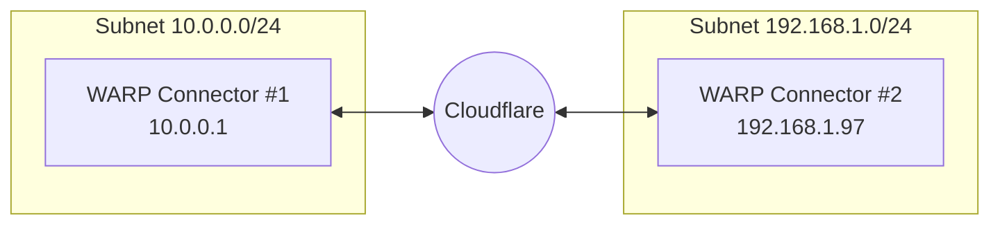
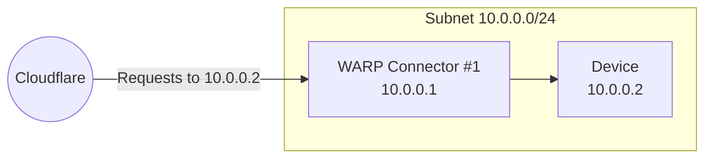
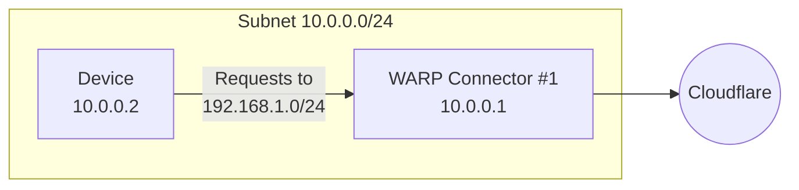
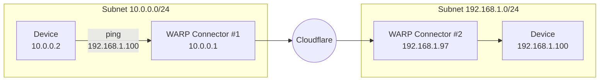

import { Render, Details, GlossaryTooltip, TabItem, Tabs } from "~/components";

This guide covers how to connect two independent subnets with WARP Connector. Each subnet must run its own WARP Connector on a Linux host. Installing on your router is the simplest setup, but if you do not have access to the router, you may choose any other machine on the subnet.



In this example, we will create a WARP Connector for subnet `10.0.0.0/24` and install it on `10.0.0.1`. We will then create a second WARP Connector for subnet `192.168.1.0/24` and install it on `192.168.1.97`.

## Prerequisites

- A Linux host [^1] on each subnet.
- Verify that your firewall allows inbound/outbound traffic over the [WARP IP addresses, ports, and domains](/cloudflare-one/connections/connect-devices/warp/deployment/firewall/).

## 1. Install a WARP Connector

<Render file="tunnel/warp-connector-install" />

## 2. (Recommended) Create a device profile

<Render file="tunnel/warp-connector-device-profile" />

## 3. Route traffic from WARP Connector to subnet

1. In [Zero Trust](https://one.dash.cloudflare.com), go to **Networks** > **Routes**.
2. Select **Create route**.
3. In **CIDR**, enter the private IPv4 address range that you wish to route through this WARP Connector (for example, `10.0.0.0/24`). WARP Connector does not currently support IPv6 routes.
    :::note
    If you do not already have a private network range, you can choose a subnet from one of these [pre-defined CIDRs](https://datatracker.ietf.org/doc/html/rfc1918#section-3).
    :::
4. For **Tunnel**, select the name of your WARP Connector (_Subnet-10.0.0.0/24_).
5. Select **Create**.
6. In your WARP Connector device profile, [configure Split Tunnels](/cloudflare-one/connections/connect-devices/warp/configure-warp/route-traffic/split-tunnels/) so that traffic to your private network CIDR (`10.0.0.0/24`) routes through the WARP tunnel. For example, if you are using **Exclude** mode, delete `10.0.0.0/8` from Split Tunnels and re-add the following IPs: `10.0.1.0/24`, `10.0.2.0/23`, `10.0.4.0/22`, `10.0.8.0/21`, `10.0.16.0/20`, `10.0.32.0/19`, `10.0.64.0/18`, `10.0.128.0/17`, `10.1.0.0/16`, `10.2.0.0/15`, `10.4.0.0/14`, `10.8.0.0/13`, `10.16.0.0/12`, `10.32.0.0/11`, `10.64.0.0/10`, `10.128.0.0/9`

The WARP Connector will now forward inbound requests to devices on the subnet.



## 4. Route traffic from subnet to WARP Connector

Depending on where you installed the WARP Connector, you may need to configure other devices on the subnet to route outbound requests through WARP Connector.



### Option 1: Default gateway

<Render file="tunnel/warp-connector-default-gateway" />

### Option 2: Alternate gateway

<Render file="tunnel/warp-connector-alternate-gateway" />

#### Add route to router

For example, for devices on subnet `10.0.0.0/24` to reach applications behind subnet `192.168.1.0/24`, add a rule on the router that routes `192.168.1.0/24` to the WARP Connector host machine (`10.0.0.100`).

<Render file="tunnel/warp-connector-alternate-gateway-flow" />

### Option 3: Intermediate gateway

<Render file="tunnel/warp-connector-intermediate-gateway" />

#### Add route to devices

<Render file="tunnel/warp-connector-route-all-traffic" />

Alternatively, you can configure only certain routes to egress through WARP Connector. For example, you may only want to filter traffic destined to internal applications and devices, but allow public Internet traffic to bypass Cloudflare.

<Tabs> <TabItem label="Linux">

```sh
sudo ip route add <DESTINATION-IP> via <WARP-CONNECTOR-IP> dev eth0
```

</TabItem> <TabItem label="macOS">

```sh
sudo route -n add -net <DESTINATION-IP> <WARP-CONNECTOR-IP>
```

</TabItem>

<TabItem label="Windows">

```bash
route /p add <DESTINATION-IP> mask 255.255.255.255 <WARP-CONNECTOR-IP>
```

</TabItem> </Tabs>


#### Verify routes

<Render file="tunnel/warp-connector-verify-routes" />

## 5. Install another WARP Connector

Repeat steps 1, 3, and 4 above to install an additional WARP Connector on subnet `192.168.1.0/24`. The device profile created in Step 2 will apply to all WARP Connectors.


## 6. Test the WARP Connector

You can now test the connection between the two subnets. For example, on the `10.0.0.2` device run `ping 192.168.1.100`.



:::note

If you are testing with curl using private hostnames, add the `--ipv4` flag to your curl commands.
:::

[^1]: <Render file="tunnel/warp-connector-linux-packages" />