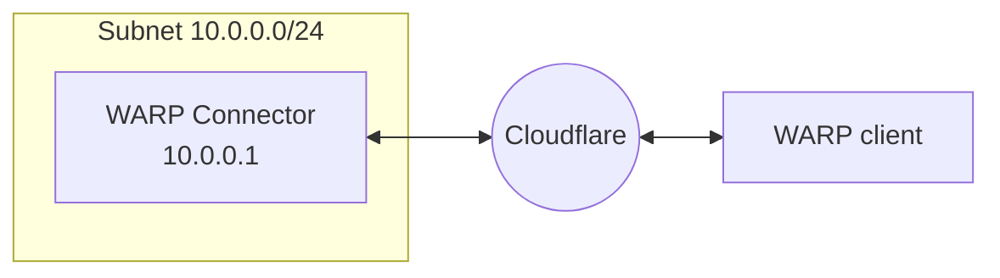

import { Details, GlossaryTooltip, TabItem, Tabs } from "~/components";

```mermaid
    flowchart LR
      subgraph subnet1[Subnet 10.0.0.0/24]
      router1["WARP Connector
        10.0.0.1"]
      end
      router1<-->C((Cloudflare))<-->W[WARP client]
```
