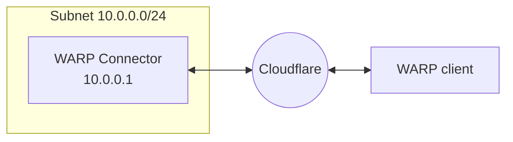

import { Render, Details, GlossaryTooltip, TabItem, Tabs } from "~/components";

#### Route from subnet to WARP clients

`100.96.0.0/12` is the default CIDR for all user devices running the [WARP client](/cloudflare-one/connections/connect-devices/warp/). To connect from the subnet to user devices:
- On your router, add a rule that routes the destination IP `100.96.0.0/12` to the WARP Connector host machine (`10.0.0.100` in the diagram above).
- Ensure that CGNAT IP traffic routes through WARP on both the WARP Connector host and WARP client devices. In other words, delete `100.96.0.0/12` from the [Split Tunnel Exclude list](/cloudflare-one/connections/connect-devices/warp/configure-warp/route-traffic/split-tunnels/) in both device profiles.