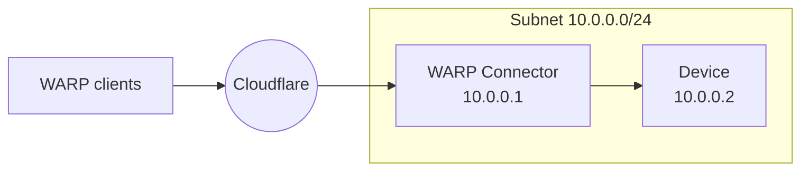
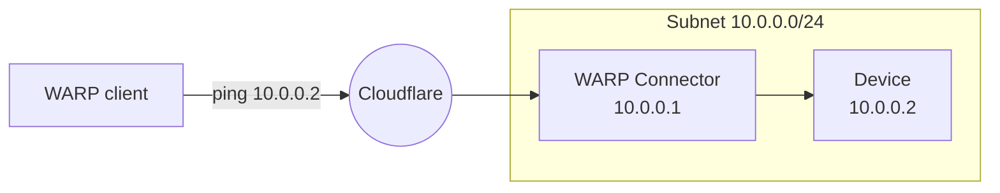

import { Render, Details, GlossaryTooltip, TabItem, Tabs } from "~/components";

This guide covers how to connect WARP client user devices to a private network behind WARP Connector. In this example, we will create a WARP Connector for subnet `10.0.0.0/24` and install it on `10.0.0.1`.



## Prerequisites

- A Linux host [^1] on the subnet.
- Verify that your firewall allows inbound/outbound traffic over the [WARP IP addresses, ports, and domains](/cloudflare-one/connections/connect-devices/warp/deployment/firewall/).

## 1. Install a WARP Connector

<Render file="tunnel/warp-connector-install" />

## 2. (Recommended) Create a device profile

<Render file="tunnel/warp-connector-device-profile" />

## 3. Route CGNAT IPs through Cloudflare

WARP clients and WARP Connectors are accessed using their  <GlossaryTooltip term="CGNAT IP">CGNAT IP</GlossaryTooltip>. Therefore, CGNAT IP traffic must route through Cloudflare on both the WARP Connector host and WARP client devices.

1. In your WARP Connector device profile, go to [Split Tunnels](/cloudflare-one/connections/connect-devices/warp/configure-warp/route-traffic/split-tunnels/).
2. Ensure that `100.96.0.0/12` routes through the WARP tunnel. For example, if you are using **Exclude** mode, delete `100.64.0.0/10` from the list and re-add `100.64.0.0/11` and `100.112.0.0/12`.
3. Repeat the previous steps for all WARP client device profiles.

## 4. Route traffic from subnet to WARP Connector

Depending on where you installed the WARP Connector, you may need to configure other devices on the subnet to route requests through WARP Connector.

### Option 1: Default gateway

<Render file="tunnel/warp-connector-default-gateway" />

### Option 2: Alternate gateway

<Render file="tunnel/warp-connector-alternate-gateway" />

#### Add route to router

`100.96.0.0/12` is the default CIDR for all user devices running the [WARP client](/cloudflare-one/connections/connect-devices/warp/). On your router, add a rule that routes the destination IP `100.96.0.0/12` to the WARP Connector host machine (`10.0.0.100`).

<Render file="tunnel/warp-connector-alternate-gateway-flow" />

### Option 3: Intermediate gateway

<Render file="tunnel/warp-connector-intermediate-gateway" />

#### Add route to devices

To route all <GlossaryTooltip term="CGNAT IP">CGNAT IP</GlossaryTooltip> traffic through WARP Connector:

<Tabs> <TabItem label="Linux">

```sh
sudo ip route add 100.96.0.0/12 via <WARP-CONNECTOR-IP> dev eth0
```

</TabItem> <TabItem label="macOS">

```sh
sudo route -n add -net 100.96.0.0/12 <WARP-CONNECTOR-IP>
```

</TabItem>

<TabItem label="Windows">

```bash
route /p add 100.96.0.0/12 mask 255.255.255.255 <WARP-CONNECTOR-IP>
```

</TabItem> </Tabs>

#### Verify routes

<Render file="tunnel/warp-connector-verify-routes" />

## 5. Test the WARP Connector

You can now send a request from a WARP client user device to a device behind WARP connector. For example, on the WARP client device run `ping 10.0.0.2`.



[^1]: <Render file="tunnel/warp-connector-linux-packages" />