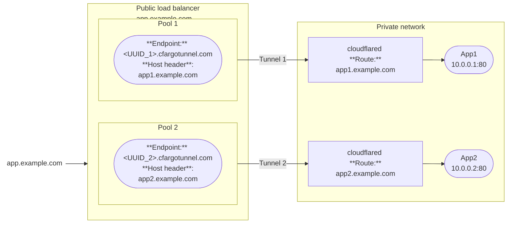
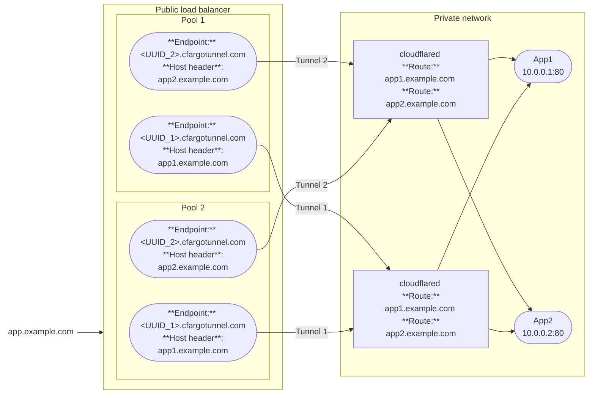
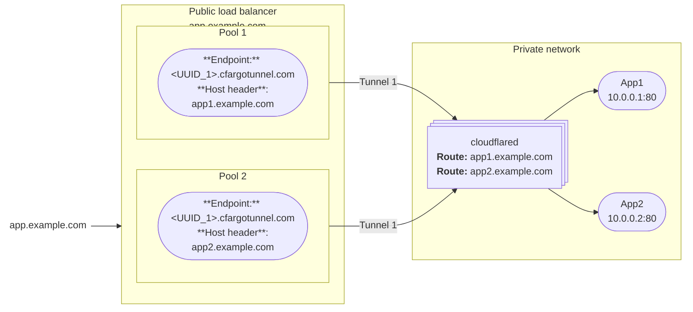

import { Render, TabItem, Tabs } from "~/components";

A [public load balancer](/load-balancing/load-balancers/) allows you to distribute traffic across the servers that are running your [published applications](/cloudflare-one/connections/connect-networks/routing-to-tunnel/). When you add a [published application route]() to your Cloudflare Tunnel, Cloudflare generates a subdomain of `cfargotunnel.com` with the UUID of the created tunnel. `<UUID>.cfargotunnel.com` as if it were a public load balancer endpoint.

Unlike publicly routable IP addresses, the subdomain will only proxy traffic for a load balancer pool in the same Cloudflare account. If someone discovers your subdomain UUID, they will not be able to create a DNS record in another account or system to proxy traffic to the address.

The DNS record (`UUID.cfargotunnel.com`) for each Cloudflare Tunnel is the load balancer endpoint address. Host header is required for tunnel endpoints.

### Option 1: One tunnel per app


Only valid for active-standby setups, since each pool has only one endpoint.

### Option 2: Two tunnels, each tunnel connects to both apps



good for an [Active-active](/load-balancing/load-balancers/common-configurations/#active---active-failover) setup which distributes traffic to endpoints in the same pool
Active-active uses all available instances to process requests simultaneously, providing better performance and scalability by load-balancing traffic across them

### Option 3: One tunnel for both apps



Only valid for active-standby LB setups, since each pool has only one endpoint.

Easier to manage if all apps are in the same physical location. Recommend Option 1 if apps are in different geographic locations.

Note: A single origin pool in LB can't have the same Tunnel GUID referenced twice

Deploy replicas for server redundancy. replicas operate in pooled mode.


## Add a tunnel to a load balancer pool

<Tabs> <TabItem label="Dashboard">

To create a load balancer, refer to the [Load Balancing documentation](/load-balancing/load-balancers/create-load-balancer/). The endpoint address is the subdomain of your tunnel, `<UUID>.cfargotunnel.com`.

If you want to add a [monitor](/load-balancing/monitors/) to your load balancer pool, you will need to add a host header to **Advanced health check settings**. The header will be similar to `Header Name: Host` and `Value: www.your-zone.com`. The monitor will not work without the host header if you are using a config file that defines the `ingress` field, as shown in [this example](https://github.com/cloudflare/argo-tunnel-examples/blob/adb44da43ec0aa65f7928613b762a47ae0d9b2b0/named-tunnel-k8s/cloudflared.yaml#L90).

</TabItem>

<TabItem label="cli">

You can add Cloudflare Tunnel to an existing load balancer pool directly from `cloudflared`:

```sh
cloudflared tunnel route lb <tunnel name/uuid> <hostname> <load balancer pool>
```

- `<hostname>`: the DNS hostname of the load balancer, for example `lb.example.com`.

- `<load balancer pool>`: the name of the [pool](/load-balancing/pools/create-pool/#create-a-pool) that will contain the tunnel subdomain.

This command creates an LB DNS record that points the specified hostname to the subdomain of your tunnel (`<UUID>.cfargotunnel.com`). Traffic will not be proxied unless the tunnel is running.

:::note

To create DNS records using `cloudflared`, the [`cert.pem`](/cloudflare-one/connections/connect-networks/do-more-with-tunnels/local-management/local-tunnel-terms/#certpem) file must be installed on your system.
:::

</TabItem>

</Tabs>

## Optional Cloudflare settings

The application will default to the Cloudflare settings for the load balancer hostname, including [cache rules](/cache/how-to/cache-rules/) and [firewall policies](/firewall/). You can change the settings for your hostname in the [Cloudflare dashboard](https://dash.cloudflare.com/).

## Known limitations

### Monitors and TCP Tunnel origins

If you have a tunnel to a port or SSH port, do not run a TCP health check.

Instead, set up a health check endpoint in `cloudflared` — for example, an [ingress entry rule](/cloudflare-one/connections/connect-networks/do-more-with-tunnels/local-management/configuration-file/#file-structure-for-public-hostnames) that returns a fixed HTTP status response — and create an **HTTP** [monitor](/load-balancing/monitors/) for that endpoint. The monitor will only verify that your server is reachable. It does not check whether the server is running and accepting requests.

### Session affinity and replicas

The load balancer does not distinguish between [replicas](/cloudflare-one/connections/connect-networks/configure-tunnels/tunnel-availability/) of the same tunnel. If you run the same tunnel UUID on two separate hosts, the load balancer treats both hosts as a single endpoint. To maintain [session affinity](/load-balancing/understand-basics/session-affinity/) between a client and a particular host, you will need to connect each host to Cloudflare using a different tunnel UUID.

### Local connection preference

If you notice traffic imbalances across endpoints in different locations, you may have to adjust your load balancer setup.

`cloudflared` connections give preference to tunnels that terminate in the same Cloudflare data center. This behavior can impact how connections are weighted and traffic is distributed.

The solution depends on the type of tunnel being used. If running [legacy tunnels](/cloudflare-one/connections/connect-networks/do-more-with-tunnels/migrate-legacy-tunnels/), put your origins in different pools. If running [Cloudflare tunnel replicas](/cloudflare-one/connections/connect-networks/configure-tunnels/tunnel-availability/) (using a shared ID), switch to separate Cloudflare tunnels as distinct origins.
