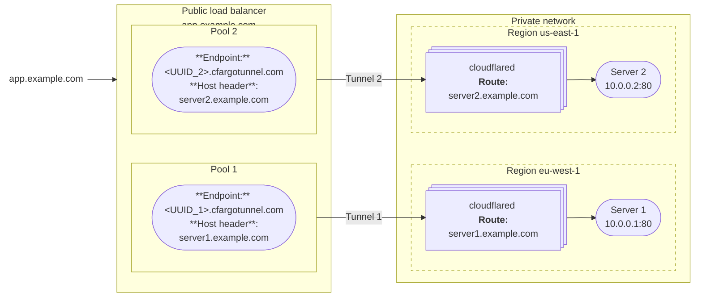
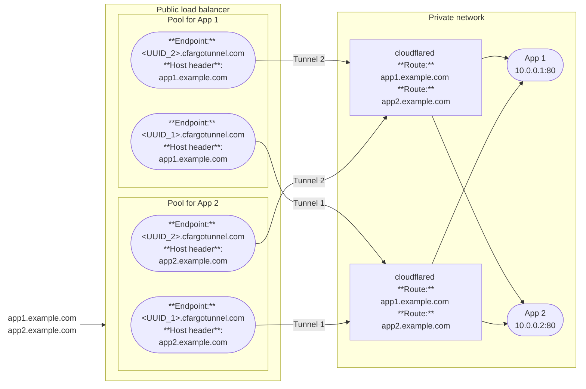

import { Render, DashButton } from "~/components";

A [public load balancer](/load-balancing/load-balancers/) allows you to distribute traffic across the servers that are running your [published applications](/cloudflare-one/connections/connect-networks/routing-to-tunnel/).

When you add a [published application route](/cloudflare-one/connections/connect-networks/get-started/create-remote-tunnel/#2a-publish-an-application) to your Cloudflare Tunnel, Cloudflare generates a subdomain of `cfargotunnel.com` with the UUID of the created tunnel. You can add the application to a load balancer pool by using `<UUID>.cfargotunnel.com` as the [endpoint address](/load-balancing/understand-basics/load-balancing-components/#endpoints) and specifying the application hostname (`app.example.com`) in the [host header](/load-balancing/additional-options/override-http-host-headers/). Load Balancer does not support directly adding `app.example.com` as an endpoint if the service is behind Cloudflare Tunnel.

## Create a public load balancer

### Prerequisites

- A Cloudflare Tunnel with a [published application route](/cloudflare-one/connections/connect-networks/get-started/create-remote-tunnel/#2a-publish-an-application)
- A `CNAME` DNS record that points the application hostname (`app.example.com`) to `<UUID>.cfargotunnel.com`. This DNS record is automatically created for routes configured through the dashboard. Routes configured via the API or CLI require [manually creating the record](/cloudflare-one/connections/connect-networks/routing-to-tunnel/dns/).

### Create a load balancer

To create a load balancer for Cloudflare Tunnel published applications:

1. In the Cloudflare dashboard, go to the **Load Balancing** page.

	 <DashButton url="/?to=/:account/load-balancing" />
2. Select **Create load balancer**.
3. Select **Public load balancer**.
4. Choose the website to which you want to add this load balancer. To simplify DNS record management, we recommend using the same domain as your published application route.
5. On the **Hostname** page, enter a hostname for the load balancer (for example, `lb.example.com`).
6. On the **Pools** page, select **Create a pool**.
7. Enter a descriptive name for the pool. For example, if you are configuring one pool per tunnel, the pool name can match your tunnel name.
8. To add a tunnel endpoint to the pool, configure the following fields:
			- **Endpoint Name**: Name of the server that is running the application
			- **Endpoint Address**: `<UUID>.cfargotunnel.com`, where `<UUID>` is replaced by your Tunnel ID. You can find the **Tunnel ID** in [Zero Trust](https://one.dash.cloudflare.com) under **Networks** > **Tunnels**.
			- **Header value**: Hostname of your published application route (such as `app.example.com`). To find the hostname value, open your tunnel configuration and go to the **Published application routes** tab.
			- **Weight**: Assign a [weight](/load-balancing/understand-basics/traffic-steering/origin-level-steering/#weights) to the endpoint. If you only have one endpoint, enter `1`.
9. (Recommended) On the **Monitors** page, attach a monitor to the tunnel endpoint. You can create the following monitor to check if the application is reachable:
	- **Type**: _HTTPS_
	- **Path**: `/`
	- **Port**: `443`
	- **Expected Code(s)**: `200`
	- **Header Name**: `Host`
	- **Value**: `app.example.com`

10. Save and deploy the load balancer.

To test the load balancer, access the application using the load balancer hostname (`lb.example.com`).

### Optional Cloudflare settings

The application will default to the Cloudflare settings for the load balancer hostname, including [cache rules](/cache/how-to/cache-rules/) and [firewall policies](/firewall/). You can change the settings for your hostname in the [Cloudflare dashboard](https://dash.cloudflare.com/).

## Common architectures

### One tunnel per region

Only valid for active-standby setups, since each pool has only one endpoint.

Note: A single origin pool in LB can't have the same Tunnel GUID referenced twice

Deploy replicas for server redundancy. replicas operate in pooled mode.

### Multiple apps per tunnel

good for an [Active-active](/load-balancing/load-balancers/common-configurations/#active---active-failover) setup which distributes traffic to endpoints in the same pool
Active-active uses all available instances to process requests simultaneously, providing better performance and scalability by load-balancing traffic across them

Routes configured via the dashboard will automatically generate a `CNAME` record in the DNS zone that points to `<UUID>.cfargotunnel.com`. For example, if you add a tunnel route that points `app.example.com` to `localhost:80`, Cloudflare creates a `CNAME` record that points `app.example.com` to `<UUID.cfargotunnel.com`.
Auto-generated DNS records:

| Type | Name | Content |
| ---- | ---- | ------- |
| LB   | `lb.example.com` | n/a|
| CNAME | app1 | `<UUID_1>.cfargotunnel.com` |
| CNAME | app2 | `<UUID_1>.cfargotunnel.com` |
| CNAME | app1 | `<UUID_2>.cfargotunnel.com` |
| CNAME | app2 | `<UUID_2>.cfargotunnel.com`  |

Updated DNS records:

| Type | Name | Content |
| ---- | ---- | ------- |
| LB   | `lb.example.com` | n/a |
| CNAME | app1 | `lb.example.com` |
| CNAME | app2 | `lb.example.com` |

## Known limitations

### Monitors and TCP tunnel origins

If you have a tunnel to a port or SSH port, do not set up a [TCP monitor](/load-balancing/monitors/). Instead, set up a health check endpoint on the `cloudflared` host and create an HTTPS monitor. For example, you can use `cloudflared` to return a fixed HTTP status response:

1. In your Cloudflare Tunnel, [add a published application route](/cloudflare-one/connections/connect-networks/get-started/create-remote-tunnel/#2a-publish-an-application) to represent the health check endpoint:
	- **Hostame**: Enter a hostname for the health check endpoint (for example, `health-check.example.com`)
	- **Service Type**: _HTTP_STATUS_
	- **HTTP Status Code**: `200`
2. From the **Load Balancing** page, [create a monitor](/load-balancing/monitors/create-monitor/) with the following properties:
	- **Type**: _HTTPS_
	- **Path**: `/`
	- **Port**: `443`
	- **Expected Code(s)**: `200`
	- **Header Name**: `Host`
	- **Value**: `health-check.example.com`

You can now assign this monitor to your load balancer endpoint. The monitor will only verify that your server is reachable. It does not check whether the server is running and accepting requests.

### Session affinity and replicas

The load balancer does not distinguish between [replicas](/cloudflare-one/connections/connect-networks/configure-tunnels/tunnel-availability/) of the same tunnel. If you run the same tunnel UUID on two separate hosts, the load balancer treats both hosts as a single endpoint. To maintain [session affinity](/load-balancing/understand-basics/session-affinity/) between a client and a particular host, you will need to connect each host to Cloudflare using a different tunnel UUID.

### Local connection preference

If you notice traffic imbalances across endpoints in different locations, you may have to adjust your load balancer setup.

`cloudflared` connections give preference to tunnels that terminate in the same Cloudflare data center. This behavior can impact how connections are weighted and traffic is distributed.

The solution depends on the type of tunnel being used. If running [legacy tunnels](/cloudflare-one/connections/connect-networks/do-more-with-tunnels/migrate-legacy-tunnels/), put your origins in different pools. If running [`cloudflared` replicas](/cloudflare-one/connections/connect-networks/configure-tunnels/tunnel-availability/) (using a shared UUID), switch to separate Cloudflare tunnels as distinct origins.
