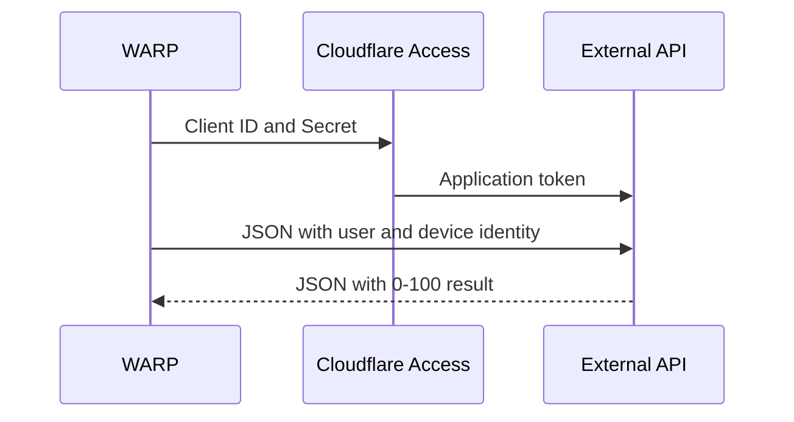

import { Render } from "~/components"

Cloudflare Zero Trust allows you to enforce custom device posture checks on your applications. This involves configuring a WARP service-to-service integration that periodially calls the external API of your choice, whether it is a third-party endpoint provider or a home built solution. When called, the API will receive device identifying information from Cloudflare and be expected to return a value between `0` to `100`. You can then set up a device posture check that determines if the returned value counts as a pass or fail; for example, you could allow access to a user only if their device has a posture value greater than `60`.



## External API requirements

The custom service provider integration works with any API service that meets the following specifications. For an example of a custom device posture integration API, refer to our [Cloudflare Workers sample code](https://github.com/cloudflare/custom-device-posture-integration-example-worker).

### Authentication

The WARP client authenticates to the external API through Cloudflare Access. The external API should [validate the application token](/cloudflare-one/identity/authorization-cookie/validating-json/) issued by Cloudflare Access to ensure that any requests which bypass Access (for example, due to a network misconfiguration) are rejected.

### Data passed to external API

Cloudflare will pass the following parameters to the configured API endpoint. You can use this data to identify the device and assign a posture score. For some devices, not all identifying information will apply, in which case the field will be blank. A maximum of 1,000 devices will be sent per a request.

| Field | Description |
| ----- | ----------- |
| `device_id` | Device UUID assigned by the WARP client |
| `email` | Email address used to authenticate the WARP client |
| `serial_number` | Device serial number |
| `mac_address` | Device MAC address |
| `virtual_ipv4` | Device virtual IPv4 address |
| `hostname` | Device name |

Example request body:
```json
{
  "devices": {
    [
      {
        "device_id": "9ece5fab-7398-488a-a575-e25a9a3dec07",
        "email": "jdoe@mycompany.com",
        "serial_number": "jdR44P3d",
        "mac_address": "74:1d:3e:23:e0:fe",
        "virtual_ipv4": "100.96.0.10",
        "hostname": "string",
      },
      {...},
      {...}
    ]
  }
}
```

### Expected response from external API

For each Cloudflare `device_id`, the API service is expected to return a posture score and optionally a third-party device ID.

| Field | Description |
| ----- | ----------- |
| `s2s_id` | Third party device ID (empty string if unavailable) |
| `score` | Integer value between `0` - `100` |

Example response body:
```json
{
  "result": {
    "9ece5fab-7398-488a-a575-e25a9a3dec07": {
      "s2s_id": "",
      "score": 10
    },
    "device_id2": {...},
    "device_id3": {...}
  }
}
```

## Set up custom device posture checks

### 1. Create a service token

WARP uses an Access Client ID and Access Client Secret to securely authenticate to the external API. If you do not already have an Access Client ID and Access Client Secret, [create a new service token](/cloudflare-one/identity/service-tokens/#create-a-service-token).

### 2. Create an Access application

Next, secure the external API behind Cloudflare Access so that WARP can authenticate with the service token. To add the API endpoint to Access:

1. [Create a self-hosted application](/cloudflare-one/applications/configure-apps/self-hosted-apps/) for your API endpoint.
2. Add the following Access policy to the application. Make sure that **Action** is set to _Service Auth_ (not _Allow_).

	| Action | Rule type | Selector          | Value                                 |
	| ------ | --------- | ----------------- | ------------------------------------- |
	| Service Auth | Include  | Service Token | `<TOKEN-NAME>`                       |

### 3. Add a service provider integration

To create a custom service-to-service integration:

<Render file="posture/add-service-provider" params={{ provider: "Custom service provider" }} />
5. In **Access client ID** and **Access client secret**, enter the Access service token used to authenticate to your external API.
6. In **Rest API URL**, enter the external API endpoint that Cloudflare will query for posture information (for example, `https://api.example.com`). For more information, refer to [External API requirements](#external-api-requirements).
7. In **Polling frequency**, choose how often Cloudflare Zero Trust should query the external API for information.
8. Select **Test and save**. The test checks if Cloudflare can authenticate to the API URL using the provided Access credentials.

Next, [configure a device posture check](#configure-the-posture-check) to determine if a given posture score constitutes a pass or fail.

### 4. Configure the posture check

<Render file="posture/configure-posture-check" params={{ one: "Custom service provider" }} />

## Device posture attributes

| Selector      | Description                                                                                       | Value                                                                                         |
| ------------- | ------------------------------------------------------------------------------------------------- | --------------------------------------------------------------------------------------------- |
| Score            | Posture score returned by external API                                                                                   | `0` to `100`                                                                                  |