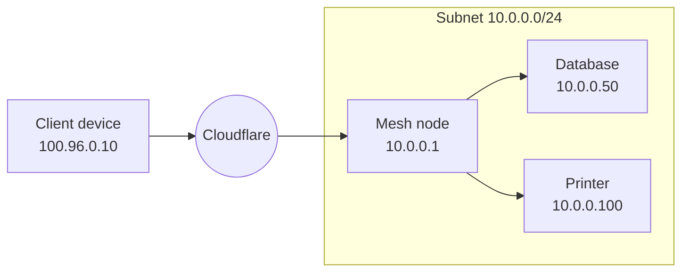
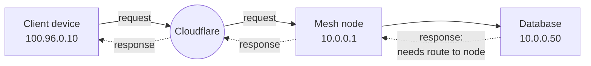
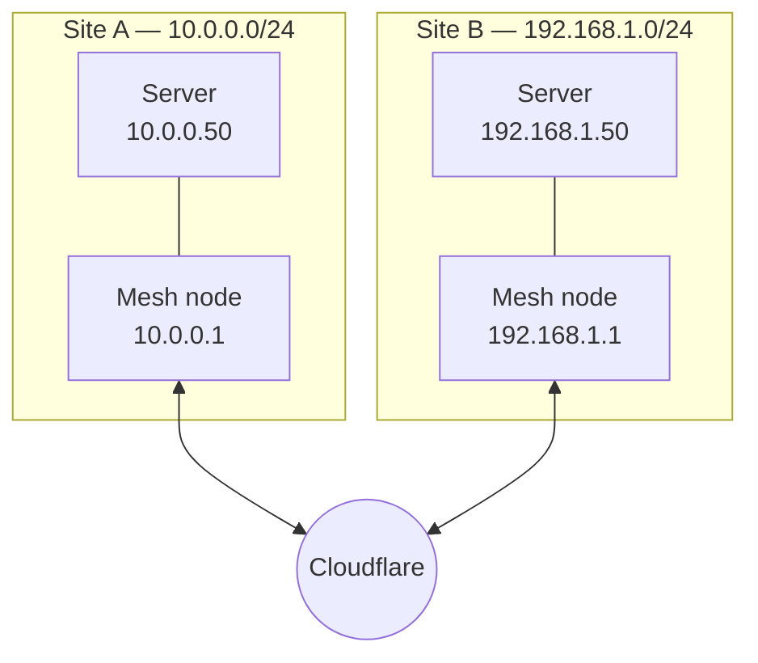

import { DashButton, Tabs, TabItem, APIRequest, GlossaryTooltip, Render, MeshHostnameRoutingDiagram } from "~/components";

By default, a Mesh node is reachable only by its own [Mesh IP](/cloudflare-one/networks/connectors/cloudflare-mesh/#mesh-ips). To make other devices on the subnet behind the node reachable — servers, databases, printers, IoT devices that cannot run the [Cloudflare One Client](/cloudflare-one/team-and-resources/devices/cloudflare-one-client/) — add a route to the node. A Mesh node supports two types of routes:

- **CIDR routes** — forward traffic for an IP range — private (for example, `10.0.0.0/24`) or public — through the node.
- **Hostname routes** — attract traffic for a hostname to the node instead of an IP. This works for a **private** hostname (for example, `wiki.internal.local`), which is useful when the application has an unknown or ephemeral IP, as well as a **public** hostname (for example, `www.example.com`), which routes that hostname's traffic through the node and egresses via the node's public IP.

When you add a route, the Mesh node acts as a gateway: traffic destined for the advertised CIDR or hostname is forwarded to the node, which delivers it to the appropriate host on the local network (or egresses it to the public Internet).

Both IPv4 and IPv6 CIDR routes are supported.

## When to use routes

- **Without routes** — Devices on your Mesh can only reach the node itself by its Mesh IP. Services running directly on the node are reachable this way.
- **With routes** — Devices on your Mesh can reach any host on the subnet behind the node. Use this when you have infrastructure that cannot run the [Cloudflare One Client](/cloudflare-one/team-and-resources/devices/cloudflare-one-client/).


## Manage CIDR routes

Use CIDR routes to forward traffic from your mesh node to devices on your local network.

### Add a route

<Tabs syncKey="dashPlusAPI"> <TabItem label="Dashboard">

1. In the Cloudflare dashboard, go to **Networking** > **Mesh**.

   <DashButton url="/?to=/:account/mesh" />

2. Select your Mesh node.
3. Go to the **Routes** tab.
4. Select **Add route**.
5. Enter the private CIDR you want to route through this node (for example, `10.0.0.0/24`).
6. (Optionally) add a description for the route.
7. Select **Add route**.

</TabItem> <TabItem label="API">

<APIRequest
  path="/accounts/{account_id}/teamnet/routes"
  method="POST"
  json={{
    network: "10.0.0.0/24",
    tunnel_id: "{mesh_node_id}",
    comment: "Staging subnet",
  }}
/>

</TabItem> </Tabs>

### Edit a route

<Tabs syncKey="dashPlusAPI"> <TabItem label="Dashboard">

1. Go to **Networking** > **Mesh** > select your node > **Routes** tab.
2. Select the edit icon next to the route you want to modify.
3. Update the CIDR or description.
4. Select **Save**.

</TabItem> <TabItem label="API">

<APIRequest
  path="/accounts/{account_id}/teamnet/routes/{route_id}"
  method="PATCH"
  json={{
    network: "10.0.0.0/24",
    comment: "Updated description",
  }}
/>

</TabItem> </Tabs>

### Delete a route

<Tabs syncKey="dashPlusAPI"> <TabItem label="Dashboard">

1. Go to **Networking** > **Mesh** > select your node > **Routes** tab.
2. Select the delete icon next to the route.
3. Confirm deletion.

</TabItem> <TabItem label="API">

<APIRequest
  path="/accounts/{account_id}/teamnet/routes/{route_id}"
  method="DELETE"
/>

</TabItem> </Tabs>

## Configure Split Tunnels

For traffic to reach your advertised CIDR, the range must route through Cloudflare on both the Mesh node and client devices.

### On the Mesh node

In your Mesh node's device profile, ensure the advertised CIDR routes through Cloudflare:

- **Include mode** (recommended for Mesh nodes): Add the CIDR to your include list.
- **Exclude mode**: Remove the CIDR (or its parent range) from your exclude list.

For example, if you are advertising `10.0.0.0/24` and your Split Tunnels exclude list contains `10.0.0.0/8`, you need to remove `10.0.0.0/8` and re-add the portions of the `10.0.0.0/8` range that you do not want to route through Cloudflare.

### On client devices

Repeat the same Split Tunnel configuration on the device profiles used by your client devices, ensuring the advertised CIDR routes through Cloudflare.

## Return traffic routing

The Mesh node forwards inbound traffic from Cloudflare to devices on the subnet. However, for **return traffic** (responses from subnet devices back to Mesh clients), the subnet devices need a route back to the Mesh node.



How you configure this depends on where the Mesh node is installed:

### Option 1: Mesh node is the default gateway

If the Mesh node is the subnet's default gateway (or is installed on the router), no additional configuration is needed. All traffic from subnet devices naturally routes through the node.

### Option 2: Mesh node is not the default gateway

If the Mesh node is a regular host on the subnet, configure the subnet's router to send Mesh traffic through the node. Add a static route:

- **Destination**: `100.96.0.0/12` (Mesh IP range)
- **Next hop**: The Mesh node's local subnet IP (for example, `10.0.0.1`)

This ensures that responses to Mesh clients are forwarded to the Mesh node for delivery through Cloudflare.

## Site-to-site routing

When you have Mesh nodes at multiple sites, devices on one subnet can reach devices on another subnet through Cloudflare.



For this to work:

1. Each Mesh node must advertise the local subnet as a [CIDR route](#add-a-route) so Cloudflare knows which node to forward traffic to.
2. The remote subnet CIDRs must route through Cloudflare on each node. In your Mesh node's [Split Tunnel](/cloudflare-one/team-and-resources/devices/cloudflare-one-client/configure/route-traffic/split-tunnels/) configuration, add the remote site's CIDR to the include list (or remove it from the exclude list).
3. Each site's router needs static routes pointing remote subnets to the local Mesh node:

**Site A router:**

- **Destination**: `192.168.1.0/24` → **Next hop**: `10.0.0.1` (local Mesh node)
- **Destination**: `100.96.0.0/12` → **Next hop**: `10.0.0.1`

**Site B router:**

- **Destination**: `10.0.0.0/24` → **Next hop**: `192.168.1.1` (local Mesh node)
- **Destination**: `100.96.0.0/12` → **Next hop**: `192.168.1.1`

For production site-to-site deployments, consider enabling [high availability](/cloudflare-one/networks/connectors/cloudflare-mesh/high-availability/) on each node. HA provides failover for the CIDR routes advertised by a node — if the active replica goes down, Cloudflare promotes a standby so traffic to the subnet continues to flow.

## DNS filtering

To filter DNS queries from the subnet using [Cloudflare Gateway](/cloudflare-one/traffic-policies/dns-policies/):

1. **Configure DNS on your router**: Point your router's DNS to the Gateway resolver IPs:
   - `172.64.36.1`
   - `172.64.36.2`

2. **Add IP routes to your router**: On your router, add static routes pointing the Gateway resolver IPs to your Mesh node's local IP. This allows DNS traffic to reach Cloudflare through the node.
   - **Destination**: `172.64.36.1` → **Next hop**: `10.0.0.1` (local Mesh node)
   - **Destination**: `172.64.36.2` → **Next hop**: `10.0.0.1`

3. **Configure Split Tunnels**: Ensure the following IPs route through the Mesh node in your [Split Tunnels](/cloudflare-one/team-and-resources/devices/cloudflare-one-client/configure/route-traffic/split-tunnels/) configuration:
   - The subnet's internal DNS resolver IP
   - Gateway initial resolved IP range: `172.64.128.0/20` (IPv4) and `2606:4700:0cf1:4000::/64` (IPv6)

Gateway logs DNS queries with the private source IP of the originating device. You can use this to create [resolver policies](/cloudflare-one/traffic-policies/resolver-policies/) for internal DNS records.

## Hostname routes

Instead of advertising an IP range, you can attract traffic for a specific hostname to a Mesh node. When a user requests the hostname, Cloudflare Gateway assigns an <GlossaryTooltip term="initial resolved IP">initial resolved IP</GlossaryTooltip> and routes the traffic through the node.

- **Private hostname** (for example, `wiki.internal.local`) — the node delivers the traffic to the application's private IP on the local network. Useful when the application has an unknown or ephemeral IP.
- **Public hostname** (for example, `www.example.com`) — the node egresses the traffic to the public Internet using its own public IP. This lets you use a Mesh node as a dedicated egress for that hostname.

Hostname routes replace [virtual networks](/cloudflare-one/networks/connectors/cloudflare-tunnel/private-net/cloudflared/tunnel-virtual-networks/) as the way to reach resources: because a hostname is globally unique, **overlapping hostnames are not supported** and a hostname can only be routed to one node or tunnel at a time.

<MeshHostnameRoutingDiagram />

For a deeper look at the packet flow behind hostname routing, refer to the [announcement blog post](https://blog.cloudflare.com/tunnel-hostname-routing/).

### Prerequisites

- **Run a supported Mesh node version.** Hostname routing requires the Mesh node to run Linux Cloudflare One Client version `2026.6.822.0` or newer.
- **Enable the Gateway proxy** with TCP, UDP, and ICMP:

  <Render file="tunnel/enable-gateway-proxy" product="cloudflare-one" />

- **Route all of the following ranges through Cloudflare** in the [Split Tunnel](/cloudflare-one/team-and-resources/devices/cloudflare-one-client/configure/route-traffic/split-tunnels/) configuration of **both** the Mesh node's device profile **and** your client device profiles. In Include mode, add each range; in Exclude mode, ensure none of them (or their parent ranges) are excluded.

  | Purpose                     | IPv4            | IPv6                       |
  | --------------------------- | --------------- | -------------------------- |
  | Mesh device IP range        | `100.96.0.0/12` | `2606:4700:cf1:1000::/64`  |
  | Cloudflare source IP range  | `100.64.0.0/12` | `2606:4700:cf1:5000::/64`  |
  | Hostname routing (token IPs) | `172.64.128.0/20` | `2606:4700:0cf1:4000::/64` |

- **Remove the hostname's top-level domain from [Local Domain Fallback](/cloudflare-one/team-and-resources/devices/cloudflare-one-client/configure/route-traffic/local-domains/)** on client devices, so the DNS query is sent to Cloudflare Gateway for resolution.

### Add a hostname route

<Tabs syncKey="dashPlusAPI"> <TabItem label="Dashboard">

1. In the Cloudflare dashboard, go to **Networking** > **Mesh**.

   <DashButton url="/?to=/:account/mesh" />

2. Select your Mesh node.
3. Go to the **Routes** tab.
4. Select **Add route**, then select **Private hostname**.
5. Enter the fully qualified domain name (FQDN) you want to route through this node (for example, `wiki.internal.local`).

   <Render file="tunnel/hostname-format-restrictions" product="cloudflare-one" />

6. (Optionally) add a description for the route.
7. Select **Add hostname**.

</TabItem> <TabItem label="API">

<APIRequest
  path="/accounts/{account_id}/zerotrust/routes/hostname"
  method="POST"
  json={{
    hostname: "wiki.internal.local",
    tunnel_id: "{mesh_node_id}",
    comment: "Internal wiki",
  }}
/>

</TabItem> </Tabs>

### Configure DNS resolution

For a **private** hostname, Gateway must be able to resolve the hostname to its private IP. How you configure this depends on whether DNS resolution and application traffic use the **same** connector or **different** connectors.

#### The node resolves the hostname (default)

By default, the Mesh node resolves the hostname using the DNS resolver configured on its host machine (for example, in `/etc/resolv.conf` on Linux) — the same way `cloudflared` does. If the node can already resolve the hostname to its private IP through that resolver, no further configuration is required.

If the node cannot resolve the hostname on its own, the simplest option is to add an entry to the node's hosts file (for example, `/etc/hosts` on Linux) mapping the hostname to its private IP. Unlike a Cloudflare Tunnel, a Mesh node does **not** require you to run a dedicated DNS server:

```txt title="/etc/hosts"
10.0.0.50 wiki.internal.local
```

#### Split DNS: DNS and application traffic use different connectors

You only need a Gateway [resolver policy](/cloudflare-one/traffic-policies/resolver-policies/) when the DNS query must be sent to a **different** connector than the application traffic — for example, the internal DNS server sits behind one Mesh node or Cloudflare Tunnel, while the application is reached through another. In that case:

1. Add a [CIDR route](#add-a-route) for the DNS server's IP so Gateway can reach it through the connector where the DNS server lives (a Mesh node or a [Cloudflare Tunnel](/cloudflare-one/networks/connectors/cloudflare-tunnel/)).
2. Create a [resolver policy](/cloudflare-one/traffic-policies/resolver-policies/) that sends DNS queries for the hostname (or its domain) to that internal DNS server.

:::note[Where to run the DNS server]

If the DNS server is reached through a Mesh node, you cannot run it on the **same machine** as that node — the node's DNS interface binds port `53`. Host the DNS server on a separate machine in the same private network. In that case, configure return routes on the subnet so the DNS server's responses can reach the client:

- **Mesh device IP range**: `100.96.0.0/12` → next hop is the Mesh node's local IP
- **Initial resolved IP range**: `172.64.128.0/20` → next hop is the Mesh node's local IP

:::

For a **public** hostname, the Mesh node handles resolution: Gateway sends the DNS query to the node, the node resolves it through its upstream DNS provider, and then routes the packet to the destination and egresses using its own public IP. No internal DNS server or resolver policy is required.

### Secure hostname traffic

After adding a hostname route, secure it with either an [Access self-hosted application](/cloudflare-one/access-controls/applications/non-http/self-hosted-private-app/) or [Gateway network policies](/cloudflare-one/traffic-policies/network-policies/). For details and examples, refer to [Connect a private hostname](/cloudflare-one/networks/connectors/cloudflare-tunnel/private-net/cloudflared/connect-private-hostname/#3-recommended-filter-network-traffic-with-gateway).

### Limitations

<Render file="gateway/egress-selector-chrome-issue" product="cloudflare-one" />
