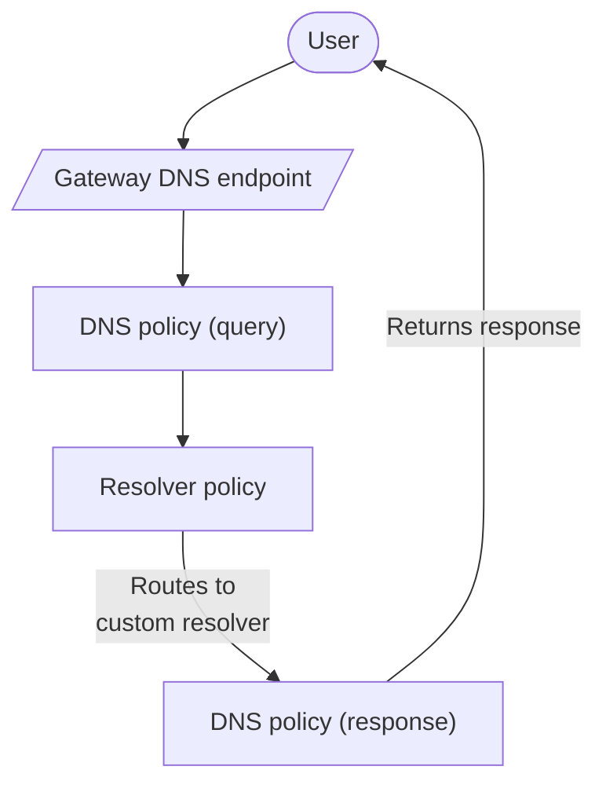

import { Render } from "~/components";

:::note
Only available on Enterprise plans.
:::

By default, Gateway sends DNS requests to [1.1.1.1](/1.1.1.1/), Cloudflare's public DNS resolver, for resolution. Enterprise users can instead create Gateway policies to route DNS queries to custom resolvers.

Gateway will route user traffic to your configured DNS resolver based on the matching policy, even if your resolvers' IP addresses overlap.

## Use cases

You may use resolver policies if you require access to non-publicly routed domains, such as private network services or internal resources. You may also use resolver policies if you need to access a protected DNS service or want to simplify DNS management for multiple locations.

If your resolver is only reachable by a client device and not by Gateway via a Cloudflare tunnel, Magic WAN tunnel, or other public Internet connections, you should configure [Local Domain Fallback](/cloudflare-one/connections/connect-devices/warp/configure-warp/route-traffic/local-domains/) for your device. If both Local Domain Fallback and resolver policies are configured for the same device, Cloudflare will apply your client-side Local Domain Fallback rules first. If you onboard DNS queries to Gateway with the WARP client and route them with resolver policies, the source IP of the queries will be the IP address assigned by the WARP client.

## Resolver connections

Resolver policies support TCP and UDP connections. Custom resolvers can point to the Internet via IPv4 or IPv6, or to a private network service, such as a [Magic tunnel](/magic-transit/how-to/configure-tunnels/). Policies default to port `53`. You can change which port your resolver uses by customizing it in your policy.

You can protect your authoritative nameservers from DDoS attacks by enabling [DNS Firewall](/dns/dns-firewall/).

### Cloudflare Tunnel

You can configure connections to a private resolver connected to Cloudflare with [Cloudflare Tunnel](/cloudflare-one/connections/connect-networks/). To ensure `cloudflared` can route UDP traffic to your resolver, connect your tunnel via [QUIC](/cloudflare-one/connections/connect-networks/configure-tunnels/tunnel-run-parameters/#protocol).

For more information on connecting a private DNS resolver to Cloudflare with Cloudflare Tunnel, refer to [Private DNS](/cloudflare-one/connections/connect-networks/private-net/cloudflared/private-dns/).

### Magic WAN

To enable connections to a private resolver connected to Cloudflare via [Magic WAN](/magic-wan/), contact your account team.

### Available DNS endpoints

Resolver policies can route queries for resolution from the following DNS endpoints:

- IPv4
- IPv6
- [DNS over HTTPS (DoH)](/cloudflare-one/connections/connect-devices/agentless/dns/dns-over-https/)
- [DNS over TLS (DoT)](/cloudflare-one/connections/connect-devices/agentless/dns/dns-over-tls/)
- DNS queries generated by Cloudflare [Browser Isolation](/cloudflare-one/policies/browser-isolation/) and [Clientless Web Isolation](/cloudflare-one/policies/browser-isolation/setup/clientless-browser-isolation/)
- DNS queries generated by [proxy endpoints](/cloudflare-one/connections/connect-devices/agentless/pac-files/)

Gateway will filter, resolve, and log your queries regardless of endpoint.

## Create a resolver policy

<Render file="gateway/create-resolver-policy" />

For more information on creating a DNS policy, refer to [DNS policies](/cloudflare-one/policies/gateway/dns-policies/).

## Selectors

### Content Categories

<Render file="gateway/selectors/content-categories" />

### DNS Resolver IP

<Render file="gateway/selectors/dns-resolver-ip" />

### DoH Subdomain

<Render file="gateway/selectors/doh-subdomain" />

### Domain

<Render file="gateway/selectors/domain" />

### Host

<Render file="gateway/selectors/host" />

### Location

<Render file="gateway/selectors/location" />

### Query Record Type

<Render file="gateway/selectors/query-record-type" />

### Security Categories

<Render file="gateway/selectors/security-categories" />

### Source Continent

Use this selector to filter based on the continent where the query arrived to Gateway from. <Render file="gateway/selectors/source-continent" params={{ one: "dns.src" }} />

### Source Country

Use this selector to filter based on the country where the query arrived to Gateway from. <Render file="gateway/selectors/source-country" params={{ one: "dns.src" }} />

### Source IP

<Render file="gateway/selectors/source-ip-dns" />

### Users

<Render file="gateway/selectors/users" />

## Comparison operators

<Render file="gateway/comparison-operators" />

## Value

<Render file="gateway/value" params={{ one: "hostnames", two: "Host" }} />

## Logical operators

<Render file="gateway/logical-operators" params={{ one: "Identity" }} />
