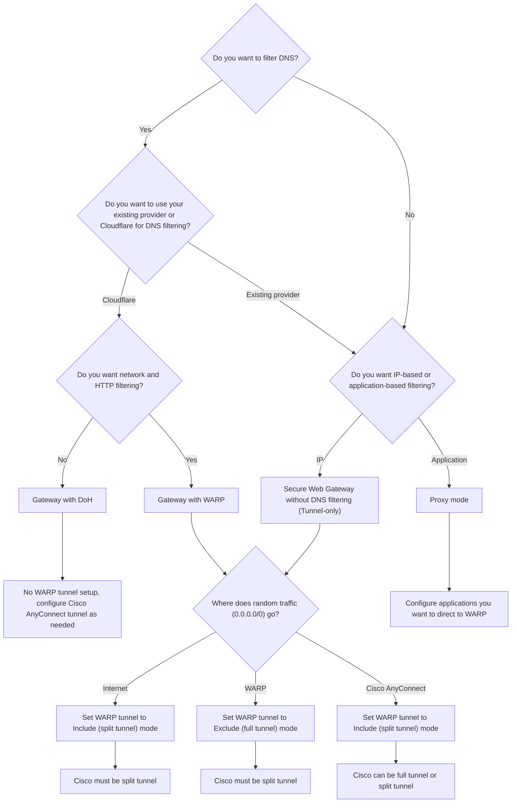
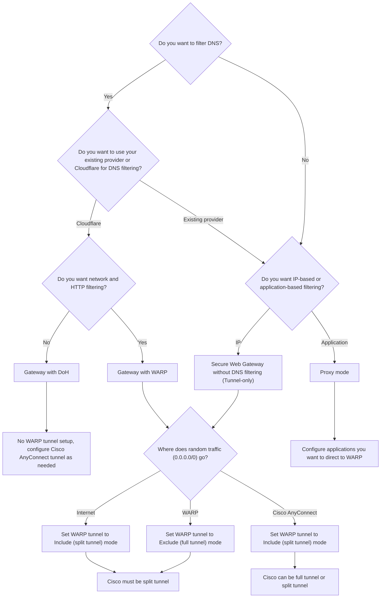

import { Details, Render } from "~/components";

This guide clarifies key concepts for configuring Cloudflare WARP alongside Cisco AnyConnect. It addresses how WARP handles DNS and routing decisions.

## 1. Prerequisites

### Core interoperability principles

Running Cisco AnyConnect and WARP simultaneously requires careful configuration. Adhere to these fundamental rules:

- Single DNS authority: Only one service (Cloudflare or your existing provider) should actively manage DNS resolution and filtering.
- Single default route owner: Never configure both WARP and Cisco AnyConnect to establish a Full Tunnel. This creates a tunnel-in-a-tunnel conflict.
- Mutual exclusion: Any traffic you configure to go through the Cloudflare WARP tunnel (for example, private subnets) must be explicitly excluded from the Cisco AnyConnect configuration, and vice versa.

### WARP tunnel terminology

The following table maps common industry tunneling terms to Cloudflare WARP terminology and explains how each routing model affects traffic flow.

| Concept | Industry term | Cloudflare WARP term | WARP behavior |
|--------|---------------|----------------------|-------------|
| Routing all traffic | Full tunnel | Exclude mode | WARP asserts precedence over the default route. All traffic goes through WARP except specified exclusions. |
| Routing specific traffic | Split tunnel | Include mode | WARP does not create a default route. Only traffic explicitly defined in the Include list enters the tunnel. |

Refer to [Split Tunnels](/cloudflare-one/team-and-resources/devices/warp/configure-warp/route-traffic/split-tunnels/#change-split-tunnels-mode) to review how to select a WARP mode in the Cloudflare One dashboard or through Terraform.

### Default routes

In networking, the default route dictates where traffic flows when no other specific path is defined. Instead of adding a literal `0.0.0.0/0` entry to the routing table, which is a common industry practice, WARP calculates the entire IP address space, subtracts any configured exclusions, and creates high-priority routes for all remaining subnets.

### Supported tunnel configurations

The following table outlines the supported tunnel configurations.

| Cloudflare WARP tunnel mode | Cisco VPN tunnel mode | Compatibility |
|-----------------------------|-----------------------|---------------|
| Include mode (Split tunnel) | Split tunnel          | ✅ Supported |
| Exclude mode (Full tunnel) | Split tunnel          | ✅ Supported |
| Include mode (Split tunnel) | Full tunnel           | ✅ Supported |
| Exclude mode (Full tunnel) | Full tunnel           | ❌ Not supported |

Running WARP in Exclude mode (Full tunnel) and Cisco AnyConnect as a full tunnel at the same time will lead to a tunnel-in-a-tunnel conflict. Explain what tunnel-in-a-tunnel is.

### WARP modes

WARP operates in several modes, each with different traffic handling capabilities:

<Render file="warp/warp-modes" product="cloudflare-one" />

## 2. WARP mode decision matrix

Your decisions on which service actively manages DNS and how you want to route network traffic will determine the correct WARP mode and configuration approach for your environment.

## 3. Configuration instructions by WARP mode

The following sections display Cisco AnyConnect and Cloudflare configuration instructions for each WARP mode.

- [Gateway with DoH](#gateway-with-doh) (DNS Handled by WARP, No IP Tunnel)
- [Gateway with WARP](#gateway-with-warp) (DNS Handled by WARP, IP Tunnel)
- [Secure Web Gateway without DNS Filtering](#secure-web-gateway-without-dns-filtering-tunnel-only) (IP Tunnel Only)
- [Proxy mode](#proxy-mode) (Application-based filtering)

### Implementation considerations

#### Exclude Cloudflare endpoints from AnyConnect configuration

Regardless of what WARP mode you use, you must always exclude the following Cloudflare endpoints from the Cisco AnyConnect tunnel to ensure proper interoperability:

- Client orchestration API
- DoH IPs
- Client authentication endpoint
- Captive portal

Additional exclusions may be required based on your desired WARP mode and are listed in this document for each WARP mode. There are other Cloudflare endpoints you may want to exclude for security or functionality reasons, but they are not critical to the operation of the WARP client. For more information about Cloudflare WARP operability with firewalls, refer to [WARP with firewall](/cloudflare-one/team-and-resources/devices/warp/deployment/firewall/).

#### Configure routing for WARP and Cisco AnyConnect tunnels

:::note

This section only applies if you are using Gateway with WARP or Secure Web Gateway without DNS Filtering (Tunnel Only) modes.

:::

The Gateway with WARP and Secure Web Gateway without DNS Filtering (Tunnel Only) modes both provide IP filtering capabilities.

If you are using Gateway with WARP or Secure Web Gateway without DNS Filtering (Tunnel Only) mode for your WARP deployment, you must appropriately configure both the WARP client and the Cisco AnyConnect client to avoid conflicts.

| Where 0.0.0.0/0 goes | Required WARP tunnel mode | Required Cisco AnyConnect mode | Outcome |
|---------------------|---------------------------|---------------------------------|---------|
| Internet (neither WARP nor Cisco) | Include mode | Split tunnel | Both clients are limited to specific routes; general internet traffic bypasses both tunnels. |
| WARP | Exclude mode | Split tunnel | WARP asserts the default route and captures all traffic not explicitly excluded. Any Cisco-routed traffic must be excluded from WARP. |
| Cisco AnyConnect | Include mode | Full tunnel or split tunnel | Cisco asserts the default route. WARP is used only for explicitly included traffic, which must be excluded from Cisco. |

:::caution[Prevent tunnel in a tunnel errors]

Do not configure both WARP and Cisco AnyConnect to assert the [default route](/cloudflare-one/team-and-resources/devices/warp/deployment/cisco/#default-routes). This creates a ["tunnel in a tunnel" conflict](/cloudflare-one/team-and-resources/devices/warp/deployment/cisco/#supported-tunnel-configurations).

:::

---

### Gateway with DoH

Gateway with DNS-over-HTTPs (DoH) mode is ideal if you only require Cloudflare DNS filtering and policy enforcement.

| Mode | DNS filtering | Network filtering | HTTP filtering | Function |
|------|---------------|--------------------------|-----------|----------|
| Gateway with DoH | Yes | No | No | DNS filtering only. Does not tunnel IP traffic.|

#### 1. Cisco AnyConnect Configuration

The following steps must be taken in your Cisco AnyConnect configuration to ensure proper interoperability with Cloudflare WARP.

##### 1.1. DNS

Disable DNS configuration/filtering on the Cisco ASA, or ensure it is explicitly delegated to the system/WARP.

##### 1.2. Tunnel

Configure Cisco AnyConnect to deny (exclude) the following Cloudflare components from the VPN tunnel:

The WARP client connects to Cloudflare via a standard HTTPS connection outside the tunnel for operations like registration or settings changes. To perform these operations, you must allow the following IPs and domains:

<Render file="warp/client-orchestration-ips" product="cloudflare-one" />

Even though `zero-trust-client.cloudflareclient.com` and `notifications.cloudflareclient.com` may resolve to different IP addresses, WARP overrides the resolved IPs with the IPs listed above. To avoid connectivity issues, ensure that the above IPs are permitted through your firewall.

To deploy WARP in FedRAMP High environments, you will need to allow a different set of IPs and domains through your firewall:

- IPv4 API endpoints: `162.159.213.1` and `172.64.98.1`
- IPv6 API endpoints: `2606:54c1:11::` and `2a06:98c1:4b::`
- SNIs: `api.devices.fed.cloudflare.com` and `notifications.devices.fed.cloudflare.com`

In [Gateway with DoH](/cloudflare-one/team-and-resources/devices/warp/configure-warp/warp-modes/#gateway-with-doh) mode, the WARP client sends DNS requests to Gateway over an HTTPS connection. For DNS to work correctly, you must allow the following IPs and domains:

- IPv4 DoH addresses: `162.159.36.1` and `162.159.46.1`
- IPv6 DoH addresses: `2606:4700:4700::1111` and `2606:4700:4700::1001`
- SNIs: `<ACCOUNT_ID>.cloudflare-gateway.com`

Even though `<ACCOUNT_ID>.cloudflare-gateway.com` may resolve to different IP addresses, WARP overrides the resolved IPs with the IPs listed above. To avoid connectivity issues, ensure that the above IPs are permitted through your firewall.

To deploy WARP in FedRAMP High environments, you will need to allow a different set of IPs and domains through your firewall:

- IPv4 DoH addresses: `172.64.100.3` and `172.64.101.3`
- IPv6 DoH addresses: `2606:54c1:13::2`
- SNIs: `<ACCOUNT_ID>.fed.cloudflare-gateway.com`

When you [log in to your Cloudflare One organization](/cloudflare-one/team-and-resources/devices/warp/deployment/manual-deployment/), you will have to complete the authentication steps required by your organization in the browser window that opens. To perform these operations, you must allow the following domains:

- The IdP used to authenticate to Cloudflare One
- `<your-team-name>.cloudflareaccess.com`

To deploy WARP in FedRAMP High environments, you will need to allow different domains through your firewall:

- FedRAMP High IdP used to authenticate to Cloudflare One
- `<your-team-name>.fed.cloudflareaccess.com`.

The following domains are used as part of our captive portal check:

- `cloudflareportal.com`
- `cloudflareok.com`
- `cloudflarecp.com`
- `www.msftconnecttest.com`
- `captive.apple.com`
- `connectivitycheck.gstatic.com`

There are other Cloudflare endpoints you may want to exclude for security or functionality reasons, but they are not critical to the operation of the WARP client. Refer to the [WARP with firewall](/cloudflare-one/team-and-resources/devices/warp/deployment/firewall/) documentation for more information.

#### 2. Cloudflare WARP Configuration

The following steps must be taken in your Cloudflare One configuration to ensure proper interoperability with Cisco AnyConnect.

##### 2.1 DNS

Need Cloudflare-specific instructions here.

##### 2.2 Tunnel

No configuration is required. WARP does not create a tunnel in this mode, meaning no routing updates conflict with Cisco.

Mode Verification: Verify your Device Profile service mode is set to Gateway with DoH.

---

### Gateway with WARP 

Gateway with WARP mode is ideal if you require Cloudflare DNS filtering and policy enforcement, as well as IP/HTTP filtering.

| Mode | DNS filtering | Network filtering | HTTP filtering | Function |
|------|---------------|--------------------------|-----------|----------|
| Gateway with WARP | Yes | Yes | Yes | DNS filtering and IP/HTTP filtering. Tunnels IP traffic.|

#### 1. Cisco AnyConnect configuration

The following steps must be taken in your Cisco AnyConnect configuration to ensure proper interoperability with Cloudflare WARP.

##### 1.1 DNS

Disable DNS configuration/filtering on the Cisco ASA, or ensure it is explicitly delegated to the system/WARP.

##### 1.2 Tunnel

###### 1.2.1 Set AnyConnect to Split tunnel or Full tunnel

Set your AnyConnect client to Split tunnel or Full tunnel based on your [Routing decision matrix](/cloudflare-one/team-and-resources/devices/warp/deployment/cisco/#configure-routing-for-warp-and-cisco-anyconnect-tunnels) choice.

###### 1.2.2 Exclude Cloudflare endpoints from AnyConnect tunnel

Configure Cisco AnyConnect to deny (exclude) the following Cloudflare components from the VPN tunnel:

- Any IP addresses that you have configured to run through WARP tunnel

The WARP client connects to Cloudflare via a standard HTTPS connection outside the tunnel for operations like registration or settings changes. To perform these operations, you must allow the following IPs and domains:

<Render file="warp/client-orchestration-ips" product="cloudflare-one" />

Even though `zero-trust-client.cloudflareclient.com` and `notifications.cloudflareclient.com` may resolve to different IP addresses, WARP overrides the resolved IPs with the IPs listed above. To avoid connectivity issues, ensure that the above IPs are permitted through your firewall.

To deploy WARP in FedRAMP High environments, you will need to allow a different set of IPs and domains through your firewall:

- IPv4 API endpoints: `162.159.213.1` and `172.64.98.1`
- IPv6 API endpoints: `2606:54c1:11::` and `2a06:98c1:4b::`
- SNIs: `api.devices.fed.cloudflare.com` and `notifications.devices.fed.cloudflare.com`

In [Gateway with DoH](/cloudflare-one/team-and-resources/devices/warp/configure-warp/warp-modes/#gateway-with-doh) mode, the WARP client sends DNS requests to Gateway over an HTTPS connection. For DNS to work correctly, you must allow the following IPs and domains:

- IPv4 DoH addresses: `162.159.36.1` and `162.159.46.1`
- IPv6 DoH addresses: `2606:4700:4700::1111` and `2606:4700:4700::1001`
- SNIs: `<ACCOUNT_ID>.cloudflare-gateway.com`

Even though `<ACCOUNT_ID>.cloudflare-gateway.com` may resolve to different IP addresses, WARP overrides the resolved IPs with the IPs listed above. To avoid connectivity issues, ensure that the above IPs are permitted through your firewall.

To deploy WARP in FedRAMP High environments, you will need to allow a different set of IPs and domains through your firewall:

- IPv4 DoH addresses: `172.64.100.3` and `172.64.101.3`
- IPv6 DoH addresses: `2606:54c1:13::2`
- SNIs: `<ACCOUNT_ID>.fed.cloudflare-gateway.com`

When you [log in to your Cloudflare One organization](/cloudflare-one/team-and-resources/devices/warp/deployment/manual-deployment/), you will have to complete the authentication steps required by your organization in the browser window that opens. To perform these operations, you must allow the following domains:

- The IdP used to authenticate to Cloudflare One
- `<your-team-name>.cloudflareaccess.com`

To deploy WARP in FedRAMP High environments, you will need to allow different domains through your firewall:

- FedRAMP High IdP used to authenticate to Cloudflare One
- `<your-team-name>.fed.cloudflareaccess.com`.

The following domains are used as part of our captive portal check:

- `cloudflareportal.com`
- `cloudflareok.com`
- `cloudflarecp.com`
- `www.msftconnecttest.com`
- `captive.apple.com`
- `connectivitycheck.gstatic.com`

  

**WireGuard**

|                |                                             |
| -------------- | ------------------------------------------- |
| IPv4 address   | `162.159.193.0/24`                          |
| IPv6 address   | `2606:4700:100::/48`                        |
| Default port   | `UDP 2408`                                  |
| Fallback ports | `UDP 500`   `UDP 1701`   `UDP 4500` |

**MASQUE**

|                |                                                                                                                     |
| -------------- | ------------------------------------------------------------------------------------------------------------------- |
| IPv4 address   | `162.159.197.0/24`                                                                                                  |
| IPv6 address   | `2606:4700:102::/48`                                                                                                |
| Default port   | `UDP 443`                                                                                                           |
| Fallback ports | `UDP 500`   `UDP 1701`   `UDP 4500`   `UDP 4443`   `UDP 8443`   `UDP 8095`   `TCP 443` [^1] |

[^1]: Required for HTTP/2 fallback

:::note

Before you [log in to your Cloudflare One organization](/cloudflare-one/team-and-resources/devices/warp/deployment/manual-deployment/), you may see the IPv4 range `162.159.192.0/24`. This IP is used for consumer WARP ([1.1.1.1 w/ WARP](/warp-client/)) and is not required for Zero Trust services.
:::

Devices will use the MASQUE protocol in FedRAMP High environments. To deploy WARP for FedRAMP High, you will need to allow the following IPs and ports:

|                |                                                                                                                     |
| -------------- | ------------------------------------------------------------------------------------------------------------------- |
| IPv4 address   | `162.159.239.0/24`                                                                                |
| IPv6 address   | `2606:4700:105::/48`                                                                               |
| Default port   | `UDP 443`                                                                                                           |
| Fallback ports | `UDP 500`   `UDP 1701`   `UDP 4500`   `UDP 4443`   `UDP 8443`   `UDP 8095`   `TCP 443` [^1] |

[^1]: Required for HTTP/2 fallback

There are other Cloudflare endpoints you may want to exclude for security or functionality reasons, but they are not critical to the operation of the WARP client. Refer to the [WARP with firewall](/cloudflare-one/team-and-resources/devices/warp/deployment/firewall/) documentation for more information.

#### 2. Cloudflare WARP Configuration

The following steps must be taken in your Cloudflare One configuration to ensure proper interoperability with Cisco AnyConnect.

##### 2.1 Set WARP Split Tunnels mode

Set your WARP Split Tunnels mode to Include (Split tunnel) or Exclude (Full tunnel) based on your [Routing decision matrix](/cloudflare-one/team-and-resources/devices/warp/deployment/cisco/#configure-routing-for-warp-and-cisco-anyconnect-tunnels) choice.

<Render file="warp/change-split-tunnels-mode" product="cloudflare-one" />

##### 2.2 Exclude Cisco endpoints from the WARP tunnel

Add the following Cisco entries to the WARP Split Tunnel Exclude list:

- The Public IP address of the Cisco firewall/VPN concentrator.
- The private IP range/subnet used by the Cisco AnyConnect client (the split tunnel configuration of AnyConnect). This prevents the WARP tunnel from interfering with Cisco's internal routes.

---

### Secure Web Gateway without DNS Filtering (Tunnel only)

Use Secure Web Gateway without DNS filtering (Tunnel only) mode when you need Cloudflare's IP/HTTP filtering capabilities but must retain your existing DNS provider.

| Mode | DNS filtering | Network filtering | HTTP filtering | Function |
|------|---------------|--------------------------|-----------|----------|
| Secure Web Gateway without DNS Filtering (Tunnel Only) | No | Yes | Yes | IP/HTTP filtering only. Tunnels IP traffic.|

#### 1. Cisco AnyConnect configuration

The following steps must be taken in your Cisco AnyConnect configuration to ensure proper interoperability with Cloudflare WARP.

##### 1.1 DNS

No changes are needed to your existing DNS provider as Cloudflare will not be handling DNS filtering in this mode.

##### 1.2.Tunnel

###### 1.2.1 Set AnyConnect to Split tunnel or Full tunnel

Set your AnyConnect client to Split tunnel or Full tunnel based on your [Routing decision matrix](/cloudflare-one/team-and-resources/devices/warp/deployment/cisco/#configure-routing-for-warp-and-cisco-anyconnect-tunnels) choice.

###### 1.2.2 Exclude Cloudflare endpoints from AnyConnect tunnel

Configure Cisco AnyConnect to deny (exclude) the following Cloudflare components from the VPN tunnel:

- Any IP addresses that you have configured to run through WARP tunnel

The WARP client connects to Cloudflare via a standard HTTPS connection outside the tunnel for operations like registration or settings changes. To perform these operations, you must allow the following IPs and domains:

<Render file="warp/client-orchestration-ips" product="cloudflare-one" />

Even though `zero-trust-client.cloudflareclient.com` and `notifications.cloudflareclient.com` may resolve to different IP addresses, WARP overrides the resolved IPs with the IPs listed above. To avoid connectivity issues, ensure that the above IPs are permitted through your firewall.

To deploy WARP in FedRAMP High environments, you will need to allow a different set of IPs and domains through your firewall:

- IPv4 API endpoints: `162.159.213.1` and `172.64.98.1`
- IPv6 API endpoints: `2606:54c1:11::` and `2a06:98c1:4b::`
- SNIs: `api.devices.fed.cloudflare.com` and `notifications.devices.fed.cloudflare.com`

In [Gateway with DoH](/cloudflare-one/team-and-resources/devices/warp/configure-warp/warp-modes/#gateway-with-doh) mode, the WARP client sends DNS requests to Gateway over an HTTPS connection. For DNS to work correctly, you must allow the following IPs and domains:

- IPv4 DoH addresses: `162.159.36.1` and `162.159.46.1`
- IPv6 DoH addresses: `2606:4700:4700::1111` and `2606:4700:4700::1001`
- SNIs: `<ACCOUNT_ID>.cloudflare-gateway.com`

Even though `<ACCOUNT_ID>.cloudflare-gateway.com` may resolve to different IP addresses, WARP overrides the resolved IPs with the IPs listed above. To avoid connectivity issues, ensure that the above IPs are permitted through your firewall.

To deploy WARP in FedRAMP High environments, you will need to allow a different set of IPs and domains through your firewall:

- IPv4 DoH addresses: `172.64.100.3` and `172.64.101.3`
- IPv6 DoH addresses: `2606:54c1:13::2`
- SNIs: `<ACCOUNT_ID>.fed.cloudflare-gateway.com`

When you [log in to your Cloudflare One organization](/cloudflare-one/team-and-resources/devices/warp/deployment/manual-deployment/), you will have to complete the authentication steps required by your organization in the browser window that opens. To perform these operations, you must allow the following domains:

- The IdP used to authenticate to Cloudflare One
- `<your-team-name>.cloudflareaccess.com`

To deploy WARP in FedRAMP High environments, you will need to allow different domains through your firewall:

- FedRAMP High IdP used to authenticate to Cloudflare One
- `<your-team-name>.fed.cloudflareaccess.com`.

The following domains are used as part of our captive portal check:

- `cloudflareportal.com`
- `cloudflareok.com`
- `cloudflarecp.com`
- `www.msftconnecttest.com`
- `captive.apple.com`
- `connectivitycheck.gstatic.com`

  

**WireGuard**

|                |                                             |
| -------------- | ------------------------------------------- |
| IPv4 address   | `162.159.193.0/24`                          |
| IPv6 address   | `2606:4700:100::/48`                        |
| Default port   | `UDP 2408`                                  |
| Fallback ports | `UDP 500`   `UDP 1701`   `UDP 4500` |

**MASQUE**

|                |                                                                                                                     |
| -------------- | ------------------------------------------------------------------------------------------------------------------- |
| IPv4 address   | `162.159.197.0/24`                                                                                                  |
| IPv6 address   | `2606:4700:102::/48`                                                                                                |
| Default port   | `UDP 443`                                                                                                           |
| Fallback ports | `UDP 500`   `UDP 1701`   `UDP 4500`   `UDP 4443`   `UDP 8443`   `UDP 8095`   `TCP 443` [^1] |

[^1]: Required for HTTP/2 fallback

:::note

Before you [log in to your Cloudflare One organization](/cloudflare-one/team-and-resources/devices/warp/deployment/manual-deployment/), you may see the IPv4 range `162.159.192.0/24`. This IP is used for consumer WARP ([1.1.1.1 w/ WARP](/warp-client/)) and is not required for Zero Trust services.
:::

Devices will use the MASQUE protocol in FedRAMP High environments. To deploy WARP for FedRAMP High, you will need to allow the following IPs and ports:

|                |                                                                                                                     |
| -------------- | ------------------------------------------------------------------------------------------------------------------- |
| IPv4 address   | `162.159.239.0/24`                                                                                |
| IPv6 address   | `2606:4700:105::/48`                                                                               |
| Default port   | `UDP 443`                                                                                                           |
| Fallback ports | `UDP 500`   `UDP 1701`   `UDP 4500`   `UDP 4443`   `UDP 8443`   `UDP 8095`   `TCP 443` [^1] |

[^1]: Required for HTTP/2 fallback

There are other Cloudflare endpoints you may want to exclude for security or functionality reasons, but they are not critical to the operation of the WARP client. Refer to the [WARP with firewall](/cloudflare-one/team-and-resources/devices/warp/deployment/firewall/) documentation for more information.

#### 2. Cloudflare WARP configuration

The following steps must be taken in your Cloudflare One configuration to ensure proper interoperability with Cisco AnyConnect.

##### 2.1 Set WARP Split Tunnels mode

Set your WARP Split Tunnels mode to Include (Split tunnel) or Exclude (Full tunnel) based on your [Routing decision matrix](/cloudflare-one/team-and-resources/devices/warp/deployment/cisco/#configure-routing-for-warp-and-cisco-anyconnect-tunnels) choice.

<Render file="warp/change-split-tunnels-mode" product="cloudflare-one" />

##### 2.2 Add Cisco endpoint exclusions

Add the following Cisco entries to the WARP Split Tunnel Exclude list:

- The Public IP address of the Cisco firewall/VPN concentrator.
- The private IP range/subnet used by the Cisco AnyConnect client (the split tunnel configuration of AnyConnect). This prevents the WARP tunnel from interfering with Cisco's internal routes.

---

### Proxy mode

Proxy mode is best suited for organizations that want to filter traffic originating from specific applications.

| Mode | DNS filtering | Network filtering | HTTP filtering | Function |
|------|---------------|--------------------------|-----------|----------|
| Proxy mode | No | No | Yes | Routes HTTP traffic on a per-application or OS basis.|

#### 1. Cisco AnyConnect configuration

The following steps must be taken in your Cisco AnyConnect configuration to ensure proper interoperability with Cloudflare WARP.

##### 1.1 DNS

No changes are needed to your existing DNS provider as Cloudflare will not be handling DNS filtering in this mode.

##### 1.2 Tunnel

Configure Cisco AnyConnect to deny (exclude) the following Cloudflare components from the VPN tunnel:

The WARP client connects to Cloudflare via a standard HTTPS connection outside the tunnel for operations like registration or settings changes. To perform these operations, you must allow the following IPs and domains:

<Render file="warp/client-orchestration-ips" product="cloudflare-one" />

Even though `zero-trust-client.cloudflareclient.com` and `notifications.cloudflareclient.com` may resolve to different IP addresses, WARP overrides the resolved IPs with the IPs listed above. To avoid connectivity issues, ensure that the above IPs are permitted through your firewall.

To deploy WARP in FedRAMP High environments, you will need to allow a different set of IPs and domains through your firewall:

- IPv4 API endpoints: `162.159.213.1` and `172.64.98.1`
- IPv6 API endpoints: `2606:54c1:11::` and `2a06:98c1:4b::`
- SNIs: `api.devices.fed.cloudflare.com` and `notifications.devices.fed.cloudflare.com`

In [Gateway with DoH](/cloudflare-one/team-and-resources/devices/warp/configure-warp/warp-modes/#gateway-with-doh) mode, the WARP client sends DNS requests to Gateway over an HTTPS connection. For DNS to work correctly, you must allow the following IPs and domains:

- IPv4 DoH addresses: `162.159.36.1` and `162.159.46.1`
- IPv6 DoH addresses: `2606:4700:4700::1111` and `2606:4700:4700::1001`
- SNIs: `<ACCOUNT_ID>.cloudflare-gateway.com`

Even though `<ACCOUNT_ID>.cloudflare-gateway.com` may resolve to different IP addresses, WARP overrides the resolved IPs with the IPs listed above. To avoid connectivity issues, ensure that the above IPs are permitted through your firewall.

To deploy WARP in FedRAMP High environments, you will need to allow a different set of IPs and domains through your firewall:

- IPv4 DoH addresses: `172.64.100.3` and `172.64.101.3`
- IPv6 DoH addresses: `2606:54c1:13::2`
- SNIs: `<ACCOUNT_ID>.fed.cloudflare-gateway.com`

When you [log in to your Cloudflare One organization](/cloudflare-one/team-and-resources/devices/warp/deployment/manual-deployment/), you will have to complete the authentication steps required by your organization in the browser window that opens. To perform these operations, you must allow the following domains:

- The IdP used to authenticate to Cloudflare One
- `<your-team-name>.cloudflareaccess.com`

To deploy WARP in FedRAMP High environments, you will need to allow different domains through your firewall:

- FedRAMP High IdP used to authenticate to Cloudflare One
- `<your-team-name>.fed.cloudflareaccess.com`.

The following domains are used as part of our captive portal check:

- `cloudflareportal.com`
- `cloudflareok.com`
- `cloudflarecp.com`
- `www.msftconnecttest.com`
- `captive.apple.com`
- `connectivitycheck.gstatic.com`

Proxy mode only uses MASQUE, so exclude MASQUE endpoints only.

|                |                                                                                                                     |
| -------------- | ------------------------------------------------------------------------------------------------------------------- |
| IPv4 address   | `162.159.197.0/24`                                                                                                  |
| IPv6 address   | `2606:4700:102::/48`                                                                                                |
| Default port   | `UDP 443`                                                                                                           |
| Fallback ports | `UDP 500`   `UDP 1701`   `UDP 4500`   `UDP 4443`   `UDP 8443`   `UDP 8095`   `TCP 443` [^1] |

[^1]: Required for HTTP/2 fallback

:::note

Before you [log in to your Cloudflare One organization](/cloudflare-one/team-and-resources/devices/warp/deployment/manual-deployment/), you may see the IPv4 range `162.159.192.0/24`. This IP is used for consumer WARP ([1.1.1.1 w/ WARP](/warp-client/)) and is not required for Zero Trust services.
:::

Devices will use the MASQUE protocol in FedRAMP High environments. To deploy WARP for FedRAMP High, you will need to allow the following IPs and ports:

|                |                                                                                                                     |
| -------------- | ------------------------------------------------------------------------------------------------------------------- |
| IPv4 address   | `162.159.239.0/24`                                                                                |
| IPv6 address   | `2606:4700:105::/48`                                                                               |
| Default port   | `UDP 443`                                                                                                           |
| Fallback ports | `UDP 500`   `UDP 1701`   `UDP 4500`   `UDP 4443`   `UDP 8443`   `UDP 8095`   `TCP 443` [^1] |

[^1]: Required for HTTP/2 fallback

There are other Cloudflare endpoints you may want to exclude for security or functionality reasons, but they are not critical to the operation of the WARP client. Refer to the [WARP with firewall](/cloudflare-one/team-and-resources/devices/warp/deployment/firewall/) documentation for more information.

#### Cloudflare WARP configuration

The following steps must be taken in your Cloudflare One configuration to ensure proper interoperability with Cisco AnyConnect.

TODO: Need instructions on how to set up proxy mode.

---

