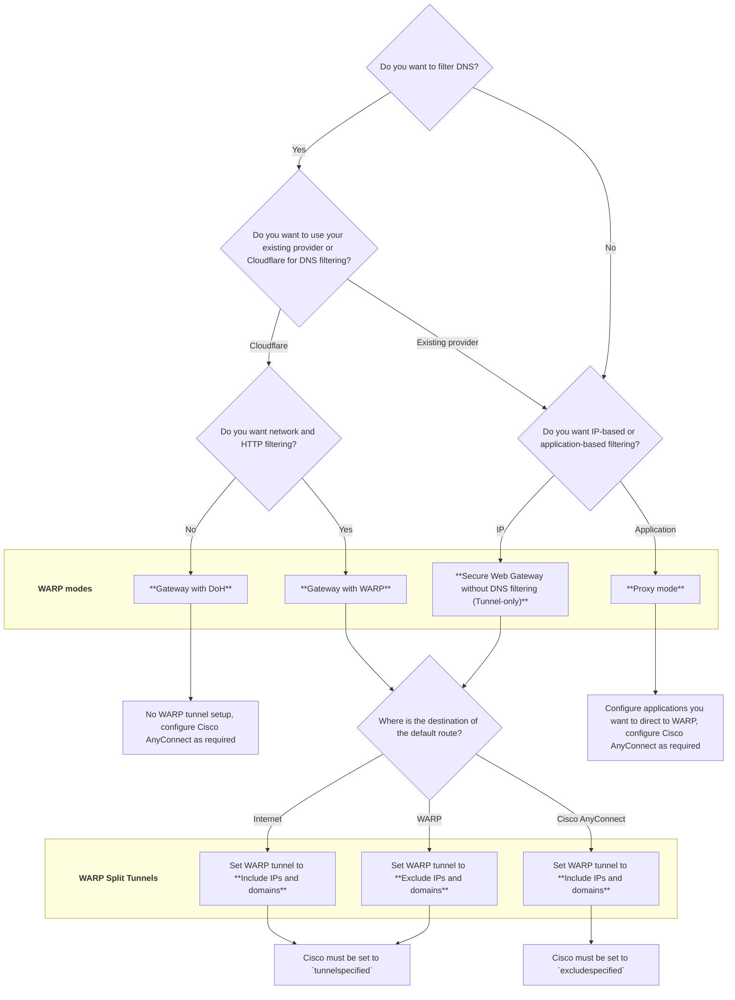

import { Details, Render } from "~/components";

This guide clarifies key concepts for configuring Cloudflare WARP alongside Cisco AnyConnect. This document addresses how WARP handles DNS and routing decisions.

## 1. Prerequisites

- Read the [Get started guide](/cloudflare-one/setup/) to set up a Cloudflare account and create a Zero Trust organization.

### Core interoperability principles

Running Cisco AnyConnect and WARP simultaneously requires careful configuration. Adhere to these fundamental rules:

- Single DNS authority: Only one service (Cloudflare or your existing provider) should actively manage DNS resolution and filtering.
- Single default route owner: Never configure both WARP and Cisco AnyConnect to establish a Full Tunnel.
- Mutual exclusion: Any traffic you configure to go through the Cloudflare WARP tunnel (for example, private subnets) must be explicitly excluded from the Cisco AnyConnect configuration, and vice versa.

### WARP tunnel terminology

The following table maps common industry tunneling terms to Cloudflare WARP terminology and explains how each routing model affects traffic flow.

| Routing behavior | Cisco AnyConnect configuration | Cloudflare WARP configuration | WARP behavior |
|-----------------|--------------------------------|-------------------------------|------------------------|
| Route all traffic except specific networks | Exclude Network List Below | Exclude IPs and domains | WARP asserts precedence over the system default route. All traffic is routed through the tunnel except explicitly excluded destinations. |
| Route only specific networks | Tunnel Network List Below | Include IPs and domains | WARP does not assert precedence over the default route. Only traffic matching the include list is routed through the tunnel. |

:::caution[Tunnel All Networks]

Cisco AnyConnect's Tunnel All Networks `tunnelall` option enforces unconditional full tunneling, where all traffic is routed through the VPN tunnel without the ability to define exclusions.

More importantly, `tunnelall` mode cannot operate alongside the Cloudflare WARP tunnel. WARP relies on explicit Include or Exclude routing rules to determine how traffic is handled, and an unconditional full-tunnel configuration would conflict with WARP's routing model.

As a result, environments using `tunnelall` must transition to explicit Include or Exclude routing when deploying a Cloudflare WARP mode that uses a tunnel for IP or application-based filtering.
:::

Refer to [Split Tunnels](/cloudflare-one/team-and-resources/devices/warp/configure-warp/route-traffic/split-tunnels/#change-split-tunnels-mode) to review how to select a WARP split tunnel mode in the Cloudflare One dashboard or through Terraform.

### Default routes

In networking, the default route dictates where traffic flows when no other specific path is defined. Instead of adding a literal `0.0.0.0/0` entry to the routing table, which is a common industry practice, WARP calculates the entire IP address space, subtracts any configured exclusions, and creates high-priority routes for all remaining subnets.

### Supported routing combinations

The following table outlines the supported routing combinations.

**TODO: Clean up and merge tables**

| Cisco AnyConnect | Cloudflare WARP | Compatibility |
|------------------|-----------------|---------------|
| Tunnel Network List Below   `tunnelspecified` | Include IPs and domains | ✅ Supported |
| Tunnel Network List Below   `tunnelspecified` | Exclude IPs and domains | ✅ Supported |
| Exclude Network List Below   `excludespecified` | Include IPs and domains | ✅ Supported |
| Exclude Network List Below   `excludespecified` | Exclude IPs and domains | ❌ Not supported |
| Tunnel All Networks   `tunnelall` | Include IPs and domains | ❌ Not supported |
| Tunnel All Networks   `tunnelall` | Exclude IPs and domains | ❌ Not supported |

| Cisco AnyConnect | Cloudflare WARP | Compatibility | Behavior |
|------------------|-----------------|---------------|----------|
| Tunnel Network List Below   `tunnelspecified` | Include IPs and domains | ✅ Supported | Only traffic explicitly configured in **AnyConnect** or **WARP** is tunneled. Any traffic not matched by either tunnel is sent directly to the Internet using the user's local connection. |
| Tunnel Network List Below   `tunnelspecified` | Exclude IPs and domains | ✅ Supported | All traffic is sent through the WARP tunnel except traffic explicitly configured for the Cisco AnyConnect tunnel. Traffic excluded from the WARP tunnel and not configured for the Cisco AnyConnect tunnel will go to the Internet. |
| Exclude Network List Below   `excludespecified` | Include IPs and domains | ✅ Supported | All traffic is sent through Cisco AnyConnect tunnel except traffic explicitly configured for the WARP tunnel. Traffic excluded from the Cisco AnyConnect tunnel and not configured for the WARP tunnel will go to the Internet. |
| Exclude Network List Below   `excludespecified` | Exclude IPs and domains | ❌ Not supported | Both clients attempt to exclude traffic, resulting in ambiguous routing behavior. This configuration is not supported. |
| Tunnel All Networks   `tunnelall` | Include IPs and domains | ❌ Not supported | Cisco AnyConnect's `tunnelall` configuration will attempt to tunnel WARP's traffic, leading to a tunnel-in-a-tunnel conflict. |
| Tunnel All Networks   `tunnelall` | Exclude IPs and domains | ❌ Not supported | Cisco AnyConnect's `tunnelall` configuration will attempt to tunnel WARP's traffic, leading to a tunnel-in-a-tunnel conflict. |

<Render file="warp/cisco/exclude-include-definition" product="cloudflare-one" />

Running WARP in `Exclude IPs and domains` and Cisco AnyConnect in `tunnelall` or `excludespecified` at the same time will lead to a tunnel-in-a-tunnel conflict.

A tunnel-in-a-tunnel conflict occurs when the destination of one tunnel is configured in the other tunnel. For example, Cisco AnyConnect is configured in `tunnelall` or `excludespecified` and is not configured to exclude the [WARP ingress IPs](/cloudflare-one/team-and-resources/devices/warp/deployment/firewall/#warp-ingress-ip). Similarly, WARP is configured to `Exclude IPs and domains` but is not configured to exclude the public IP address of the Cisco AnyConnect firewall. 

### WARP modes

WARP operates in several modes, each with different traffic handling capabilities:

<Render file="warp/warp-modes" product="cloudflare-one" />

## 2. WARP mode decision matrix

Your decisions on which service actively manages DNS and how you want to route network traffic will determine the correct WARP mode and configuration approach for your environment.

## 3. Configuration instructions by WARP mode

The following sections display Cisco AnyConnect and Cloudflare configuration instructions for each WARP mode.

- [Gateway with DoH](#gateway-with-doh) (DNS Handled by WARP, No IP Tunnel)
- [Gateway with WARP](#gateway-with-warp) (DNS Handled by WARP, IP Tunnel)
- [Secure Web Gateway without DNS Filtering](#secure-web-gateway-without-dns-filtering-tunnel-only) (IP Tunnel Only)
- [Proxy mode](#proxy-mode) (Application-based filtering)

### Implementation considerations

#### Exclude Cloudflare endpoints from AnyConnect configuration

Regardless of what [WARP mode](/cloudflare-one/team-and-resources/devices/warp/deployment/cisco/#warp-modes) you use, you must always exclude the following Cloudflare endpoints from the Cisco AnyConnect tunnel to ensure proper interoperability:

- [Client orchestration API](/cloudflare-one/team-and-resources/devices/warp/deployment/firewall/#client-orchestration-api)
- [Client authentication endpoint](/cloudflare-one/team-and-resources/devices/warp/deployment/firewall/#client-authentication-endpoint)
- [Captive portal](/cloudflare-one/team-and-resources/devices/warp/deployment/firewall/#captive-portal)

Additional exclusions may be required based on your desired WARP mode and are [listed in this document for each WARP mode](/cloudflare-one/team-and-resources/devices/warp/deployment/cisco/#3-configuration-instructions-by-warp-mode). There are other Cloudflare endpoints you may want to exclude for security or functionality reasons, but they are not critical to the operation of the WARP client. For more information about Cloudflare WARP operability with firewalls, refer to [WARP with firewall](/cloudflare-one/team-and-resources/devices/warp/deployment/firewall/).

#### Configure routing for WARP and Cisco AnyConnect tunnels

:::note

This section only applies if you are using [Gateway with WARP](#gateway-with-warp) or [Secure Web Gateway without DNS Filtering (Tunnel Only)](#secure-web-gateway-without-dns-filtering-tunnel-only) modes.

:::

The [Gateway with WARP](#gateway-with-warp) and [Secure Web Gateway without DNS Filtering (Tunnel only)](#secure-web-gateway-without-dns-filtering-tunnel-only) modes both provide IP filtering capabilities.

If you are using Gateway with WARP or Secure Web Gateway without DNS Filtering (Tunnel only) mode for your WARP deployment, you must appropriately configure both the WARP client and the Cisco AnyConnect client to avoid conflicts.

**TODO: Clean up and merge tables**

<Render file="warp/cisco/default-route-routing-table" product="cloudflare-one" />

<Render file="warp/cisco/exclude-include-definition" product="cloudflare-one" />

:::caution[Prevent tunnel in a tunnel errors]

Do not configure both WARP and Cisco AnyConnect to assert the [default route](/cloudflare-one/team-and-resources/devices/warp/deployment/cisco/#default-routes). This creates a ["tunnel in a tunnel" conflict](/cloudflare-one/team-and-resources/devices/warp/deployment/cisco/#supported-tunnel-configurations).

:::

---

### Gateway with DoH

Gateway with DNS-over-HTTPs (DoH) mode is ideal if you only require Cloudflare DNS filtering and policy enforcement.

| Mode | DNS filtering | Network filtering | HTTP filtering | Function |
|------|---------------|--------------------------|-----------|----------|
| Gateway with DoH | Yes | No | No | DNS filtering only. Does not tunnel IP traffic.|

#### 1. Cisco AnyConnect Configuration

The following steps must be taken in your Cisco AnyConnect configuration to ensure proper interoperability with Cloudflare WARP.

##### 1.1. DNS configuration for Cisco AnyConnect

Ensure Cisco AnyConnect does not manage or intercept DNS queries. This includes disabling DNS servers pushed by the VPN and disabling the Cisco Umbrella module (if installed), allowing Cloudflare WARP to control DNS resolution.

If you want WARP to manage DNS queries, you must configure Cisco AnyConnect's Connection Profiles and/or Group Policies to `dns-server none`.

Group Policies take precedence over Connection Profiles.

##### 1.2. Tunnel configuration for Cisco AnyConnect

If you are using:
- `tunnelall`: Not supported for interoperability with Cloudflare WARP.
- `tunnelspecified`: Ensure that the following Cloudflare IPs and domains are not included in the Cisco AnyConnect tunnel.
- `excludespecified`: Ensure that the following Cloudflare IPs and domains are excluded from the Cisco AnyConnect tunnel.

Configure Cisco AnyConnect to exclude the following Cloudflare components from the VPN tunnel:

The WARP client connects to Cloudflare via a standard HTTPS connection outside the tunnel for operations like registration or settings changes. To perform these operations, you must allow the following IPs and domains:

<Render file="warp/client-orchestration-ips" product="cloudflare-one" />

Even though `zero-trust-client.cloudflareclient.com` and `notifications.cloudflareclient.com` may resolve to different IP addresses, WARP overrides the resolved IPs with the IPs listed above. To avoid connectivity issues, ensure that the above IPs are permitted through your firewall.

To deploy WARP in FedRAMP High environments, you will need to allow a different set of IPs and domains through your firewall:

- IPv4 API endpoints: `162.159.213.1` and `172.64.98.1`
- IPv6 API endpoints: `2606:54c1:11::` and `2a06:98c1:4b::`
- SNIs: `api.devices.fed.cloudflare.com` and `notifications.devices.fed.cloudflare.com`

In [Gateway with DoH](/cloudflare-one/team-and-resources/devices/warp/configure-warp/warp-modes/#gateway-with-doh) mode, the WARP client sends DNS requests to Gateway over an HTTPS connection. For DNS to work correctly, you must allow the following IPs and domains:

- IPv4 DoH addresses: `162.159.36.1` and `162.159.46.1`
- IPv6 DoH addresses: `2606:4700:4700::1111` and `2606:4700:4700::1001`
- SNIs: `<ACCOUNT_ID>.cloudflare-gateway.com`

Even though `<ACCOUNT_ID>.cloudflare-gateway.com` may resolve to different IP addresses, WARP overrides the resolved IPs with the IPs listed above. To avoid connectivity issues, ensure that the above IPs are permitted through your firewall.

To deploy WARP in FedRAMP High environments, you will need to allow a different set of IPs and domains through your firewall:

- IPv4 DoH addresses: `172.64.100.3` and `172.64.101.3`
- IPv6 DoH addresses: `2606:54c1:13::2`
- SNIs: `<ACCOUNT_ID>.fed.cloudflare-gateway.com`

When you [log in to your Cloudflare One organization](/cloudflare-one/team-and-resources/devices/warp/deployment/manual-deployment/), you will have to complete the authentication steps required by your organization in the browser window that opens. To perform these operations, you must allow the following domains:

- The IdP used to authenticate to Cloudflare One
- `<your-team-name>.cloudflareaccess.com`

To deploy WARP in FedRAMP High environments, you will need to allow different domains through your firewall:

- FedRAMP High IdP used to authenticate to Cloudflare One
- `<your-team-name>.fed.cloudflareaccess.com`.

The following domains are used as part of our captive portal check:

- `cloudflareportal.com`
- `cloudflareok.com`
- `cloudflarecp.com`
- `www.msftconnecttest.com`
- `captive.apple.com`
- `connectivitycheck.gstatic.com`

There are other Cloudflare endpoints you may want to exclude for security or functionality reasons, but they are not critical to the operation of the WARP client. Refer to the [WARP with firewall](/cloudflare-one/team-and-resources/devices/warp/deployment/firewall/) documentation for more information.

#### 2. Cloudflare WARP configuration

The following steps must be taken in your Cloudflare One configuration to ensure proper interoperability with Cisco AnyConnect.

##### 2.1 DNS configuration

No configuration is required. WARP takes over DNS filtering.

##### 2.2 Tunnel configuration

No configuration is required. WARP does not create a tunnel in this mode, meaning no routing updates conflict with Cisco.

---

### Gateway with WARP 

Gateway with WARP mode is ideal if you require Cloudflare DNS filtering and policy enforcement, as well as IP/HTTP filtering.

| Mode | DNS filtering | Network filtering | HTTP filtering | Function |
|------|---------------|--------------------------|-----------|----------|
| Gateway with WARP | Yes | Yes | Yes | DNS filtering and IP/HTTP filtering. Tunnels IP traffic.|

#### 1. Cisco AnyConnect configuration

The following steps must be taken in your Cisco AnyConnect configuration to ensure proper interoperability with Cloudflare WARP.

##### 1.1 DNS configuration for Cisco AnyConnect

Ensure Cisco AnyConnect does not manage or intercept DNS queries. This includes disabling DNS servers pushed by the VPN and disabling the Cisco Umbrella module (if installed), allowing Cloudflare WARP to control DNS resolution.

If you want WARP to manage DNS queries, you must configure Cisco AnyConnect's Connection Profiles and/or Group Policies to `dns-server none`.

Group Policies take precedence over Connection Profiles. 

##### 1.2 Tunnel configuration for Cisco AnyConnect

###### 1.2.1 TODO: Need a title for this section. 

TODO: Need a instructions on how to set up split tunnel in Cisco. 

Set your AnyConnect client to Split tunnel or Full tunnel based on your [routing preference](/cloudflare-one/team-and-resources/devices/warp/deployment/cisco/#2-warp-mode-decision-matrix). Avoid [tunnel-in-a-tunnel](/cloudflare-one/team-and-resources/devices/warp/deployment/cisco/#supported-routing-combinations) conflicts.

<Render file="warp/cisco/default-route-routing-table" product="cloudflare-one" />

###### 1.2.2 Exclude Cloudflare endpoints from AnyConnect tunnel

If you are using:
- `tunnelall`: Not supported for interoperability with Cloudflare WARP.
- `tunnelspecified`: Ensure that the following Cloudflare IPs and domains are not included in the Cisco AnyConnect tunnel.
- `excludespecified`: Ensure that the following Cloudflare IPs and domains are excluded from the Cisco AnyConnect tunnel.

TODO: Need instructions on how to exclude Cloudflare endpoints from AnyConnect tunnel.

Configure Cisco AnyConnect to exclude the following Cloudflare components from the VPN tunnel:

- Any networks that you have configured in the WARP tunnel

The WARP client connects to Cloudflare via a standard HTTPS connection outside the tunnel for operations like registration or settings changes. To perform these operations, you must allow the following IPs and domains:

<Render file="warp/client-orchestration-ips" product="cloudflare-one" />

Even though `zero-trust-client.cloudflareclient.com` and `notifications.cloudflareclient.com` may resolve to different IP addresses, WARP overrides the resolved IPs with the IPs listed above. To avoid connectivity issues, ensure that the above IPs are permitted through your firewall.

To deploy WARP in FedRAMP High environments, you will need to allow a different set of IPs and domains through your firewall:

- IPv4 API endpoints: `162.159.213.1` and `172.64.98.1`
- IPv6 API endpoints: `2606:54c1:11::` and `2a06:98c1:4b::`
- SNIs: `api.devices.fed.cloudflare.com` and `notifications.devices.fed.cloudflare.com`

In [Gateway with DoH](/cloudflare-one/team-and-resources/devices/warp/configure-warp/warp-modes/#gateway-with-doh) mode, the WARP client sends DNS requests to Gateway over an HTTPS connection. For DNS to work correctly, you must allow the following IPs and domains:

- IPv4 DoH addresses: `162.159.36.1` and `162.159.46.1`
- IPv6 DoH addresses: `2606:4700:4700::1111` and `2606:4700:4700::1001`
- SNIs: `<ACCOUNT_ID>.cloudflare-gateway.com`

Even though `<ACCOUNT_ID>.cloudflare-gateway.com` may resolve to different IP addresses, WARP overrides the resolved IPs with the IPs listed above. To avoid connectivity issues, ensure that the above IPs are permitted through your firewall.

To deploy WARP in FedRAMP High environments, you will need to allow a different set of IPs and domains through your firewall:

- IPv4 DoH addresses: `172.64.100.3` and `172.64.101.3`
- IPv6 DoH addresses: `2606:54c1:13::2`
- SNIs: `<ACCOUNT_ID>.fed.cloudflare-gateway.com`

When you [log in to your Cloudflare One organization](/cloudflare-one/team-and-resources/devices/warp/deployment/manual-deployment/), you will have to complete the authentication steps required by your organization in the browser window that opens. To perform these operations, you must allow the following domains:

- The IdP used to authenticate to Cloudflare One
- `<your-team-name>.cloudflareaccess.com`

To deploy WARP in FedRAMP High environments, you will need to allow different domains through your firewall:

- FedRAMP High IdP used to authenticate to Cloudflare One
- `<your-team-name>.fed.cloudflareaccess.com`.

The following domains are used as part of our captive portal check:

- `cloudflareportal.com`
- `cloudflareok.com`
- `cloudflarecp.com`
- `www.msftconnecttest.com`
- `captive.apple.com`
- `connectivitycheck.gstatic.com`

  

**WireGuard**

|                |                                             |
| -------------- | ------------------------------------------- |
| IPv4 address   | `162.159.193.0/24`                          |
| IPv6 address   | `2606:4700:100::/48`                        |
| Default port   | `UDP 2408`                                  |
| Fallback ports | `UDP 500`   `UDP 1701`   `UDP 4500` |

**MASQUE**

|                |                                                                                                                     |
| -------------- | ------------------------------------------------------------------------------------------------------------------- |
| IPv4 address   | `162.159.197.0/24`                                                                                                  |
| IPv6 address   | `2606:4700:102::/48`                                                                                                |
| Default port   | `UDP 443`                                                                                                           |
| Fallback ports | `UDP 500`   `UDP 1701`   `UDP 4500`   `UDP 4443`   `UDP 8443`   `UDP 8095`   `TCP 443` [^1] |

[^1]: Required for HTTP/2 fallback

:::note

Before you [log in to your Cloudflare One organization](/cloudflare-one/team-and-resources/devices/warp/deployment/manual-deployment/), you may see the IPv4 range `162.159.192.0/24`. This IP is used for consumer WARP ([1.1.1.1 w/ WARP](/warp-client/)) and is not required for Zero Trust services.
:::

Devices will use the MASQUE protocol in FedRAMP High environments. To deploy WARP for FedRAMP High, you will need to allow the following IPs and ports:

|                |                                                                                                                     |
| -------------- | ------------------------------------------------------------------------------------------------------------------- |
| IPv4 address   | `162.159.239.0/24`                                                                                |
| IPv6 address   | `2606:4700:105::/48`                                                                               |
| Default port   | `UDP 443`                                                                                                           |
| Fallback ports | `UDP 500`   `UDP 1701`   `UDP 4500`   `UDP 4443`   `UDP 8443`   `UDP 8095`   `TCP 443` [^1] |

[^1]: Required for HTTP/2 fallback

There are other Cloudflare endpoints you may want to exclude for security or functionality reasons, but they are not critical to the operation of the WARP client. Refer to the [WARP with firewall](/cloudflare-one/team-and-resources/devices/warp/deployment/firewall/) documentation for more information.

#### 2. Cloudflare WARP Configuration

The following steps must be taken in your Cloudflare One configuration to ensure proper interoperability with Cisco AnyConnect.

##### 2.1 Set WARP Split Tunnels

Set your WARP Split Tunnels mode to `Include IPs and domains` or `Exclude IPs and domains` based on your [routing preference](/cloudflare-one/team-and-resources/devices/warp/deployment/cisco/#2-warp-mode-decision-matrix). Avoid [tunnel-in-a-tunnel](/cloudflare-one/team-and-resources/devices/warp/deployment/cisco/#supported-routing-combinations) conflicts.

**TODO: Clean up and merge tables**

<Render file="warp/cisco/default-route-routing-table" product="cloudflare-one" />

<Render file="warp/change-split-tunnels-mode" product="cloudflare-one" />

##### 2.2 Exclude Cisco endpoints from the WARP tunnel

TODO: Add instructions on how to exclude Cisco endpoints from the WARP tunnel.

Add the following Cisco entries to the WARP Split Tunnel Exclude list:

- The Public IP address of the Cisco firewall/VPN concentrator.
- The IP networks configured as Secured Routes in Cisco AnyConnect. This prevents the WARP tunnel from interfering with the Cisco Secured Routes.

---

### Secure Web Gateway without DNS Filtering (Tunnel only)

Use Secure Web Gateway without DNS filtering (Tunnel only) mode when you need Cloudflare's IP/HTTP filtering capabilities but must retain your existing DNS provider.

| Mode | DNS filtering | Network filtering | HTTP filtering | Function |
|------|---------------|--------------------------|-----------|----------|
| Secure Web Gateway without DNS Filtering (Tunnel Only) | No | Yes | Yes | IP/HTTP filtering only. Tunnels IP traffic.|

#### 1. Cisco AnyConnect configuration

The following steps must be taken in your Cisco AnyConnect configuration to ensure proper interoperability with Cloudflare WARP.

##### 1.1 DNS

No changes are needed to your existing DNS provider as Cloudflare will not be handling DNS filtering in this mode.

##### 1.2.Tunnel

###### 1.2.1 TODO: Need a title for this

TODO: Need instructions for this section.

Set your AnyConnect client to Split tunnel or Full tunnel based on your [routing preference](/cloudflare-one/team-and-resources/devices/warp/deployment/cisco/#2-warp-mode-decision-matrix). Avoid [tunnel-in-a-tunnel](/cloudflare-one/team-and-resources/devices/warp/deployment/cisco/#supported-routing-combinations) conflicts.

**TODO: Clean up and merge tables**

<Render file="warp/cisco/default-route-routing-table" product="cloudflare-one" />

###### 1.2.2 Exclude Cloudflare endpoints from AnyConnect tunnel

TODO: Need instructions on how to do this.

Configure Cisco AnyConnect to exclude the following Cloudflare components from the VPN tunnel:

- Any IP addresses that you have configured to run through WARP tunnel

The WARP client connects to Cloudflare via a standard HTTPS connection outside the tunnel for operations like registration or settings changes. To perform these operations, you must allow the following IPs and domains:

<Render file="warp/client-orchestration-ips" product="cloudflare-one" />

Even though `zero-trust-client.cloudflareclient.com` and `notifications.cloudflareclient.com` may resolve to different IP addresses, WARP overrides the resolved IPs with the IPs listed above. To avoid connectivity issues, ensure that the above IPs are permitted through your firewall.

To deploy WARP in FedRAMP High environments, you will need to allow a different set of IPs and domains through your firewall:

- IPv4 API endpoints: `162.159.213.1` and `172.64.98.1`
- IPv6 API endpoints: `2606:54c1:11::` and `2a06:98c1:4b::`
- SNIs: `api.devices.fed.cloudflare.com` and `notifications.devices.fed.cloudflare.com`

When you [log in to your Cloudflare One organization](/cloudflare-one/team-and-resources/devices/warp/deployment/manual-deployment/), you will have to complete the authentication steps required by your organization in the browser window that opens. To perform these operations, you must allow the following domains:

- The IdP used to authenticate to Cloudflare One
- `<your-team-name>.cloudflareaccess.com`

To deploy WARP in FedRAMP High environments, you will need to allow different domains through your firewall:

- FedRAMP High IdP used to authenticate to Cloudflare One
- `<your-team-name>.fed.cloudflareaccess.com`.

The following domains are used as part of our captive portal check:

- `cloudflareportal.com`
- `cloudflareok.com`
- `cloudflarecp.com`
- `www.msftconnecttest.com`
- `captive.apple.com`
- `connectivitycheck.gstatic.com`

  

**WireGuard**

|                |                                             |
| -------------- | ------------------------------------------- |
| IPv4 address   | `162.159.193.0/24`                          |
| IPv6 address   | `2606:4700:100::/48`                        |
| Default port   | `UDP 2408`                                  |
| Fallback ports | `UDP 500`   `UDP 1701`   `UDP 4500` |

**MASQUE**

|                |                                                                                                                     |
| -------------- | ------------------------------------------------------------------------------------------------------------------- |
| IPv4 address   | `162.159.197.0/24`                                                                                                  |
| IPv6 address   | `2606:4700:102::/48`                                                                                                |
| Default port   | `UDP 443`                                                                                                           |
| Fallback ports | `UDP 500`   `UDP 1701`   `UDP 4500`   `UDP 4443`   `UDP 8443`   `UDP 8095`   `TCP 443` [^1] |

[^1]: Required for HTTP/2 fallback

:::note

Before you [log in to your Cloudflare One organization](/cloudflare-one/team-and-resources/devices/warp/deployment/manual-deployment/), you may see the IPv4 range `162.159.192.0/24`. This IP is used for consumer WARP ([1.1.1.1 w/ WARP](/warp-client/)) and is not required for Zero Trust services.
:::

Devices will use the MASQUE protocol in FedRAMP High environments. To deploy WARP for FedRAMP High, you will need to allow the following IPs and ports:

|                |                                                                                                                     |
| -------------- | ------------------------------------------------------------------------------------------------------------------- |
| IPv4 address   | `162.159.239.0/24`                                                                                |
| IPv6 address   | `2606:4700:105::/48`                                                                               |
| Default port   | `UDP 443`                                                                                                           |
| Fallback ports | `UDP 500`   `UDP 1701`   `UDP 4500`   `UDP 4443`   `UDP 8443`   `UDP 8095`   `TCP 443` [^1] |

[^1]: Required for HTTP/2 fallback

There are other Cloudflare endpoints you may want to exclude for security or functionality reasons, but they are not critical to the operation of the WARP client. Refer to the [WARP with firewall](/cloudflare-one/team-and-resources/devices/warp/deployment/firewall/) documentation for more information.

#### 2. Cloudflare WARP configuration

The following steps must be taken in your Cloudflare One configuration to ensure proper interoperability with Cisco AnyConnect.

##### 2.1 Set WARP Split Tunnels mode

Set your WARP Split Tunnels mode to `Include IPs and domains` or `Exclude IPs and domains` based on your [routing preference](/cloudflare-one/team-and-resources/devices/warp/deployment/cisco/#2-warp-mode-decision-matrix). Avoid [tunnel-in-a-tunnel](/cloudflare-one/team-and-resources/devices/warp/deployment/cisco/#supported-routing-combinations) conflicts.

<Render file="warp/cisco/default-route-routing-table" product="cloudflare-one" />

<Render file="warp/change-split-tunnels-mode" product="cloudflare-one" />

##### 2.2 Add Cisco endpoint exclusions

TODO: Need instructions for this section.

Add the following Cisco entries to the WARP Split Tunnel Exclude list:

- The Public IP address of the Cisco firewall/VPN concentrator.
- The IP networks configured as Secured Routes in Cisco AnyConnect. This prevents the WARP tunnel from interfering with the Cisco Secured Routes.

---

### Proxy mode

Proxy mode is best suited for organizations that want to filter traffic originating from specific applications.

| Mode | DNS filtering | Network filtering | HTTP filtering | Function |
|------|---------------|--------------------------|-----------|----------|
| Proxy mode | No | No | Yes | Routes HTTP traffic on a per-application or OS basis.|

#### 1. Cisco AnyConnect configuration

The following steps must be taken in your Cisco AnyConnect configuration to ensure proper interoperability with Cloudflare WARP.

##### 1.1 DNS configuration for Cisco AnyConnect

No changes are needed to your existing DNS provider as Cloudflare will not be handling DNS filtering in this mode.

##### 1.2 Tunnel configuration for Cisco AnyConnect

If you are using:
- `tunnelall`: Not supported for interoperability with Cloudflare WARP.
- `tunnelspecified`: Ensure that the following Cloudflare IPs and domains are not included in the Cisco AnyConnect tunnel.
- `excludespecified`: Ensure that the following Cloudflare IPs and domains are excluded from the Cisco AnyConnect tunnel.

Configure Cisco AnyConnect to exclude the following Cloudflare components from the VPN tunnel:

The WARP client connects to Cloudflare via a standard HTTPS connection outside the tunnel for operations like registration or settings changes. To perform these operations, you must allow the following IPs and domains:

<Render file="warp/client-orchestration-ips" product="cloudflare-one" />

Even though `zero-trust-client.cloudflareclient.com` and `notifications.cloudflareclient.com` may resolve to different IP addresses, WARP overrides the resolved IPs with the IPs listed above. To avoid connectivity issues, ensure that the above IPs are permitted through your firewall.

To deploy WARP in FedRAMP High environments, you will need to allow a different set of IPs and domains through your firewall:

- IPv4 API endpoints: `162.159.213.1` and `172.64.98.1`
- IPv6 API endpoints: `2606:54c1:11::` and `2a06:98c1:4b::`
- SNIs: `api.devices.fed.cloudflare.com` and `notifications.devices.fed.cloudflare.com`

When you [log in to your Cloudflare One organization](/cloudflare-one/team-and-resources/devices/warp/deployment/manual-deployment/), you will have to complete the authentication steps required by your organization in the browser window that opens. To perform these operations, you must allow the following domains:

- The IdP used to authenticate to Cloudflare One
- `<your-team-name>.cloudflareaccess.com`

To deploy WARP in FedRAMP High environments, you will need to allow different domains through your firewall:

- FedRAMP High IdP used to authenticate to Cloudflare One
- `<your-team-name>.fed.cloudflareaccess.com`.

The following domains are used as part of our captive portal check:

- `cloudflareportal.com`
- `cloudflareok.com`
- `cloudflarecp.com`
- `www.msftconnecttest.com`
- `captive.apple.com`
- `connectivitycheck.gstatic.com`

Proxy mode only uses MASQUE, so exclude MASQUE endpoints only.

|                |                                                                                                                     |
| -------------- | ------------------------------------------------------------------------------------------------------------------- |
| IPv4 address   | `162.159.197.0/24`                                                                                                  |
| IPv6 address   | `2606:4700:102::/48`                                                                                                |
| Default port   | `UDP 443`                                                                                                           |
| Fallback ports | `UDP 500`   `UDP 1701`   `UDP 4500`   `UDP 4443`   `UDP 8443`   `UDP 8095`   `TCP 443` [^1] |

[^1]: Required for HTTP/2 fallback

:::note

Before you [log in to your Cloudflare One organization](/cloudflare-one/team-and-resources/devices/warp/deployment/manual-deployment/), you may see the IPv4 range `162.159.192.0/24`. This IP is used for consumer WARP ([1.1.1.1 w/ WARP](/warp-client/)) and is not required for Zero Trust services.
:::

Devices will use the MASQUE protocol in FedRAMP High environments. To deploy WARP for FedRAMP High, you will need to allow the following IPs and ports:

|                |                                                                                                                     |
| -------------- | ------------------------------------------------------------------------------------------------------------------- |
| IPv4 address   | `162.159.239.0/24`                                                                                |
| IPv6 address   | `2606:4700:105::/48`                                                                               |
| Default port   | `UDP 443`                                                                                                           |
| Fallback ports | `UDP 500`   `UDP 1701`   `UDP 4500`   `UDP 4443`   `UDP 8443`   `UDP 8095`   `TCP 443` [^1] |

[^1]: Required for HTTP/2 fallback

There are other Cloudflare endpoints you may want to exclude for security or functionality reasons, but they are not critical to the operation of the WARP client. Refer to the [WARP with firewall](/cloudflare-one/team-and-resources/devices/warp/deployment/firewall/) documentation for more information.

#### Cloudflare WARP configuration

The following steps must be taken in your Cloudflare One configuration to ensure proper interoperability with Cisco AnyConnect.

TODO: add instructions on how to set up Proxy mode. 

---

TODO: Add possible edge cases and conclusion.
