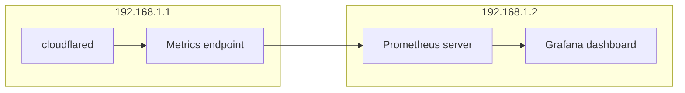

[Grafana](https://grafana.com/) is a dashboard tool that visualizes data stored in other databases. You can use Grafana to convert your [tunnel metrics](/cloudflare-one/connections/connect-networks/monitor-tunnels/metrics/) into actionable insights.

It is not possible to push metrics directly from `cloudflared` to Grafana. Instead, `cloudflared` runs a [Prometheus](https://prometheus.io) metrics endpoint, which a Prometheus server periodically scrapes. Grafana then uses Prometheus as a data source to present metrics to the administrator.



This tutorial covers how to create the metrics endpoint, set up the Prometheus server, and view the data in Grafana.

## Before you begin

- You will need a Cloudflare Tunnel. To create a tunnel, refer to our [getting started guide](/cloudflare-one/connections/connect-networks/get-started/).

## Create the metrics endpoint

If your tunnel was created via the CLI, run the following command on the `cloudflared` server (`192.168.1.1`):

```sh
cloudflared tunnel --metrics 192.168.1.1:60123 run my-tunnel
```

If your tunnel was created via the dashboard, the [--metrics](/cloudflare-one/connections/connect-networks/configure-tunnels/tunnel-run-parameters/#metrics) flag must be added to your `cloudflared` system service configuration. Refer to [Add tunnel run parameters](/cloudflare-one/connections/connect-networks/configure-tunnels/remote-management/#add-tunnel-run-parameters) for instructions on how to do this.

## Set up Prometheus

On the Prometheus and Grafana server (`192.168.1.2`):

1. [Download](https://prometheus.io/download/) Prometheus.

2. Extract Prometheus:

   ```sh
   tar xvfz prometheus-*.tar.gz
   cd prometheus-*
   ```

3. Open `prometheus.yml` in a text editor and add the `cloudflared` job to the end of the file:

   ```yml null {31-33}
   # my global config
   global:
     scrape_interval: 15s # Set the scrape interval to every 15 seconds. Default is every 1 minute.
     evaluation_interval: 15s # Evaluate rules every 15 seconds. The default is every 1 minute.
     # scrape_timeout is set to the global default (10s).

   # Alertmanager configuration
   alerting:
     alertmanagers:
       - static_configs:
           - targets:
             # - alertmanager:9093

   # Load rules once and periodically evaluate them according to the global 'evaluation_interval'.
   rule_files:
     # - "first_rules.yml"
     # - "second_rules.yml"

   # A scrape configuration containing exactly one endpoint to scrape:
   # Here it's Prometheus itself.
   scrape_configs:
     # The job name is added as a label `job=<job_name>` to any timeseries scraped from this config.
     - job_name: "prometheus"

       # metrics_path defaults to '/metrics'
       # scheme defaults to 'http'.

       static_configs:
         - targets: ["localhost:9090"] ## Address of Prometheus dashboard

     - job_name: "cloudflared"
       static_configs:
         - targets: ["198.168.1.1:60123"] ## cloudflared server IP and the --metrics port configured for the tunnel
   ```

4. Start Prometheus:

   ```sh
   ./prometheus --config.file="prometheus.yml"
   ```

   You can optionally configure Prometheus to run as a service so that it does not need to be manually started if the machine reboots.

5. Open a browser and go to `http://localhost:9090/`. You should be able to access the Prometheus dashboard.

6. To verify that Prometheus is fetching tunnel metrics, enter `cloudflared_tunnel_total_requests` into the expression console and select **Execute**.

   

Refer to [Available metrics](/cloudflare-one/connections/connect-networks/monitor-tunnels/metrics/#available-metrics) to check what other metrics are available.

## Connect Grafana to Prometheus

1. [Download](https://grafana.com/grafana/download) and install Grafana.

2. Start Grafana as a system service:

   ```sh
   sudo systemctl daemon-reload
   sudo systemctl start grafana-server
   ```

3. Verify that Grafana is running:

   ```sh
   sudo systemctl status grafana-server
   ```

4. Open a browser and go to `http://localhost:3000/`. The default HTTP port that Grafana listens to is `3000` unless you have configured a different port.

5. On the sign-in page, enter your Grafana credentials.

   To test without an account, you can enter `admin` for both the username and password and skip the password change step.

6. In Grafana, go to **Connections** > **Data sources**.

7. Select **Add a new data source** and select **Prometheus**.

8. In the **Prometheus server URL** field, enter the IP address and port of your Prometheus dashboard (`http://localhost:9090`).

9. Select **Save & test**.

## Build Grafana dashboard

1. In Grafana, go to **Dashboards** > **New** > **New dashboard**.
2. Select **Add visualization**.
3. Select **Prometheus**.
4. In the metrics field, enter `cloudflared_tunnel_total_requests` and select **Run queries**. You will see a graph showing the number of requests as a function of time.


You can add operations to the queries to modify what is displayed. For example, you could show all tunnel requests over a recent period of time, such as a day, rather than all tunnel requests since metrics began reporting.
