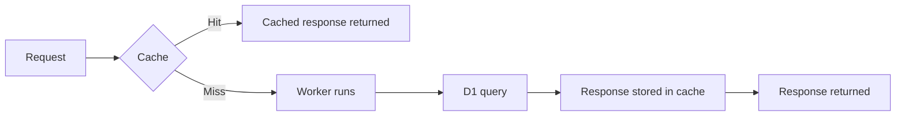

import { TypeScriptExample, WranglerConfig } from "~/components";

Workers Cache lets Cloudflare return cached HTTP responses from your Worker without executing your Worker code. When an incoming request matches a cached response, Cloudflare serves the response directly from its edge cache — reducing latency and Workers CPU usage.

For a Worker that queries D1, a cache hit returns the stored response without running your Worker — and without querying D1. D1 bills usage based on the rows each query reads. On a cache hit, no query runs, so no rows are read.

You control caching with standard HTTP `Cache-Control` directives on the responses your Worker returns. For the full documentation, refer to [Workers Cache](/workers/cache/).

## How it works

With caching enabled, Cloudflare checks the cache before running your Worker. On a hit, the cached response is returned directly. On a miss, your Worker runs, and if the response is cacheable per its `Cache-Control` header, Cloudflare stores it for the next request.



Workers Cache is tiered by default. A lower tier sits in the data center nearest the user, and an upper tier aggregates cache fills across the network. A response generated near your database can be served from the upper tier to users anywhere, without querying D1 again. Refer to [Tiered cache](/workers/cache/#tiered-cache).

### How it works with D1

Without caching, every read runs your Worker and queries the primary database instance — the single [location](/d1/configuration/data-location/) that stores your database. Latency grows with the distance between the user and the primary.

With caching enabled, the cache absorbs that cost:

- **On a hit, D1 is never queried.** The cached response is served from the data center nearest the user, and no rows are read from D1.
- **On a miss, the query runs once.** Your Worker queries the primary, and the response is stored in both cache tiers on the way back to the user.
- **Bursts produce one query.** When many requests for the same URL arrive at once, [request collapsing](/workers/cache/#request-collapsing) runs your Worker once and serves the result to every waiting request.

You decide how fresh data must be with `Cache-Control`. Use `stale-while-revalidate` to serve the cached response immediately while a background refresh re-queries D1. After a write, call `ctx.cache.purge()` to invalidate cached responses by tag — the next request queries D1 for fresh data. Refer to [Purging the cache](/workers/cache/purge/).

## When caching helps

Caching is a good fit for Workers that query D1 for:

- **Reusable reads.** Responses that are identical across requests — product pages, article content, or category listings.
- **Slowly changing data.** A short `max-age` absorbs most reads even when the underlying rows change occasionally.
- **Spiky traffic.** Request collapsing keeps a burst of requests to one URL from becoming a burst of D1 queries.

Caching is not useful for:

- **Per-user data.** Responses scoped to one account or session must never be served to another user.
- **Real-time reads.** Data that must reflect every write, such as live counters or order status.
- **Writes.** Only `GET` and `HEAD` requests are cached. Other methods always run your Worker.

:::note

Cloudflare's standard [cache bypass conditions](/cache/concepts/cache-responses/#bypass) apply. Responses with a `Set-Cookie` header and requests with an `Authorization` header trigger automatic bypass, so authenticated traffic is not cached by default. Refer to [Automatic bypass conditions](/workers/cache/configuration/#automatic-bypass-conditions) for details.

:::

## Quickstart

This quickstart walks you through enabling caching for a Worker that queries D1, deploying, and observing the cache.

You need a Worker with a D1 binding. To create both, refer to [Get started](/d1/get-started/).

### 1. Enable caching in your Wrangler configuration

:::note
Requires Wrangler 4.69.0 or above.
:::

<WranglerConfig>

```jsonc
{
	"name": "my-worker",
	"main": "src/index.ts",
	"compatibility_date": "$today",
	"cache": {
		"enabled": true,
	},
	"d1_databases": [
		{
			"binding": "DB",
			"database_name": "my-db",
			"database_id": "<unique-ID-for-your-database>"
		}
	]
}
```

</WranglerConfig>

Setting `cache.enabled` to `true` causes Cloudflare to check the cache before invoking your Worker on every HTTP request.

### 2. Query D1 and return a cacheable response

To control how long Cloudflare caches each response, set `max-age` on the response. Tag responses with `Cache-Tag` so you can purge them by tag later:

<TypeScriptExample filename="src/index.ts">

```ts
interface Env {
	DB: D1Database;
}

export default {
	async fetch(request, env): Promise<Response> {
		const url = new URL(request.url);
		const productId = url.searchParams.get("id") ?? "1";

		const product = await env.DB.prepare(
			"SELECT id, name, price FROM products WHERE id = ?1",
		)
			.bind(productId)
			.first();

		return new Response(JSON.stringify(product), {
			headers: {
				"Content-Type": "application/json",
				// Fresh for 1 minute; serve stale for up to 5 minutes while revalidating.
				"Cache-Control": "public, max-age=60, stale-while-revalidate=300",
				// Lets you purge this response by tag after writes.
				"Cache-Tag": `product-${productId}`,
			},
		});
	},
} satisfies ExportedHandler<Env>;
```

</TypeScriptExample>

The first request to each URL queries D1 and stores the response. Requests within the freshness window are served from cache, and D1 is not queried.

### 3. Deploy and observe the cache

Deploy your Worker:

```sh
npx wrangler deploy
```

Then send two requests and look at the `Cf-Cache-Status` response header:

```sh
curl -I https://my-worker.example.workers.dev/?id=1
```

```txt title="First request — expected"
HTTP/2 200
cache-control: public, max-age=60, stale-while-revalidate=300
cf-cache-status: MISS
```

```sh
curl -I https://my-worker.example.workers.dev/?id=1
```

```txt title="Second request — expected"
HTTP/2 200
cache-control: public, max-age=60, stale-while-revalidate=300
cf-cache-status: HIT
```

The second request receives the cached response. Your Worker did not run, so no query reached D1 — and the hit consumes no CPU time.

### 4. Purge after writes

A cached response stays in the cache until it expires. When your application writes new data to D1, purge the cache after the write so the next request queries D1.

Because the cache is checked before your Worker runs, call `ctx.cache.purge()` from inside the Worker, after the D1 write completes. Purges propagate globally:

<TypeScriptExample filename="src/index.ts">

```ts
if (request.method === "POST") {
	const { id, price } = await request.json<{ id: string; price: number }>();

	// Write to D1 first, then invalidate every cached response
	// tagged with this product.
	await env.DB.prepare("UPDATE products SET price = ?1 WHERE id = ?2")
		.bind(price, id)
		.run();

	await ctx.cache.purge({ tags: [`product-${id}`] });

	return new Response("Updated");
}
```

</TypeScriptExample>

For all purge modes — by tag, by path prefix, or everything — refer to [Purging the cache](/workers/cache/purge/).

## Alternative: the Cache API

The [Cache API](/workers/runtime-apis/cache/) is a separate, programmatic cache. Your Worker runs on every request, checks `caches.default` before querying D1, and stores the response itself on a miss. Use it when you need custom cache keys or per-entry behavior that `Cache-Control` headers cannot express.

Compared with Workers Cache, the Cache API:

- Runs your Worker on every request. It does not return cached responses without executing your code.
- Does not collapse concurrent requests, so a burst invokes your Worker once per request.
- Does not participate in tiered caching.

For new Workers, prefer Workers Cache. Refer to [Limitations](/workers/cache/limitations/) for the full comparison.

## Next steps

- **[Workers Cache](/workers/cache/)** — how caching works, including [tiered caching](/workers/cache/#tiered-cache) and [request collapsing](/workers/cache/#request-collapsing).
- **[Configuration](/workers/cache/configuration/)** — `Cache-Control` semantics, per-entrypoint caching, and cross-version caching.
- **[Purging the cache](/workers/cache/purge/)** — invalidate cached responses by tag or path prefix.
- **[Global read replication](/d1/best-practices/read-replication/)** — a complementary approach that serves fresh reads closer to users, instead of skipping them.
