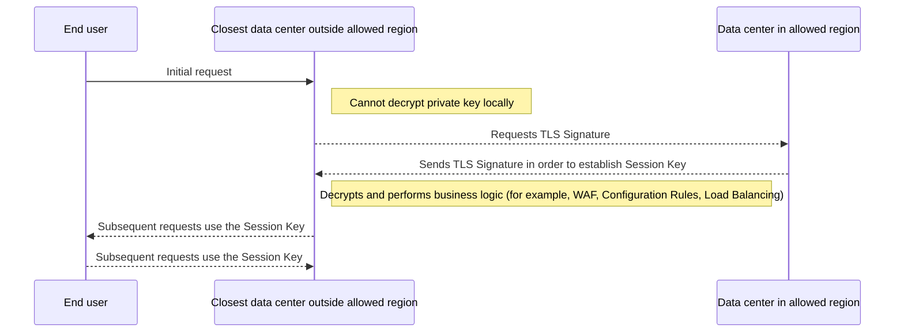

Geo Key Manager gives customers control over where their private TLS keys are decrypted.

## Customize where keys are decrypted

By default, your private keys are encrypted and securely distributed to each Cloudflare data center, where they can be decrypted and used for local TLS termination (the process of decrypting incoming HTTPS traffic). Geo Key Manager controls where these keys are decrypted, rather than where their encrypted copies are stored.

Geo Key Manager was restricted to the US, EU, and high-security data centers, but with the new version of Geo Key Manager, available in [Closed Beta](https://blog.cloudflare.com/configurable-and-scalable-geo-key-manager-closed-beta/), you can now create `allowlists` and `blocklists` of countries in which your private keys can be decrypted. For example, you can restrict private TLS key decryption to Australia or to the EU and the UK.

Geo Key Manager uses its own country-based key-decryption policies, separate from [Regional Services regions](/data-localization/region-support/#region-types). For the regions supported by each Data Localization Suite feature, refer to [Region support](/data-localization/region-support/).

## Cloudflare data center flow example

The following diagram shows what happens when an end user connects to a Cloudflare data center that is not permitted to decrypt your private key locally. To complete the TLS handshake, the local data center must request a private-key operation from a data center in an authorized region. Once a session key (a short-lived symmetric encryption key) is established, the local data center can decrypt traffic for the remainder of the connection without contacting the authorized data center again. This extra step adds latency on the first request, which can be as much as a second if the authorized data center is geographically distant.

 

 

For detailed information on setup and supported options, refer to [Geo Key Manager documentation](/ssl/edge-certificates/geokey-manager/).
